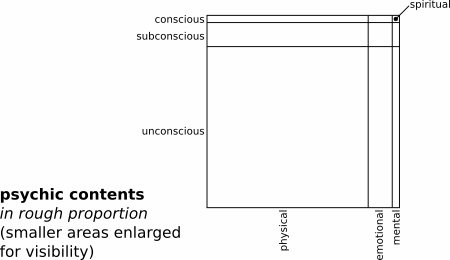

# _2_ &nbsp; dark retreat {#dark-retreat}

Now we will apply the theory of hygiene to the practice of dark retreating. We will examine the **elements** of hygienic dark retreating. **Distinctions** between hygiene and other approaches further aid understanding. Some **mechanics** follow.

## elements {#elements}

My observations about the psyche and darkness follow. I show how hygiene applies to them. I explain the secret of why it works.

### psyche {#psyche}

Shelton reviewed hygienic ideas about the psyche. "Graham pointed out that the 'vital instincts' behaved as though directed by intelligence. Tilden held that physiology is 'organized psychology.'"[^5]

Shelton's own unsentimental view is: "The conscious functions of the body serve primarily to protect and provide the needs of the subconscious functions."[^6] This means consciousness is not an end in itself. It serves a biological function. Hygiene views _knowing_ as primarily unconscious (autonomic, involuntary), and secondarily conscious (willed, voluntary).[^7]

Furthermore, the psyche is the _primary_ system in the human organism. "Consciousness---for those living organisms which possess it---is the basic means of survival," as philosopher, Ayn Rand, put it in her _meta-ethics_[^8]. Whatever affects the psyche hugely affects the rest of the organism, whether for good or ill.

The psyche coordinates all other systems. It does so consciously, subconsciously, and unconsciously. The psyche is diffuse throughout the organism. It functions at every scale. It autonomically monitors and harmonizes all processes. How many at once? 70 trillion cells * 5 million processes per cell = 350 quintillion 350,000,000,000,000,000,000) organic processes per second.

That's a lot of work to coordinate. Like any other organic system, the psyche needs a period of rest and recovery. Since its sensory apparatus is reflexive---the skin automatically feels what makes contact with it, the nose smells, the eyes see---sensory destimulation is necessary for psychic rest.

Think back to the times you got your best sleep. Besides feeling at ease, your shelter was probably especially dark, well-ventilated, and quiet. While the exact circumstances at the time cannot be replicated, these critical elements can be.

## darkness {#darkness2}

Man is a diurnal species, naturally awake in daytime and asleep at night. This physiological cycle is critical to psychic function. Modern life replaces the natural extremes of sun and stars with the relentless grey of artificial light and sunglasses. It replaces natural sleeping patterns with graveyard shifts and after-parties. This greyness, along with a hundred other civilized offenses, has pushed psychic illness to epidemic proportions. Simply put, our lifeway is brutal, damaging, and dysfunctional.

Modern distress (sensory overload, overwork, loneliness, malnourishment, etc) requires hundreds of millions of people to consume psychoactive drugs just to function. Most dislike this dependency, which causes further distress. Caught in a vicious circle, they wonder helplessly if things will ever change. 

Many factors contribute to distress. Hygienic dark retreating provides a simple way to reverse all of them at once. First, halts them. Second, it gives you a chance to recover from them autonomically. No drugs, therapy, or experts. _Self-healing unleashed_.

Thus, contrary to fairy tales, religion, and light bulb advertisements, darkness is a good thing. Darkness, like light, is a natural condition of life. We need nature's full provision of it---10 hours a day---in order to rest properly.

In crisis, we need an extended period of darkness to rest and recover. Dark retreating is to the psyche what fasting is to the body: 

- relief from sensory processing
- time to fully recover from trauma, exhaustion, and poisoning
- recognition of which part of who is performing the recovery

We have a basic need for darkness. Instinct in extreme circumstances gives us a graphic clue. When psychically overwhelmed, a child crouches down and covers his eyes, taking cover in solitude if possible. Depressed or shocked from disaster, his whole being cries out, "Gimme shelter!". 

A darkroom is that shelter. Darkness was long sought. It was right before our eyes. But we couldn't see it. It was obscured by our Apollonian obsession with light, thought, and action. And by medieval fear. Now we can finally sink into darkness and rest. We can recover our lost selves.

### hygiene revisited {#hygiene-revisited}

In hygiene, we found shelter for darkness itself. A context. It gives us a framework to understand why dark retreating works. 

So let us revisit it by going back to the beginning, to the word, hygiene. We will analyze one of senses in Webster's definition:  
_conditions and practices conducive to the preservation of health._

- _hygiene_ derives from the name of Hygieia, the Greek goddess of health. Hygiene is about health.
- _conditions and practices_ refer to the normal conditions and activities of life. These are the environmental and instinctive factors inherent in nature. They make life, thus healing, possible.
- _conducive_ means:
	- making it easy, possible, or likely for something to happen or exist
	- tending to promote or assist
	- contributive to
- _preservation_ refers to self-preservation by the organism
- _health_ refers to the health of an organism

Thus, the organism preserves its own health with normal conditions of life. Hygiene is the science of _conditional self-preservation_. It aids reason in making this happen by choice, by will. 

This whole meaning hides within the dictionary's definition. Natural Hygiene, as the standard bearer of hygienic science, makes it explicit.

Now we can elaborate on self-preservation. It:

- is the defining characteristic of all organisms
- comprises self-generation, self-maintenance, and self-healing
- occurs at every scale: [____microzymas____](https://livebloodonline.com/pleomorphism-and-germ-theory-explained/), cells, tissues, organs, systems, and the organism as a whole

Self-healing:

- requires more work, time, and energy than self-maintenance, but less than self-generation
- includes:
	- repair of damage
	- elimination of toxins, exogenous and endogenous
	- re-energization of tissue

Consciously, we provide ourselves the conditions of life. Unconsciously, we use them in life's staggering number of processes of self-preservation.

The unconscious is:

- the hidden part of consciousness. It is pervasive in the being, an integral aspect of the organism at every scale
- the biggest part of consciousness, coordinating millions of actions per second in each one of our trillions of cells
- omniscient, omnipotent, and infallible: all-knowing, all-powerful, and incapable of error
- just waiting for a chance to fix what is broken

Hygienic dark retreating is that chance.

### secret {#secret}

At last we are prepared to understand the secret of why hygienic dark retreating works. There are three reasons: physiology, attitude, and environment

#### 1 &nbsp; physiology {#physiology}

1. circadian rhythms: We have a 24-hour wake-sleep cycle. It is governed by the circadian system. This system is controlled by a tiny region of the brain. It is called the [____suprachiasmatic nucleus____](https://en.wikipedia.org/wiki/suprachiasmatic_nucleus). It has an internal 24-hour clock and resets itself with light. It rests atop the optic chiasm, the intersection of the optic nerves coming from the backs of the eyes. The eyes send it a direct signal of the presence or absence of light. This is prior to the imagery in the signal decoded by the visual cortex of the brain. 

	The suprachiasmatic nucleus, for example, instructs the pineal gland to secrete a famous hormone, [____melatonin____](https://en.wikipedia.org/wiki/melatonin) into the bloodstream. This hormone causes us to sleep, dream, and lose appetite. In absolute extended darkness, the pineal gland _floods_ the body with melatonin, intensifying these restful processes. 

	Melatonin is but one of many hormones, nervous signals, and processes that facilitate the deep rest and sleep necessary to recover from and assimilate the benefits of waking life.
2. destimulation
	- conservation: we conserve the energy consumed by sensory processing. It turns sensations into percepts, data into information. Almost half the brain is dedicated to sensory processing. Sight requires twice as much as all other senses combined. Darkness eliminates external visual data and minimizes other kinds. 
	- calm: without the abstract stimulation of visual data, the abstract mind slows down
		- fewer thoughts occur
		- thinking becomes harder
		- thinking becomes _less interesting_ (!)
		- directing attention restfully becomes *much* easier. (See [____attention____](#attention)&nbsp;_-​5_)
	- balance: the remaining sensations feed the feeling and moving centers of intelligence. Outwardly unoccupied, the internal sense of touch sharpens in its [____many aspects____](https://en.wikipedia.org/wiki/Sense). Intuition and instinct, aspects of consciousness suppressed in civilization, reactivate. They balance the psychic workload, making it more efficient, saving energy and internal activity.
3. inactivity
	- resting causes rapid recovery of homeostasis, the foundation of healing
	- it induces the stillness required for repair
	- it enables conservation of the extra vital energy the process of healing consumes. 

#### 2 &nbsp; attitude {#attitude2}

Hygiene's passive attitude toward healing aligns the conscious and unconscious parts of the self. It enables the internal peace and cooperation necessary for super-intensified healing (miracles) to occur. At first, only knowledge of this attitude is necessary. Belief comes later. 

The hygienic attitude is the essential difference between hygienic retreats and other types. The ego is assured that the crisis will be handled by a superior faculty. The ego finally relaxes its grip. It relinquishes to the unconscious the task of fixing its old crisis.

Active practices do not compensate for deficient conditions. The passive attitude inspires great care in providing proper conditions. The best darkroom and best retreats result. 

The attitude rests on knowledge of hygiene, physiology, and the complimentary roles of the conscious and unconscious. This calls for study. For hygiene, I recommend my book, [____*Shelton's*____](https://hygienicdarkretreat.com/f/hygiene.pdf), and [____Douglas Graham's____](https://foodnsport.com). For psychology, choose among those in my [____bibliography____](#bibliography-influences)&nbsp;_-​t_.

{pagebreak}

#### 3 &nbsp; environment {#environment}

A retreat provides the organism all the conditions of profound rest:

- social: security, solitude, silence, support, time
- mechanical: darkness, warmth, fresh air, comfort, electromagnetic neutrality, safety
- personal: frugivorous food, pure water, sleep, exercise, knowledge

In terms of experiencing profound rest and miraculous healing, a hygienic dark retreat is the perfect storm.

## distinctions {#distinctions}

We are beginning to see how not all dark retreats are alike. For eons all over the world, people of every lifeway and tradition, spiritual and cultural, have retreated in darkness. But the differences in approach outlined above greatly influence results. I will explain these differences and their importance in using darkness on your own. 

### attitude {#attitude}

One's attitude has a huge effect on the outcome of a retreat. Only the unconscious can perform miraculous feats of healing. If one's attitude supports it, then it can perform. If not, then not, and one's retreat will be merely amazing. 

Obviously, amazing doesn't suffice. We have had plenty of amazement. We need miracles. And the miracles we need only the unconscious can perform.

Civilization has taught us well: in various ways, we have all come to believe that somehow, someday, we would finally _do_ something about our quandary. Our culture worships the mind---even while confounding it at every turn with dogma and restrictions.

We assume doing something means willing ourselves to mental effort. We feel pumped up by the prospect of doing something consciously and directly. We eagerly sign up for workshops, submit to treatments, undertake disciplines, and experiment with exotic psychoactive substances. Meanwhile, the all-knowing unconscious rots in an unemployment line.

It is egomania. It is an act. It is a pretense of enthusiasm and competence. It covers up painful psychic damage, self-loss, helplessness, and even the urge to total selflessness by suicide. 

Under regular circumstances, we won't drop this act. We cannot. It would be too painful and frightening. We need an exceedingly safe place. Nature provides it in darkness.	

Even if we were not helpless in our post-traumatic amnesia and denial, hygiene shows that we cannot willfully heal injury anyway. This may seem discouraging, but it is fruitful. It can elicit a strong enough response from conscience to halt our futile efforts, notice the all-powerful self-healing organism, and finally provide for it.

Life is the source of power. Pathologically disidentified from life, we are powerless. Yet we presume to control the grand order of life rather than serve it. 

It is time to face facts. We are not going to handle our quandary as we imagine ourselves to be: just the conscious, volitional part of ourselves. We are not going to get it done or have anything to do with its getting done. We are not going to figure it out. We are fit to be tied.

The best we can do is fully admit our helplessness and surrender to the only force that could ever untie the knot. It is the Gordian Knot. But the knot must be untied, the precious rope put to use again. Alexander did not properly handle it by cutting it open with his sword, and neither will we with our scheming, effort, skill, or technology.

Only the silent, slow tendrils of the organism's vast autonomic intelligence can ever untie such a tangle. But it needs our recognition, our commission to do the job. It cannot go beyond its conditioned scope of action without explicit support. The unconscious brings wholeness, not division.  Integrity is the end, so integrity must be the means as well.

Hygiene's emphasis on rest and healing is an important idea. It defines the appropriate _attitude_ toward retreating. How one approaches a retreat has a great effect on what happens in it. I learned this in fasting. The mind becomes extremely powerful when it is resting. If one's attitude is really to passively support the omnipotent healing forces of the organism in doing everything, the effect of this internal unity will be infinitely greater than if one has the conflicted doer-attitude of a practitioner.

No one before has explicitly gone into darkness with the hygienic perspective. That is, with the sole purpose of simply providing the normal conditions of life to the self-healing organism. Since the organism is the only thing that heals the organism, this is far more effective than any other approach can be. Stories of miraculous healing in darkness continue to find their way to me. But I predict they will pale in comparison to what the hygienic perspective will make possible.

The effort involved is supportive: maintain the conditions of healing. It's easy. Stay in the darkroom. Lie down and rest. Eat. Exercise. Bathe. Eliminate. Lie back down. Think when necessary. Stare at the backs of your eyelids a moment. Then feel your breath and pulse for hours. Let sleep come.

It will. Darkness ensures it. Being in darkness so long, eventually one is induced to sleep, and sleep deeply. In my retreats, I have often felt positively knocked out. It is delicious. Time vanishes. Dreams are fewer. In 48 hours it is possible to catch up on all the sleep one has ever lost. (See the first of my [____five darkness experiences____](https://hygienicdarkretreat.com/report/five-darkness-experiences)). I am not speaking metaphorically. It is impossible to believe until it happens.

I find even the least bit of light too distracting, too stimulating. It puts me on guard. I can't relax. I can't "stay with" what I'm feeling despite the light. I can't "just be with it". I can't "feel into myself". I've tried and failed my whole life. I have found solace only in darkness. Those active attitudes just distract from the rest I need.

To me, retreating feels like falling through a trapdoor. At the end of my second successful retreat, I felt that 5-6 more trapdoors awaited me. They would take a total of about two weeks of darkness to fall through. Then I would reach the other side of my personal struggle, my lifelong dilemma. I still await my chance.

There are serene times in darkness and times when I feel I am crawling in my skin. It is alternately pleasant and unpleasant. But it is no worse than what I go through anyway. It is accelerated, concentrated, and without distraction. And since healing occurs, not just relief, there is a good chance of never reliving those particular horrors again.

### fulfilment {#fulfilment}

The restful attitude has a very pleasant effect. It becomes more apparent the longer a retreat goes on. It is a sense of fulfilment. It is as if all one's futile efforts of the past are redeemed and their goal is finally realized. As lost parts of the self are recovered, the satisfaction and joy of simply being alive returns.

When exhausted, just getting up to pee can feel like a chore. In darkness, this feeling of imposition can intensify at first. But then, imperceptibly, it turns to satisfaction again. For me, for example, to exercise became fun after three days. I felt how frustrated I had been in my inactivity.

Frustration is one of many effects of psychic damage. By definition, it incapacitates us. We can no longer do certain normal things. The organism generates fear of the activity to prevent us from trying, failing, and hurting ourselves even worse.

But we still desire these activities. Frustration is the conflict between desire, fear, and disability. The organism thus expends a tremendous amount of energy to keep us safe in our incapacity. Recapacitation removes the cause of fear, enables fulfilment of desire, and releases vital energy for other tasks. Self-recovery accelerates and deepens, and with it, satisfaction in living.

### not {#not}

There are three things the hygienic use of darkness is not: spiritual, therapeutic, or psychedelic. After discussing each one, I'll summarize what they have in common.

#### not spiritual {#not-spiritual}

Hygienic dark retreating is not spiritual. This is either unbelievable or a shock to the spiritual mind. Which views spirituality as the biggest possible context. It believes everything fits inside spirituality and can be best understood spiritually. 

Ironically, spirituality deals with the smallest part of the psyche: the intersection of its conscious and mental aspects.

Spirituality only regards other aspects instrumentally: good inasmuch as the conscious can access and control them. Actually, they are good inasmuch as they serve life, which they all do, otherwise they wouldn't exist.

Spiritual practice is discipline. It depends on the will and on thinking. But will is the most delicate, energy-consuming, and surface-level part of the psyche. It is the most damaged by trauma and the most in need of rest.

Using the will for spiritual discipline takes energy from the processes that healing the will depends on. In terms of healing, it gives the least possible benefit for the time, energy, and effort expended. It produces impressive results only by our abysmal standards. It prevents accomplishment of the top priority: full recovery of the psyche from its catastrophic damage. Which, ironically, is what drives people to spiritual things.

For example, meditation, like all spiritual practice, entails _super-effort to force access to subtle energy reserves to fuel artificial transformation_[^9]. 

The hygienic approach entails exactly the opposite: _profound rest to accumulate energy for autonomic restoration_. At rest, the conscious self makes no attempt to ameliorate suffering. It only puts conditions of healing at the disposal of the unconscious. Whose job it is to coordinate the healing of the organism.

Discipline begins with accepting an artificial internal conflict as natural. I mean, "the monstrous absurdity of original sin." (--Ayn Rand[^10]) Then one struggles "against nature" (--Gurdjieff), overcoming habits with practices to achieve an ideal. Jean Liedloff warned about this adversarial approach to life.[^11] As Jesus told Peter, "Get thee behind me, Satan." Satan is the Adversary: the liar, thief, killer, and destroyer.

Hygiene begins with an assumption of natural harmony, of non-contradiction. It gives a logical, non-adversarial explanation of illness. This naturally motivates one to fulfill his supportive role in illness, which functions to restore health.

Lastly, discipline sets up artificial dangers and obstacles. The conscious takes control of the process. This usurps the responsibility of the omnipotent unconscious to handle it. The ego becomes subject to the grand-scale forces involved, which are beyond its capability. Without close supervision of a spiritual guide, harm is sustained.

Practices engage the will so forcefully that its overpowers the instinct to rest. Most of the possible benefits of being in darkness are prevented. These would include the psychic independence necessary to break away from the tradition and the over-arching cult of civilization itself.

Supervision places subtle controls on the individual, further limiting the experience and results. Disciplined traditions then spread fear of dark retreating without spiritual preparation and facilitation. It is a racket based on a self-fulfilling delusion.

Hygiene exposes rackets: medical, spiritual, or otherwise. 

I was born into an esoteric tradition. Later, I met great masters, lived ascetically, and had a guru. That was my world.

My conclusion is that spirituality is the world's most sophisticated trap. It how society captures the most intense seekers of truth, freedom, selfhood, and righteousness. It shuttles them into whichever tradition and denomination suits them. It is the top-level of the control system we are slaves of. Freedom from spirituality brings a chance of genuine freedom in this life.

I recommend the liberating exposés of spirituality of two great and daring thinkers: a Christian, Walter Veith[^12], and an ex-New Ager, George Kavassilas[^13]. 

#### not therapeutic {#not-therapeutic}

Hygienic dark retreating is not a therapy. Therapy is done _to_ a passive organism in the attempt to heal or cure it from the outside. The principal actor in a therapeutic session is not the organism, but the therapist, therapy, or therapeutic substance or mechanism.

But these are all instruments of will. None can perform even one of the millions of organic processes of healing. It is a big show. A lie. Most of the claims come from the _stimulant delusion_. Shelton wrote a whole chapter on it, starting with this:

> Throughout all systems and methods of therapeutics there runs the basic error that what they call the therapeutic actions of their various procedures represent the beneficial actions of these things upon the body, or that they call out actions on the part of the body that are beneficial or useful in overcoming “disease.” The truth is that these so-called “therapeutic actions” of “remedies” are actions of the body to defend it against the “remedies.”[^14]

Therapy depends on the organism to react to treatment. But it views the organism as incapable of initiating movement toward health. _It fails to see such movement in disease itself_.

Perforce, a patient in therapy accepts its assertion of his helplessness. He thus denies his involuntary self-healing ability. He continues neglecting its conditions. The unconscious gets the message. It is suppressed, largely annulled. 99.99% of its power remains dormant. Without conscious support, it cannot do the great things it is capable of.

Academic science has a similarly objectifying approach to dark retreating, though in reverse. It is called _Chamber REST_ (Restricted Environmental Stimulation Therapy). As the name implies, and in accordance with scientific materialism, it tends to reduce a retreat and its effects to destimulation: _absence_ of usual sensory stimuli. The subject is then probed, monitored, and interrogated as to what is happening in this absence.

Physically, darkness is the absence of light. But the organism does not experience darkness as an absence but as another condition to take hold of and use. To illustrate this, one can make darkness an object of attention. One can look at it. It is like a screen a movie is projected on. 

To be in darkness is to sink into non-existent being, the background of [____existence____](https://hygienicdarkretreat.com/other/existence). One meets the essence of intrigue and mystery. One comes fully into one's own presence.

Like nighttime itself, darkness characterizes a normal period of time in life. Time does not stop. The world does not cease to exist. Something is still there. Academics and therapists miss the enormous intelligence of the organism at work in darkness, even as they depend on it for the minor data they allow it to produce for them to collect. Willfully blind, having presumed their subject into hiding, they probe in the dark.

In a dark retreat, darkness does nothing. Like air or water, darkness is an inert condition. It merely presents an opportunity to the self-preserving organism to express its ceaseless tendency toward wholeness in another way. The principal actor is life, not its conditions nor any treatment or therapist.

#### not psychedelic {#not-psychedelic}

Hygienic dark retreating is not psychedelic. The psychedelic approach uses an abnormal condition, like a toxic substance or sleep deprivation, to consciously experience unconscious phenomena. We know substances are abnormal by their taste and the sudden, extreme way the organism responds to them. 

Hygiene only uses normal conditions. Being self-healing, the organism requires no medicine. Plant medicines are thus needless and abnormal to ingest, inhale, or absorb. 

From the outside, an organism needs only nutriment it can integrate into its living tissue. If it is not air, water, food, or earth, it is non-nutritive and thus toxic. We know something is food or poison by how it tastes and how we respond to it. Response to normal conditions is smooth and slow, not sharp or sudden.

Neither do we seek thrills in hygiene. The awesome images and feelings one can have in darkness are impressive and subtly nourishing. But they are not the main point. The point is to recover the capacity to live normally. Here at hygiene 3.0 HQ, we are cutting through spiritual materialism (the title of an interesting book on one's way out of the spiritual world). 

Many people believe that endogenous DMT highs happen in dark retreats. Mantak Chia claims this in his book, _Darkroom Enlightenment_. By reports, the experiences are similar. But it is unproven and, as yet, unprovable. Current methods of detecting DMT in the pineal gland would require it to be removed, dissected, and analyzed, killing the subject.

Psychedelic and dark retreat researcher, Ondrej Skala, told me this. He cited his associate, Dr Marek Malus, professor of psychology at the University of Ostrava, Czech Republic. Dr Malus, whom I met there, is the world's leading academic researcher of dark retreating.

Drugs destroy the self-possession necessary for success in any healthy endeavor. With regards to self-discovery and self-recovery, drugs are child's play (yes, including ayahuasca and iboga). They intoxify the body and soul, hollowing out the being. 

Perhaps most damaging, they epitomize our lifeway's false strategy of externalization: seeking outside oneself for what can only be found within. Never satisfied, one remains in need of them. Drugs are a racket.

Do the lives of many people improve with plant medicines? Yes, at the surface. But improvements come at the expense of the underlying vitality needed to heal at the root. We need a complete solution.

I could also say that drugs do not lead to genuine spiritual realization or enlightenment; that they destroy the subtle nervous system enlightenment depends on; that great masters eschew and condemn them. But I reject the premise that enlightenment is a worthy goal. We need something much greater than that to end our suffering, solve our problems, and live fully. Drugs destroy the means of accomplishing this: health and self-regard.

Obviously, drugs are expensive and legally treacherous. They lead one to associate with misguided, destructive people. And they corrode basic conditions of life: work, relationship, rest. We all know tragic examples.

A clue to the abnormality of drugs lies in the fact that, in the restful use of darkness, the compulsion and even the thought of using them vanishes. Dependency falls away when natural energy, clarity, fulfillment, and purpose return. Life as oneself becomes appealing again. 

This describes one case I am familiar with. After over a decade of vain seeking with ayahuasca, etc, a man found himself in darkness. He closed the door on substances, went back to school, and now has a stable romantic relationship and does high-level work internationally.

Just say yo (Spanish for "I"). Get yourself back the way nature provides.

#### not summary {#not-summary}

Spirituality, therapy, and psychedelics share a vain strategy to end suffering: _make the unconscious conscious so the conscious can somehow fix it_. They all view the unconscious as inert, even resistant to fixing things. This attitude is stupid and clumsy. It whips a tired, injured conscious into work it can never do. It insults and abuses the expert unconscious while leaching its products. It is internalized tyranny.

Predictably, the unconscious, which is capable of the work, responds by going on strike. Next to nothing happens that should.

Naturally, this gives conventional psychotic minds no pause. Indeed, it confirms their adversarial expectations of the organism. They call for further intervention. Which makes no sense and never works. So try it again!

In contrast, hygiene respects the abilities of the unconscious. It is passive as regards the will. The will plays only the supportive role it is capable of. The omnipotent autonomic self plays the leading role it ought to. The will recognizes and supports it. Zero conflict. Maximum efficiency. Perfect result.

## mechanics {#mechanics}

### food {#food}

Attention to diet and nutrition has always been a big part of hygiene. Due to decreased activity, stress, and appetite, darkness presents a miraculous opportunity to:

- eat well
- interrupt the malnourishing, dissociative, intoxifying relationship with food most of us suffer from
- clearly experience one's thoughts, feelings and sensations

This is why I serve and recommend only fresh fruit and greens to retreaters. This is the frugivorous diet, common to all anthropoid primates like us. Being perfectly appropriate for our anatomy and physiology, these foods only nourish us. They don't medicate us. They neither stimulate or intoxify the system, nor overtax digestion, nor suppress feeling or memory.

For more about frugivorous diet, I recommend [____*The 80/10/10 Diet*____](https://foodnsport.com) by Dr Douglas Graham. He is a professional hygienist, frugivore since 1978, former Olympic athlete and trainer to professional athletes. 

Also, see videos by [____Loren Lockman____](https://www.youtube.com/user/LorenLockman). He is a hygienist and frugivore since 1991. He is a genius about food. His formulations are elegant and incisive. It is as if he came from the future to show us how to eat.

If exploring this diet does not come easily for you and becomes an impediment to retreating, then just keep it in mind for now. Plan to eat as simply and naturally as you know how. Use as many recommendations from this book as you can. Feel free to write me with your limitations. At least I can help you avoid potent toxins often regarded as healthy. Reversing illness and suffering is a process with its own logic. Darkness is a starting point. Diet is secondary. It can come later. Take one step at a time.

Note: just because the frugivorous diet consists of all raw food does not make it the "raw food diet". Frugivorism has a rich set of criteria about food: timing, quantity, proportion, combination, season, source, one's _feeling_, etc. It is a zoological distinction rooted in anatomy, physiology, and psychical propensity. It exemplifies the harmony between sciences.

Raw foodism is an ideological diet like fruitarianism, veganism, and vegetarianism. It is an anti-scientific free-for-all. 

It has only one criterion: no high-heating of food. Otherwise, eat as many "combination abominations"[^15] as you like! It lacks depth and seriousness. It is reductive fanaticism, not a whole relationship with food. Quasi-cults grow up around it. It's rather a mess.

### security {#security}

Security is a social and physical condition in which harm caused by malevolent people is deterred as much as possible by the recognition and uncompromising defense of individual rights to life, liberty, and property.

A retreater is especially vulnerable. Darkrooms must be strongholds against malevolence: well-built and watched over by savvy people. This means:

- Fences, gates, solid walls and doors with multiple, good locks
- redundant security procedures, including screening measures (eg, the Psychopathy Checklist)
- wise operators with a strategy to keep everyone from harm

Evil is real. Malevolent psychopaths and narcissists are among us. They may wish to retreat or become supporters for any number of reasons. Physically and socially, they must by dealt with, and in ways that do not make matters worse. Let us begin by acknowledging their existence.

Statistics are surprising. Andrei Lobaczewski, author of _Political Ponerology_ was a clinical psychologist. He studied psychopathy on a mass scale within mass psychopathic states (Poland under Nazism, then communism). He found that 0.6% of the population are primary psychopaths, 5.4% are secondary psychopaths, and 12% are narcissists[^16]. That is 18%, about 1 in 6 people. Most of them are not evildoers due to good training and the law. But the few who are evildoers perpetrate half of all violent crime[^17].

As decency breaks down, as is happening today, they receive poorer treatment and training as children. Society provides them more leniency, excuses, and niches. Philosophy courses in state-sponsored universities provide them formal justification and ready acolytes. They take advantage of the naive in both criminal and non-criminal ways.

Prepare yourself. Hope for the best, plan for the worst. Recovering personal power by healing from trauma is the best defense. It removes the main vulnerability that psychopaths play on. It is the foundation of all other possible defenses.

If you are psychically unstable or dangerous, you may have noticed. Others will have told you. Take it seriously. Study it. Study yourself. You can become increasingly harmless and useful to yourself and others. Use rational philosophy, psychology [^18], and darkness to gain in psychobiological normalcy. 

More later on [____psychopathy____](#psychopathy)&nbsp;_-​3_ and the [____psychotic____](#psychotic)&nbsp;_-​5_.

### safety {#safety}

Safety prevents harm among benevolent people. It is simpler than security and mostly mechanical. I address safety throughout the book, from philosophy and format to protocol and design. We are trying to recover from overwhelming disaster. Everything possible about a retreat must be safe.

### preparation {#preparation}

One does nothing directly in a retreat to cause healing. So one cannot prepare to do that. One's focus should be on providing a retreat's simple conditions. There are three.

1. knowledge
	- read the rest of this book
		- learn the idea of the hygienic (passive) attitude toward healing. There is no need to believe it before seeing its truth for yourself in darkness.
		- assimilate my discoveries and avoid my errors
	- learn enough about eating frugivorously to feel satisfied when doing it (2-4 weeks to read and try _The 80/10/10 Diet_)
2. excellent darkroom
	- [____design____](#design)&nbsp;_-​7_ and [____make____](#make)&nbsp;_-​8_ a darkroom (1 month) or [____retreat____](#retreat)&nbsp;_-​x_ at one of ours
3. sympathetic support
	- a [____5-day retreat____](#5-day)&nbsp;_-​4_ can be done alone. Just make sure no unsympathetic people are around. Support must be supportive. Reassuring. Arrange it with someone with common sense, a stable personality, reliability, and sympathy. This is important for both mechanical and psychical reasons. See [____support____](#support)&nbsp;_-​5_.

Then schedule the retreat, collect food, and begin.

~/~

Buckle up. We are heading into the abysmal and pregnant psychology behind hygienic dark retreating.

[^5]: Herbert Shelton, [____*Science and Fine Art of Natural Hygiene*____](https://hygienicdarkretreat.com/f/hygiene.pdf)\*, p35
[^6]: Ibid, p139
[^7]: William Arthur Evans, psychobiologist, said that each cell has thoughts, feelings, and instincts. Conscious experience summarizes those trillions of inputs, and can influence them in turn. Evans bested the hygienists of his time in his grasp of this issue—and in some of his results. He helped his clients trace and correct physical maladies through their feelings. His books are extraordinary. See my blog post [____William Arthur Evans____](https://hygienicdarkretreat.com/blog/2009/08/william-arthur-evans/) and the [____bibliography____](#bibliography-influences)&nbsp;_-​t_.
[^8]: Ayn Rand, _The Virtue of Selfishness_, p18, "The Objectivist Ethics"
[^9]: See [____*In Search of the Miraculous*____](https://hygienicdarkretreat.com/f/search.pdf)\* by PD Ouspensky on Gurdjieff's teachings
[^10]: _Atlas Shrugged_, in Galt's Speech
[^11]: _The Continuum Concept_, Jean Liedloff, about parenting and natural, non-adversarial relationship
[^12]: Walter Veith is an Adventist evangelist and former biology professor. He exposes most spiritual activity as Satanism, ie, the lie of works-based salvation. In his sing-song voice, he conveys the unified story arc of the Bible and the meaning of Christ's message of salvation by grace. (Hygiene's restful approach to healing translates this message into biological terms.) See his astonishing video series, [____"Total Onslaught"____](https://adtv.watch/series/total-onslaught). 
[^13]: George Kavassilas, philosopher and ET contactee, wrote [____*Our Universal Journey*____](https://www.ourjourneyhome.earth/market-place#section-1592035487385). George exposes _all_ spiritual activity, including Christianity, as part of an all-too-real, cosmic-scale [____*God Control Matrix*____](https://youtube.com/playlist?list=PLV75wDOASk_eAijH1idZyya3AE7RmwbG1). George has genuinely new and compelling ideas, from his cosmopolitics and exponential physics to his psychophysiology and ontology of the eternal individual.
[^14]: Herbert Shelton, [____*Science and Fine Art of Natural Hygiene*____](https://hygienicdarkretreat.com/f/hygiene.pdf)\*, p103
[^15]: _Raw Courage World_ a hard to find, fun-park ride of a book by the gonzo Fouad "Raw Courage" Dini. While reading it, many wonder if it is really happening. Yes, it is.
[^16]: [____*Political Ponerology*____](https://hygienicdarkretreat.com/f/ponerology.pdf)\* by Andrei Lobaczewski, clinical psychologist. He studied psychopathy on a mass scale under the Nazis then the communists in Poland. He and his multi-generational team, working in secret, found its patterns, mechanisms, and simple preventatives. Here is an [____excellent introductory interview____](https://www.sott.net/article/159686-In-Memoriam-Andrzej-M-obaczewski)
[^17]: [____"Psychopaths Among Us"____](http://www.hare.org/links/saturday.html), on the critical work of Robert Hare, psychologist and creator of the _Psychopathy Checklist_.
[^18]: [____*Malignant Self-Love: Narcissism Revisited*____](https://narcissistic-abuse.com) by Sam Vaknin is _the_ book for narcissists (and their victims) who seek conscious aid in understanding and reforming their condition.

