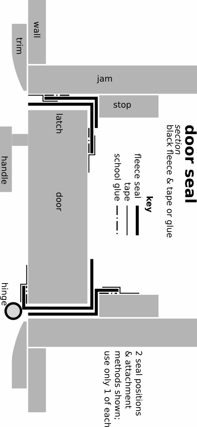

# _10_ &nbsp; darkness {#darkness}

There is darkness, and then there is _darkness_. We're going for the second kind: perfect and absolute. There is a million percent difference between 99% and 100% dark. In 100% darkness, the mind has nothing left to hold onto, no reason to resist. Finally it can let go, fall into the well of itself, and be renewed.

Light is easier to deal with than ventilation. There are fewer factors involved, they are all controllable, and they are visible.

But light is relentless. It sneaks sideways through a single layer of clear plastic tape and the hook and loop of black velcro; through the weave and fibers of heavy fabric; around multiple, darkened corners; and past all edges and joints.

I suffered many defeats at the mighty hands of light. Eliminating it demanded equally formidable techniques. I wandered continents for years to find them. Now I bestow them upon you.

Numerals with - x + are in millimeters (see [____metric____](#metric)&nbsp;_-​8_).

## technique {#technique}

Generally, to darken a space,

1. use dense, inherently lightproof sheet material in 1--2 layers to cover area. Using few layers means:
	- simpler construction
	- better function
	- easier operation
	- neater appearance
	- greater need for precision
2. seal out light at edges with black polar fleece. Attach it to 2 sides, over an edge, forcing light around 1--2 corners.
3. make outer surfaces exposed to sun reflective: white or silver
4. in vents, channel light around 6 black-surfaced corners

If improvising for [____tonight____](#tonight)&nbsp;_-​4_: use as many layers as necessary. If it is already night, turn on all your lights and check your work from outside. With each layer, block as much light as close to the source as possible. First, block 99% the light. Then 99% of what's left. The last 0.01% is easier to address or ignore. Close curtains over windows outside a darkroom's door. Where possible, shade darkening measures made of paper from direct sunlight.

Edges were tricky till I tried black polar fleece. It's like a sponge for light. It is widely available, cheap, and forgiving. A knit fabric, its edges require no hem. Just cut and attach with school glue or masking tape. 

We will start with the most portable and perhaps simplest design. It darkens the small space around the eyes: the mask.

{pagebreak}

## mask {#mask}

A good blindfold or sleeping mask is the quickest way to obtain a large measure of darkness wherever you are. It's like draping a dark shirt over the eyes, but it stays on all night.

Know that no mask is comfortable for long periods. None stays in place during all movement. And our skin has enough light-receptors for it to wake us up. A mask cannot replace a darkroom. And the [____double-blind____](#double-blind)&nbsp;_-​10_ below may be just as easy to make.

A mask is cheap, accessible, discreet, and very effective for immediately improving sleep. It is a good first step toward the profound rest darkness makes possible.

No mask I've tried or seen satisfied my requirements. So I designed one. The strap design is very effective. It would improve most existing masks. Instant and standard versions are described.

### constraints {#constraints3}

- blocks all light 
	- through the mask
	- at its edges
- comfortable for many hours
- stays in place during sleep and gentle activity
- cheap and simple to make
- easily replaced elastic (skin and hair oils seem to degrade it quickly)

Adjust the measurements as needed. The mask can cover your forehead, but not your ears, nor go below your nose. Adapt it according to its comfortability and light-blocking ability on your face. The drawing is of the mask that fits me.

### instant {#instant}

&nbsp;

I put this one together in a few minutes. It's like the standard mask below but without seals. Combined with a mostly darkened room, it blocked 95% of light and let me sleep in and nap. (Later, I managed to staple seals to it for 99--100% darkness.)

- cut a piece from a black 100% cotton
	- T-shirt, 250 x 440, folded the short way in 4 layers
	- or sweatshirt, 250 x 330, folded in 3
	- towel, 250 x 220, folded in 2
- staple along its long edges
- 4 strap anchors
		- 3- holes poked through with a ballpoint pen tip, elastic going through them then knotted
		- or 2 staples each
		- knot where comfortable, end-knots (overhand or figure-8) on one end, two half-hitches or slip knots on the other.
- vertical strap: make a slipknot in each end of the vertical elastic piece that tightens around the horizontal straps.

### standard {#standard2}

&nbsp; &nbsp; &nbsp; &nbsp; &nbsp; plan: sleeping mask - [____download____](https://hygienicdarkretreat.com/img/plan/mask.pdf)

{pagebreak}

1. materials
	- soft black knit fabric: 
		- 100% cotton sweatshirt fabric (French Terry cloth or loop-back cotton) 
		- 100% T-shirt fabric (cotton jersey)
		- polar fleece for the cold
		- cotton is cooler than fleece, which can feel scratchy, too. Avoid woven fabric. It frays and doesn't flex. A bright colored piece of cloth on the outside makes finding the mask in the light and in bags a lot easier. 
	- elastic, 3--5-, white, helps to find the mask and is common in stores
	- cord, 3- polyester or nylon, white
	- thread
2. follow instructions in [____fabricate____](#fabricate)&nbsp;_-​9_
3. attach side seals to cover
	1. put cotton cover with plan still attached on 2--3 layers of cardboard
	2. each side seal has a 7- wide flap divided by 5- cut in middle and a small circle on dashed stitch line. Two side seals=4 divisions. 
		1. align one division at a time to grey marks on cover
		2. tape in place
		3. sew on stitch line of plan to or from small circle
		4. tear plan in middle to bend seal 
		5. repeat for other three divisions
		6. remove all paper from fabric
4. attach center seals
	1. fold center seals in half the long way and fit them between side seals, making everything symmetrical and even
	2. pin center seals to cover through their folds 
	3. sew (maybe hand sew) center seals to cover
5. bind seals
	1. hand-sew seals together through sideways stitch line
	2. pull thread with minimal force, leaving seam neither loose nor tight.
	3. the stitch line is a little distant—7-—from the zigzagging edges of the seals. This allows the seals to hold each other up to fill in the gaps on each side of the nose. Yet the unbound edges of the seals can fan out to more gently make contact with the face.
6. sew cover
	1. stack all cover pieces, matching up edges evenly
	2. fold seam allowance of cotton cover under and pin in place to other cover pieces
	3. sew around edge of cover to join all pieces
7. prepare straps
	1. cut elastic
		- 2 pieces 500- long
		- 1 piece 250- long
	2. cut cord, 4 pieces 30- long
	3. melt all ends with flame to prevent fraying
	4. tie figure-8 knots in ends of elastic
8. attach straps
	1. fold cord in half, making a loop. Sew loop to front of mask at points **x** and **z** so loops stick out over corners from cover 1- and cord ends are pointed toward center of cover
	2. tie one end of a 500- piece to a loop at point **x** with a slip knot
	3. tie other end at other point **x** with taut line hitch
	4. repeat steps 2 & 3 with other 500- piece at points **y**
	5. tie 250- piece to 500- pieces at points **z** with slip knots
	6. the taut line hitch, when tight, slides on the part of the strap it is tied to, then locks in place, creating a strap of adjustable length. Adjust straps for comfort. Bottom strap should go around neck, top strap should go high around back of head.
	
{pagebreak}

## door seal {#door-seal}

Black polar fleece makes darkening a door easy and quick. Use masking tape at first. Tack edge of fleece in position with 10- pieces of masking tape every 400-. Then put a continuous strip of tape over the edge. Once you get the hang of it and know where you want the fleece to stay, use school glue where possible (glue removal described below).

1. sides and top: affix 50--70- wide strips of black fabric to door jam with masking tape or white school glue. When closing, door should catch middle of fabric, pulling and bending it around one edge of the door and fill the gap between the door and jam. 
2. hinges: make perpendicular cuts in edges of fleece to accommodate these
3. latch: make a parallel cut over the strike plate to accommodate the bolts
4. bottom: where no threshold vent is necessary, make a fleece baffle the width of the door. See threshold vent perspective drawing for baffle design. It is a half-tube of black fleece fabric that hangs from the bottom of the door on each side and touches the threshold or floor underneath. Tape a 100- wide strip of black fabric to the threshold or floor under the closed door. Black fabric against black fabric makes a good light seal. Partially darken space beyond door with curtains or partitions to ensure darkness in the darkroom.
5. if light still leaks in the sides or top, affix a second strip to door, as in drawing
6. to remove glued-on fabric, wet it. This will dissolve the glue and the strips will peel off easily after a few minutes. As this happens, use a wet rag to wipe off glue residue before it dries again.

If door has a window, cover it with a double-blind or a panel, described below. 

&nbsp; &nbsp; &nbsp; &nbsp; &nbsp; plan: door seal - [____download____](https://hygienicdarkretreat.com/img/plan/door-seal.pdf)

## window {#window}

For your next trick: blacking out windows. I have tried 10 methods of lightproofing windows in ~100 spaces over 15 years. Two work well just about everywhere.

The double-blind is the new standard for darkening windows. It is a quick, easy blackout blind. The panel is a modern revival of traditional shutters, offering soundproofing and security.

Notes on retired methods—foil, single layer, velcro, roller blind—come last.

### general {#general}

#### comments {#comments2}

In sealing off windows, we must consider ventilation.

If your room's air supply comes through your window, attach a universal vent to the back of the blind. If the recess doesn't allow this, attach the vent to the front. Test position of vent before cutting a slot for it to make sure it clears the window frame and handles. The slot jig usually works. See [____universal vent parts____](#universal)&nbsp;_-​9_.

If both your supply and return air pass through your window, use two lightproof vents, one at the top, one at the bottom of a blind. Use fan mounts and silencers if necessary. Test without them at first. Some buildings have mysteriously good ventilation. Convection works in winter, when temperatures inside and out are different enough.

Some windows leave no space for a blind or vent because they are flush with the wall. In this case, either:
 
1. remove window temporarily. Replace it with a vented panel
2. use a panel or shutters outside, operable from the inside
3. build a frame around window for a double-blind or panel

A handful of companies make portable blinds for traveling, especially with children. They attach to the glass with suction cups. The cups can be repositioned on the blind for different windows. They are convenient and helpful.

Some sell the fabric they use by the meter. One company sent me several samples to test. I wanted lightproofness in one layer. No sample worked, so I gave up on it. But two layers of it would make a fine double-blind. It would be portable, adaptable, and look nice, as well.

#### constraints {#constraints4}

- perfectly darkening
- quickly and easily operated so it is actually used
- good-looking
- discreet: looks like a blind or curtain from the outside
- accommodates lightproof vent
- window or trickle vent can be open behind it
- holds its shape over time in different temperatures and humidities
- durable
- can be made of common, cheap materials
- easy to make
- easily uninstalled
- leaves few marks or holes

#### lesson {#lesson}

Here's a quick lesson on window types and anatomy.

- types:
	- fixed
	- opening
		- sliding
			- double-hung (vertical)
			- horizontal
		- casement (hinged)
- anatomy, from center of window to wall:
	1. pane: the glass itself
	2. frame: holds pane, moving with it in opening windows 
	3. sash: attached to wall, surrounds frame. In opening windows, the frame closes against the sash. With non-opening windows, sash is often the same as the frame.
	4. sill: holds sash; it's the surface where you put plants, candles, etc, and corresponding sides and top. Defines the recess.
	5. recess: entire opening in wall where window is installed. It is defined by the sill.
	6. trim: wooden border around window. Attaches to wall and edge of sill, covering the crack between them. Not always present. 40--100- wide, 10--20- deep. 
	7. wall

### coverings {#coverings}

#### double-blind {#double-blind}

This is my favorite method. One layer is inserted into the recess and held by friction. One covers the recess and seals with tape*. Light can't get past all the corners and narrow gaps. The double-blind is: 

- cheap, easy, fast to find materials for and to do
- extremely effective and simplest overall
- durable, adaptable, and cleanable for reuse and travel

It blocks 99.9% of light even without taping the outer layer. Masking tape seals out the rest for a retreat. It requires ordinary precision. It is more effective and comfortable than a mask, and about as quick to make.

It is usually of flexible black plastic construction sheeting. Plastic is the lightest weight lightproofing material. It doesn't stretch or sag, making taping easy. 

The inner layer can also be a lightweight board: cardboard, foam-core board, or corrugated plastic sign board. It is easy to use for weeks, months, maybe years.

The design principles apply to fabric and paper, too. They look better. But they are heavier. Fabric requires a rod (or suction cups). Paper warps with heat or moisture. 

I use masking tape to seal the cover. It sticks to plastic and most other things very well and causes the least damage when removed. Heat from a blow dryer can help remove it. 

*Other attachment methods could work, too: magnets, suction cups, hooks, poster tack, pins, tacks, staples, nails, etc.

North Americans: 1 mil = 0.025- = 25µ(microns).

Minimum total thickness of plastic layers: 0.25-. Fabric and paper: thicker. Always use black. It absorbs the most light as it passes through the thickness of the material.

&nbsp; &nbsp; &nbsp; &nbsp; &nbsp; plan: double-blind with vent - [____download____](https://hygienicdarkretreat.com/img/plan/double-blind.pdf)

##### materials {#materials}

- black plastic 
	- most common
	- construction sheeting, black polyethylene, 0.15 thick. Widely available in rolls or by the meter at building supply, variety, and department stores.
	- garbage bags. Package usually shows thickness in microns. Make two stacks, 0.125 each. Join with staples, tape, melting, or sewing
- white plastic: **important**
	- with black plastic, attach white material to outside layer. Use any thickness of plastic, fabric, paper. But leave 30--50- of black edge exposed.
	- windows build up fierce heat when sealed with black plastic. It destroys the vacuum seal of dual or triple-pane windows. It even causes them to explode! The heat also damages paint and wood.
	- black plastic looks spooky from the outside, attracting negative attention. White looks normal.
- black & white plastic
	- laminated agricultural plastic
		- called "light deprivation" tarp, used in greenhouses and for "pit tarps". I once got some for free from an agricultural plastic supply house. It was the end of a 1-ton roll of 0.125- plastic. It was too little for them but a lot for me.
		- easiest. Looks good. Satisfying to use. Technology at its best.
		- use one layer for traveling. Use two layers, white sides visible, for perfect darkness. 
	- lumber unit shipping covers, free at lumber yards. They are big, black & white-laminated woven plastic tarps with color graphics. Wipe clean. Patch punctures. Put black sides together, white sides out.
- fabric
	- black twill or similar tight weave.
	- white muslin or bed sheeting for outer layer
- paper
	- kraft paper off a roll, black, white, brown
	- white backside of gift wrapping paper
- masking tape

##### assembly {#assembly}

1. insert
	- this is the first layer. It goes inside the recess against the sash or frame. 
	- when using black & white plastic, add 60--100- to each dimension. White side faces outside. But fold the edge back 30--50-. This turns the black side outward for sealing against frame or wall. Tape it in place.
	- it can also be cardboard, black foam-core board or black corrugated plastic
	- join multiple boards with 50- wide strips of board, any corrugations perpendicular to seam
	- fit a window perfectly with no measuring: enlarge a board with 50--200- wide strips of black posterboard glued to edge of board, extending to the sash or sill. First, crease and fold the strip 15- from the edge.
	- for a handle, use a small block of wood. Screw it in from the back through a fender washer or stiff piece of plastic, like a bottle cap.
2. the cover is the second layer. It goes over the recess, extending 100--200- past it or past trim. This also blocks light that leaks through cracks between sill and wall.
3. temperature control: protect windows from heat damage
	- reflect heat with white paper, posterboard or fabric that faces outside. At the edges, leave 30--50- black to absorb light where it makes contact with frame
	- in extremely hot areas, install an awning, exterior blind or shutters
4. For daily use till you retreat or make a panel,
	- tape cover to wall only at top corners. Tape and untape blind layers in place daily.
	- put a patch of tape on wall to tape to to protect wall and extend life of tape
	- make a curtain rod with a 19 x 38 board. Tape top edge of cover to the back of it. Rest board on nails or screws beyond top corners of window and, during the day, on a second set below bottom corners.

##### tape {#tape}

1. use regular masking tape, 25- wide. Masking tape is effective, cheap, sticks and conforms well to irregular wall surfaces, yet comes off easily without residue (unless you leave it up too long: months, maybe weeks). 3M construction grade from a builder's supply is best. It is strong and sticky.
2. black masking tape is not necessary for my standard techniques, but it is interesting and fun. It could be useful in special applications you dream up. Brands and models are Intertape PF3 or PB1 and Shurtape T106<!-- from American Tape and Label-->. Local art and professional lighting supply stores carry it. For difficult surfaces, photographic masking tape or black kraft paper tape are stickier, thicker (more lightproof), stronger, and more expensive. Look for ProGaff (formerly Permacel) 743, Shurtape 724 or 743, and 3M 235. 
3. avoid electrical and duct tapes. They are made of soft vinyl and obnoxious adhesives. They are toxic in their manufacture, handling, use, and disposal. Gaffer's tape has better adhesive for removal. But most are vinyl. One exception is Shurtape PC 657, a polyethylene coated gaffer's tape. 
4. pro-tips
	- let tape relax between unrolling it and pressing it in place. Don't apply while stretched. Stretched tape slowly peels off by itself!
	- for temporary seal, press in place with pad of finger.
	- for strong, more permanent seal, press in place with finger nail or edge of guitar pick or credit card. You can see and feel the difference immediately.
	- use sticky side of one piece to grab edge of another applied piece and remove it
	- use small pieces to tack material in place, then long pieces to cover the whole edge
	- use one layer of tape except for tacking and overlapped ends. One layer flexes with what it is taped to. Which expands and contracts with heat and moisture. Multiple layers of tape are rigid. They peel, opening cracks for light to get through.

#### panel {#panel}

A panel is for permanent use. It has several benefits.

It seals snugly inside a recess or frame, inside or out. It can hinge outside like a shutter. It is of exterior plywood inside or out, or melamine inside. These engineered woods are dimensionally stable. 

A panel: 

- is best for long-term use
- is lightproof in one layer
- seals well with fleece, which attaches well to the edges with various glues
- adds soundproofing and thermal insulation
- retains its shape and size
- easily takes cutting for a hole or slot to attach a duct or vent (unlike glass). 
- looks good
- is easy to get free material for from discarded furniture
- removes with no trace, usually held in place by pressure.
- installable with hinges
- usable for retreats and nightly sleeping
- adds security if installed outside and latches from the inside through the window

Panels work for opening or fixed windows. Fill big openings with multiple panels. Add a flange of wood to the side edge of one panel and fleece to the edge of the next one.

Exterior plywood needs three months to outgas. Before using, store it flat with spacers between each sheet. Or tape foil or mylar over its inner face temporarily.

Avoid interior plywood. Its glue is more toxic and outgasses more and longer than that of exterior plywood.

Avoid cardboard for panels. It warps and shrinks. Water damages it. It doesn't stop noise. 

&nbsp;

&nbsp;

**—** Photo shows, from front to back: 2 black horizontal straps (steel pallet straps screwed to wall), running over 4 tightening blocks, wedged against 4 horizontal ribs, screwed to 2 separate plywood boards, each bordered with black fleece seal. **—**

##### instructions {#instructions2}

Remove an opening window at its hinges. Carefully trace its outline onto the board you will use. If handles or hinges make this awkward, trace onto paper or cardboard. Tracing is better than measuring. It captures non-square corners that windows tend to acquire over time.

Cut 2--3- inside the traced line to allow for fleece seal. Make sure it fits in the frame with 2--3- around it. 

Determine where a vent or silencer will go so it clears the frame, the screen, and the window recess. Measure and mark a hole in the panel for the vent or silencer.

Cut out hole with a jig or coping saw. Or drill holes just inside the corners with a 4- bit. For each hole, drill two more 8- away just inside the line. Then drill between them along the line at various angles until you cut a slot big enough for a keyhole or hack saw.

Attach a handle to lift it in and out. Glue and screw a 20 x 30 x 20 block of wood to the board above its center.

Reinforce panel with ribs of dimensional lumber to keep or make it flat. Add hinges, inside or out, to make operation quick.

Seal exposed edges of melamine with varnish or glue. Glue a 60- strip of fleece around edge so it attaches to the panel's faces and edge. Glue on a second strip if necessary.

Fleece at edges usually holds the board snugly in place. If not, find attachment points on either side of the frame (or make them with screws). Stretch a wire, rope, or strap over the panel between them. Wedge a block of wood between it and panel to keep panel in place. 

The oldest solution proves the most elegant: exterior shutters, operable from the inside. Traditional architecture worldwide uses them. They are common in Europe. Roller blinds like this are standard on the Mediterranean. They operate with interior straps. It's so nice! The French still like shutters hinged, as do Latinos.

Alas, most Americans, Canadians, and Australians miss them without knowing it. People of Protestant countries are less aware of their bodies. We cling to big windows as symbols of the space and freedom we are fast losing. Ironically, the first step to regaining these is to cover up the windows.

### zip {#zip}

I don't use these techniques anymore. But I kept their photos, plans and instructions in the [____zip file____](https://hygienicdarkretreat.com/hygienicdarkretreat.zip).

#### foil {#foil}

If all you have is foil and electrical tape, this technique works. The trick is to remove the roll from the box and unroll it directly onto the glass. This prevents bending, cracking and resulting light leaks. Tape it in place with black electrical tape. One-time use. Doesn't work with vent. It is wasteful and toxic but better than psychosis.

#### single layer {#single-layer}

A single layer blind uses extra-thick (0.25-) material: 

- black polyethylene construction sheeting, available at concrete supply houses
- EPDM rubber, used for pond lining and roofs
- high-quality blackout fabric (~1- thick)

A single layer requires extra treatment at the edge. Do one or more of these:

- fold edge under to create a springy seal
- make a fleece seal, especially for rough surfaces
- extend plastic farther beyond trim (150--200-)
- black, lightproof tape when sealing to wall 

Avoid nicks and punctures. Repair with black tape or taped patches of the same material. The double-blind is better in most cases.

#### velcro {#velcro}

Blackout fabric + adhesive velcro = 1-hour blind. This technique isn't bad. It is promising. Maybe it's for you. Good fabric must be found. The adhesive was not secure. It can also peel off the fabric's lightproof coating. It mucks up sewing needles. Non-adhesive, sewn-on velcro would be better than adhesive velcro. Commercial versions of it exist. 

#### roller blind {#roller-blind}

These can be cool: motorized blackout roller blinds with lightproof rails and remote control. Watch them on YouTube. 

I wanted to see how cheaply I could do it. I reduced the cost of materials 90%. But labor was too much. The result was not as durable, effortless, or sleek as a high-quality manufactured blind. Compatibility with motors is uncertain.

If you want a roller blind, I suggest you save up and buy one from an established local blind shop. Let a technician come and measure your windows. Buy only top-quality national or international brands. Cheap models online may disappoint you.

Get a guarantee of absolute lightproofness of the entire installation. Tell them you will be testing it with advanced sensors: eyes adjusted to darkness for days.

Foamed acrylic coating is the industry standard. Make sure the label says "acrylic" so you avoid toxic PVC.

