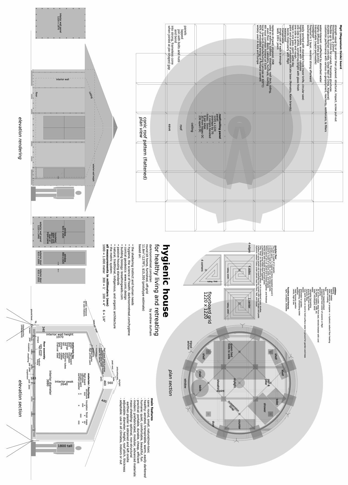

# _7_ &nbsp; design {#design}

Nature works. Occasionally, disaster strikes and chaos ensues. We must restore order. We need a plan. So we design.

## considerations {#considerations}

### normal {#normal}

Hygiene uses only normal conditions. A darkroom is merely what all shelter should be: easily darkened. The purpose of buildings is to provide shelter. We use shelter to control our exposure to elements, pollution, and animals for the purposes of rest, safety, and security.

Street lamps, signage, and head lights make light pollution. Combined with the modern fetish for large unshuttered windows, they make the darkening of bedrooms critical to survival. Light is an element to control one's exposure to. Having huge lights in the wall that turn off and on by themselves contradicts the purpose of shelter. Everyone’s bedroom should be a darkroom, at least for nightly sleep. It is normal. It is just rare... for now.

Total darkness is normal for sleep and healing. Man's original habitat is tropical forest. Its dense canopy makes the forest floor pitch black at night. In the open, light from stars and moon is nothing compared to street lights. 

While we can sleep in light if necessary, it compromises the quality of sleep. No biological adaptation to it has occurred, only vital accommodation (development of tolerance) at the expense of overall function (see [____process____](#process)&nbsp;_-​1_. 

Vernacular architecture worldwide features small windows with shutters for total darkness. The ancients weren't just without cheap plate glass. They knew something.

We have darkness at any time by covering eyes with hands. It is part of the sheltering instinct. We do it reflexively when tired or injured, along with seeking safety, shelter, and solitude. Construction is an intensified form of the sheltering instinct. Our extremely traumatized condition causes the modern, hyper-intense form of construction.

The civilized obsession with building expresses the impulse to self-healing on a social scale. Knowing this, we can voluntarize the activity. We can direct it explicitly toward its implicit goal: to provide the conditions of profound rest. We can define and meet its specifications.

### start {#start}

Start in your own bedroom. You already know you can sleep there, what problems need mitigation, where things are and how they work. You already paid for it. You need access to darkness every night anyway. It makes sense to begin darkening it.

If it is truly not worth darkening or unsuitable for short retreats, it is unsuitable for living. I strongly suggest you make arrangements to move. 

If, for whatever reason, you wish to darken a room elsewhere, then sleep there three nights beforehand. See if anything about it might disturb you which you cannot practically change: noise, odors or poor ventilation, atmosphere. Mind your senses, feelings, and state of mind. Will you be comfortable there? Do you actually sleep? Will darkening and ventilating it be a reasonable effort? If so, proceed. If not, conserve your initiative and keep looking.

### types {#types}

There are basic and dedicated darkrooms. 

A basic darkroom is built to basic specifications below, probably in your bedroom. It is for nightly use and short retreats up to 5 days. Basic specifications are: security, reasonable quietness, perfect darkness, ample ventilation, and comfort, plus any others in the list below that you can manage. See _basic_ comments for clarification. For budget building tips, see [____format____](#format)&nbsp;_-​4_ and the _make_ chapters: [____make____](#make)&nbsp;_-​8_, [____air____](#air)&nbsp;_-​9_, [____darkness____](#darkness)&nbsp;_-​10_, and [____water____](#water)&nbsp;_-​11_. Or write me after reading them.

A dedicated darkroom is built to full specifications below in a small house in a quiet location. It is for all kinds of people for retreats of any length, short (up to 9 days), medium (3-8 weeks), and long (3-12 months). It requires all the specifications below. If it is your first darkroom, start with a fully functional house. This means it has automated heating, running hot water, mechanical ventilation, and electricity. Later, when you know more, you can build something new.

### standards {#standards}

Most of my retreats succeeded or failed because of how well the darkroom itself worked. Do not tolerate stale air, frequent or extended noise, light leaks, dangers, discomforts, poor food, etc. Poor conditions cause stress. Stress compromises a retreat. If it becomes distress, it ruins a retreat. So handle problems ahead of time rather than imagining you can endure them. That is for spiritual athletes and other egomaniacs. Listen to your body and soul. Listen to your life.

You should be able to turn off the light and let go of external concerns. The stress of healing is enough to bear. A retreat is not an imposition. You naturally want to do it because you are rationally convinced it is good. It is not for discipline or practice, but rest and recuperation. It is not effort, but relief; not penance or strife, but sanctuary from the punishment and strife of our lifeway.

A successful retreat depends on several factors including facility, attitude, preparation, protocol, and support. The facility is usually the biggest piece of the puzzle. Good design builds many conditions of success into the room, making retreats practically foolproof. The better the darkroom, the more effective your retreat will be. There is no penalty for doing things correctly.

But probably you cannot do everything correctly the first time. Certainly, you will do your best. You can improve upon it later. If we could already do everything correctly, we would have no need of darkrooms. Just be honest with yourself about whether your best is good enough for now. This is a real chance to decrease suffering. Don't cut corners if you can help it. This principle applies to everything in the list below.

A hygienic darkroom functions perfectly. It has a minimalist aesthetic for easy and safe use. It is non-toxic. It is comfortable. In construction and operation, it can embody economy or 5-star luxury. But it is always world-class in terms of function.

I welcome everyone's improvements to these specifications judged by the objective standards of reason, good (life-supporting) design, and hygiene.

## building {#building}

### exterior {#exterior}

- secure
	- located among peaceful people
	- defensible grounds and facility
	- keys only with retreater and supporter
	- supporter on call 24/7 with cellphone, intercom, or bell 
- quiet
	- on a low-traffic street
	- away from machines that produce a low-frequency hum and vibration. Specialized detection equipment and a [____lawsuit____](http://www.howtowinincourt.com/?refercode=DA0054) may be required to stop it. Inexpensive silencing techniques cannot.
	- sound-insulated to a normal degree
	- silent or insulated machines inside (free of vibration and harmonics)
	- short, occasional noise is ok
	- _basic:_ quiet enough for your comfort without earplugs
- solitudinous
	- separate, unoccupied building (see noise section below)
	- small: 0-4 bedrooms, 12-70m^2^
	- _basic:_ 
		- 6m^2^ minimum
		- either be alone in the house or apartment during retreat 
		- or supporter can stay there too, but not share a wall for sleeping
- electromagnetically neutral
	- natural materials: earth, wood, stone; no metal structure
	- grounded wiring
	- single outlet where power enters room or building, opposite bed
	- [____earthing____](https://earthing.com) bed sheet
	- _basic:_ unplug and turn off as much electricity in and around the room as possible at the breaker, switch, and appliance. For example, if a heater is needed, turn off power to the darkroom and run an extension cord from another room. This gets power out of the walls and brings it into the room at only one point, away from the bed.

### interior {#interior}

- safe
	- rounded corners and edges
	- padded, guarded, or eliminated protrusions
	- nothing to bump one's head on, especially doors and ceilings
	- nothing easily broken
	- _for long retreats_: small and round (see roundness section below):
		- 3.2--6m inside diameter, 8--28m^2^
		- minimum wall height: 195cm 
		- ceiling peak: 240+cm
- dark
	- perfectly dark: not a haze, glimmer, or pinprick of light anywhere
	- easily darkened windows
	- lightlock
		- lightproof double doors
		- enough space between them for a person and food deliveries
		- for communication, a lightproof vent in inner door
	- lightproof bag for cellphone. It can have a red window made of the translucent plastic used in stage lighting ("gels")
	- candles and lighter for before the retreat and transition days
	- _basic:_ perfectly dark bedroom, bathroom, blindfold, and mostly dark hallways and kitchen
- well-ventilated
	- fresh 
		- air is unpolluted, filtered or purified if necessary
		- no bad smells or toxic fumes inside the building from decay, mold, or modern building materials
	- sufficient
		- fan maintains continuous airflow. Except for constant coastal winds, passive systems require excessive engineering; intermittent ventilation is insufficient and causes mold.
		- manually adjustable airflow, or possibly with smart controls
	- silent: fan is quiet, dampened, silenced
	- ventilation is independent of windows, with its own holes in walls
	- _basic:_ get plenty of fresh air into the room without cold drafts or noise; see [____warmth____](#warmth)&nbsp;_-​9_ and the quiet new 200mm [____fan mount____](#fan-mount)&nbsp;_-​9_
- warm
	- automatic heating from gas, oil, electricity, pellets, wood, etc 
		- thermostat inside room
		- any fueling occurs outside room
		- non-electric if possible, otherwise, low-intensity, localized, EM-shielded electric heat
	- if possible
		- [____Heat Recovery Ventilator____](https://en.wikipedia.org/wiki/Heat_recovery_ventilation), either with fiwihex core ([____Fresh-R____](https://fresh-r.eu)) or Mitsubishi Lossnay core ([____Renewaire____](https://www.renewaire.com)) (or other high-tech paper core). Fans require silencers and/or acoustic ducting.
		- building is super-insulated and sealed to Passive House standards to eliminate heating 
	- _basic:_ somehow, be warm in and out of bed 
- comfortable
	- bed
		- size: double or long single
		- mattress: layers of new foam padding, flame-retardant free, of varying firmness for adjustable softness, aired out regularly
		- polyester/non-toxic mattress cover, long comforter, and pillow
		- 100% natural fiber bottom sheet and duvet
		- especially with a single bed, a mechanism to prevent loss of covers during sleep. A cord or elastic tied over them to the bed frame at the knee area works.
	- sofa, reclining chair, hammock, inversion swing
	- hard warm floor, rugs
	- dining table and chair
	- _basic:_ bed, rug, padded chair, and table
- bathroom
	- regular bathroom 
	- or portable fixtures in [____water____](#water)&nbsp;_-​11_ including
		- composting toilet
		- greywater drainage
	- _basic:_ For a 5-day retreat, minimum requirements in primitive conditions are: bottled water (for both washing and drinking), a washcloth or sponge for a sponge bath, a towel, and a composting bucket toilet. For longer retreats, a darkened bathroom is necessary. En suite is best, but walking to it from the darkroom is fine with a blindfold, dark clothes, and extra curtains on windows. Bathing is as important for emotional and intellectual reasons as physical ones.  
- cold food storage
	- silent (unmotorized or isolated)
	- unmotorized uses the ground, block ice, ventilation (fan-driven cold outside air), or electronic circuit
	- _private_: blindfold to go to refrigerator in kitchen (unscrew its lightbulb)
- shelf for personal storage
- space for simple exercise
	
## qualities {#qualities}

### quiet {#quiet}

Silence is critical to retreating. I was in denial about this for years. It is even more difficult than ventilation. An unacceptable noise level is more common than air pollution and less controllable.

Regarding shared buildings: others inevitably make noise. Even if not, you will know someone is there, able to hear you. Like me, you may need to scream and cry in darkness. It's nobody's business. The process is strictly for oneself.

A darkroom must minimize the influence of others and consideration needed for and from them. This gives the autonomic self the maximum support to perform its awesome task. Contact with people during a retreat should be brief and intentional, not incidental.

A clear exception is if you are a parent of a child. The child can be with you in darkness as long as you both like. I have never facilitated such a retreat, but I definitely would. Nothing is more important to sanity, happiness, and avoidance of retraumatization of new generations than [____filial attachment____](https://continuum-concept.org). If you find your capacity for attachment wanting, you will likely begin to recover it.

The weirdest thing that happened to me with regards to noise from other people was in an apartment building in [____December 2011____](https://hygienicdarkretreat.com/report/6-day). I kept waking up exhausted from hundreds of short, meaningless dreams. After days of this, I realized in a fury that I was dreaming the mind chatter of others in the building. I stopped the retreat. 

I'm rarely "psychic". This never happened to me before. But I am a canary in a coalmine. When something goes wrong, I notice.

Yet two years later, in December, 2013, I successfully retreated in another apartment building. I believe this was due to three factors: The building was fairly quiet. I was less fragile than before. And my sympathetic, wise, older host had a strong, benevolent presence and stayed in the apartment like a guardian while I retreated. I was very lucky.

As always, I had the darkroom to myself. I had tested my comfort in the apartment beforehand, finding I could sleep and dream easily enough. During my retreat, I could feel others' presence in the building, but their thoughts did not invade my dreams like before. I got the deep rest I needed. 

I would not have done a long retreat there, but the short one I did nearly saved my life. It bought me two more months of internal stability to work on this book. And it revealed a widely available setting for short retreats.

The worst noise comes from the relentless grinding of machines: stereos, traffic, ventilation and refrigeration equipment on buildings, and construction. It can seem fine at first. But soon it becomes intolerable. A [____silencer____](#silencer)&nbsp;_-​9_ is amazingly effective at neutralizing external noise. House-in-house or room-within-a-room construction, with decoupled walls and floating floor, is necessary to stop low frequencies.

### subtle {#subtle}

Buildings can have subtle problems that most of us have difficulty detecting. This is a place where the feeling and moving [____centers of intelligence____](#psychosis)&nbsp;_-​3_ come into play.

The larger the building, the more electrical wiring, and the more steel framing and reinforcement it has, the more it is electromagnetically disturbing. Baubiologie[^32], the advanced building science from Germany, has exposed this danger since the 1950s. 

Then there is high-frequency wireless radiation like cellular, wifi, and bluetooth signals. They comprise the planet-size, psychotronic microwave oven we now live inside of. Fortunately, it exponentially decreases in intensity with distance from the source. You can turn off all wireless devices under your power, and it makes a difference. The mass of a building absorbs some of it. Long term, you can move or install shielding. Magnesium oxide sheeting over or in place of drywall is especially helpful.

Written evidence of damage from wireless radiation lies in the safety warnings in the manuals of cellphones, microwaves, and wifi routers. The US Navy made a [____*100 page summary*____](https://hygienicdarkretreat.com/f/wireless)\* of thousands of pages of military research into the harmfulness of wireless devices _50 years ago_. Widespread lack of concern about it is a textbook example of denial, a symptom of mass trauma-induced  [____mass psychosis____](#psychosis)&nbsp;_-​3_.

One can become so vulnerable in profound rest that the wrong setting can become harmful. Make sure you feel comfortable in a large or occupied building. Be confident you will be ok when retreating there.

Let instinct guide you. Observe what your body does. Do you relax or does your body language close? Do you feel pulled into the building, or do you make moves for the door? Your body knows what is good.

If it seems ok, test it by staying a night or two. Later, if the influence of the building undermines the restfulness of the retreat too much, stop the retreat and try again elsewhere.

Make extra preparations to doubly protect yourself from distress on your transition days: no shopping, visitors, media, or travel. Following my weird retreat in 2011, I was not thinking straight. I moved to an even less restful location only one day after. This proved even more harmful than the first location. Post-retreat planning is critical. See [____post-retreat____](#post-retreat)&nbsp;_-​5_.

### round {#round}

_Note: A round darkroom is unimportant for short retreats. Plan one for both shelter and medium and long retreats._

An experiment: go into a round building. Observe how you feel. Compare it to how you feel in square ones.

The designers and craftsmen who raised me had me run this sort of experiment since childhood, using myself as my instrument. Here are my conclusions.

Round buildings feel sheltering. Small round spaces feel cozy, not suffocating. One can easily relax inside. One has just what one needs.

Round buildings shield occupants from subtle energy, physical and psychical. Energy flows around and through them. They do not resist or trap it. 

We have a psychobiological expectation of roundness in our environment. Nature is a symphony of curves: circles, ellipses, parabolas, catenaries, spirals, cones, and spheres. Curvature arises from innumerable straight-edged shapes at the microscopic scale: triangles, pentagons, and hexagons; tetrahedrons, octahedrons, dodecahedrons and icosahedrons; their combinations and stellations; and the occasional cube.

Buckminster Fuller demonstrated in his _Synergetics_ (see [____*A Fuller Explanation*____](https://www.arvindguptatoys.com/arvindgupta/synergy-fuller.pdf)\*) that these shapes, in turn, arise from nature's coordinate system: the shape of space itself. Made of close-packed spheres, it is octetrahedronal, not cubic (Cartesian). It is four-dimensional, not three. We find shapes that evoke it inherently, compelling, familiar and alive.

By comparison, a square building feels lifeless and imprisoning. By nature, the right angle stops movement: of things, people, and energy. This stagnation saps and poisons occupants over the long term. Even turning at right angles while walking is jarring and militaristic. 

We compensate by making square (rectilinear or orthogonal) buildings larger than necessary to push corners away. We soften and round them out by filling their corners with stuff. Ever dissatisfied, we remodel. When that fails, we move, perhaps destroying a family or business in the process. 

Eventually, the only thing to do about such toxic buildings is demolish them. When hysterical, we unconsciously arrange for it to burn down or even get bombed. Behind the apparent irrationality of wastefulness, greed, carelessness, crime, and war lies a biological imperative to break free from Roman slave-city architecture.

Due to gravity, single right angles of linear structures, like trees and stalactites, abound in nature. But not squares and cubes. Squares are inherently weak and inefficient. They collapse without diagonal support (triangulation) and require more edge for the same amount of area as circles. They mate poorly with the curved universe. A few minerals have cubic crystals, like salt. Not much else.

Orthogonal construction breeds decadence, disease, and violence. Rectilinearity is the geometry of slavery: Romans built on grids because they are easily policed. It is a military-economic strategy widely used to the current day.

Black Elk, a Plains Indian accustomed to tipis, observed the demoralizing effect of log cabins on his people on reservations. He decided, "It is a bad way to live, for there can be no power in a square."

How tiresome to learn that we live in voluntary prisons. What is to be done?

The problem solves itself. We simply turn our prisons into escape pods. After all, we do need to stop moving around. We are sick. We are slaves. We need to rest, to recover ourselves, to reset our relationship to the world. Conscious of the immobilizing influence of these boxes, these cells, we can turn it to our advantage. We use it to stop. 

But not halfway, like beasts pacing restlessly in a cage. We stop fully, more and faster than anyone expected, without the slightest concession to the demand to constantly be busy. We can even say this is what our buildings were always for.

So rectilinear buildings are not just acceptable for short retreats, but perfectly suitable. We can remedy them by an art of placement: feng shui, vastuveda, wabi sabi, or [____ordo____](https://hygienicdarkretreat.com/other/ordo). This may render them suitable for medium-length retreats. If not, and certainly for long retreats, we replace, vacate, and dismantle them. We burn or bury their materials or renew them through re-use in round buildings. 

A good building for the long-term is round or has five or more walls in a regular polygon. Walls can be rectangles. Right angles where floors meet walls are fine. But not where walls meet ceilings or each other, as in orthogonal floor plans.

Happily, a handful of elegant, cheap, quick, [____round shelter designs____](https://hygienicdarkretreat.com/other/links) exist for new buildings. They include my hygienic house, below. 

It turns out that rectilinear construction is not simpler or easier. It's just a frame of mind.

~/~

Now, let's learn to make prison cells into escape vehicles. The next four "make" chapters give detailed instructions and plans for your very own darkroom.

See [____plan____](https://hygienicdarkretreat.com/plan) on my website for a color sketch, downloads, and budget. Also in zip file.

[^32]: Building Biology in English. [____*Breathing Walls*____](https://breathingwalls.com) is an exceedingly practical manual of baubiological theory and technique. The International Institute for Bau-Biologie and Ecology [____IBE____](https://buildingbiology.net) in Florida offers a course.

