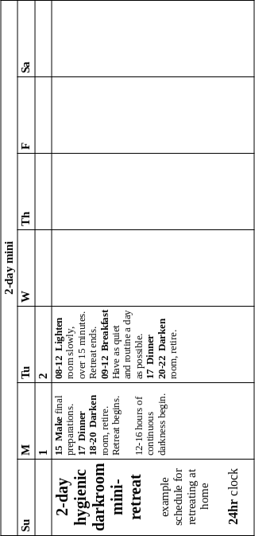
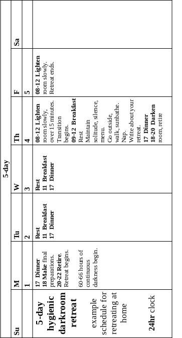
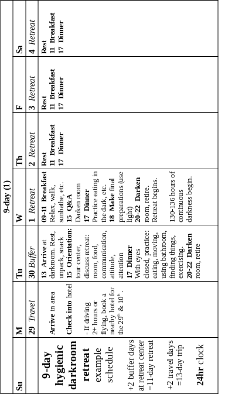
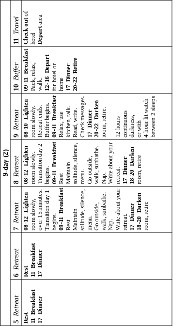

# _4_ &nbsp; format {#format}

We can use darkness in various formats for different reasons. Here, I describe formats in which I have experienced deep rest and gotten positive results in my energy level, psychic state, and general well-being. I also explain ways darkness can go wrong and how to easily avoid them. 

I recommend gradually increasing the length of stays in darkness. First darken your bedroom for sleeping and maybe a mini-retreat (12--16 hours). This improves your sleep and gives you a taste of a retreat. Upgrade your room for a [____5-day____](#5-day)&nbsp;_-​4_ retreat. You will get relief, profound rest, and hints of healing. It will also work for 9-day [____Czech____](#czech)&nbsp;_-​4_ retreats.

A dedicated darkroom works better for 9-day [____standard____](#standard)&nbsp;_-​4_ retreats and [____medium____](#medium)&nbsp;_-​4_-length retreats (3--8 weeks). I believe we can heal from the core of our suffering in a medium retreat. Your experience at home might inspire you to build such a darkroom yourself. Interest in darkness is growing. The world needs more and better facilities than the dozens that exist. 

Even greater preparations must be made for a [____long____](#long)&nbsp;_-​4_ retreat (3-12 months). It promises to enable us to heal from everything. This includes what few people believe can heal: major physical illness and injury, missing teeth, age-related symptoms. Even birth defects, including ugliness, brain damage, amputation, and nanite infestation might heal. It stands to reason. The self-healing organism cannot help but attain perfect health if the conditions are provided.

In general, the longer a retreat, the better its conditions must be. This means more silence, space, comfort, and support. You can pull off a 5-day retreat nearly anywhere.

A 9-day standard retreat requires upgraded conditions. Besides birth, a retreat might be the most important event of your life. It deserves serious attention—possibly more than your birth got.

## sleep {#sleep}

### tonight {#tonight}

Get relief _tonight_ from most outdoor ambient light. In 5-10 minutes, fix dark, dense sheet material over your bedroom windows and doors. 

- over door and windows, tack or tape up 
	- extra curtains, blankets, sleeping bags, dark bedsheets 
	- black plastic, carpet, or cardboard
	- or prop up plywood, old doors, or big table tops
	- use whatever you have to cover the windows
- extend corners of flexible materials as far as possible past door on each side
- turn off or cover devices in your room that produce light
- make sure you have plenty of fresh air, even if it lets in a little light
- block some of the remaining light with a mask from an airline or travel store; a tall dark, winter hat pulled down, or a dark t-shirt draped over your eyes. Every bit helps.

We often feel groggy after sleeping a lot after many short nights. Some call this getting too much sleep. But that is a physiological impossibility. The body never errs. It's a matter of how tired people can get and still keep their jobs.

In fact, we are tapping into the first layer of a backlog of lost sleep. Feeling groggy is the first phase of catching up. This can take days. Reversing sleep deprivation is like withdrawing from a strong drug. Like me, you may need a retreat to get to the other side of it without backsliding.

In the meantime, this format helps us remember how important darkness is. The next step is to make an [____instant mask____](#instant)&nbsp;_-​10_. When ready for perfect darkness, make [____window coverings____](#window)&nbsp;_-​10_ and a [____door seal____](#door-seal)&nbsp;_-​10_, maybe lightproof [____vents____](#vent)&nbsp;_-​10_ and a [____fan mount____](#fan-mount)&nbsp;_-​9_, and maybe even a [____silencer____](#silencer)&nbsp;_-​9_. Then your room will be dark, quiet, airy, _and_ easily reopened to light during the day.

### nightly {#nightly}

We require total darkness to sleep well. No one is an exception to this. You may be able to fall asleep despite the street light outside your bedroom window, but only at the expense of overall function (see Law of Vital Accommodation in [____process____](#process)&nbsp;_-​1_). The circadian system has not changed one iota since industrialization. It never gets used to anything. If light intrudes on your sleep, it will signal the circadian system to make your sleep less deep and restful, whether you know it or like it or not. It's like what many clients told me after their retreats: "I had no idea how tired I was."

A friend darkened his bedroom. He reported a huge improvement in the quality of sleep he and his mate got. Vivid dreams returned as well. I have experienced the same thing whenever I have been able to darken the room I sleep in. The darker the room, the better the sleep. 100% darkness is a 10,000% better than 99.9% darkness. Extinguishing that last bit of light leaves the mind nothing to hang onto. It gives new meaning to "falling asleep". See for yourself.

It is best to go to sleep early, from 18:00 to 22:00 at the latest. Four hours later, one naturally awakens from this "first sleep" for a candle-lit "watch" of about 4 hours. At this hour, one is freshly rested, yet the promise of sleep lies ahead. The world outside is quieter; children are asleep; the mind runs more slowly; and inhibitions are slightly relaxed.

This makes sex especially gratifying. Many consider it an auspicious hour for meditation or prayer. Use a candle or other dim, warm lighting. Avoid cold-tinted lighting, which greatly stimulates the circadian system.

Light exercise, light reading, and light snacking (on fruit) are fine, too. Perhaps a menial chore or two. But serious work can over-stimulate the mind and distract from getting back to sleep when tired again. 

A second sleep lasts 4 more hours. It is deliciously renewing. A nap in early afternoon, as short as 20 minutes, will refresh you yet again. That is, if you can stand feeling so good.

Before widespread public lighting, this was a common sleeping pattern. It's called biphasic or [____segmented sleep____](https://en.wikipedia.org/wiki/Segmented_sleep). It is natural. Retreating strongly resets it. If it happens with you, consider it a normal part of life recovered.

Many aspects of modern life seem out of control. Blackout blinds offer the unique thrill of reclaiming control over one of life's most basic functions: sleeping and waking. No more will sun and street-lighting determine when you wake up. You will, and when you are good and ready.

## retreat {#retreat2}

### short {#short}

Short retreats last 0.5--9 days. You can begin at home.

#### mini {#mini}

_Note: I do not recommend a mini-retreat. I merely suggest it as a possibility. Only do it if you can do it exactly as instructed, thus not endangering yourself. I cannot do them properly, so I don't try anymore. But some people will have the capacity and circumstances to make it ok. If you have a negative experience, don't try again. Use a 5-day or 9-day retreat to recover._

A mini-retreat allows you to dip your toe into retreating while keeping to your schedule. It includes the two primary phases of a retreat: sleeping long and deeply, and being awake by yourself without distraction for some hours. 

It is the same as sleeping nightly in darkness except you:

- turn off lights by 20:00 sharp*
- maintain darkness whether or not you wake up in the middle of the night
- get 1-2 extra sleeps in the morning
- stay in darkness 12--16 hours*
- have a quiet day at home and an early night

A mini-retreat could help maintain restedness between 5- and 9-day retreats. Some benefits of retreating fade and at different rates. Extend them. Smooth the transition to your next retreat with a mini-retreat per week or month.

Find a schedule for 5-day retreats in calendar form below.

> **_CAUTION:_** Start a mini-retreat by 20:00 at the latest, and stay no more than 16 hours. I learned both these rules the hard way. It induced mild shock and very negative feelings and thoughts. Recovery took a 5-day retreat.

If you can't start your mini-retreat on time, postpone it till you can. Starting regular retreats an hour late is less than ideal, but it still works because the organism has time to compensate. Not so with mini-retreating.

#### cycle {#cycle}

The human organism in darkness seems to go through a 48-hour cycle. The point of no return seems to be 16 hours. (I predict that research will bear this out.) So either exit a mini-retreat before going past this point or plan a 5-day retreat to complete the cycle.

Otherwise you may have a bad experience. For me it was like getting out of a Ferris wheel halfway up. Read my post, [____how not to retreat____](https://hygienicdarkretreat.com/blog/2013/05/how-not-to-retreat), for more on the debacle.

Biological rhythms are very powerful. Apparently, they cannot be messed with in this way. 

On the positive side, 48-hour cycles seems to work best in pairs. In the first cycle, suffering is relieved. Energy accumulates. False capacity is jettisoned. In the second, the extra energy is used to heal one of the causes of suffering and restore normal capacity. This is why a 9-day retreat is much more than twice as effective than a 5-day. 

#### 5-day {#5-day}

Once your darkening and ventilating measures are working smoothly for nightly use and mini-retreats, you can easily add the remaining elements of a darkroom for a 5-day retreat.

Everyone interested in a 5-day retreat can do one. Though not guaranteed, it is possible to catch up on all the sleep one ever lost. The amount of deep sleep that can be had in such a short amount of time is impossible to conceive beforehand and hard to believe even after experiencing it. 

You get relief from distress and overstimulation. You recover homeostasis. You regain hope and make a memory of feeling very good. While most effects fade after a few weeks, you will recover bits of your lost self. 

You start learning how to be in darkness. Your supporter starts learning how to be around a retreater. You will see better how and when to do future retreats, and for how long.

Running water is unnecessary for a 5-day retreat. See [____water____](#water)&nbsp;_-​11_ meet the simple requirements.

Timing of multi-day retreats is flexible compared to mini-retreats. Plan to turn off lights between 18:00 and 20:00. If something comes up and you are late, it's ok. But 22:00 is the deadline. If you miss it, start the next evening. 

Things come up. Insomnia, anxiety, and addiction screw things up. Darkness is how to begin seriously interrupting these illnesses. Most effects of a short retreat will fade. But you will glimpse the light at the end of the tunnel.

In accordance with the natural diurnal cycle, go into darkness in the evening and come out in the morning. Just stay in extra days in between. This makes the dark part of the 5-day retreat ~2.5 days (~60 hours). Avoid checking the time. Use a cellphone alarm set to a specific day to know when the retreat is over.

Besides sleeping as much as possible, eating, exercise, eliminating, bathing, what does one do in darkness without work, people, or media? One keeps [____attention____](#attention)&nbsp;_-​5_ in restful places. 

Afterward, slowly re-adjust to light. You did not just watch the flickering light of a matinee in a dark cinema. You spent days in total darkness. Sudden exposure to daylight would be a shock. Spend a minimum of 15 minutes gradually relighting the room. Open the door or uncover a window a few millimeters at a time. 

> **_CAUTION:_** I did too many 5-day retreats (13!). It was like getting caught in a whirlpool. I lost too much [____false capacity____](#false-capacity)&nbsp;_-​1_ before normal capacity could be restored to compensate. Avoid this mistake.

If you do a 5-day retreat, just do **one**. Then press on with arrangements for a 9-day Czech retreat. This begins with sharing the idea with others. You support their 9-day Czech retreats, probably in your darkroom, till one can support yours. More below about this.

A schedule for 5-day retreats in calendar form is below.

#### lit {#lit}

Surprise: in a good dark retreat, some days are sunlit.

Medium and long retreats also have lit days.

##### transition {#transition}

It takes time to properly readjust to light and ordinary life. So a period of unstressed transition back to it is _just as important as darkness itself_. For every three days of darkness, schedule one day of transition with sunlight. Uncover windows and spend time outside during daylight hours. Hand write a report about your retreat. Everything else about the retreat remains the same. 

Hormones need time to readjust to light. The sense of balance can also be affected. Retreating has often felt like a chemical process. I have felt sleepiness or coolness flood through my brain or hands. It takes time to reflect on what just happened. One begin integrating the changes, extra energy, and value of the retreat. 

Spend transition days quietly, visiting no one. First, slowly uncover at least one window. Take a slow walk or two. Sunbathe or sit in the sun outside without sunglasses. Take a nap inside with windows covered. Uncover them again. Re-cover them by 20:00 and spend the whole night in darkness. Repeat for each transition day.

After your last sleep, slowly uncover the windows. Leave the room by noon at the latest. Take some time leaving. Maybe take another walk or sit in the sun. Have a few words with your supporter, not much.

##### extra {#extra}

One becomes more vulnerable during a retreat to shocks and stresses of the world. When in unfamiliar places, the being must be more protected. Extra days before and after a retreat allow for this. There are two kinds: buffer and travel.

When retreating away from home, add 2 buffer days to your retreat, one before, one after. Thus, a 5-day retreat would require 7 calendar days. Buffer days are taken at the darkroom.

When traveling to a retreat center by plane or more than 2 hours on wheels, add 2 more days for travel, one before, one after. Thus, a 5-day retreat involving such travel would require 9 calendar days. Travel days are taken at a hotel.

Let's walk through it. 

1. Travel the first day of your trip. Stay in hotel. Get the plane, traffic, and crowds out of your system.
2. The next day—the first buffer day—go to the retreat center. This gives you time to disconnect from the world and get used to the darkroom and staff. To choose furniture, appliances, etc.
3. Do your retreat: darkness + transition.
4. The buffer day afterward gives you time to reconnect to the world. Talk to people, check messages, review your work schedule, etc. Leave for the hotel. Gear up for the crowds, traffic, and plane again.
5. Travel home the next day. The benefits of the retreat, stowed safely in your being, will arrive intact and ready to flower in your daily life.

My Australian collaborator, Marion Abbott, discerned the need for these extra days when planning for her first client. Who loved the luxury of time they imbued her whole trip with.

I love it, too. Extra days seem as important to me for successful retreats at a center as transition days are everywhere. Marion's insight is an example of the care for life that hygiene inspires. Let us be careful about it and take our time.

After returning home, ease back into your regular life. Avoid non-routine activities the first week. You will likely continue to notice effects from the retreat. Due to their dreamlike intensity, I call this phase the aftermath. See [____post-retreat____](#post-retreat)&nbsp;_-​5_.

#### 9-day {#9-day}

The organism's response to darkness is cumulative; the healing process deepens every day. Nine days is more than twice as beneficial as five.

Many of my early clients felt like they were just beginning to get somewhere when their 5-day retreats ended. Some were either very wound up or very rested to begin with. There was not enough time for them to get anywhere, whether with their exhaustion or deeper issues. So I upgraded my darkroom to handle 9-day retreats for first-timers. 

Sure enough, they did fine. They expressed greater satisfaction with their retreats than 5-day retreaters. A first retreat of 9 days ensures a breakthrough of some kind is made. 

In rare, highly crystallized personalities, a noticeable breakthrough may require a medium retreat. Healing must deepen sufficiently for strong defenses to dissolve. But 9-day retreats have great potential to support recovery of the lost self in nearly everyone.

The over-loss of false capacity is avoided in a 9-day retreat. Two 48-hour cycles allow a cause of one's suffering to permanently heal. One will gain noticeable measures of energy and personal stability.

In terms of the 48-hour cycle, the 9-day retreat seems to have an extra day. I want to make sure there is enough time for significant healing to occur. If it has by the 5th morning in darkness, a day before the transition is scheduled to begin, then the transition can begin then. If not, keep to the schedule. Two transition days are required in either case.

If you have built your own darkroom, do a 9-day retreat once a friend has done a 5-day or 9-day retreat and can support you. If retreating at an established darkroom, you can begin retreating with a 9-day retreat. 

A [schedule for 9-day retreats in calendar form is further below.

##### standard {#standard}

A standard 9-day retreat has all the conditions of a 5-day retreat, plus:

- a second 48-hour cycle
- a second transition day
- a separate building for the darkroom
- the support team has three people. They have all retreated and read this book. Two are onsite all the time. One runs errands and stays nearby, on call. This creates psychic shielding for the retreater. 
- a fully functional bathing facility to support emotional as well as physical cleansing. For remote  locations, see my design for a portable indoor [____shower____](#deluxe3)&nbsp;_-​11_.

These conditions enable the retreater to relax and heal as deeply as possible for this length of retreat. Imagine  sanctuary: its silence and peace. Life will have everything it needs to finally tend its wounds.

Conditions have proven difficult to provide. How do we get there? Czechs have given us the missing rung of a [____ladder____](#ladder)&nbsp;_-​4_ to climb to this height.

##### Czech {#czech}

I lived awhile in Czech Republic in 2019. I visited several dark retreat centers.

A typical Czech retreat lasts from Friday to Friday, 7 nights, 6 days of continuous darkness. Retreaters are advised to return home for the weekend and relax as a kind of transition. The room is cleaned. Another retreater begins the same day.

This fits the schedule and budget of most Czech retreaters. And it keeps operators in business. It is not a country rich in money. Czechs are resourceful and economical.

Czechs are highly intelligent, with a rich culture. But for hundreds of years, they lived under the boots of foreign powers. To protect their souls, they developed rich inner lives.

Darkness came naturally to Czechs. Within 15 years of the Soviet collapse, Czech Republic became the dark retreat capital of the world. Now it has 30 centers with 70 rooms for a population of only 10 million. Per capita, this is 200x more than America.

Some darkrooms are simple detached cabins. Some share walls with other darkrooms in the home of the operator. Often, only one supporter serves multiple retreaters. Sometimes, it works. But sometimes, noise, poor air quality, and stressed supporters compromise retreats.

A hygienic Czech retreat has:

- nearly as much continuous darkness (6 nights, 5 days)
- the same total amount of darkness (8 nights, 10 with buffer days)
- time to absorb the benefits (2 transition and 2 buffer days)
- a single qualified supporter (who has done a 5- or 9-day retreat and understood my book)
- one building for both retreater and supporter 
	- with sonic isolation between darkroom and supporter quarters
	- kitchen and bathroom can be used by supporter
- lower expectations for results than in a standard retreat
- a quiet, well-ventilated darkroom of superior design
- hygienic (frugivorous) food 
- better prepared retreaters

The typical 7-day retreat of the Czechs may be why they avoid the injury of over-loss of false capacity despite deficiencies in their operations. Their wisdom in this can safeguard us, too, until we can organize standard 9-day and medium retreats.

**Problems:** Supplies might run out. The supporter might get tired or need to go out. Here are solutions:

- planning: think of contingencies. Buy extra stuff: food, spare heater, fan. Whatever might break or run out. 
- help: 
	- a friend, assistant, or a grocery delivery service
	- a substitute supporter relieves the main supporter for a night halfway through the retreat's dark period
- telephone: supporter goes shopping with a phone, telling retreater. Retreater has a darkened programmed phone to call with. 3 hours max. This can happen once halfway through and on buffer and transition days. This is a last resort. 
- breaks: supporter gets long breaks between supporting retreats, 1-2 weeks

Don't push things. Err conservatively. Build in surpluses and redundancies wherever possible. The retreater needs someone around for minimal psychic shielding, as with the standard retreat. The supporter needs care, too.

#### schedule {#schedule}

Here are schedules in calendar form for:

- 2-day mini-retreat 
- 5-day retreat
- 9-day retreat

Or read them in [____linear form____](https://hygienicdarkretreat.com/schedule).

{pagebreak}

#### ladder {#ladder}

For a long time, I was stuck in the course of retreats I had envisioned. It was like a ladder made for 3m high giants. And it had a missing rung between 5-day and 9-day standard retreats. It was too far to get a leg up. And I could not stay with 5-day retreats and suffer more over-loss of [____false capacity____](#false-capacity)&nbsp;_-​1_.

The [____Czech retreat____](#czech)&nbsp;_-​4_ is the missing rung. Now the ladder is complete:

1. read my book
2. darken your room for sleep
3. upgrade it for a 5-day retreat
4. do one
5. improve your life (after every retreat)
6. upgrade room for 9-day Czech retreats
7. support them for others, training some of them as supporters
8. have one of them support a Czech retreat for you
9. build a darkroom in a separate building
10. do and support 9-day standard retreats
11. build portable hygienic houses
12. move to a better location with them
13. do and support medium retreats
14. do and support long retreats

### medium {#medium}

A medium retreat lasts 3--8 weeks (including ~25% transition days). This length of a retreat will enable the organism to heal the root causes of one's psychic suffering. Some problems will vanish, others may remain. But one will finally be able to solve them. With so much time at rest, the organism can restore its primary system. One will finally have the capacity to put things right again.

Minimize internal obstacles: get away from all accustomed influences and associations. Now that you know what you're doing in darkness, it's worth paying extra for this. Take a trip at least a couple hours away. Fly to a darkroom on another continent if necessary. Or rent a fully functioning small house in an unpolluted place and darken it yourself, arranging for maintenance and support with experienced fellow retreaters.

The darkroom needn't be fancy, only function in every way without fail or compromise. One of the supporters must be handy enough to keep it that way. There's nothing like mechanical issues to ruin a retreat.

Two of three supporters should be available all the time to make sure you have food, basic comforts, and someone to talk to for a few minutes when necessary. By the time you decide to do it, you will know you are doing one of the most important things in your entire life. Prepare accordingly.

The benefits of short retreats are impressive but still limited. Doing many of them does not equal doing a few long ones. The law of diminishing returns combines with the frustration of glimpsed but unrealized potential. Boldly escalate from a couple short retreats to a medium one.

I did a long series of 4-5-day retreats. My next retreat will be 9 days. I aim for 21 days (including transition days). In 2008, in my second successful retreat, I had a vision: in 2 weeks of darkness I will heal from my psychic trauma at the core. This will enable me to put the rest of my life back together afterward. With 5 transition days, this will make for a 21-day retreat.

I do not know exactly how long others would have to retreat to reach the same point. I assume others will have similar visions in their short retreats of how long their medium retreats must be. Thus the time range of 3-8 weeks.

One of my clients has been considering this for awhile. In his early experiments with darkness, he sensed that he would need 3 weeks of darkness (plus a week of transition days). I believe people come to know precisely what they need the more they get of it.

### long {#long}

A long retreat lasts 3-12 months. I have heard reports of retreats like this. They had results we would consider miraculous. But they are within man's potential. The organism made itself to begin with. Under good conditions, it is able to remake itself, perhaps better than new.

[____Stories persist____](https://hygienicdarkretreat.com/report/365-day-yogi) of astonishing physical healing occurring in Ayurvedic dark retreats lasting 3-12 months: growing new teeth; recovering lost hair and eyesight, even youth itself. It is worth looking into.

The hygienic protocol for long retreats is yet to be determined. Short retreats give us clues about medium ones. Medium retreats will give us clues about long ones. Reports from other traditions are useful. 

For example, in the above story, the yogi exposed himself to a tiny amount of light. His assistants would leave the darkroom door cracked when they brought him food before sunrise, after first light. Is this a good idea? Let's find out.

He attributed his miraculous recovery, not to his practices in darkness nor the ayurvedic herbs he took, but to Lord Krishna. Krishna is an incarnation of Vishnu, the preserver. He is a projection of the self-preserving power of life. 

Jesus the Christ is called the author of life. The Christ principle is in all living things. Jesus modeled it. His complete identification with the Christ naturally resulted in miracles.

He said all who believe in Him, the Christ, would do all he did and more. For he would go to the Father, something even greater that we cannot yet behold. 

One needn't be a Hindu or Christian to appreciate the vivifying principle in these ideas—and in every organism. The principle means you and I are enough. We have within ourselves the living power we need to recover ourselves. We need only provide it the proper conditions.

This much we can do. 

W> ## warning {#warning}

There are five harmful and dangerous ways to retreat in darkness. I learned about them the hard way and am paying the price to this day. The only possible point of my enduring them was so I could warn you. These are little gateways to hell. I sincerely wish you to heed my words and to avoid such suffering.

Fortunately, avoiding them is easy once you know. In the list, each is linked to longer discussions of them elsewhere in the book. Just say no to:

1. mini-retreating even one second behind schedule. See _retreat_ > _mini_ section above.
2. retreating without transition days. See _5-day retreat_ above and [____post-retreat____](#post-retreat)&nbsp;_-​5_.
3. doing more than one 5-day retreat rather than advancing to 9-day, medium, and long retreats. This is a serious no-no, folks. See _5-day retreat_ above and [____false capacity____](#false-capacity)&nbsp;_-​1_. The matter cannot be overstated.
4. sub-standard darkrooms. We become vulnerable in darkness. We are fools to tolerate the irritations and compromised retreats due to poor design and construction: noise, low air-quality, toxic materials, discomfort, cold drafts, etc. See chapters 7-11 for how to build or judge a darkroom suitable for hygienic retreats. Precious few people operate them. It's time to get serious and build world-class darkrooms.
5. poor support:
	- insufficient support
	- inexperienced, ignorant, or indifferent support
	- other people who are around who are hostile to you or to retreating itself. Say no to abusive relationships of all kinds.
6. I said five. But now I'm going to talk sternly.

	By ignoring my instructions and warnings, maybe you can discover more ways to get hurt in darkness. But as my late legal counsel, DeWaynn Rogers, would ask, What is the penalty for following instructions?

	In the future, we will have more data. We will have studied, applied, and reflected upon all this enough to see better ways. I will update my writings to reflect them, just as I have for 15 years.
	
	Until then, stick to the tried and true. Err conservatively. Be reckless about some other part of your life. The most amazing thing you ever do is bound to have rough edges if handled incorrectly. Don't pet pigs backwards, either.

Ok, now you know how to keep yourself safe in darkness. Back to the many wonders of hygienic dark retreating.

## future {#future}

I aim for the simplest way to restore health fully. Broken bones can heal perfectly. So can we, and in every aspect. To this end, I would like to see hygienic retreat centers worldwide with facilities and support for:

- short, medium, and long dark retreats
- fasts (a la Albert Mosseri's groundbreaking [____method____](https://hygienicdarkretreat.com/f/fasting))
- physical retraining
- training in healthy lifeway, including both lifestyle and livelihood
- open-source research and development of the above
- a village residence for staff, family, friends, and guests, where all this gets applied and tested in real life

In 4–5 visits over 2-3 years, one would be:

- restored to full function and vitality
- able maintain it in daily life
- healed of all trauma, poisoning, and exhaustion of the past

For a few years, I focused on designing and building public darkrooms. Then came a few more years of making private darkrooms at home. As a consultant, I am also available to help:

- operators of retreat centers who would like to switch to the hygienic approach
- developers of hygienic retreat centers described above

If you support hygienic dark retreating, I will refer clients to you. Write me.

~/~

It may take a few generations of healthy living to fully restore our health and realize man's potential. I believe we can get most of the way back in our lifetimes.

We have examined different formats of the restful use of darkness for different circumstances and purposes. Let's look ahead to more of what happens in a retreat and exactly how to conduct it.

