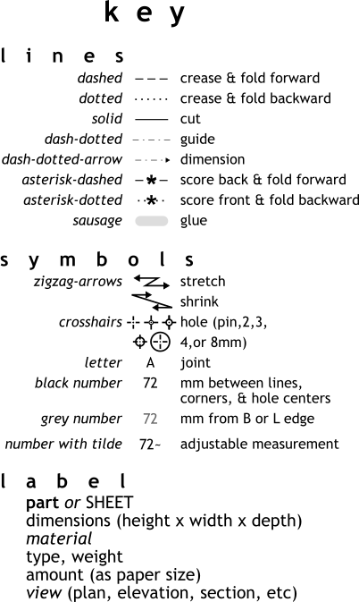

# _8_ &nbsp; make {#make}

> _The time for half-measures and talk is over._  
&nbsp; &nbsp; &nbsp; -- Maximus, in "Gladiator"

## intro {#intro2}

Just the thesis of this book has brought relief and hope to readers. But 99% of its value lies in its application. This requires a darkroom. Darkrooms are uncommon. Suitable buildings are not. These last four "make" chapters explain how to build darkrooms inside existing buildings.

Whether or not you build a darkroom, reading these chapters will give you a sense of being in one. You will:

- see how
	- the abstractions in the first part of the book apply concretely in this one
	- theory, process, and design make up an integral whole, sans contradiction
- learn how to combine elements into a system in your own design
- learn what to look for in a darkroom
- know what is going on around you during a retreat
- be better able to help diagnose, even fix yours should it break down during your retreat

This chapter provides basic information that applies to all components of a darkroom. The next three chapters provide blueprints and instructions for components related to three elements: 

- [____air____](#air)&nbsp;_-​9_
	- vents: universal and threshold
	- silencer
	- fan mount
	- power sources, heating, air purification are discussed 
- [____darkness____](#darkness)&nbsp;_-​10_
	- mask
	- door seal
	- blinds: double blind and panel
- [____water____](#water)&nbsp;_-​11_: DIY, portable kitchen and bathroom fixtures
	- sink
	- toilet
	- bath/shower
	
Designs are low-cost, low-tech, and work off-grid.

A darkroom is a real thing you see and touch, make, use, and offer others. It is not a metaphor. It takes knowledge, imagination, design, measurement, plans, materials, craftsmanship, construction, testing, and improvement.

These are normal activities. Everyone does them to some degree. and get help with the rest. If you can walk down stairs without falling, slice a loaf of bread, hit a plate when you aim food at it, hold a pencil, cognize sentences, tell light from dark, and feel a breeze, you are mechanically sufficient to begin. As Jack Nuckols, a mechanical engineer and my grand-elder, told me when my time came, "Become a craftsman." Perhaps your time has come. Become a craftsman.

I make mistakes as I make things. Don't imagine otherwise. Don't imagine you won't. Fix what you can. Start over when you must. There are only two embarrassments in craftwork:

1. having zero ability with it for lack of trying and trying again until you succeed. Way too many people these days are thus embarrassed. Don't be counted among them just because you got a late start. Life requires making things. Get to it. Don't wait for the robots.
2. not scrapping a ruined piece of work. Start over. It's what trash cans are for.

Jack, ever good-natured, talked to us like this when we were kids. We loved it. He challenged us, inspired us, and helped us when we wanted to make something.

A sniper's rule could belong to craftsman, too: "Aim small, miss small." The precision of the plans to follow helps you aim small. The designs and materials are forgiving. Little mistakes can be absorbed, bigger ones, corrected or repaired, fatal ones, quickly forgotten with a fresh set of parts.

I suggest that, your first time through these last chapters, just read the prose parts. Skim or skip the instructions till you make something. They can make quite dense reading before you have great need.

All components rely on the basic instructions in the following sections: **metric**, **tools**, **plans**, and **fabrication**. Each component has special instructions and design constraints in later chapters. 

After improvising darkness to sleep in [____tonight____](#tonight)&nbsp;_-​4_, the [____instant mask____](#instant)&nbsp;_-​10_ probably comes next. Thus initiated, you can begin your training as a darkroom-building ninja. You will become invisible to everyone for a while. And everything will be invisible to you, too. Haha.

If you need more specific advice for darkening your space, I provide [____design consultation____](#consult)&nbsp;_-​x_. I guide people through text, voice, and image on a chat app toward a completed darkroom and successful retreat. Likewise, feel free to use these [____open-source____](#open-source)&nbsp;_-​e_ designs and my consultation to darken other people's spaces as a service for money. See [____license____](#license)&nbsp;_-​w_ for my liberal terms.

## metric {#metric}

All measurements are in metric. Lone numerals are in millimeters, marked by -, x, + (in drawings, nothing). Examples:

- 50- = 50mm
- 50--60- = 50mm to 60mm
- 50 x 40 x 3 = 50mm wide x 40mm high x 10mm deep/thick
- 50 + door thickness = 50mm + door thickness
- in a drawing, 50 = 50mm

Are you used to the inches, pounds, and gallons of the imperial system? Get a handle on the brain-descrambling metric system in a split-minute:

1. When using it, count, add, subtract, multiply, and divide by 10 as usual. Forget about fractions and multiple conversion factors.
	- basic conversions:
		- length: 
			- 1m = 100cm = 1000- (meter, centimeter, millimeter)
			- 1cm = 10-
		- volume: 1L = 10dL = 1000mL (liter, deciliter, milliliter)
		- mass: 1kg = 10hg = 1000g (kilogram, hectogram, gram) Mass is like weight. But it uses a balance, not a spring scale, so it does not depend on Earth's gravity. (Build a darkroom in space!)
	- cool intra-conversions: 
		- 1L = 10cm x 10cm x 10cm = 1000cm^3^
		- 1L water = 1kg, thus:
		- 1mL water = 1cm^3^ = 1g 
		- brilliant! simple! humane!
2. Make the metric system tangible. Visualize the following imperial near-equivalents. Then use them to imagine my descriptions and make estimations. More precise conversion factors given in {braces} for large quantities.
	- length	
		- 25- = 1" (inch) {25.4-}
		- 100- = 4"
		- 30cm = 1' (foot)
		- 1m = 40" {39-3/8"}
		- 3m = 10'
		- 1km = 0.6 mile / 1 mile = 1.6km {0.62-/-1.61}
	- area
		- 1m^2^ = 11'^2^ {10.76}
		- 4' x 8' sheet = 122cm x 244cm = 3m^2^
		- A0-A8 paper size system. A sheet's 1:&radic;2 proportion remain the same when cut in half the short way. A0 = 841 x 1189 = 1m^2^. A1 = 595 x 841 = 0.5m^2^. A4, the metric counterpart to North American letter size paper, is 210 x 297 = 0.0625m^2^ (1/16m^2^)
	- volume
		- 4L = 1 gallon {3.79}
		- 1.7cmh = 1cfm (for airflow: cubic meter per hour to cubic feet per minute)
	- mass 
		- 28g = 1 oz {28.35}
		- 1kg = 2 lb {2.2}

## tools {#tools}

Making components requires most or all of these tools:

1. table or desk
2. measure
	1. Note: before purchase, test tools for accuracy, which can vary between identical tools, even of good brands. Instructions below.
	2. metric ruler, 45--50cm, clear plastic. If reproducing plans by hand rather than printing them, also get a 30cm [____Incra ruler____](https://www.incra.com). For its effortless marking precision, I recommend it for making anything at all ever. It's the greatest hand tool I have ever used.
	3. metric measuring tape, 5m
		1. common in dollar stores and Harbor Freight Tools in America
		2. hook tape on end of meter stick and compare marks for accuracy of external measurement
		3. push end of meter stick against a wall, put tape on top of meter stick, and compare marks for accuracy of internal measurement
	4. optional: meter stick, steel with engraved marks
		1. skip this in America. It's too hard to find. You just need a long straight edge. 
		2. put marked edges of two sticks together so 40cm mark of one meets 60cm mark of other
		2. push ends of both against a wall and check how well marks line up
		3. repeat with other sticks till you find a match
		4. buy one of them 
3. mark
	1. 0.5- mechanical pencil
	2. ballpoint pen, black or blue ink
	3. black marker
	4. straight pin with colored plastic head or masking tape handle
	5. magnifying glass (even a tiny plastic one works, like the one in a Swiss Army knife)
4. crease, score, cut 
	1. straight edge 200- longer than your longest piece will be. 1--2- thick steel is best. An aluminum door or window frame member also works well. A board less than 12- thick with a perfectly straight edge (check it!) is fine.
	2. table knife: use back of tip for creasing
	3. razor knife with new blade: use for scoring and cutting. To score is to cut halfway through thickness of material with razor knife so it remains one piece and folds very easily
	4. scissors for both paper and fabric
5. join
	1. masking tape
	2. wood glue, unthickened, any grade
	3. glue syringe, 20--50mL for precise, efficient gluing
		- available
			- at kitchen supply shops, with 2--3- stainless needles
			- at discount variety stores (dollar stores, bazars) 
			- at pharmacies. Also get a 2 x 40--50 needle. Perhaps cut off the tip. If unavailable, use a cartridge from ballpoint pen, the fat (4--5-) tapering type. Clean it out and trim it down to point in taper that fits over nipple of syringe
			- at woodworking shops, with needles
		- remove needle and plunger. Cover nipple with finger and fill from back, leaving 10- unfilled. Replace plunger barely. Point nipple upward and uncover it. Wait for air bubble to rise to top. Then push plunger in till air is cleared from syringe. Replace needle and use.

## plans {#plans}

Computer-drafted plans are precise, clear, and easy to modify. They can be baffling at first. Keep studying them.

1. use the **key** to understand the symbols and marks
2. compare drawings to photos.
3. read the instructions through a couple times in the days before making begins.
4. then _follow the instructions_, one step at a time. You ought to end up with the intended component. 
5. dimensions are X x Y x Z (left-right x up-down x forward-backward; width x height x depth/thickness)

Understanding often comes through doing. If this does not work, write me and I'll try to sort out the confusion and maybe improve the instructions and drawings for others, too.

A drawing has one or two _views_, depending on the best way to communicate its information. Most are two-dimensional (2D). A couple are 3D.

- _plan:_ from above. Default view.
- _pattern:_ flat, unfolded part from above
- _elevation:_ from the side
- _section:_ a cutaway or slice of the object showing all parts when assembled
- _perspective:_ from a non-right-angled point of view to capture more sides (3D)
- _exploded:_ all parts separated but in correct order and linear relation (3D)

For example, the [____universal vent____](#universal)&nbsp;_-​9_ has pattern views of its parts and a section + elevation view showing how parts are assembled. The [____toilet frame____](#upgrade2)&nbsp;_-​11_ has both plan and elevation views, while the [____shower____](#upgrade3)&nbsp;_-​11_ has an exploded view. The [____threshold vent____](#threshold)&nbsp;_-​9_ has a perspective view.

All plans can be reused except the [____mask____](#mask)&nbsp;_-​10_ plan, which is destroyed as you make it. So make as many prints of it as masks you intend to make. 

Images in this book are only for reference and hand-reproduction. They are reduced to fit book pages. Thus they are neither full-scale nor in proportion to each other. If reading on a screen while online, you can zoom in. Download a full-size PDF with link below each image.

### 1 &nbsp; download {#download}

Download all plans at once with the dark retreat [____zip file____](https://hygienicdarkretreat.com/hygienicdarkretreat.zip). Extract (decompress) the file. Contents:

- plans: a complete set of PDF plans
- all photos below plus extras from website
- SVG source files of plans for modifying them, originally drawn in [____Inkscape____](https://inkscape.org).

### 2 &nbsp; print {#print}

1. large format
	1. large format printing is cheap, extremely accurate, and much faster and easier than desktop printing. Most print shops, including Staples and Office Depot, now offer large format printing.
	2. email your files to print shop or take them on a USB flash drive
	3. paper: specify cheapest option
	4. have files printed in actual size, with no scaling. Before paying, check measurements with ruler or measuring tape. Distortion should not exceed 1- over a 250- span.

		After resigning myself to 2- distortion per 250- (0.8%) with desktop printers, I was shocked to find almost no distortion with large format printing, maybe 0.5-/500- (0.1%). But then it made sense because architects, engineers, and builders depend on this service for their blueprints. 
		
		[Note: it turns out that machine was very well maintained. Another large format print job I had done was quite distorted. So, get a guarantee of accuracy and check before paying.] 
2. desktop
	1. only do this if you are absolutely broke or can't find a large format printing service on your desert island. Desktop printing of plans takes a lot of time and yields imperfect results.
	2. print
		1. open file with Adobe Reader (not Adobe Professional) 
		2. in print dialogue, select: "Poster"; Tile Scale: 100%; Overlap: 1.0in; Cut marks: yes; Labels: yes
		3. use A4, letter, or legal size, possibly A3
		4. Distortion over 250- span should not exceed 1-.
		5. after printing one file, check measurements against ruler to 1- tolerance.
	3. join sheets 
		1. cut a small wedge out of overlapping cut mark to align it with matching cut mark on sheet below
		2. align cut marks at perimeter of plan first, then the one(s) in the middle. 
		3. use masking tape to join sheets
3. by hand
	1. ruler and magnifying glass
		1. get large white paper to make a reusable pattern with. Don't measure directly on materials.
		2. to keep drawing orthogonal, use some combination of graph paper, drafting table, and extra careful measurement and marking. An [____Incra ruler____](https://incra.com) will help a lot with this. 
		3. use magnifying glass to see small words and numbers in the book
		4. plans are as symmetrical and uniform as possible. If two similar-looking areas of a plan look the same size, they are. So from measurements given in plans, infer the rest. There is some redundancy so you don't have to figure out everything and can double-check essential measurements with arithmetic. 
		5. use grey-numbered cumulative measurements in plan to quickly mark lines
	2. trace
		1. trace directly from a flat screen monitor
		2. zoom image till stated measurements match a ruler both horizontally and vertically
		3. tape paper to the screen
		4. mark ends, corners, and intersections of lines precisely and lines just well enough to know what you are looking at later
		5. you will have to overlap multiple sheets of paper for most plans, as with a desktop printer. On each new piece of paper, repeat the last set of marks from the previous so you know where to overlap and tape the sheets together.

### 3 &nbsp; key {#key}

Below is the key to the plans. Find further explanation of symbols in **fabricate** section below, especially the dash-dotted guide line. Its use varies with each drawing.

&nbsp;

&nbsp; &nbsp; &nbsp; &nbsp; &nbsp; plan: key - [____download____](https://hygienicdarkretreat.com/img/plan/key.pdf)

{pagebreak}

## fabricate {#fabricate}

These instructions apply to all components, or as indicated. Read further instructions for each component in its respective chapter and section afterward.

### 1 &nbsp; prepare plans {#prepare-plans}

1. for fabric parts of ([____universal vent____](#universal)&nbsp;_-​9_ and [____mask____](#mask)&nbsp;_-​10_):
	1. using ruler and razor knife, cut out parts on solid outlines
	2. cut out tape holes approximately on dash-dotted lines 
	3. skip to [____3 - make parts____](#make-parts)&nbsp;_-​8_ below
2. where necessary, make small v-cuts in outlines of plans to see where to align them with edges of materials

### 2 &nbsp; transfer plans to materials {#transfer-plans-to-materials}

1. tape plans to materials
	- [____universal vent____](#universal)&nbsp;_-​9_: skew patterns to cardboard, 15°
2. put cutting mat or three layers of cardboard on work surface
3. transfer plan with straight pin
	- use magnifying glass for ease of marking and geeky precision thrills
	- poke pin through:
		- all black lines close to ends (not grey glue sausages)
		- centers of holes
4. remove plan from material
5. mark pin holes:
	- dashed lines: circles
	- dotted lines: double circle
	- solid lines: squares
	- dash-dotted lines: triangle
	- holes: star
6. mark the marked holes again
	- draw short lines from circles, triangles, and squares in the same direction as lines in plan
	- circles/double circles: add asterisks where indicated 
	- copy joint letters (A, B, C...)
7.  label drawing, words oriented the same as in plan

### 3 &nbsp; make parts {#make-parts}

1. universal vent walls & baffles: blacken one side with acrylic paint or black paper 
2. keep scrap cardboard on work surface
3. fabric parts (mask, vents)
	1. tape plans to fleece over tape holes
	3. cut parts exactly around plan outline with scissors 
	4. leave plans taped to mask side seals
	5. remove plans from other parts
	6. repeat steps 1--4 to make
		 - 2 mask center seals
		 - 4 mask covers. For the 4th cover, use optional cotton fabric, add 20- on side for seam allowance, and leave plan taped to fabric.
	7. skip remaining steps and resume special instructions
4. paper/cardboard parts
	1. between holes in cardboard
		- circled pairs: crease front, fold forward
		- double-circled pairs, crease back, fold backward
		- press hard into creases with sharp edge of straight board at 45° angle
	2. between circled and double-circled holes in paper:
		- crease front side
		- fold forward
		- refold backward between double-circled holes
	3. between squared holes: cut with razor knife
4. wood: cut parts on a table saw

Voila. You've got the basics of all darkroom components. You've prepared their plans and parts. Now, let's see how they come together for ventilation, silence, and warmth.

