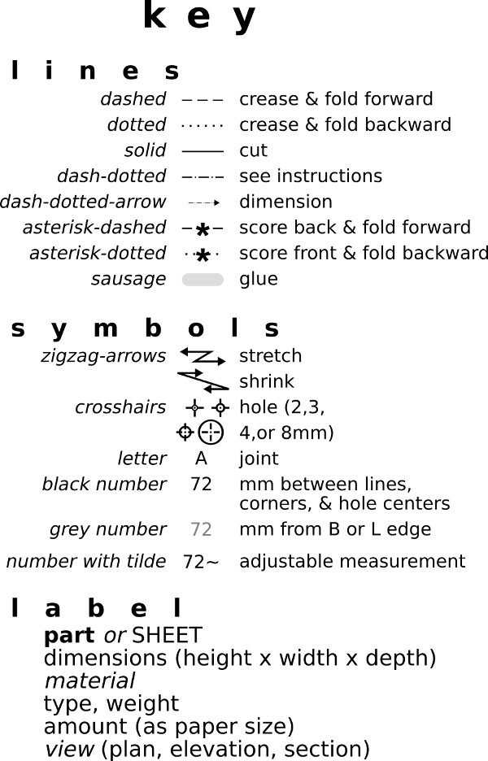

# 8 - make {#make}

> "The time for half-measures and talk is over."  
 -- Maximus in _Gladiator_

&nbsp;

Just the ideas in this book can bring relief and hope. But 99% of their value lies in their application. This requires a darkroom. Since darkrooms are uncommon, these last four chapters explain how to build darkrooms, usually inside existing buildings. 

This chapter provides basic information that applies to all components of a darkroom. The next three chapters provide blueprints and instructions for components related to three elements: air, darkness, water. They are vents, silencers, seals, blinds, and kitchen and bathroom fixtures. Designs are low-cost, low-tech, and work off-grid.

A darkroom is a real thing you see and touch, make, use, and offer others. It is not a metaphor. It takes a knowledge, imagination, design, measurement, plans, materials, craftsmanship, construction, testing, and improvement. 

These are normal human activities everyone can do to some degree and get help with the rest. If you can walk down stairs without falling, hit a plate when you aim food at it, hold a pencil, cognize sentences, tell light from dark, and feel a breeze, you are mechanically sufficient to begin. As Jack Nuckols, an engineer and my grand-elder, once told me when my time came, "Become a craftsman." Perhaps your time has come.

I suggest that, your first time through these chapters, you read everything in this one but just the prose parts of the last three. Save the lists of instructions for when it comes time to build. They make dense reading. Eventually, they'll be replaced with graphical assembly instructions like IKEA's. For now, slog through with me.

All components rely on the basic instructions in the following sections: **metric**, **tools**, **plans**, and **fabrication**. Each component has special instructions and design constraints in its own section in later chapters:

>> [____9&nbsp; air____](#air)  
[____10&nbsp; darkness____](#darkness)  
[____11&nbsp; water____](#water)  

After improvising darkness to sleep in [____*tonight*____](#tonight), the [____*instant sleeping mask*____](#instant) probably comes next. Thus initiated, you can begin your training as a darkroom-building ninja. You will become invisible to everyone. And you won't be able to see anything, either. Haha.

If you need more specific advice for darkening your space, I provide [____*design consultation*____](#services). Yes, guiding people by word and picture on a chat application toward a completed darkroom and successful retreat actually works, and I have done it. Likewise, feel free to use these [____*open-source*____](#open-source) designs and my consultation to darken other people's spaces as a service for money. See [____*license*____](#license) for my liberal terms.

## metric {#metric}

I give all measurements in metric, mostly millimeters. Are you used to inches, pounds, and gallons? Get a handle on the brain-descrambling metric system in a split-minute:

1. understand that, with metric, you will simply be counting to 10 and multiplying by 10 like normal. You will not, thank god, be wrangling fractions and multiple conversion factors as in the imperial system.
    - basic metric conversions:
        - length: 1m=100cm=1000mm (meter, centimeter, millimeter)
        - volume: 1L=10dL=1000mL (liter, deciliter, milliliter)
        - mass: 1kg=10hg=1000g (kilogram, hectagram, gram. Mass is like weight. But it uses a balance, not a spring scale, so it does not depend on Earth's gravity. Build a darkroom in space!)
    - cool intra-conversions: 
        - 1L=10cm x 10cm x 10cm (1000cm^3^)
        - 1L water=1kg
        - thus, 1mL water=1cm^3^=1g 
		- brilliant! simple! humane! 
2. use these imperial near-equivalents to practice the metric system, visualize my descriptions, and make estimations. Not for precise conversions or large quantities. (*My favorites):
    - length
		- *25mm = 1" (inch)
		- *100mm = 4"
        - 30cm = 1' (foot)
        - 1m = 1 yard & 4" 
        - 3m = 10'
	- area
		- 1m^2^ = 11'^2^
		- 4' x 8' sheet = 120cm x 240cm (~3m^2^)
		- the genius &radic;2-based A1-A8 paper size system
	- volume
		- *4L = 1 gallon
		- 1.7cmh = 1cfm (cubic meter/hour; cubic feet/minute of air)
	- mass 
		- 28g = 1 oz
		- *1kg = 2 lb

## tools {#tools}

Making components requires some or all of these tools:

1. table or desk
2. measure
    1. Note: before purchase, test tools for accuracy, which can vary between identical tools, even of good brands. Instructions below.
    2. metric ruler, 30cm, clear plastic. If reproducing plans by hand rather than printing them, then get an [____Incra ruler____](http://incra.com). For its effortless marking precision, I recommend it for making anything at all ever. It's the greatest hand tool I have ever used.
    3. meter stick, steel with engraved marks
        1. put marked edges of two sticks together so 40cm mark of one meets 60cm mark of other
        2. push ends of both against a wall and check how well marks line up
        3. repeat with other sticks till you find a match
        4. buy one of them 
    3. metric measuring tape, 5m
		1. use a tape whose case length is easily and accurately added to the figure on the tape itself. Some measuring tapes are designed to give highly accurate internal measurements, eg, between sills
        2. hook tape on end of meter stick and compare marks for accuracy of external measurement
        3. push end of meter stick against a wall, put tape on top of meter stick, and compare marks for accuracy of internal measurement
3. mark
    1. 0.5mm mechanical pencil
    2. ballpoint pen, black or blue ink
    3. black marker
    4. straight pin with colored plastic head or masking tape handle
    5. magnifying glass (even a tiny plastic one works, like the one in a Swiss Army knife)
4. crease, score, cut 
    1. straight edge 200mm longer than your longest piece will be. 1-2mm-thick steel is best. An aluminum door or window frame member also works well. A board less than 12mm thick with a perfectly straight edge (check it!) is fine.
    2. table knife: use back of tip for creasing
    3. razor knife with new blade: use for scoring and cutting. To score is to cut halfway through thickness of material with razor knife so it remains one piece and folds very easily
    4. scissors for both paper and fabric
5. join
    1. masking tape
    2. wood glue, unthickened, any grade
    3. glue syringe, 20-50mL for precise, efficient gluing
        - available at:
            - as kitchenware along with 2-3mm stainless needles
            - pharmacies. Also get a 2mm x 40--50mm needle. Perhaps cut off the tip. If unavailable, use a cartridge from ballpoint pen, the fat (4-5mm) tapering type. Clean it out and trim it down to point in taper that fits over nipple of syringe
            - woodworking shops, with needles
        - remove needle and plunger. Cover nipple with finger and fill from back, leaving 10mm unfilled. Replace plunger barely. Point nipple upward and uncover it. Wait for air bubble to rise to top. Then push plunger in till air is cleared from syringe. Replace needle and use.
6. for [____roller blind____](http://darkroomretreat.com/darkness/#roller-blind):
    1. drill
    2. screwdriver
    3. gluing clamp (for roller blind)
        - 2 straight, flat 35 x 90 boards, non-rounded edges
        - 1.5x as long as long edge of paper sheets
        - every 300mm, 8mm holes, an 8x80mm bolt, 2 washers, and a wingnut holding boards together
    4. hack saw (for roller blind), even just a hack saw blade is enough. Cover teeth at one end with tape as a handle so you can cut on the pull stroke

## plans {#plans}

I have drawn the plans on a computer for precision, clarity, and ease of modification. However, at first, they can be baffling to look at. 

1. Use the **key** to understand the symbols and marks
2. Compare drawings to photos.
3. Read the instructions through a couple times in the days before making begins.
4. Then _follow the instructions_, one step at a time, and you ought to end up with the intended component. 

Understanding often comes through action. If this does not work, write me and I'll try to sort out the confusion and maybe improve the instructions and drawings for others, too.

A drawing has one or two _views_, depending on the best way to communicate its information:

- _plan:_ from above, two dimensional (2D). Default view if unlabeled.
- _elevation:_ from the side (2D)
- _section:_ a cutaway or slice of the object showing all parts when assembled (2D)
- _perspective:_ from a non-right-angled point of view to capture more sides (3D)
- _exploded:_ all parts separated but in correct order and linear relation (3D)

For example, the [____helix vent____](http://darkroomretreat.com/darkness/#helix-vent) has plan views of its flat parts and one section view showing how parts are assembled. The [____toilet frame____](water/#upgrade-toilet) has both plan and elevation views, while the [____shower____](http://darkroomretreat.com/water/#shower) has an exploded view.

All plans can be reused except [____sleeping mask____](http://darkroomretreat.com/darkness/sleeping-mask) plan, which is destroyed as you make it. So make as many prints of it as masks you intend to make. 

Images in this book are only for reference and hand-reproduction. They are reduced to fit book pages. Thus they are neither full-scale nor in proportion to each other. If reading on a screen while online, you can zoom in. Click each image to open the corresponding full-size plan as an individual PDF.

1. download all plans at once with the darkroom retreat [____zip file____](http://darkroomretreat.com/darkroom-retreat.zip). Extract (decompress) the file. Contents:
    - plans: a complete set of PDF plans
    - all photos below plus extras from website
    - SVG source files of plans for modifying them, originally drawn in [____Inkscape____](http://inkscape.org). Use v0.92.3.
    - I would love it if someone made 
        - 3D versions of these drawings with Sketchup
        - assembly instructions for the components like IKEA
2. print
    1. large format
        1. large format printing is cheap, extremely accurate, and much faster and easier than desktop printing. Most print shops, including Staples and Office Depot, now offer large format printing.
        2. email your files to print shop or take them on a USB flash drive
        3. paper
            1. specify cheapest option
            2. if print shop has 300gsm acid-free black paper on a roll for large format printing, print the helix vent's channels and walls directly onto it. Yes, black ink on black paper is visible enough to work with.
        4. have files printed in actual size, with no scaling. Before paying, check measurements with ruler or measuring tape. Distortion should not exceed 1mm over a 250mm span.

            After resigning myself to 2mm distortion per 250mm with desktop printers, I was shocked to find _no_ distortion with large format printing. But then it made sense because architects, engineers, and builders depend on this service for their blueprints.
    2. desktop
        1. only do this if you are absolutely broke or can't find a large format printing service on your desert island. Desktop printing of plans takes a lot of time and yields imperfect results.
        2. print
            1. open file with Adobe Reader (not Adobe Professional) 
            2. in print dialogue, select: "Poster"; Tile Scale: 100%; Overlap: 1.0in; Cut marks: yes; Labels: yes
            3. use A4, letter, or legal size, possibly A3
            4. Distortion over 250mm span should not exceed 1mm.
            5. after printing one file, check measurements against ruler to 1mm tolerance.
        3. join sheets 
            1. cut a small wedge out of overlapping cut mark to align it with matching cut mark on sheet below
            2. align cut marks at perimeter of plan first, then the one(s) in the middle. 
            3. use masking tape to join sheets
    3. by hand
    	1. ruler and magnifying glass
			1. get large white paper to make a reusable pattern with. Don't measure directly on materials.
    	    2. to keep drawing orthogonal, use some combination of graph paper, drafting table, and extra careful measurement and marking. An [____Incra ruler____](incra.com) will help a lot with this. 
			3. use magnifying glass to see small words and numbers in the book
            4. plans are as symmetrical and uniform as possible. If two similar-looking areas of a plan look the same size, they are. So from measurements given in plans, infer the rest. There is some redundancy so you don't have to figure out everything and can double-check essential measurements with arithmetic. 
            5. use grey-numbered cumulative measurements in plan to quickly mark lines
		2. trace
			1. trace directly from a flat screen monitor
			2. zoom image till stated measurements match a ruler both horizontally and vertically
			3. tape paper to the screen
			4. mark ends, corners, and intersections of lines precisely and lines just well enough to know what you are looking at later
			5. you will have to overlap multiple sheets of paper for most plans, as with a desktop printer. On each new piece of paper, repeat the last set of marks from the previous so you know where to overlap and tape the sheets together.
3. key

    Here is a key to the computer-drafted plans. Find further explanation of symbols, especially dash-dotted lines, in **fabricate** section below.

## fabricate {#fabricate}

These instructions apply to all components, or as indicated. Read special instructions for each component in its respective section afterward.

1. prepare plans
    1. for fabric parts ([____sleeping mask____](http://darkroomretreat.com/darkness/#sleeping-mask), [____roller blind seals____](http://darkroomretreat.com/darkness/#roller-blind))
        1. using ruler and razor knife, cut out parts at outlines (except roller blind seals: cut around group of 8 seals)
        2. cut out tape holes on dash-dotted lines
        3. skip to step "3. make parts" (about two pages below)
    2. customize [____roller blind plans____](http://darkroomretreat.com/darkness/#roller-blind)
        1. cut out parts, leaving as much paper around them as possible 
        2. measure variables (_h_, _w_, _t_) and derive measurements for parts. Write measurements on parts next to variables.
        4. cut lines running through stretch arrows
    3. customize [____threshold vent____](http://darkroomretreat.com/air/#threshold-vent)
        1. using straight edge and razor knife, cut vertical lines running through shrink arrows in grey areas
        2. shrink left and right sections (push them inward, overlapping center section) until cut edges match center section's top and bottom mm marks equal to _h_ 
        3. draw vertical lines through mm marks in corners of plan equal to _h_
        4. cut horizontal line running through center shrink arrow
        5. shrink top and bottom sections until cut edges match center section's left and right mm marks equal to _t_
        6. adjust point C (at both left and right):
            - downwardly so its distance from point D equals _t_/2
            - horizontally so it lies on new vertical line
        7. cut vertical line running through center stretch arrow
2. transfer plans to material
    1. tape plans to materials
        1. [____helix vent shell____](http://darkroomretreat.com/air/#helix-vent): align plan diagonally to corrugations (or edges or folds) of cardboard
        2. where necessary, cut out small wedges from outlines of plans to align them with edges of materials. With some roller blind frame parts, dash-dotted extensions of outlines aid in this step.
        3. parts with stretch arrows
            1. tape one half to edge of material
            2. using derived measurements and tape measure, mark material where opposite edge of part should be and tape it there
        4. lay out other plans on materials and tape opposite corners
    2. put three layers (10mm+) of scrap cardboard on work surface
    3. transfer plan to material
        - poke straight pin through 
        	- all lines close to ends
        	- centers of holes
        - in cardboard
        	- poke all the way through dotted lines
        	- poke just the surface layer through dashed lines
        - use magnifying glass for ease of marking and geeky precision thrills
    4. remove plan from material
    5. mark holes in material (from: with)
        - dashed lines: circles (asterisk where indicated)
        - dotted lines: triangles (asterisk where indicated)
        - solid lines: squares
        - dash-dotted lines: question mark
        - holes: double-circle
	6. mark marked hole
	    - draw short lines from circles, triangles, and squares in the same direction as lines in plan
        - circles & triangles: add asterisk where indicated 
        - copy joint labels (A, B, C, etc)
3. make parts:
    1. keep scrap cardboard on work surface
    2. fabric parts (sleeping mask, roller blind seals)
        1. tape plans to fleece over tape holes
        2. roller blind locking seals: cut 8mm slits through plan with razor knife 
        3. cut parts exactly around plan outline with scissors 
        4. leave plans taped to sleeping mask side seals
        5. remove plans from other parts
        6. repeat steps 1-4 to make
            - 2 sleeping mask center seals
            - 4 sleeping mask covers. For the 4th cover, use optional cotton fabric, add 20mm on side for seam allowance, and leave plan taped to fabric.
            - 4 roller blind locking seals
        7. skip remaining steps 2-4 and resume special instructions
    3. cardboard shell of helix vent
        1. trim excess cardboard around pattern but don't cut its edges yet
        2. lightly crease between circled holes with back of table knife tip, avoiding breaking the surface of cardboard 
        3. press straight edge into creases to deepen them
        4. turn cardboard over and repeat steps 2 & 3 with triangled holes
        5. cut between squared holes
        6. fold cardboard at creases, bending it well past 90&deg;
    4. paper parts
    	1. holes with asterisks
			- triangled pairs, score front, fold backward
            - circled pairs, score back, fold forward
        2. circled and triangled holes
            - crease front side with back of table knife tip
            - fold at creases forward
            - then, fold triangled creases backward
        3. squared holes: cut with razor knife
        4. double-circled holes 
    		- to diameter indicated in plan
        	- use a pointed dowel of appropriate diameter
        	- spin it with your fingers or a power drill as you gently push it into hole
	5. voila
	
~~

Now that we've covered the basics that apply to all darkroom components, let's look at those in the air, silence, and warmth department.
