{mainmatter}

-# front

&nbsp;

&nbsp;

&nbsp;

_a_ &nbsp; blurb  
_b_ &nbsp; notes  
_c_ &nbsp; foreword  
_d_ &nbsp; preface  
_e_ &nbsp; introduction 

# _a_ &nbsp; blurb {#blurb}

### recover your lost self {#recover-your-lost-self}

Switch off the world. Sleep deeply. Heal from _everything_.

Including trauma, the cause of suffering. Trauma is natural. But so is health. So nature provides a condition of healing from trauma: darkness.

Consciously, you rest in darkness and maintain the conditions of rest. Unconsciously, you work. Your organism unleashes its limitless power to heal itself, in body and soul.

Lost parts of the self return. One becomes whole again. It feels like a miracle.

From health come joy, power, and genius: the capacities we need to restore the world and live full lives in it.

Everything else can wait. Recovering your lost self cannot wait.
 
### what {#what}

A hygienic dark retreat is an extended rest in a totally dark room. The room is quiet, comfortable, and well-ventilated. There is food. One is alone, with a supporter nearby.

This is a complete manual, with theory, protocol, and design. It explains why retreating works and how to do it. It has instructions and blueprints for beginning at home.

### toward a hygienic psychology {#toward-a-hygienic-psychology}

This approach to darkness is _hygienic_. It is neither spiritual, therapeutic, nor psychedelic. 

Hygiene is the science of health, a branch of biology (look it up). It is based on life's self-preserving and conditional nature. Hygiene led the 19th century's famous improvements in public health.

Hygiene lacked only a psychology and a grasp of trauma. These prove to be the keys to health. The result: reliable miracles.

# _b_ &nbsp; notes {#notes}

This book is best read front to back, word upon word. Each paragraph builds upon the last. The thesis is presented immediately in brief, then in increasing detail.

The book is an integrated whole. Every word aids comprehension, including front and back elements (preface, faq, etc).

#### links {#links}

- [____underlined____](https://hygienicdarkretreat.com/) words are links
- external links are listed at the very end of this book, in element _z_
- a link followed by a letter or number is a "crosslink", a cross reference to another section within the book. For example, [____media____](#media) _-b_ crosslinks to the section below, "media", in this element, _b_ &nbsp; notes.
- [____*italicized*____](https://foodnsport.com) links are book titles
- if also [____*asterisked*____](https://hygienicdarkretreat.com/f/hygiene.pdf)\*, book is free to download or read online

#### media {#media}

Paper or e-paper is best for reading. Print a paper copy from this pdf. Or buy one (see [____write____](#write) _-x_). 8" or 10" e-paper devices from established companies are good. Dasung or Onyx monitors are best for writing and working.

Avoid backlit screens for reading: computers, tablets, phones. They irritate the eyes, disrupt concentration, and lower comprehension.

#### latest {#latest}

I improve the book continually. Get the latest version before rereading or making components:

- web: [____hygienicdarkretreat.com____](https://hygienicdarkretreat.com/) 
- ebook (pdf, epub, mobi): [____leanpub.com/hygienicdarkretreat____](https://leanpub.com/hygienicdarkretreat) (subscribe to my updates in your "library" on Leanpub.)
- plans: [____hygienicdarkretreat.zip____](https://hygienicdarkretreat.com/hygienicdarkretreat.zip)

# _c_ &nbsp; foreword {#foreword}

### the recovery of joy {#the-recovery-of-joy}

This book comes out of a long inquiry into the cause of joy. 

At 15, out of the blue, great joy overcame me. The moment blossomed into hours, days, months. Joy was real. It was natural. It was _normal._

Then it disappeared. _Why_? The need gripped me to solve this mystery. After a long investigation, I did. (More soon.)

The solution included a way to recover joy. Freud had identified the destroyer of joy: trauma. I discovered the essential condition nature provides us to heal from trauma: darkness, used restfully. 

Joy comes from health, not achievement or acquisition. It comes from being, not from doing or having. It means all is well with oneself. It is the feeling of being fully alive. 

Lack of joy---suffering---comes from damage from trauma. Given profound rest in darkness, trauma heals by itself, and joy returns.

It's that simple. For 13 millennia, we have been but weeks away from joy, health, and peace. 

In our trauma-induced psychosis, we came to believe that lack of joy comes from moral failure. Effort became our smug panacea. But its results fade fast. It is a counterfeit. 

By the will, one can do nothing directly to restore joy, only provide proper conditions. The organism does the rest naturally. _Autonomically_.

We have been right that something is wrong with us. We have been right that we must do something about it. But we have been wrong about which part of ourselves must do it. At long last, this book puts the issue to rest.

# _d_ &nbsp; preface {#preface}

When I first retreated in darkness, I just did it to rest. It worked. After 56 hours, I had caught up on all the sleep I had ever lost. For the first time in decades, I felt awake. I was stunned.

Two years later, the same thing happened. In addition, I felt assured. Calmed. _Well_ in my soul. 

This sense of psychic health stayed with me for months. But how, after a lifetime of depression and alienation?

From hygiene, I remembered two principles:

- the self-healing nature of life
- rest as the primary condition of healing

And little failures of memory in middle age were showing me the organic nature of my psyche.

One morning in a dream, these clues fused in a conception of _the restful use of darkness in support of the self-healing psyche_.

I began testing this idea in more dark retreats. Lethal psychic issues that had tortured me for a lifetime began resolving themselves spontaneously, as predicted. In 14 years and 27 retreats, I have seen no sign of an end to this process---short of full recovery of psychophysical integrity.

My confidence has grown through what I have learned by testing: what happens in darkness and why; how to retreat and what for. Further progress in this approach requires me to share it. It needs more participation, resources, and velocity. 

Hygienic dark retreating requires minimal effort and no faith. Darkness is not a void, but a sanctuary. It is not the absence of light, but the presence of the self. It is yours.

&nbsp;

ad  
Oslo, 2020

# _e_ &nbsp; introduction {#introduction}

In civilization, we are over-stimulated and distressed. We need relief.

We are exhausted and sad, anxious, enraged, depressed. We need rest and recovery.

We are hurt and sick. We need healing.

How? By _hygienic dark retreating_: profound rest for the self-healing psyche. It is a rational approach. It is the solution to suffering of nature, the only source of real solutions.

In darkness, one switches off the world, with its noise and demands. One takes refuge in the deep self, supporting it in healing itself by itself. This book is the complete manual for understanding and doing it. 

## basics {#basics}

### how it works {#how-it-works}

1. The psyche, as an organic system, is self-healing.
2. The primary condition of healing is profound rest. 
3. The most profound psychic rest occurs in extended total darkness _as a physiological response_

Because the process of healing is automatic, it is foolproof. The psyche needs darkness for rest like lungs need air for breathing and eyes need light for seeing. It knows no substitute. Healing happens involuntarily---by itself---when we voluntarily provide ourselves with sufficient conditions of rest. This is fully developed in [____secret____](#secret) _-2_. It is contextualized in [____hygienic psychology____](#hygienic-psychology) _-3_.

Through abstract theory and concrete practice, this book tells how to provide all the conditions of rest in perfect proportion. Most importantly, it introduces the passive, hygienic _attitude_ toward healing. Merely knowing it opens the door to super-intensified healing, ie, miracles. When you are ready, you can walk through it. 

The book reveals what healing requires in detail. It inspires you to heal and to support others in doing so. It includes designs for darkroom components. Their precision enables even amateur craftsmen to get them right.

### requirements {#requirements}

To retreat, one needs three things:

1. knowledge:
	- of hygienic theory
	- of the practice of hygienic dark retreating
2. materials 
	- darkroom
	- food
	- personal belongings
3. support
	- supporters are knowledgeable: have read this book, possibly [____Science and Fine Art of Natural Hygiene____](https://hygienicdarkretreat.com/f/hygiene.pdf)\*, Herbert Shelton's masterwork on hygiene
	- experienced: have done at least a [____5-day____](#5-day) _-4_ retreat
	- sympathetic, protective of himself and retreater

		Hygiene is the basis on which sick people can help each other without making things worse. Our problem is partly social. It is solved with increasing degrees of cooperation as we become more capable of doing so.

Meet these requirements by reading this book, preparing for a retreat, and retreating. 

Your first retreats are gratifying warm-ups. You will get relief, sleep, and healing like you never thought possible. You will feel the meaning of hygienic ideas. You will learn how to be in darkness. Then you will be prepared for the ultra-effective medium and long retreats.

#### darkroom {#darkroom}

A darkroom is a bedroom, suite, or house that is perfectly dark, well-ventilated, quiet, warm, and comfortable. A darkroom can be basic or deluxe. To summarize the practical point of this book, I advocate making basic darkness in your bedroom now, and arranging for deluxe darkness in another location later. 

This provides darkness for nightly sleep; a place to familiarize yourself with extended darkness at your own pace; and a place for your first short retreats.

Deluxe darkness adds extra features, comforts, and space. A dedicated darkroom is built in a small fully functional house in a quiet location. Like all houses should be but are not, it is perfectly and easily darkened and undarkened. More in [____design____](#design) _-7_.

### terminology {#terminology}

#### glossary {#glossary}

hygiene
: [Gr. _Hygieia_, goddess and personification of health)
1 - the science of health, a branch of biology.
2 - caring for health by respecting life's self-preserving nature and providing its normal conditions.
3 - hygienism; Natural Hygiene

Take a moment. Pull out 2-3 dictionaries. Look it up for yourself. Some do not even mention cleanliness.

Natural Hygiene
: the two-century-old school of health that exemplifies and champions hygiene (as distinguished from the medically reduced view of hygiene as mere cleanliness)

health
: biological integrity; wholeness; being hale, intact, complete. Characterized by strength, beauty, radiant energy, function, and ease.

normal
: what is biologically appropriate (not merely usual or average)

psyche
: the faculty of knowing, specifically of man, including:

	-  intelligence:  form / center / functions / association
		- moving: sensation / gut / physical, instinct / reptilian  
		- feeling: perception / heart / emotional, intuition / mammalian
		- thinking: conception / brain / mental, intellect / rational
	- parts (used as both adjectives and nouns)
		- unconscious: coordinates processes fundamental to life like metabolism, cell division, and blood oxygen levels. It cannot become conscious or directly controlled except to an insignificant or backfiring degree, through intense yogic practices, techniques like hypnosis or biofeedback, or psychoactive substances. Synonyms: autonomic, involuntary
		- subconscious: acquired automatized knowledge, which can be made conscious, like walking, emotional associations, cognizing words, and dreaming
		- conscious: ordinary waking awareness, as when reading this book or running an errand. Primarily used to direct attention. Synonyms: will or volition
	- scales
		- cell
		- tissue
		- organ
		- system
		- the organism as a whole

psychic
:	of or relating to the psyche in general (not occult powers).  
&nbsp; &nbsp; For example, I refer to psychic illness rather than "mental" illness. Mental means of or relating to the mind. Psychology is not just the study of the mind, but the psyche: the entire human faculty of knowing. This includes emotional and physical aspects not reducible to the mental one.  

lifeway
:	a way of life; everything that happens with people in a given group in the course of living.  
&nbsp; &nbsp; I once used the word, culture, for this. Then my neighbor, [____John Zerzan____](https://johnzerzan.net), explained to me that culture is recent: an aspect of civilization. I searched a single word that would include all approaches to man's existence. Lifeway compresses the phrase "way of life" into one word. It is common in anthropology.

#### usage {#usage}

I don't use neologisms. I don't use words in any special sense. A dictionary will clear up any confusion you may have while reading. Read through the senses and the etymology as well.

My usage is sometimes uncommon. I take pains to recover the original or essential meanings of words by digging into etymology and historical usage. Bad philosophical influences, manipulation by elites, and sloppy popular usage constantly degrade the meanings of high-level abstractions. Words become corrupt or acquire unfortunate associations. Language is artificial and must be maintained.

I consider this half the job of intellectuals. The Oxford English Dictionary exemplifies this effort. I used to jot down words to look up in it on my next visit to the library. Pre-1970 editions of American Heritage Dictionary and Webster's are excellent dictionaries in single volumes.

Beware of newer lexicology. Idealism dominates intellectuals. Its radical irrationality has corrupted English. I mean the modern heirs of Plato and Kant: Bernays, Adorno, Mao (political correctness), Marcuse, etc. Their followers aren't just writing screenplays but editing dictionaries.

## background {#background}

### nature {#nature}

Darkness is instinctive. We sleep in it at night and nap in shadows. We use our hands to cover our eyes when overwhelmed. When injured or sick, we take longer refuge in caves and shelters. We and many other animals always have. 

Absolute darkness is natural. Our natural habitat is tropical forest. At night its floor is pitch black.

### traditions {#traditions}

Spiritual traditions have used darkness for millennia. They tend to view it as the ultimate environment for self-discipline and gaining unusual knowledge. Egyptians and Maya have used it in pyramids; Christians in catacombs; Sufis and Taoists in caves; Tibetan Buddhists in cells of monasteries.

Indigenous traditions do likewise: Amazonian shamanism uses darkness in ayahuasca ceremony. Welsh shamans and Navajo, Maya, and Kogi Indians build special dark structures. They hold darkness in high regard as essential to self-discovery. They also use caves for healing. 

Western science has studied sensory destimulation since the 1950s for astronautics, health, and mind-control. Ayurveda, India's ancient healing tradition, uses extended periods of darkness for rejuvenation. By [____reports____](https://hygienicdarkretreat.com/report/365-day-yogi), a dark retreat is nothing less than the fountain of youth.

Unfortunately, the partially or completely active nature of these approaches to dark retreating compromises them. They depend on an active will, the faculty most in need of rest.

Hygiene is passive, allowing the distressed will to finally rest and recover. Hygiene depends on the autonomic self---omniscient, omnipotent, and infallible---to accomplish the work of healing. This removes structural conflict in the method, promising [____limitless____](https://hygienicdarkretreat.com/blog/2011/05/limitless) results. 

Hygiene completely secularizes the use of darkness for the specific purpose of healing. There is nothing mystical, disciplined, or complicated about this approach. It is rational, safe, and natural, leading to reliable miracles.

### hygiene {#hygiene-i}

Medicine led us to believe hygiene is just cleanliness (see [____history____](#history) _-1_). In fact, hygiene deals with all aspects of health scientifically. Any good dictionary proves this. Hygiene is broad and deep. 

The word is common because of _Natural Hygiene_. It is a radical school of natural health originating in America in 1822. It led the global natural health movement of the 19th century.

Hygiene respects the self-preserving nature of life. It observes that organisms both maintain and recover health under normal conditions of life. So it studies organic self-preservation and how to provide its conditions.

Normal conditions of life include fresh air, sunlight, natural food, work, friendship, and cleanliness by regular bathing. Hygiene taught the modern world the enormous benefits of these simple, free, natural, pleasant influences. This significantly raised health standards worldwide. Its motto is "Health through healthful living". It has only lacked a psychology and an appreciation for trauma as the cause of all illness; this book corrects that.

Hygiene identifies disease **_as_** the process of healing. Disease is the normal organic activity of repair, elimination, and re-energizing, but distressed by abnormal conditions. Thus, disease is not an invading entity to be fought. It is a beneficial process to support by restoring healthy conditions and practices. It is a set of clues to precisely guide this caregiving.

The fundamentals of hygiene help us reconnect with our own common sense about healing. They guide us past incorrect assumptions we likely have about it. First, learn these absolute basics. Then you can learn the concrete details of a dark retreat and approach it with confidence. Moreover, hygiene provides guidance in all aspects of healthful living.

### people {#people}

My parents had taught me the importance of eating well through their interest in natural diet. When I was 9 years old, I got sick and realized it was from the junk food I had eaten the day before. Diet became my religion for 30 years.

Natural Hygiene came knocking three times. The first time was in 1989 through my dad's second wife, Jennifer Justice. She was a truthseeker with scores of fascinating books. Among them I found the ecstatic _Fit for Life_ by Harvey and Marilyn Diamond. 

It knocked again in 1992 through a great friend, Sterling Voss. In the greatest letter anyone ever wrote me, he told me about _Fasting Can Save Your Life_ by Herbert Shelton, hygiene's systematizer. 

It knocked a final time in 2001, through friend and colleague, Frederic Patenaude. He was the editor of _Just Eat An Apple_ magazine and author of _The Raw Secrets_. These publications were about the raw vegan diet. This time, I opened the door.

#### frederic {#frederic}

I met [____Frederic Patenaude____](https://fredericpatenaude.com) in San Diego at a raw food potluck. We found we helped each other get things done. We became housemates and coworkers for a total of three years off and on from 1998 till 2003. We worked at Nature's First Law in California; Tree of Life Center in Arizona; and at his new office in Quebec.

Frederic had started in hygiene with the works French hygienic master, Albert Mosseri. Frederic read all his 20+ books and was in contact with him till his death in 2012.

Slowly, I absorbed the essence of Natural Hygiene's radical perspective through conversations with Frederic. By this, I mean he got it through my thick skull with his calm, relentless, crystalline arguments. I was challenging but sympathetic, so I kept asking. He kept answering.

It took time because I started out confused. A mess of alternative dietary ideas floated around my head since childhood. Fortunately, I was committed to logic. The rationality and simplicity of hygiene made it finally click. I started studying it on my own.

Frederic's dedication and great knowledge made him immovable where I was merely stubborn. I am grateful to him for this.

I can only hope to return the favor with the current work. It illuminates certain mysteries of diet that frustrated us. Like why some people stick with eating healthy food and others don't (see [____capacity____](#capacity) _-1_). And the greater mystery of metaphysical suffering that we, like so many others, failed to solve with diet.

#### purna {#purna}

Purna Steinitz was my guru for several years between 2000-2008. I first heard about dark retreating in 2004 from him. An American Hindu, he had heard about its use in Ayurveda. He told me, "Apparently, after a few weeks of it, one comes out completely renewed."

The idea struck me as strange. The well-lit Apollonian upper world of spirituality attracted me most. As a budding hygienist, I thought we needed _light_. But like a lot of earthy things Purna said, the idea of renewal in darkness stayed with me. 

I also learned from him the ideas of capacity, function, and how one's results come from how one is being. As with darkness and grace, I have extricated them from the spiritual context and put them into the more profitable biological one of this book.

#### harold {#harold}

A year later, I moved to an ecovillage in Oregon. I met the village maintenance man. I'll call him Harold. He actually had a darkroom.

He had inspired the village's youth to try darkness. After listening to him about it that winter, I did, too.

[____Wow____](https://hygienicdarkretreat.com/report/five-darkness-experiences).

But as Harold liked to say, I was just getting started. It would take two more years, the shock of leaving my guru, and another successful retreat for me to grasp the significance of retreating in darkness.

Harold and I would part company later, but he showed me what would become my work in this life.

#### andrew {#andrew}

How did all this begin?

My parents were thinkers and somewhat unconventional. They were much concerned with philosophy, health, design, and music. I took all of it more seriously than they expected. 

They were emotionally distant. My intense [____older brother____](http://pauldurham.com) became a big force in my life. For me, our house was more training camp than home. Other [____influences____](#bibliography-influences) _-t_ and [____people____](#acknowledgments) _-u_ smoothed it out a bit.

I felt awed by life at 2, joyful at 3. School started and a part of me went comatose.

By age 15, I felt morose and alienated. But something from childhood was stirring in me. One day, I slumped before the TV. A tiny woman living inside it mentioned the importance of loving oneself and being happy. If my mood was the Death Star, this advice was Luke Skywalker's photon torpedo.

In a moment, I was overcome by [____rapture____](https://hygienicdarkretreat.com/conjecture/rapture): sublime joy in apprehending our perfect, beautiful universe. The feeling was bigger than at age 3. It lasted three months. When it faded, so did my previous interests. More than anything, I wanted to understand the cause of joy. I wanted it back. 

In elementary school, I had read _The Dark Is Rising_ by Susan Cooper. It left an intriguing impression.

During my rapture, I found _Do You Really Need Eyeglasses?_ about natural care of the eyes with exercises, sunning, and palming. By palming, I found "the field": the dark screen behind covered eyes on which the imagination plays best. I came to rely on it for rest and solace, too. Twenty-three years later, I realized this book was hygienic in origin when I read the chapter on care of the eyes in Shelton's book on hygiene.

My father's hero, Frank Lloyd Wright, gave me a way to escape school after graduation. "Better four years of experience than four more years of education," he said. That was all I needed. I never looked back.

I finished high school—barely. I started traveling and [____living out____](https://warmlite.com) of a [____backpack____](https://mchalepacks.com). For 21 years, I independently investigated the cause of joy. I used my legacy: the philosophy, hygiene, and design my parents had taught me. I did my first dark retreat. Two years later, in 2008, the answer came:

>_A slight increase of vital energy from adolescence had caused a temporary, partial restoration of my damaged psychic integrity, revealing the perfection and beauty of the universe, which was enrapturing. So a massive increase from profound rest in darkness would cause permanent and complete restoration._

With this breakthrough, my search ended. Development began, starting with testing. Besides myself, 28 clients have tried it. Their results echoed my early ones.

Over the course of my 27 retreats of 2--7 days, noticeable restoration of my psychic integrity and function has occurred. My body's scent has improved. I regained some access to my long-buried sexuality. From one retreat, I woke up feeling like an adult for the first time in 41 years. This feeling has never left me. Alongside my childish panic in the face of challenges, an adult now steadily thinks through them. 

In retreat, symptoms of fibromyalgia dissipate. Aches and pains dissolve. Flexibility returns. I wake up _just knowing_ things that had always stumped me. Issues that dogged me for decades resolve themselves. Insomnia, exhaustion, and suicidality evaporate. Clarity, energy, ease, and purpose return for weeks at a time. I naturally exercise, like a cat or a child. Basic functioning lasts two months after just a short retreat. All these things come after years or decades without them.

In all these small miracles, I have sensed far greater ones await in darkness. I gained invincible hope, the will to persist, and a more precise compass for finding my way.

Besides this and other supporting evidence, told in greater detail in my [____retreat reports____](https://hygienicdarkretreat.com/report), no data contradicting the basic idea has yet emerged. Meanwhile, interest in darkness is growing worldwide. 

In Europe, I met a renowned professor of psychology and researcher in REST (Restricted Environmental Stimulation Therapy). This is the academic approach to both flotation and dark retreating. She unqualifiedly agreed with my theory of psychophysical healing. She proposed research with my exact method, once I had a darkroom. I was not ready and could not arrange it, but it was a good sign.

Wherever I go, people are as struck by the logic of hygiene and darkness as I am. They want to try a retreat.

## application {#application}

### audience {#audience}

This book is for the:

- hygienic dark retreater. Knowledge of hygiene enables trust in and care for life. Then miracles of healing can happen.
- truthseeker like me. See for yourself if I found some. I'd like to save you some time. Maybe you, not I, will get us across the line. Whatever it takes.
- sufferer, who needs hope and a real way to stop the pain, be it metaphysical, mental, emotional, physical, social, or ecological
- normal man, who is functional, reasonable, positive, and busy; who knows there is more to life than The Program; but only has evenings, weekends and vacations in which to explore further
- self-experimenter, who feels yearning, curiosity, wonder, or a wish to find his next step
- servant, who wishes to know why mankind is in such rough shape and what to do about it
- academic, who appreciates new ideas, good arguments, and reasonable tests for them
- hygienist, who senses hygiene's unrealized potential 
- whatever you may be, you who detect something of import here

Hygienic dark retreating is for anyone to whom it makes sense and who feels moved to do it, whether to heal from acute illness or just see what it's like. 

Chronic physical illness originates in trauma. Trauma heals in darkness. Then the organism becomes able to heal the illness, sometimes concurrently. Do not underestimate the power of the self-healing organism in darkness. 

Darkness is not an escape. It suits everyone, but not necessarily right now. Sometimes illness or problems need to be addressed in more pressing and obvious ways first. Hygiene offers many means to do so. Keep one eye open for this possibility. 

Learning about hygiene through dark retreating reveals hygiene's scope like nothing else. It helps one understand the basic processes of health in a complete context of body _and_ soul. It shows where one is in the process of healing. It offers encouragement and hope. It puts things in perspective. Familiarity with hygiene is critical to healing from any illness. To this end, Herbert Shelton's [____*Science and Fine Art of Natural Hygiene*____](https://hygienicdarkretreat.com/f/hygiene.pdf)\* is essential reading.

### how to use this book {#how-to-use-this-book}

Above all, this book presents an idea for consideration. For now, doing a retreat is not at issue. To do something like this, you must want to. To want to, you must believe in it. To believe, you must know about it. So first, learn the idea if it interests you. Invest your energy in gaining knowledge by reading every word of this book, cover to cover. Once it makes sense to you, rational belief will form. Motivation naturally follows.

Then use this as a manual for making basic darkness for yourself at home. Download the companion dark retreat [____zip file____](https://hygienicdarkretreat.com/hygienicdarkretreat.zip). It has all the plans for components as well as some reference work on hygiene. 

Help from others may or may not come. You are the one you have been waiting for. The need for self-reliance applies to darkness more than anything else I've ever been involved with. I have had to recover enough of a self to rely on, and to find remnants of it I didn't know I had. But, "a little here, a little there", the task is being accomplished.

The full application of the idea of hygienic dark retreating consists of doing retreats of increasing length, alternated with making radical changes in lifeway. In darkness, one becomes capable of them. They include studying and applying the rest of hygiene. Continue this two-part program until your psychic and physical health are completely restored. _Live_.

### contents {#contents}

The front part of the book—disclaimer, dedication, contents, blurb, notes, foreword, preface, and introduction—isn't just a sales pitch. Its elements succinctly present the basic idea in different ways to aid understanding. In hygiene, understanding is always the first task.

Chapters are grouped in three parts:

1. hygienic (theory)
	- [____hygiene____](#hygiene) _-1_: theory behind the restful use of darkness
	- [____dark retreat____](#dark-retreat) _-2_: how profound rest in darkness works
	- [____psychology____](#psychology) _-3_: radicalization of hygiene 
2. retreat (process)
	- [____format____](#format) _-4_: retreat lengths and purposes
	- [____protocol____](#protocol) _-5_: what to do and how to be in a retreat
	- [____prepare____](#prepare) _-6_: orientation, questionnaire, quiz, menu, packing list
3. darkroom (design)
	- [____design____](#design) _-7_: principles and specifications
	- [____make____](#make) _-8_: descriptions, plans, and instructions to make darkrooms
	- [____air____](#air) _-9_: ventilating, silencing, and heating
	- [____darkness____](#darkness) _-10_: refined darkening techniques
	- [____water____](#water) _-11_: simple fixtures

This book is at [____leanpub.com/hygienicdarkretreat/____](https://leanpub.com/hygienicdarkretreat) as an ebook for sale. It is free at [____hygienicdarkretreat.com____](https://hygienicdarkretreat.com/), where you can also read: 

- a series of my retreat [____reports____](https://hygienicdarkretreat.com/report)
- [____early essays____](https://hygienicdarkretreat.com/conjecture) on darkness, linked to in this book
- elaborative [____blog____](https://hygienicdarkretreat.com/blog) posts
- [____other____](https://hygienicdarkretreat.com/other) writings: essays, designs, prose, myths, poetry, and lyrics since 1988, plus writings by others. They marked my way to the restful use of darkness.

### open-source {#open-source}

Thanks for reading. Please copy and give out or sell this book to others. See [____license____](#license) _-w_ for details.

This is free content and an open source project contained in a public code repository. If you have comments or corrections, email me. Or [____open an issue____](https://github.com/yodrew/yodrew.github.io) or start a [____discussion____](https://github.com/yodrew/yodrew.github.io/discussions) at github. If you know [____distributed version control____](https://rogerdudler.github.io/git-guide), fork the project, and submit a pull request.

In addition to this book, I can assist you by email, messenger apps, and in person. See [____services____](#services) _-x_ for details.
 
I continually update this book. Before rereading or building, download the latest version of the book and review relevant sections for new plans. 

~/~

Now, on to the life-restoring perspective of hygiene and how darkness and psychology complete it.

-# hygienic

#### part 1 : theory

&nbsp;

&nbsp;

_1_ &nbsp; hygiene  
_2_ &nbsp; darkroom retreat  
_3_ &nbsp; psychology

# _1_ &nbsp; hygiene {#hygiene}

## intro {#intro}

We have a real problem. To solve it, we must approach it realistically. We must deal in facts, logic and reason. 

Our problem is big and complex. We need a science to organize our reasoning.

Our problem is with health. We need a science of health. 

And, lo, we have one: _hygiene_.

Hygiene is a two century-old, globally embedded health care system. We hardly notice it. It's just how most things are done. Everyone knows its basics. Its details strike newcomers as oddly familiar.

This science contextualizes the restful use of darkness in support of the self-healing psyche. It illuminates the role of darkness in life. It shows us how to relate to it for the purpose of health.

Health, of course, is the point. We are organisms, so our purpose is to live. To live fully, we need health.

### euphoria {#euphoria}

What is health like, according to our science?

> "Health does not consist merely of the absence of symptoms of illness. It is a state of positive well-being that is evidenced by a constant state of euphoria. It is rarely, if ever, experienced by humans today."  
--Herbert Shelton, father of modern hygiene[^1]

Euphoria is the sign of function that my adolescent [____rapture____](https://hygienicdarkretreat.com/conjecture/rapture) hinted at. Once tasted, nothing else will do. What conditions would make it possible? Identifying and providing conditions is hygiene's forte. It accomplishes this by making observations of life in nature along certain lines.

### outline {#outline}

We will learn these lines---these principles---in this chapter. Which relates the basic theory of hygiene. The next chapter, **dark retreat**, relates the application of hygiene to darkness. In chapter 3, we head into the uncharted depths of hygienic **psychology**.

I aim to do much for hygiene in this book: 

- systematize its laws
- reform its pathology
- give it a psychology
- add forms of retreating, including its greatest

and thus renew it by radicalizing and completing it. This will:

- inspire a new movement for health and freedom
- obsolete the parasite, medicine 
- end our strange suffering and restore joy, peace, and intelligence in the world.

### essence {#essence}

Hygiene has three senses in its dictionary definition:

1. the science of health; a branch of biology.
2. conditions and practices conducive to the preservation of health
3. cleanliness

I would like you to see this for yourself. Take a moment and look up the word, hygiene, in 2-3 dictionaries. 

In common usage, the third sense strangely dominates. Hygiene is reduced to vigilant cleanliness against germs and the use of safety equipment to protect against a hostile environment. Why? We will get to that. 

Meanwhile, the dictionary shows that hygiene includes all healthy conditions and practices. It is fearless and relaxed. It respects life's resilience.

- air, warmth, water, food, light & darkness, shelter
- rest, work, poise, exercise, cleanliness
- family & friends, camaraderie, affection, sex, love
- freedom, peace, prosperity, habitat

The extent and organization of this list are somewhat arbitrary. It simply helps ground our discussion in biology. Which includes psychobiology and sociobiology. 

### rest {#rest}

This book mainly deals with the condition of rest. It is half of life. In our action-obsessed lifeway, we disdain and resist rest. We view it as laziness, indulgence, a waste of time. This is an obvious aspect of mass civilized psychosis.

Rest is an end in itself. It is another equal aspect of living. Moreover, nothing else is possible without it, neither action nor healing. As Shelton says, "Time spent at rest is never wasted." If we wish to be healthy, we simply must correct ourselves in this matter.

We rest for two reasons: because we are tired and because we are ill. Thus rest is of two kinds: ordinary and profound. 

Ordinary rest includes daily sleep, naps, and relaxation, alternated with daily activity in light. It is for recovering from the tiredness, the wear and tear of daily life. It is for maintenance of health.

Profound rest is:

- deep: more restful and accompanied by greater healing
- concentrated: more occurs per day
- long: lasts days, weeks, even months
- remedial: for the purpose of relief and healing from major trauma and illness
- provisioned: provided for with perfected conditions of rest.

Profound rest occurs under four main conditions. They are (in order of increasing depth):

1. solitude
2. silence
3. fasting
4. darkness

These can be used in any combination. Hygienic dark retreating begins with #1, 2, & 4. It can include #3 later. There are over 10 other conditions of rest, to be discussed in chapter 2.

The benefits of profound rest accumulate day by day. If interrupted, some healing processes must start over. To heal from major trauma, a good night's sleep is not enough, even several in a row. The rest must go on day and night for days for healing to occur. We must bring hygienic retreats into our lives to get the profound rest we need.

## history {#history}

### hygienists {#hygienists}

Hygiene originated at the peak of the Enlightenment in America. It is a gift of the children of the Revolutionaries, rivaling the great gift from their parents. The country was new. Everything was possible. Three men dared to see everything about health with fresh eyes.

In 1822, Dr Isaac Jennings abandoned drugging. He prescribed fasting under the guise of sugar and bread pills taken with copious amounts of water. His success drew patients from far and wide.

Hygiene became a mass movement in 1832 with the lectures of Sylvester Graham, physiologist, preacher, and the namesake of Graham (whole wheat) flour.

Dr Russell Trall built on the efforts of Jennings and Graham. He had independently abandoned drugging, also. He boldly advanced hygienic theory and practice. He spread hygiene widely with publications, [____lectures____](https://hygienicdarkretreat.com/f/trall.pdf), and organization.

Florence Nightingale, mother of modern nursing, spread hygiene perhaps more than anyone else, before nursing was co-opted by medicine. With help from Trall and James Jackson, Ellen G White imbued the Seventh-Day Adventist Church with hygienic principles.[^2] Today, Adventists live an average of 10 years longer than those around them.

Many other bold men and women alike gave their lives to hygiene. They touched tens of thousands personally and affected hundreds of millions with their influence. To name some: William Alcott and his daughter, Louisa May Alcott, Emmet and Helen Densmore, Edward Dewey, Susanna Dodds, O S Fowler, Felix Oswald, Mary Gove, Edmond Moras, Thomas Nichols, Chas Page, Hermann Reinheimer, Harriet Shaw, Joel Shew, George Taylor, and Robert Walter.

If hygiene were software, these initial efforts would be version 1.0. 

Hygiene 2.0 was marked by integration. After the untimely death of Dr Trall, John Tilden buoyed hygiene with his practice, books, and neat formulations. His concept of toxemia is now widespread.

By uncompromising insight and Olympian effort, Herbert Shelton revived and systematized hygiene for the 20th century. He published a score of books and 40 years of magazines. He supervised over 20,000 fasts. He counted Gandhi among his adherents and suffered similar persecutions. He rechristened hygiene as "Natural Hygiene" to distinguish it from medicine's corruption of the word to just mean cleanliness.

Albert Mosseri of France further modernized hygiene with his piquant prose and prodigious innovation in [____fasting____](https://hygienicdarkretreat.com/f/fasting-discovery).

Mosseri's reader and translator, [____Frederic Patenaude____](https://fredericpatenaude.com) of Quebec, introduced Mosseri to a wider audience through his magazine "Just Eat an Apple" and hygienic book, _Raw Secrets_ (which I helped edit and publish).

Shelton's student, TC Fry, created a widely-used hygienic course of study. A student of Fry, Harvey Diamond and his wife, Marilyn, introduced hygiene to millions (including me) with their book, _Fit for Life_.

Another student of Fry is Douglas Graham. He wrote [____*The 80/10/10 Diet*____](https://foodnsport.com), a trenchant and radical presentation of hygienic diet. It uses the familiar idea of calories in the titular ratio to explain healthy eating clearly. It makes frugivorous diet accessible. 

[____Loren Lockman____](https://tanglewoodwellnesscenter.com)'s teachings and practice of frugivorous diet are unusually elegant. I learned from him and fasted and worked with him in 2003 and 2004.

There are many hygienists to seek out. These have been important to me.

### influence {#influence}

Health was a popular movement in the 1800s in the West. Many semi-natural approaches emerged. Hygiene was the most rational, pleasing, and effective. It became the vanguard. The 19th century's famous improvements in public health resulted.

Hygiene remains the most effective and influential approach to health and healing in history. It now benefits virtually everyone on the planet several times a day, whether he knows it or not. It is now common knowledge that rest, fresh, air pure, water bathing, exercise, and nutritious food are essential to a healthy life.

These were new ideas 200 years ago. They benefit people more than medicine even pretends to. They provide endless ways to avoid doctors. They hint at compelling truths each new generation goes searching for.

Medicine opposed this progress at every turn. It took credit for what it could not stop. It made war on hygiene's teachings, institutions, and practicers with propaganda, lobbying, and legal prosecution.

Hygiene invited such attack by over-emphasizing the secondary principle of toxemia. Medicine used this flaw to reduce hygiene to cleanliness. Medicine made hygiene seem like it never existed with one hand while nearly destroying it with the other.

Hygiene 3.0 begins with the recognition of trauma as the root of disease; the restful use of darkness to heal from it; and a hygienic psychology based on these two. This is the ground of hygiene's revival. It will regain its former ascendancy and attain permanent dominance.

To mark this turnaround, I am dropping "Natural Hygiene" and reclaiming the ordinary name, hygiene, for our tradition. Medicine no longer defines it for us. We are unconquered.

## laws of life {#laws-of-life}

Shelton describes hygiene as "the employment of materials, agents, and influences that have a normal relationship to life, in the preservation and restoration of health according to well-defined laws and demonstrated principles of nature."[^3] These Laws of Life are the heart of hygiene, the key to grasping it.

I have grouped laws by importance and subject. Four primary laws form the context for the rest. Two of them, _Coordination_ and _Capacity_, I formulated. 

This is an overhaul of the [____original list____](https://hygienicdarkretreat.com/f/laws). I had some criticisms of it. Names in (parentheses) below derive from it.

Here are all the Laws of Life, the strongest dose of hygienism you can get.

### primary {#primary}

- **Force**: A force inherent in an organism, called lifeforce, sustains its structure and the instinct of self-preservation in its every cell, organ, and system. (_Life's Great Law_)
- **Order**: Life's defining characteristics are its self-preserving nature and conditional existence. The constant practical aim of self-preservation is health, life's natural state. Self-preserving means it is completely self-generating, self-maintaining (self-ordering, directing, and defending), and self-healing (self-repairing, cleaning, and energizing). From the outside, it needs only its original conditions: air, warmth, water, light and darkness, food, company, etc.
- **Coordination**: The instinct of self-preservation coordinates living processes. Instinct is a basic form of knowing. The faculty of knowing is the psyche. Thus the psyche is the coordinating system of animals. It works mostly unconsciously (involuntarily). The voluntary conscious mostly serves to maintain conditions.
- **Capacity**: Capacity determines function. Capacity is the degree of an organism's structural integrity. Function is its physical, emotional, and mental ability to live. Capacity increases with rest and decreases with trauma. How one is determines what one can do---_and benefit from_.

### secondary {#secondary}

#### process {#process}

- **Action**: Whenever action occurs in an organism in response to external influences, the action must be ascribed to the living thing. It has the power of action, not the external thing, whose main characteristic is inertia. Much related to the laws of _Power_ and _Capacity_.
- **Dual Effect**: Every action and substance has a primary effect followed by an opposite and equal secondary effect.
- **Vital Accommodation**:  The organism accommodates itself to external influences it cannot use, control, or destroy. It distributes the force of acute harm, lowering overall health.
- **Proportion**: The success of each organism is directly proportional to the amount of its life force and inversely proportional to the degree of its activity. (_Life's Great Law_.)

#### energy {#energy}

- **Power**: The power used in any vital or medicinal action is vital power, that is, power from within and not from without.
- **Distribution**: Distribution of power is proportionate to the importance and needs of the various organs and tissues of the body.
- **Limitation**: When the expenditure of vital power has advanced so far that a fatal exhaustion is imminent, a check is put upon the unnecessary expenditure of power; the organism rebels against the further use of an accustomed stimulant.

#### substance {#substance}

- **Utilization**: The normal materials of life are all that an organism is ever capable of constructively utilizing, whether it is well or sick. No substance or process that is not a normal factor in physiology can be of any value in the structure of an organism. That which is unusable in a state of health, is equally unusable in a state of illness. 
- **Selection**: When the quality of nutriment being received by an organism is higher than that of the present living tissue, the organism will discard lower-grade cells to make room for appropriating the superior materials into new and healthy tissue. (_Quality Selection_)
- **Elimination**: All injurious substances which, by any means, gain admittance into an organism are counteracted, neutralized, and eliminated as fully as bodily nerve energy supply allows and by such means and through such channels as will produce the least amount of harm to living structure. (_Selective Elimination_)
- **Conservation**: Whenever nutritive abstinence occurs, an organism's reserves are conserved and economized. Living structures are autolyzed in the inverse order of their usefulness, while toxic substances are eliminated. This law refers to fasting; it applies to starvation as well.

#### reserves {#reserves}

- **Economy**: An organism under favorable conditions stores excess vital energy and materials above the current expenditures as a "reserve fund" to be employed in time of special need. (_Special Economy_)
- **Compensation**: When activity has expended the substance and energy of the body, rest is induced in order to replenish them.
- **Development**: The development of an organism is directly proportional to the amount of vital forces and nutritive materials which are available to it, and limited by the factor in shortest supply. (integrates the law of _the Minimum_)

### comments {#comments}

The sense of these laws exposes common myths of health. The laws affirm our deep sense of life's correctness. They intrigue and inspire. They give grounds for hope. Consider yourself initiated into hygiene.

As we can see, hygiene is philosophical. Its primary laws, Force, Order, Coordination, and Capacity, mirror the axiomatic concepts found in realist metaphysics: being, identity, knowing, and causality. Applied to life, they mean: Life is. Life is what it is: alive, ie, self-preserving and conditional. Knowing is inherent in life. Life functions in accordance with its nature.

Life is assertive and active. This regards the _Law of Force_. Self-preserving means self-generating, self-maintaining, and self-healing. These obtain in every aspect of life and at every scale, from the cells to the organism as a whole. This is part of the _Law of Order_. It is intelligent, not a helpless, stupid reaction. This regards the _Law of Coordination_. It preserves itself as well as it can. This is the _Law of Capacity_ (much more about this law later).

Other laws follow. The _Law of Action_ states that only the organism performs vital action, including healing. So only the organism can heal the organism. Again, this is true at every scale. Even a cell must heal itself; another cannot. The _Law of Power_ states that energy used to perform action resides only in the organism, not anything external to it. (This law might have treated the ability as well as the energy to act. The _Law of Capacity_ now addresses ability along with other elements.)

Thus, no drug, herb, or food heals; neither any condition nor practice; nor treatment, person, or device. There is no cure, no indication to medicate. Attempting to correct the organism from the outside further traumatizes, poisons, and exhausts its power to heal itself. Whatever benefit appears in the short term undermines vitality in the long term. Such attempts mask the body's illness and delay its healing. This is an example of the intriguing _Law of Dual Effect_.

Find further discussion of these laws by [____Shelton____](https://hygienicdarkretreat.com/f/hygiene.pdf) and other hygienists he mentions.

### examples {#examples}

Whether well or ill, one's conscious (volitional) role is to discover and provide the normal conditions of life in the proper proportion. The autonomic processes of the omniscient, omnipotent, infallible organism handle the rest. Hygiene systematically describes how this happens with these logically interrelated laws. All are derived from simple observations everyone can make. It is science for everyone, ripe for self-experimentation.

A drug, for example, is a poison by definition. This is why drugs are legally controlled. An organism does not relate with poison but rapidly neutralizes and expels it. It gets hurt in the process and we call it side effects. By contrast, an organism assimilates food into its own structure without harm or compromise.

Fasting when ill is an instinctive extension of time between meals. It is observable in many other animals and has long been a part of Natural Hygiene. In this pause in eating, the body can rest from most metabolic processes. It repairs tissues. It eliminates untended waste and toxins stored deeply in excess fat. It replenishes itself with unabsorbed nutrients and energy.

For example, anemia, supposedly caused by iron deficiency, disappears. Blood iron levels normalize during a fast. A similar case is barrenness. Women who could not conceive become pregnant after fasting. The capacity either to absorb iron or conceive is restored. Just as fasting enables profound physical rest, dark retreating enables profound psychic rest.

One of hygiene's striking insights regards disease. In disease, symptoms do not afflict the body. They are how the body heals itself and how it signals for care. Disease is not hostile. It does not invade, as in the germ hypothesis. It is bodily activity. Trying to get rid of symptoms only makes war on the body that causes them. Such effort must stop.

Pain signifies repair of damaged tissues. Infection and inflammation after first aid signify neutralization and elimination of internal toxins. Unpleasant discharges---vomiting, diarrhea, extra sweating, rashes, bad breath, dark urine---are the elimination of gross accumulated toxins and waste through various organs. Fatigue and weakness signify that energy has been diverted to all this critical work, and that one must support it by resting.

These healthy processes must not be stopped but supported with rest and waited out. If one takes drugs or treatment, the body must neutralize or recover from them before continuing to heal. Creating "another disease" does not aid healing but delays it. It adds to one's damage, toxic load, and exhaustion. It leads to worse symptoms later when one has less time and energy to deal with them.

With medicine, one goes from a cough to a cold to bronchitis to pneumonia to death. We find a similar patterns in the pathologies of those with cancer, diabetes, stroke, digestive disorders, depression, AIDS, etc. We'll discuss [____pathology____](#pathology) _-3_ in greater depth in chapter 3.

Loss of appetite conserves energy from the immense effort of digestion. Pain, nausea, weakness, and exhaustion immobilize the organism, enabling all vital force to be used for healing. Every one of these is a biological virtue. None should be feared or suppressed. All should be viewed as vital victories to be trusted, observed, and supported, not fought. All occur in the most efficient possible way for the purpose of restoring health. Disease is not an enemy to battle, but our friend to tend to.

In the relationship between food and nerve energy lies another example of vital relations. Food does not actually give energy to the body directly. Eating and digesting food initially takes energy, both nerve, chemical, and muscular. Otherwise, we could eat to restore our vigor, even when sleepy.

Food provides sugar, which refuels everything from large muscle movement to thinking to cell operation. Some of this refueling can occur within seconds of eating fruit, the most easily digested food. But even this takes material and energetic reserves to accomplish. The body only transforms sugar into reserve electrical potential of the nerves during sleep. It only repairs and eliminates toxins from tissue completely while it is unused. Eventually we run out of the power necessary to function and utilize food and must rest.

Again we see that no external force has the power to act for life, only life itself. Life is the doer. Hygiene helps us redirect to the _autonomic self_ the vast attention paid in our lifeway to the volitional self. Volition plays a critical yet small part in the whole process of life. Hygiene puts these elements in their proper places. Hygiene can now offer darkness as a means of caring for the autonomic self in its primary system, the psyche.

The deep self will not solve all one's problems in darkness. Some remain for the will. The deep self will restore the will's capacity. One can then make the bold changes in lifeway necessary to handle one's remaining problems. See [____post-retreat____](#post-retreat) _-5_.

### capacity {#capacity}

I have mentioned capacity a few times. It is the idea that integrates this whole book. It is so important, I have formulated a new hygienic law about it. I'll restate it then explain.

**Law of Capacity**: Capacity, the degree of an organism's structural integrity, determines function, its physical, emotional, and mental ability to live. Capacity increases with rest and decreases with trauma. How one is determines what one can do---_and benefit from_.

This is the philosophical law of causality applied to health: a thing acts in accordance with its nature.

Everything has a structure, whether it is an idea, a building, a body, a galaxy. In organisms, structure is the psychophysical framework of life, holding it up, keeping it together. Like life, structure is a union of being and knowing. It is the vital pattern of an organism. It exists at every scale like a fractal or hologram. It is lifeforce in a particular form. It cannot be reduced to knowing, the nervous system, the skeleton, myofascia, or DNA. Yet any of these can indicate its status. 

Capacity is synonymous with constitution, endowment, type, inheritance, stock, and potential. Like these, capacity is conventionally assumed to be static. In fact, it is dynamic, changing constantly. Capacity is experienced as a sense of ease in doing something. 

It shows up in colloquialisms: "Do you have it in you? Do you have what it takes? The wherewithal? The right stuff? The touch? The X factor?" Or, "He's a natural. He was born to do it. It's in the blood." 

Two influences affect capacity significantly: profound rest (positively) and major trauma (negatively). Profound rest is both physical and psychical. Fasting provides primarily physical rest; dark retreating, primarily psychic rest. These can be used together or separately depending on capacity. 

Contrary to common opinion, effort, will, and discipline affect capacity insignificantly. Lifestyle, the daily conditions one arranges for himself, merely help one realize one's capacity. Whatever gains one makes by them beyond one's capacity are minor, however impressive they may seem, and they are easily lost. 

Likewise, heroic discipline or super-effort (doing something twice as much or twice as fast) have the notable but still insignificant effect of turning people into weird assholes. Common examples include religiosity[^4], whether about god, politics, work, or food. Fortunately, this condition abates with enough rest.

This law has a strange implication. The benefit one derives from anything cannot exceed one's capacity for it. When structure is damaged, a normal flow of vital energy will cause more damage. So the unconscious constricts it! To some degree, right action and its results—success, fulfillment, pleasure, and joy—become dangerous.

We often call this life-saving mechanism "self-sabotage" or "bad habits". But we can best understand it as a symptom of disease. As hygienists, we must seek to understand and support it, not fight it as moralists.

This will be a big change in hygiene. Hygienists have understood vital contraction on a physical level, but not a psychical one. They have resorted to moralizing about habits. This has been useless to most of the afflicted. It has alienated many. It distorted the personalities of many who tried.

The same is true of more obvious means of self-protection like resistance and stubbornness.

Imagine a damaged electrical device. Running it won't repair it. It may well cause further damage. It is best to immediately stop it, turn it off, unplug it, and bring it to a technician for a complete repair.

Insomnia is a good example. One's capacity for ordinary rest determines how much of it one will enjoy. A good night's sleep begins a deep healing process that may take days to complete. A good night's sleep entails stillness and leads to re-energization and clarity.

These lead to irritation. It's like the pain of re-breaking a badly set bone. The organism submits to it if the new energy will fuel a complete repair. But if light and activity will interrupt the process in the morning, then, from the comprehensive perspective of capacity, it's best to not start at all.

If, due to a lack of time, safety, or understanding one has not met all the conditions of healing, then unconsciously, he will be prevented from sleeping until he can _really_ sleep. Insomnia results. As with the rest of functioning, only in profound rest does the organism restore its capacity for ordinary rest.

This analysis applies to everything we repeatedly fail at. 

Like staying on a good diet. One starts eating well. Congestion clears. Sleep becomes easy and delicious. Clarity, motivation, and joy return. Eventually, the energy level reaches a fever pitch and something inside snaps. Before one knows it, one has inhaled three pieces of cake that, an hour before, was obviously horrifying. 

The unbearable level of energy in great, especially positive, emotion has the same effect on many. Or in meeting a magnificent personality—and getting star-struck. Or in getting a once-in-a-lifetime financial opportunity. Choke artistry springs from nowhere. "Things are getting a little too perfect. It's time for an all-night movie marathon! Where's the ice cream?" To prevent further damage to capacity, the autonomic self does whatever it takes to curb one's enthusiasm.

Thus, we can see how moralization about choices, habits, commitment, etc, is ineffective because it is irrelevant. We are not creatures of habit. We are beings of capacity. In any given moment, we do absolutely the best we possibly can. Whether willed or automatic, every thought, every feeling, every action is an utmost expression of one's capacity. The instant that capacity rises or falls, so does function. Life cannot do otherwise.

Genuine benefits gained by normal efforts simply realize one's capacity. That's why they feel fun. When emergencies or unusual opportunities call for extra effort, the body supplies adrenaline for it. 

But we err in continuing to exert extra effort over a prolonged time span for any purpose, let alone the impossible task of restoring original capacity. The will cannot do it. It must fail. Only the involuntary power that animates us can do it. This power cannot be manipulated, only provided for.

Understanding is the key. This requires pausing, reflecting, researching. This redirection of attention is the correct use of will. It is the correct morality. Then effort can succeed.

The _Law of Capacity_ integrates elements of several hygienic Laws of Life: _Compensation_, _Distribution_, _Development_, and others. It has many implications. If, like me, it takes over your perspective, you may realize some of your usual efforts are futile. You may feel your attention freed to discover and work upon what you can actually accomplish.

This idea of capacity has its roots in [____psychology____](https://hygienicdarkretreat.com/bibliography-influences# I read; the Ayn Rand's character studies in _Atlas Shrugged_; esoteric spiritual teaching such as Gurdjieff's;. I have simply resituated it in hygiene. Here it is in harmony with nature, universally accessible, and more useful by orders of magnitude.

### false capacity {#false-capacity}

Life equips us with everything we need to live fully. It seems to be about 50 times more than we need to survive. That is, we only have 2% left. For want of our starting surplus, a fair number of people pass away every day. In our permanent state of emergency and distress, a major crisis or two can kill most of us.

We compensate for damaged normal capacity by building _false capacity_. By constant effort, we attain substance and momentum as personalities, even some personal power. We gain knowledge, strength, skills, character. We achieve independence, beat competitors, win respect. We gain a modicum of stability, reserves, resilience. It's hard work, but if you are a good person, you do it. If you are lazy and don't struggle, you lose and you deserve to.

Sound familiar?

False capacity is hard to build and hard to maintain. It is inefficient and gives partial results.As the organism restores normal capacity in darkness, it removes false capacity as soon as possible, in accord with the _Law of Selectivity_.

False capacity exists near the surface of the personality, where one uses it. Normal capacity gets restored from the bottom up. This occurs rapidly in darkness, slowly in regular life. So we retreat long enough for it to reach the surface. Then it can replace false capacity in practical ways. 

With false capacity go the survival tricks it sustained. Only survival concerns the ego. It constricts its attention and procedures to a specific disaster, recreating it if it has to. False capacity is specialized. 

The organism is concerned with overall function and efficiency. Normal capacity is generalized and adapts to a variety of situations. It is natural, but takes some getting used to after a lifetime of faking it.

This idea contradicts our perversely moralized perspective. How shocking to discover that years of hard work on oneself accomplish little compared to doing nearly nothing for a few days in darkness; that our efforts make us fake; that our pride in them keeps us stuck.

This is the hardest lesson I have learned about darkness. With every new breakthrough I had in darkness, I would experience a corresponding loss of function. It confused me for years and began to scare me. Abilities I counted upon, that I always had, suddenly disappeared. Retreating seemed like it was backfiring.

But, no. Doing far too many 5-day retreats causes the problem of **_over-loss_** of false capacity. False capacity breaks down before the organism can replace it with normal capacity. The solution is simple: do zero or one 5-day retreat. Advance quickly to 9-day and medium-length retreats. Later, I describe how [____Czech____](#czech) _-4_ retreats are the key to this advancement.

## implication {#implication}

Hygiene has a radical implication: _All tissue, psychical and physical, can totally heal, back to its peak state in youth._

How could it not be? Integrity is an involuntary biological imperative. The organism has no choice. It has all necessary knowledge and power. It cannot err. Therefore, it must succeed. If it does not, conditions failed somehow.

Thus the organism constantly works for perfect health. As long as health is imperfect and the conditions of healing remain present, the organism must continue healing till the goal is reached.

It rarely does among us. This shows how incorrectly we live, not that life is unequal to the task. Hygienists rarely do more than pull themselves back from the brink of death and live into old age. This exposes a lacuna in hygiene 2.0.

Genetic flaws do not prevent total healing. They exist as lesions, ie, damage. Thus the unflawed genetic pattern is still present. Genes are self-healing like the rest of the organism. The organism made itself from a single cell. It can remake itself with 80 trillion. [____Apparently____](https://hygienicdarkretreat.com/report/365-day-yogi), it takes about as long.

This implication itself has astonishing implications, both personal and social. I touch on them in [____protocol____](#protocol) _-5_ and in my [____blog____](https://hygienicdarkretreat.com/blog).

~/~

This is the general theory of hygiene 3.0. Now we can better apprehend our main subject, dark retreating.

[^1]: Herbert Shelton, [____*Natural Hygiene: Man's Pristine Way of Life*____](https://bit.ly/euphoriaquote)\*, elegantly paraphrased by TC Fry, [____*Life Science Health System*____](https://bit.ly/lifesciencehealth)\*.
[^2]: White helped renew the spirit of Reformation in America with her books and visions. Sadly, she did it by plagiarizing much of her brilliant books. And she started a tradition of abusing people from the pulpits of Adventist churches. I recommend against visiting. But the lecture series of Adventist, Walter Veith, [____"Total Onslaught"____](https://adtv.watch/series/total-onslaught), is electrifying. He  correlates the Bible and its prophecies with major historical figures, events, and ideas—and the dark forces often at work in them.
[^3]: Herbert Shelton, [____*Science and Fine Art of Natural Hygiene*____](https://hygienicdarkretreat.com/f/hygiene.pdf)\*, back cover.
[^4]: religion, Latin, re (_again_) + leg (_law_), an internal binding to law. It is a desperate act, making people strange.

# _2_ &nbsp; dark retreat {#dark-retreat}

Now we will apply the theory of hygiene to the practice of dark retreating. We will examine the **elements** of hygienic dark retreating. **Distinctions** between hygiene and other approaches further aid understanding. Some **mechanics** follow.

## elements {#elements}

My observations about the psyche and darkness follow. I show how hygiene applies to them. I explain the secret of why it works.

### psyche {#psyche}

Shelton reviewed hygienic ideas about the psyche. "Graham pointed out that the 'vital instincts' behaved as though directed by intelligence. Tilden held that physiology is 'organized psychology.'"[^5]

Shelton's own unsentimental view is: "The conscious functions of the body serve primarily to protect and provide the needs of the subconscious functions."[^6] This means consciousness is not an end in itself. It serves a biological function. Hygiene views consciousness as primarily autonomic (unconscious), secondarily volitional (conscious).[^7]

Furthermore, the psyche is the _primary_ system in the human organism. "Consciousness---for those living organisms which possess it---is the basic means of survival," said philosopher, Ayn Rand, in her _meta-ethics_[^8]. Whatever affects the psyche hugely affects the rest of the organism, whether for good or ill.

The psyche coordinates all other systems. It does so consciously, subconsciously, and unconsciously. The psyche is diffuse throughout the organism. It functions at every scale. It autonomically monitors and harmonizes all processes. How many at once? 70 trillion cells * 5 million processes per cell = 350 quintillion 350,000,000,000,000,000,000) organic processes per second.

That's a lot of work to coordinate. Like any other organic system, the psyche needs a period of rest and recovery. Since its sensory apparatus is reflexive---the skin automatically feels what makes contact with it, the nose smells, the eyes see---sensory destimulation is necessary for psychic rest.

Think back to the times you got your best sleep. Besides feeling at ease, your shelter was probably especially dark, well-ventilated, and quiet. While the exact circumstances at the time cannot be replicated, these critical elements can be.

## darkness {#darkness-d}

Man is a diurnal species, naturally awake in daytime and asleep at night. This physiological cycle is critical to psychic function. Modern life replaces the natural extremes of sun and stars with the relentless grey of artificial light and sunglasses. It replaces natural sleeping patterns with graveyard shifts and after-parties. This greyness, along with a hundred other civilized offenses, has pushed psychic illness to epidemic proportions. Simply put, our lifeway is brutal, damaging, and dysfunctional.

Modern distress (sensory overload, overwork, loneliness, malnourishment, etc) requires hundreds of millions of people to consume psychoactive drugs just to function. Most dislike this dependency, which causes further distress. Caught in a vicious circle, they wonder helplessly if things will ever change. 

Many factors contribute to distress. Hygienic dark retreating provides a simple way to reverse all of them at once. First, halts them. Second, it gives you a chance to recover from them autonomically. No drugs, therapy, or experts. _Self-healing unleashed_.

Thus, contrary to fairy tales, religion, and light bulb advertisements, darkness is a good thing. Darkness, like light, is a natural condition of life. We need nature's full provision of it---10 hours a day---in order to rest properly.

In crisis, we need an extended period of darkness to rest and recover. Dark retreating is to the psyche what fasting is to the body: 

- relief from sensory processing
- time to fully recover from trauma, exhaustion, and poisoning
- recognition of which part of who is performing the recovery

We have a basic need for darkness. Instinct in extreme circumstances gives us a graphic clue. When psychically overwhelmed, a child crouches down and covers his eyes, taking cover in solitude if possible. Depressed or shocked from disaster, his whole being cries out, "Gimme shelter!". 

A darkroom is that shelter. Darkness was long sought. It was right before our eyes. But we couldn't see it. It was obscured by our Apollonian obsession with light, thought, and action. And by medieval fear. Now we can finally sink into darkness and rest. We can recover our lost selves.

### hygiene revisited {#hygiene-revisited}

In hygiene, we find a shelter for darkness itself. A context. Now we can better understand why dark retreating works. 

Now we will go back to the beginning: to the word, hygiene. We will analyze one of senses in Webster's definition:  
_conditions and practices conducive to the preservation of health._

- _hygiene_ derives from the name of Hygieia, the Greek goddess of health. Hygiene is about health.
- _conditions and practices_ refer to the normal conditions and activities of life. These are the environmental and instinctive factors inherent in nature. They make life, thus healing, possible.
- _conducive_ means:
	- making it easy, possible, or likely for something to happen or exist
	- tending to promote or assist
	- contributive to
- _preservation_ refers to self-preservation by the organism
- _health_ refers to the health of an organism

Thus, the organism preserves its own health with normal conditions of life. Hygiene is the science of _conditional self-preservation_. It aids reason in making this happen by choice, by will. 

This whole meaning hides within the dictionary's definition. Natural Hygiene, as the standard bearer of hygienic science, makes it explicit.

Now we can elaborate on self-preservation. It:

- is the defining characteristic of all organisms
- comprises self-generation, self-maintenance, and self-healing
- occurs at every scale: [____microzymas____](https://livebloodonline.com/pleomorphism-and-germ-theory-explained/), cells, tissues, organs, systems, and the organism as a whole

Self-healing:

- requires more work, time, and energy than self-maintenance, but less than self-generation
- includes:
	- repair of damage
	- elimination of toxins, exogenous and endogenous
	- re-energization of tissue

Consciously, we provide ourselves the conditions of life. Unconsciously, we use them in life's staggering number of processes of self-preservation.

The unconscious is:

- the hidden part of consciousness. It is pervasive in the being, an integral aspect of the organism at every scale
- the biggest part of consciousness, coordinating millions of actions per second in each one of our trillions of cells
- omniscient, omnipotent, and infallible: all-knowing, all-powerful, and incapable of error
- just waiting for a chance to fix what is broken

Hygienic dark retreating is that chance.

### secret {#secret}

At last we are prepared to understand the secret of why hygienic dark retreating works. There are three reasons: physiology, attitude, and environment

#### 1 &nbsp; physiology {#physiology}

1. circadian rhythms: We have a 24-hour wake-sleep cycle. It is governed by the circadian system. This system is controlled by a tiny region of the brain. It is called the [____suprachiasmatic nucleus____](https://en.wikipedia.org/wiki/suprachiasmatic_nucleus). It has an internal 24-hour clock and resets itself with light. It rests atop the optic chiasm, the intersection of the optic nerves coming from the backs of the eyes. The eyes send it a direct signal of the presence or absence of light. This is prior to the imagery in the signal decoded by the visual cortex of the brain. 

	The suprachiasmatic nucleus, for example, instructs the pineal gland to secrete a famous hormone, [____melatonin____](https://en.wikipedia.org/wiki/melatonin) into the bloodstream. This hormone causes us to sleep, dream, and lose appetite. In absolute extended darkness, the pineal gland _floods_ the body with melatonin, intensifying these restful processes. 

	Melatonin is but one of many hormones, nervous signals, and processes that facilitate the deep rest and sleep necessary to recover from and assimilate the benefits of waking life.
2. destimulation
	- conservation: we conserve the energy consumed by sensory processing. It turns sensations into percepts, data into information. Almost half the brain is dedicated to sensory processing. Sight requires twice as much as all other senses combined. Darkness eliminates external visual data and minimizes other kinds. 
	- calm: without the abstract stimulation of visual data, the abstract mind slows down
		- fewer thoughts occur
		- thinking becomes harder
		- thinking becomes _less interesting_ (!)
		- directing attention restfully becomes *much* easier. (See [____attention____](#attention) _-5_)
	- balance: the remaining sensations feed the feeling and moving centers of intelligence. Outwardly unoccupied, the internal sense of touch sharpens in its [____many aspects____](https://en.wikipedia.org/wiki/Sense). Intuition and instinct, aspects of consciousness suppressed in civilization, reactivate. They balance the psychic workload, making it more efficient, saving energy and internal activity.
3. inactivity
	- resting causes rapid recovery of homeostasis, the foundation of healing
	- it induces the stillness required for repair
	- it enables conservation of the extra vital energy the process of healing consumes. 

#### 2 &nbsp; attitude {#attitude2}

Hygiene's passive attitude toward healing aligns the conscious and unconscious parts of the self. It enables the internal peace and cooperation necessary for super-intensified healing (miracles) to occur. At first, only knowledge of this attitude is necessary. Belief comes later. 

The hygienic attitude is the essential difference between hygienic retreats and other types. The ego is assured that the crisis will be handled by a superior faculty. The ego finally relaxes its grip. It relinquishes to the unconscious the task of fixing its old crisis.

Active practices do not compensate for deficient conditions. The passive attitude inspires great care in providing proper conditions. The best darkroom and best retreats result. 

The attitude rests on knowledge of hygiene, physiology, and the complimentary roles of the conscious and unconscious. This calls for study. For hygiene, I recommend my book, [____Shelton's____](https://hygienicdarkretreat.com/f/hygiene.pdf), and [____Douglas Graham's____](https://foodnsport.com). For psychology, choose among those in my [____bibliography____](#bibliography-influences) _-t_.

{pagebreak}

#### 3 &nbsp; environment {#environment}

A retreat provides the organism all the conditions of profound rest:

- social: security, solitude, silence, support, time
- mechanical: darkness, warmth, fresh air, comfort, electromagnetic neutrality, safety
- personal: frugivorous food, pure water, sleep, exercise, knowledge

In terms of experiencing profound rest and miraculous healing, a hygienic dark retreat is the perfect storm.

## distinctions {#distinctions}

We are beginning to see how not all dark retreats are alike. For eons all over the world, people of every lifeway and tradition, spiritual and cultural, have retreated in darkness. But the differences in approach outlined above greatly influence results. I will explain these differences and their importance in using darkness on your own. 

### attitude {#attitude}

One's attitude has a huge effect on the outcome of a retreat. Only the unconscious can perform miraculous feats of healing. If one's attitude supports it, then it can perform. If not, then not, and one's retreat will be merely amazing. 

Obviously, amazing doesn't suffice. We have had plenty of amazement. We need miracles. And the miracles we need only the unconscious can perform.

Civilization has taught us well: in various ways, we have all come to believe that somehow, someday, we would finally _do_ something about our quandary. Our culture worships the mind---even while confounding it at every turn with dogma and restrictions.

We assume doing something means willing ourselves to mental effort. We feel pumped up by the prospect of doing something consciously and directly. We eagerly sign up for workshops, submit to treatments, undertake disciplines, and experiment with exotic psychoactive substances. Meanwhile, the all-knowing unconscious rots in an unemployment line.

It is egomania. It is an act. It is a pretense of enthusiasm and competence. It covers up painful psychic damage, self-loss, helplessness, and even the urge to total selflessness by suicide. 

Under regular circumstances, we won't drop this act. We cannot. It would be too painful and frightening. We need an exceedingly safe place. Nature provides it in darkness.	

Even if we were not helpless in our post-traumatic amnesia and denial, hygiene shows that we cannot willfully heal injury anyway. This may seem discouraging, but it is fruitful. It can elicit a strong enough response from conscience to halt our futile efforts, notice the all-powerful self-healing organism, and finally provide for it.

Life is the source of power. Pathologically disidentified from life, we are powerless. Yet we presume to control the grand order of life rather than serve it. 

It is time to face facts. We are not going to handle our quandary as we imagine ourselves to be: just the conscious, volitional part of ourselves. We are not going to get it done or have anything to do with its getting done. We are not going to figure it out. We are fit to be tied.

The best we can do is fully admit our helplessness and surrender to the only force that could ever untie the knot. It is the Gordian Knot. But the knot must be untied, the precious rope put to use again. Alexander did not properly handle it by cutting it open with his sword, and neither will we with our scheming, effort, skill, or technology.

Only the silent, slow tendrils of the organism's vast autonomic intelligence can ever untie such a tangle. But it needs our recognition, our commission to do the job. It cannot go beyond its conditioned scope of action without explicit support. The unconscious brings wholeness, not division.  Integrity is the end, so integrity must be the means as well.

Hygiene's emphasis on rest and healing is an important idea. It defines the appropriate _attitude_ toward retreating. How one approaches a retreat has a great effect on what happens in it. I learned this in fasting. The mind becomes extremely powerful when it is resting. If one's attitude is really to passively support the omnipotent healing forces of the organism in doing everything, the effect of this internal unity will be infinitely greater than if one has the conflicted doer-attitude of a practitioner.

No one before has explicitly gone into darkness with the hygienic perspective. That is, with the sole purpose of simply providing the normal conditions of life to the self-healing organism. Since the organism is the only thing that heals the organism, this is far more effective than any other approach can be. Stories of miraculous healing in darkness continue to find their way to me. But I predict they will pale in comparison to what the hygienic perspective will make possible.

The effort involved is supportive: maintain the conditions of healing. It's easy. Stay in the darkroom. Lie down and rest. Eat. Exercise. Bathe. Eliminate. Lie back down. Think when necessary. Stare at the backs of your eyelids a moment. Then feel your breath and pulse for hours. Let sleep come.

It will. Darkness ensures it. Being in darkness so long, eventually one is induced to sleep, and sleep deeply. In my retreats, I have often felt positively knocked out. It is delicious. Time vanishes. Dreams are fewer. In 48 hours it is possible to catch up on all the sleep one has ever lost. (See the first of my [____five darkness experiences____](https://hygienicdarkretreat.com/report/five-darkness-experiences)). I am not speaking metaphorically. It is impossible to believe until it happens.

I find even the least bit of light too distracting, too stimulating. It puts me on guard. I can't relax. I can't "stay with" what I'm feeling despite the light. I can't "just be with it". I can't "feel into myself". I've tried and failed my whole life. I have found solace only in darkness. Those active attitudes just distract from the rest I need.

To me, retreating feels like falling through a trapdoor. At the end of my second successful retreat, I felt that 5-6 more trapdoors awaited me. They would take a total of about two weeks of darkness to fall through. Then I would reach the other side of my personal struggle, my lifelong dilemma. I still await my chance.

There are serene times in darkness and times when I feel I am crawling in my skin. It is alternately pleasant and unpleasant. But it is no worse than what I go through anyway. It is accelerated, concentrated, and without distraction. And since healing occurs, not just relief, there is a good chance of never reliving those particular horrors again.

### fulfilment {#fulfilment}

The restful attitude has a very pleasant effect. It becomes more apparent the longer a retreat goes on. It is a sense of fulfilment. It is as if all one's futile efforts of the past are redeemed and their goal is finally realized. As lost parts of the self are recovered, the satisfaction and joy of simply being alive returns.

When exhausted, just getting up to pee can feel like a chore. In darkness, this feeling of imposition can intensify at first. But then, imperceptibly, it turns to satisfaction again. For me, for example, to exercise became fun after three days. I felt how frustrated I had been in my inactivity.

Frustration is one of many effects of psychic damage. By definition, it incapacitates us. We can no longer do certain normal things. The organism generates fear of the activity to prevent us from trying, failing, and hurting ourselves even worse.

But we still desire these activities. Frustration is the conflict between desire, fear, and disability. The organism thus expends a tremendous amount of energy to keep us safe in our incapacity. Recapacitation removes the cause of fear, enables fulfilment of desire, and releases vital energy for other tasks. Self-recovery accelerates and deepens, and with it, satisfaction in living.

### not {#not}

There are three things the hygienic use of darkness is not: spiritual, therapeutic, or psychedelic.

#### not spiritual {#not-spiritual}

Spirituality deals with the smallest part of the psyche: the intersection of the conscious and especially mental aspects. Spiritual practice is intense discipline. It depends on the will and on thinking. 

Will is the most delicate, energy-consuming, and surface-level part of the psyche. It is the most damaged by trauma and the most in need of rest.  

Using the will for spiritual discipline takes energy from the processes that healing the will depends on. In terms of healing, it gives the least possible benefit for the time, energy, and effort expended. It produces impressive results only by our abysmal standards. It prevents accomplishment of the top priority: full recovery of the psyche from its catastrophic damage. Which, ironically, is what drives people to spiritual things.

For example, meditation, like all spiritual practice, entails _super-effort to force access to subtle energy reserves to fuel artificial transformation_[^9]. 

The hygienic approach entails exactly the opposite: _profound rest to accumulate energy for autonomic restoration_. At rest, the conscious self makes no attempt to ameliorate suffering. It only puts conditions of healing at the disposal of the unconscious. Whose job it is to coordinate the healing of the organism.

Discipline begins with accepting an artificial internal conflict as natural. I mean, "the monstrous absurdity of original sin." (--Ayn Rand[^10]) Then one struggles "against nature" (--Gurdjieff), overcoming habits with practices to achieve an ideal. Jean Liedloff warned about this adversarial approach to life.[^11] As Jesus told Peter, "Get thee behind me, Satan." Satan is the Adversary: the liar, thief, killer, and destroyer.

Hygiene begins with an assumption of natural harmony, of non-contradiction. It gives a logical, non-adversarial explanation of illness. This naturally motivates one to fulfill his supportive role in illness, which functions to restore health.

Lastly, discipline sets up artificial dangers and obstacles. The conscious takes control of the process. This usurps the responsibility of the omnipotent unconscious to handle it. The ego becomes subject to the grand-scale forces involved, which are beyond its capability. Without close supervision of a spiritual guide, harm is sustained.

Practices engage the will so forcefully that its overpowers the instinct to rest. Most of the possible benefits of being in darkness are prevented. These would include the psychic independence necessary to break away from the tradition and the over-arching cult of civilization itself.

Supervision places subtle controls on the individual, further limiting the experience and results. Disciplined traditions then spread fear of dark retreating without spiritual preparation and facilitation. It is a racket based on a self-fulfilling delusion.

Hygiene exposes rackets: medical, spiritual, or otherwise.

I recommend the liberating exposés of spirituality of two great and daring thinkers: Walter Veith[^12] and George Kavassilas[^13].

#### not therapeutic {#not-therapeutic}

Therapy is done _to_ a passive organism in the attempt to heal or cure it from the outside. The principal actor in a therapeutic session is not the organism, but the therapist, therapy, or therapeutic substance or mechanism.

But these are all instruments of will. None can perform even one of the millions of organic processes of healing. It is a big show. A lie. Most of the claims come from the _stimulant delusion_. Shelton wrote a whole chapter on it, starting with this:

> Throughout all systems and methods of therapeutics there runs the basic error that what they call the therapeutic actions of their various procedures represent the beneficial actions of these things upon the body, or that they call out actions on the part of the body that are beneficial or useful in overcoming “disease.” The truth is that these so-called “therapeutic actions” of “remedies” are actions of the body to defend it against the “remedies.”[^14]

Therapy depends on the organism to react to treatment. But it views the organism as incapable of initiating movement toward health. _It fails to see such movement in disease itself_.

Perforce, a patient in therapy accepts its assertion of his helplessness. He thus denies his involuntary self-healing ability. He continues neglecting its conditions. The unconscious gets the message. It is suppressed, largely annulled. 99.99% of its power remains dormant. Without conscious support, it cannot do the great things it is capable of.

Academic science has a similarly objectifying approach to dark retreating, though in reverse. It is called _Chamber REST_ (Restricted Environmental Stimulation Therapy). As the name implies, and in accordance with scientific materialism, it tends to reduce a retreat and its effects to destimulation: _absence_ of usual sensory stimuli. The subject is then probed, monitored, and interrogated as to what is happening in this absence.

Physically, darkness is the absence of light. But the organism does not experience darkness as an absence but as another condition to take hold of and use. To illustrate this, one can make darkness an object of attention. One can look at it. It is like a screen a movie is projected on. 

To be in darkness is to sink into non-existent being, the background of [____existence____](https://hygienicdarkretreat.com/other/existence). One meets the essence of intrigue and mystery. One comes fully into one's own presence.

Like nighttime itself, darkness characterizes a normal period of time in life. Time does not stop. The world does not cease to exist. Something is still there. Academics and therapists miss the enormous intelligence of the organism at work in darkness, even as they depend on it for the minor data they allow it to produce for them to collect. Willfully blind, having presumed their subject into hiding, they probe in the dark.

In a dark retreat, darkness does nothing. Like air or water, darkness is an inert condition. It merely presents an opportunity to the self-preserving organism to express its ceaseless tendency toward wholeness in another way. The principal actor is life, not its conditions nor any treatment or therapist.

#### not psychedelic {#not-psychedelic}

The psychedelic approach uses an abnormal condition, like a toxic substance, sleep-deprivation, or sensory deprivation to consciously experience normally unconscious phenomena. We know substances are abnormal by their taste and how the body responds to them.

Hygiene only uses normal conditions. Being self-healing, the organism requires no medicine. Plant medicines are thus needless and abnormal to ingest, inhale, or absorb.

From the outside, an organism needs only nutriment it can integrate into its living tissue. If it is not air, water, food, or earth, it is non-nutritive. We know something is food or poison by how it tastes and how we respond to it.

Neither do we seek thrills in hygiene. The awesome images and feelings one can have in darkness are impressive and subtly nourishing. But having cool experiences is not the point. The point is to recover the capacity to live normally. Here at hygiene 3.0 HQ, we are cutting through spiritual materialism.

Many people believe that endogenous DMT highs happen in dark retreats. Mantak Chia claims this in his book, _Darkroom Enlightenment_. By reports, the experiences are similar. But it is unproven and, as yet, unprovable. Current methods of detecting DMT in the pineal gland would require it to be removed, dissected, and analyzed, killing the subject.

Psychedelic and dark retreat researcher, Ondrej Skala, told me this. He cited his associate, Dr Marek Malus, professor of psychology at the University of Ostrava, Czech Republic. Dr Malus, whom I met there, is the world's leading academic researcher of dark retreating.

Drugs destroy the self-possession necessary for success in any healthy endeavor. With regards to self-discovery and self-recovery, drugs are child's play (yes, including ayahuasca and iboga). They intoxify the body and soul, hollowing out the being. 

Perhaps most damaging, they epitomize our lifeway's false strategy of externalization: seeking outside oneself for what can only be found within. Never satisfied, one remains in need of them. Drugs are a racket.

Do the lives of many people improve with plant medicines? Yes, at the surface. But improvements come at the expense of the underlying vitality needed to heal at the root. We need a complete solution.

I could also say that drugs do not lead to genuine spiritual realization or enlightenment; that they destroy the subtle nervous system enlightenment depends on; that great masters eschew and condemn them. But I reject the premise that enlightenment is a worthy goal. We need something much greater than that to end our suffering, solve our problems, and live fully. Drugs destroy the means of accomplishing this: health and self-regard.

Obviously, drugs are expensive and legally treacherous. They lead one to associate with misguided, destructive people. And they corrode basic conditions of life: work, relationship, rest. We all know tragic examples.

A clue to the abnormality of drugs lies in the fact that, in the restful use of darkness, the compulsion and even the thought of using them vanishes. Dependency falls away when natural energy, clarity, fulfillment, and purpose return. Life as oneself becomes appealing again. 

This describes one case I am familiar with. After over a decade of vain seeking with ayahuasca, etc, a man found himself in darkness. He closed the door on substances, went back to school, and now has a stable romantic relationship and does high-level work internationally.

Just say yo (Spanish for "I"). Get yourself back the way nature provides.

#### not summary {#not-summary}

Spirituality, therapy, and psychedelics share a vain strategy to end suffering: _make the unconscious conscious so the conscious can somehow fix it_. They all view the unconscious as inert, even resistant to fixing things. This attitude is stupid and clumsy. It whips a tired, injured conscious into work it can never do. It insults and abuses the expert unconscious while leaching its products. It is internalized tyranny.

Predictably, the unconscious, which is capable of the work, responds by going on strike. Next to nothing happens that should.

Naturally, this gives conventional psychotic minds no pause. Indeed, it confirms their adversarial expectations of the organism. They call for further intervention. Which makes no sense and never works. So try it again!

In contrast, hygiene respects the abilities of the unconscious. It is passive as regards the will. The will plays only the supportive role it is capable of. The omnipotent autonomic self plays the leading role it ought to. The will recognizes and supports it. Zero conflict. Maximum efficiency. Perfect result.

## mechanics {#mechanics}

### food {#food}

Attention to diet and nutrition has always been a big part of hygiene. Due to decreased activity, stress, and appetite, darkness presents a miraculous opportunity to:

- eat well
- interrupt the malnourishing, dissociative, intoxifying relationship with food most of us suffer from
- clearly experience one's thoughts, feelings and sensations

This is why I serve and recommend only fresh fruit and greens to retreaters. This is the frugivorous diet, common to all anthropoid primates like us. Being perfectly appropriate for our anatomy and physiology, these foods only nourish us. They don't medicate us. They neither stimulate or intoxify the system, nor overtax digestion, nor suppress feeling or memory.

For more about frugivorous diet, I recommend [____*The 80/10/10 Diet*____](https://foodnsport.com) by Dr Douglas Graham. He is a professional hygienist, frugivore since 1978, former Olympic athlete and trainer to professional athletes. 

Also, see videos by [____Loren Lockman____](https://www.youtube.com/user/LorenLockman). He is a hygienist and frugivore since 1991. He is a genius about food. His formulations are elegant and incisive. It is as if he came from the future to show us how to eat.

If exploring this diet does not come easily for you and becomes an impediment to retreating, then just keep it in mind for now. Plan to eat as simply and naturally as you know how. Use as many recommendations from this book as you can. Feel free to write me with your limitations. At least I can help you avoid potent toxins often regarded as healthy. Reversing illness and suffering is a process with its own logic. Darkness is a starting point. Diet is secondary. It can come later. Take one step at a time.

Note: just because the frugivorous diet consists of all raw food does not make it the "raw food diet". Frugivorism has a rich set of criteria about food: timing, quantity, proportion, combination, season, source, one's _feeling_, etc. It is a zoological distinction rooted in anatomy, physiology, and psychical propensity. It exemplifies the harmony between sciences.

Raw foodism is an ideological diet like fruitarianism, veganism, and vegetarianism. It is an anti-scientific free-for-all. 

It has only one criterion: no high-heating of food. Otherwise, eat as many "combination abominations"[^15] as you like! It lacks depth and seriousness. It is reductive fanaticism, not a whole relationship with food. Quasi-cults grow up around it. It's rather a mess.

### security {#security}

Security is a social and physical condition in which harm caused by malevolent people is deterred as much as possible by the recognition and uncompromising defense of individual rights to life, liberty, and property.

A retreater is especially vulnerable. Darkrooms must be strongholds against malevolence: well-built and watched over by savvy people. This means:

- Fences, gates, solid walls and doors with multiple, good locks
- redundant security procedures, including screening measures (eg, the Psychopathy Checklist)
- wise operators with a strategy to keep everyone from harm

Evil is real. Malevolent psychopaths and narcissists are among us. They may wish to retreat or become supporters for any number of reasons. Physically and socially, they must by dealt with, and in ways that do not make matters worse. Let us begin by acknowledging their existence.

Statistics are surprising. Andrei Lobaczewski, author of _Political Ponerology_ was a clinical psychologist. He studied psychopathy on a mass scale within mass psychopathic states (Poland under Nazism, then communism). He found that 0.6% of the population are primary psychopaths, 5.4% are secondary psychopaths, and 12% are narcissists[^16]. That is 18%, about 1 in 6 people. Most of them are not evildoers due to good training and the law. But the few who are evildoers perpetrate half of all violent crime[^17].

As decency breaks down, as is happening today, they receive poorer treatment and training as children. Society provides them more leniency, excuses, and niches. Philosophy courses in state-sponsored universities provide them formal justification and ready acolytes. They take advantage of the naive in both criminal and non-criminal ways.

Prepare yourself. Hope for the best, plan for the worst. Recovering personal power by healing from trauma is the best defense. It removes the main vulnerability that psychopaths play on. It is the foundation of all other possible defenses.

If you are psychically unstable or dangerous, you may have noticed. Others will have told you. Take it seriously. Study it. Study yourself. You can become increasingly harmless and useful to yourself and others. Use rational philosophy, psychology [^18], and darkness to gain in psychobiological normalcy. 

More later on [____psychopathy____](#psychopathy) _-3_ and the [____psychotic____](#psychotic) _-5_.

### safety {#safety}

Safety prevents harm among benevolent people. It is simpler and mostly mechanical. I address safety throughout the book, from philosophy and planning to protocol and design.

### preparation {#preparation}

One does nothing directly in a retreat to cause healing. So one's focus should be on preparation: providing a retreat's simple conditions:

- knowledge
	- read the rest of this book
		- learn the idea of the hygienic (passive) attitude toward healing. There is no need to believe it before seeing its truth for yourself in darkness.
		- assimilate my discoveries and avoid my errors
	- learn enough about eating frugivorously to feel satisfied when doing it (2-4 weeks to read and try _The 80/10/10 Diet_)
- darkroom
	- [____design____](#design) _-7_ and [____make____](#make) _-8_ a darkroom (1 month) or [____retreat____](#retreat) _-x_ at one of ours
- support
	- [____5-day retreat____](#5-day) _-4_ can be done alone. Just make sure no unsympathetic people are around. Support is comforting. Arrange it with someone with common sense, a stable personality, reliability, and sympathy. This is important for both mechanical and psychical reasons. See [____support____](#support) _-5_.

Then schedule the retreat, collect food, and begin.

~/~

Buckle up. We are heading into the abysmal and pregnant psychology behind hygienic dark retreating.

[^5]: Herbert Shelton, [____*Science and Fine Art of Natural Hygiene*____](https://hygienicdarkretreat.com/f/hygiene.pdf)\*, p35
[^6]: Ibid, p139
[^7]: William Arthur Evans, psychobiologist, said that each cell has thoughts, feelings, and instincts. Conscious experience summarizes those trillions of inputs, and can influence them in turn. Evans bested the hygienists of his time in his grasp of this issue—and in some of his results. He helped his clients trace and correct physical maladies through their feelings. His books are extraordinary. See my blog post [____William Arthur Evans____](https://hygienicdarkretreat.com/blog/2009/08/william-arthur-evans/) and the [____bibliography____](#bibliography-influences) _-t_.
[^8]: Ayn Rand, _The Virtue of Selfishness_, p18, "The Objectivist Ethics"
[^9]: See [____*In Search of the Miraculous*____](https://hygienicdarkretreat.com/f/search.pdf)\*, PD Ouspensky's incomparable spiritual book on Gurdjieff's teachings.
[^10]: _Atlas Shrugged_, in Galt's Speech.
[^11]: See _The Continuum Concept_, Liedloff's incomparable book about natural relationship, especially with children.
[^12]: Walter Veith is an Adventist evangelist and former biology professor. He exposes most spiritual activity as Satanism, ie, the lie of works-based salvation. In his sing-song voice, he conveys the unified story arc of the Bible and the meaning of Christ's message of salvation by grace. (Hygiene's restful approach to healing translates this message into biological terms.) See his astonishing video series, [____"Total Onslaught"____](https://adtv.watch/series/total-onslaught).
[^13]: George Kavassilas, philosopher and ET contactee, wrote [____*Our Universal Journey*____](https://www.ourjourneyhome.earth/market-place#section-1592035487385). George exposes _all_ spiritual activity as part of an all-too-real, cosmic-scale [____*God Control Matrix*____](https://youtube.com/playlist?list=PLV75wDOASk_eAijH1idZyya3AE7RmwbG1). George has genuinely new and compelling ideas, from his cosmopolitics and exponential physics to his psychophysiology and ontology of the eternal individual.
[^14]: Herbert Shelton, [____*Science and Fine Art of Natural Hygiene*____](https://hygienicdarkretreat.com/f/hygiene.pdf)\*, p103
[^15]: _Raw Courage World_ a fun-park ride of a book by the gonzo Fouad "Raw Courage" Dini. While reading it, many wonder if it is really happening. Yes, it is.
[^16]: [____*Political Ponerology*____](https://hygienicdarkretreat.com/f/ponerology.pdf)\* by Andrei Lobaczewski, clinical psychologist. He studied psychopathy on a mass scale under the Nazis then the communists in Poland. He and his multi-generational team, working in secret, found its patterns, mechanisms, and simple preventatives. Here is an [____excellent introductory interview____](https://www.sott.net/article/159686-In-Memoriam-Andrzej-M-obaczewski)
[^17]: [____"Psychopaths Among Us"____](http://www.hare.org/links/saturday.html), on the critical work of Robert Hare, psychologist and creator of the _Psychopathy Checklist_.
[^18]: [____*Malignant Self-Love: Narcissism Revisited*____](https://narcissistic-abuse.com) by Sam Vaknin is _the_ book for narcissists (and their victims) who seek conscious aid in understanding and reforming their condition.

# _3_ &nbsp; psychology {#psychology}

## flaw {#flaw}

Hygiene's primary structure is sound. It deals in universal facts of biology. It is objective. It constrains its analysis and recommendations to the abilities of a reasonable man living an ordinary life nearly anywhere in the world. 

But hygiene has had secondary flaws. It has lacked a psychology. Its general pathology has avoided trauma, the first cause of disease. We must correct these. 

Hygiene has not been hygienic enough. Some of its secondary ideas and practices contradict its fundamental principles. So we can use hygiene's own principles and methods to correct it. This self-correcting quality is a hallmark of great systems.

Darkness exposes flaws in hygiene's secondary structure. Hygiene can accommodate darkness and its implications. In this chapter, we will pop the hood of hygiene and get our hands dirty. We will analyze its flaws and make necessary modifications. The result will be a system that works better by orders of magnitude.

### reform {#reform}

Lacking a psychology, hygiene could not penetrate the depths of human experience. It could not deal with the grave issue of trauma. Hygiene has focused on daily choices. Trauma doesn't happen every day. It lies beyond one's control. Changes of habit affect it little. Trauma strikes, incapacitating whole systems. It distorts their character and behavior beyond recognition.

Besides rest, trauma is the most influential force in our lives. Lacking the greatest means of profound rest, hygiene was helpless with trauma. It deferred to doctors (and priests). This subordinated hygiene to medicine and religion for nearly two centuries.

Hygiene's helplessness disappears with four reforms: 

- organization and completion of its laws
- locating trauma at the root of illness 
- recognizing darkness as the essential means nature provides us to heal from trauma
- including a psychology based on these facts

With these, hygienism becomes a complete system of health. It is capable of addressing every illness people face, physical and psychical. No one need suffer further the absurdities of medicine and other pseudo-scientific systems. To various degrees, they are all rooted in the mystical doctrine of original sin and practice of exorcism.

The acid test of any science is its ability to predict events and thus cause or prevent them if desired. By healing from trauma, we not only end dysfunction and suffering, we prevent retraumatization. I mean we cease unconsciously arranging of like car crashes, familial breakdown, and psychosomatic illness and its medical treatment.

By contrast, medicine can only deal with trauma after the fact. Its tricks for treating it impress us. We respect doctors' willingness to try. But if medicine were science, it could explain, predict, and prevent further trauma. The attention it puts on treatment diverts attention from its inherent incompetence. Crippled by false premises, it cannot understand or reverse the cause of trauma.

We are all moments from relief, days from restedness and healing, and months from total recovery from 13 millennia of abysmal suffering, problems, and failure. The cause of joy---an organism restored to wholeness---is at hand.

Safe in the submarine of this insight, we will plumb the depths of the hygienic use of darkness. We will begin by reviewing and critiquing hygiene's existing framework for understanding illness: its incisive **pathology**. Then we will go beyond it in frank discussions of **trauma**, **psychosis** and their natural and social causes in **cataclysm**. We will finish with an outline of a new and **hygienic psychology**, which promises to unleash hygiene's power and lift mankind from its debilitated state.

## pathology {#pathology}

Pathology is the study of disease: its nature, causes, and symptoms. Pathology guides our response to disease.

Every school of health has a pathology, a theory of disease. Many schools are named for them. They are primarily orientated to disease and their artful responses to it. Examples are homeopathy (_homeo_: same), naturopathy (_natur_: of nature), osteopathy (_osteo_: bone), allopathy/medicine (_allo_: other).

By contrast, hygiene is primarily concerned with the cause and conditions of health. Hygiene's pathology is merely a branch called orthopathy (_ortho_: correct).

My formulation of hygiene's generic pathology is simple. It describes the three ways an organism falls ill: by trauma, exhaustion, or poisoning. It describes the three corresponding ways it heals: repair, elimination, and re-energization.

1. **causes of disease**
	1. **trauma**: injury or damage to living tissue, whether psychical or psychical, subtle or gross. The younger the individual is, the greater his susceptibility to trauma, the subtler its form, and the wider its variety (eg, not sleeping with parents or not being nursed); yet the more rapid his recovery can be. If unhealed, trauma leads to exhaustion and poisoning, thus every illness over time.
	2. **exhaustion**: a greatly lowered energy state, sudden or prolonged. It results from overwork, distress, intense emotion, or extreme environmental factors: danger, temperature, atmospheric pressure, noise, frequencies, vibration, etc (equivalent to _enervation_, below).
	3. **poisoning**: intake of a toxic substance, emotion, impression, or idea (similar to _toxemia_, below). The organism expends tremendous energy in neutralizing and expelling it. Chronic or exceeding intake leads to every known disease.
2. **processes of healing**
	1. **repair**: the renewal and replacement of tissue after normal use; the regeneration and knitting of tissue back together following trauma
	2. **elimination**: removal of waste and toxins, both endogenous and exogenous, from cells through the lymph, blood, and organs of elimination
	3. **re-energization**: recharging of exhausted nerves and refueling of cells

The above hygienic pathology is new. It is my simplification and radicalization of the old one. The old pathology helps explain disease once it has begun. But it does not satisfactorily explain the inception of disease, nor the corresponding means of its reversal. We will review and critique the old pathology now.

### old {#old}

In the 1930s, hygienist, Dr John Tilden formulated the seven stages of all chronic disease. He based this on a century of hygienic observation of vital energy in the organism. Each stage describes what happens as vital energy declines and poisoning (toxemia) increases. Note that a sick person can move down the steps and become sicker, or up them and become well. It is cause and effect. 

Hygiene proves in theory and repeatedly demonstrates in practice the reversibility of the trend. This pathology has aided millions of people in understanding and reversing the sicknesses that medicine gave up on helping them with. 

[____Victoria Bidwell____](https://getwellstaywellamerica.com) is a longtime, tireless hygienist. We have her to thank for this cogent [____summary____](https://bit.ly/pathsummary). It is from her work, _The Health Seekers Yearbook_. It is based on Dr Tilden's analysis of disease from his book, _Toxemia_.

1. **Enervation**: Nerve energy is so reduced or exhausted that all normal bodily functions are greatly impaired, especially the elimination of endogenous and exogenous poisons. Stage one thus begins the progressive and chronic process of "toxemia toleration" that continues through all of the following stages. The toxic sufferer does not feel his "normal self." He feels either stimulated or depressed by the poisonous overload.
2. **Toxemia**: Nerve energy is too low to eliminate metabolic wastes and ingested poisons. These toxic substances begin to saturate first the bloodstream and lymphatic fluids and then the cells themselves. The toxic sufferer feels inordinately tired, run-down, and "out of it."
3. **Irritation**: Toxic build-up within the blood and lymph and tissues continues. The cells/tissues where build-up occurs are irritated by the toxic nature of the waste, resulting in a low-grade inflammation. The toxic sufferer can feel exhausted, queasy, irritable, itchy, even irrational and hostile. During these first 3 stages, if the toxic sufferer does consult a medical doctor about the reason for his low energy and irritability, the doctor tells him: "There is nothing wrong with you. These symptoms are ‘all in your head.’ You are perfectly healthy!"
4. **Inflammation**: The low-grade, chronic inflammation from stage three is leading to the death of cells. An area or organ where toxicants have amassed next becomes fully inflamed. The toxic sufferer experiences actual pain, along with pathological symptoms at this point. With the appearance of these symptoms, the medical doctor can finally give the sufferer’s complaint a name. Traditionally, medical scientists have named many of the 20,000 distinctly different diseases after the site where the toxins have accumulated and precipitated their symptoms. Once the set of symptoms is conveniently named, the doctor can mechanically prescribe the "antidote" from his Physician’s Desk Reference or from his memorized medical/ pharmaceutical repertoire. Standard medical doctors thus commence drugging and treating at this stage.
5. **Ulceration**: Tissues are destroyed. The body ulcerates, forming an outlet for the poisonous build-up. The toxic sufferer experiences a multiplication and worsening of symptoms while the pain intensifies. Standard medical doctors typically continue drugging and often commence with surgery and other forms of more radical and questionable treatment at this stage.
6. **Induration**: Induration is the result of long-standing, chronic inflammation with bouts of acute inflammation interspersed. The chronic inflammation causes an impairment or sluggishness of circulation: and because some cells succumb, they are replaced with scar tissue. This is the way we lose good, normal-functioning cells — by chronic inflammation and death of cells. Toxins may or may not be encapsulated in a tumor, sac, wen, or polyp. The toxic sufferer endures even more physical pain, which is intensified by the emotional distress of realizing that he is only getting worse, regardless of his earnest, obedient, even heroic attempts to get well. Standard medical doctors continue with both drugging and surgery and all other kinds of modalities deemed appropriate, both conventional and experimental. ("Induration" means "hardening" or "scarring" of tissues.)
7. **Fungation** (cancer): Cellular integrity is destroyed through their disorganization and/or cancerous proliferation. Tissues, organs, and whole systems lose their ability to function normally. Biochemical and morphological changes from the depositing of endogenous and exogenous toxins bring about degeneration and death at the cellular level. The toxic sufferer is "a pathological mess": he is on his deathbed. Standard medical doctors declare at this stage: "There is no hope left. You have just so much longer to live. You need to make preparations accordingly." Failure of vital organs eventually results in death.

### revision {#revision}

Tilden's analysis shows the close relationship between exhaustion and poisoning as two of the most obvious causes of all illness. Indeed, they play a huge part in ongoing symptomology. It shows where a sick person really is in the course of illness. It subtly informs one's response. It explains hygiene's countless unpublicized successes for two centuries with people allopathy had pronounced hopeless. 

Usually, hygienists put people to bed with plenty of water and fresh air and cease to poison them with drugs. If clients can improve their lifestyles enough afterward, then they will not relapse. Common advice is to quit the ultra-toxins of coffee, tea, and tobacco; eliminate overwork and reduce stress; increase daily rest; increase fresh food in the diet; take up exercise; fast sometimes; and move away from polluted areas.

But for many of us, that is a big **if**. If we could do it, we wouldn't have our problems in the first place. If we do not do it, then hygiene has been unable to help us further. Most of us drift back to medicine. A few get lucky with alternatives in reducing their worst symptoms. The rest find ways to cope… or perish quietly.

We note the pathology's emphasis on toxemia: chronic internal uncleanliness. This reveals not only Tilden's focus but Natural Hygiene's Puritanical character. It is how medicine trapped hygienism by reducing it to cleanliness. It is why the word, hygiene, makes everyone think of cleanliness despite what the dictionary says.

**The missing link in orthopathy is trauma**. Its absence has undermined hygiene's success and status. Early hygienists viewed chronic illness as important. They did not grasp the primacy of trauma: its causal relation to chronic illness. They saw trauma as a mechanical issue best left to surgeons. 

For their part, the surgeons relished the challenge. Their willingness to deal with trauma is the source of medicine's dominance today. By surrendering the imperative of trauma, hygienists lent allopathy mythic power.

Most early hygienic physicians started as allopaths. It seems they never shook their fascination with surgery. Surgery makes doctors seem powerful on nature's scale. It affirms civilization's fear of the body and nature. It reinforces the feeling of helplessness following trauma.

Engaging the dragon of trauma with their little swords, doctors acquire the status of gods and heroes. On some level, everyone knows trauma is the cause of all suffering, disease, and incapacity. Everyone recognizes it the moment it is stated, either by a bowed head, widened eyes, or nodding—or haughty denial (which I've seen a thousand times.) Unhealed trauma has destroyed most of our precious personal power. Anyone who can bring back even a little of it must be divine. Trauma makes for great drama.

Fortunately, rationality prevails in hygiene. It is, after all, a science. Both etymology and biology help us correct hygiene's over-emphasis on cleanliness. In the three phases of healing, repair is fundamental to elimination. The organism cleans itself only as it repairs itself. Repair causes a mess. It must be cleaned up as it proceeds. Damaged tissue is unprotected and dysfunctional. It collects debris. The body awaits a chance to repair itself. Meanwhile, it conserves energy by only cleaning what it must.

This explains endless detoxification when switching to a clean diet. Improved diet cannot fix trauma. At best, it exposes it.

Likewise, the organism re-energizes tissue only as it repairs and cleans itself. Tissue is fully charged only when its integrity is completely restored. Therefore, trauma comes before exhaustion and poisoning in the pathology. Remaining stages become subordinate to these primary three. Thus the revised pathology.

Disease can begin with any of these three. But chronic disease originates in unhealed trauma. In healthy organisms, self-correcting instincts are strong. They immediately prompt an individual to restore normal conditions if exhaustion and poisoning occur in daily life. Only trauma can wreck these instincts or make acting on them impossible. Exhaustion and poisoning follow on its heels.

We seem caught in a strange dream, half-waking and prolonged. We have tried to force ourselves awake with treatment, substances, and discipline. Hygienic dark retreating lets us sleep it off. Hygiene is like physiological judo. It does not resist disease, but lets disease bring its own resolution. 

Hygiene is calm, understanding, effective. Rather than wait for trauma to replay its disastrous drama in our lives, we can finally prevent it by healing from it. We simply take hygiene's peaceful, reassured approach to resolving it once and for all.

### allopathy {#allopathy}

As Hygieia is the daughter of Aesculapius, the Greek god of medicine, so is hygiene partly a reaction to allopathy, which we are so exposed to. So next we will examine medical pathology.

Critics of medicine first called it allopathy. Medicine uses poisons to cause symptoms of _another_ disease. The idea is that, in the body's forced struggle against the other disease, it will overcome the first one. Then the poisonous medicine is removed. The patient quickly recovers from the artificial disease and is left in health. 

When sick, take poison. Hurt yourself to be well. 

War is peace. Love is hate. Freedom is slavery.

The doctrine of original sin underlies allopathy. This doctrine says life is inherently corrupt and impotent. Suffering and disease are natural and unavoidable. They are our fate. We are not naturally well. We must be forced to be well, just as we must be forced to be good. Nevermind that:

- life is self-healing
- intact organisms are healthy
- survival requires health (we would not have made this far without it)
- health is the identity of life
- the rest of living nature exhibits near-universal health

Allopathy sidesteps these facts with civilization's mystical axiom of human exceptionalism. That is, natural laws do not apply to us. We are inherently sinful and sick because we are men.

Allopathy pretends to be rational and scientific. Yet it views health as a stroke of luck. "You must have a good constitution," they say before changing the subject. When people get sick, there's nothing wrong. It's just how life is. Medicine itself is not an abject failure. 

This is why doctors gloss over causes. They speak in tautologies, substituting diagnosis for explanation. For example, "Your bowels aren't working because you have Crohn's disease." It's as if the name is a irreducible primary.

It leaves nothing to investigate. Life is just expressing its weak, morbid nature. Doctors might peer into an illness's causation another level or two to explain it. But this goes against their premises. They usually skip right to symptomology and treatment---syringe, scalpel, and the germ theory of disease in hand.

The germ theory says microscopic invaders cause disease. We are victims of infection. The organism is helpless, the doctor is capable. He must fight, overcome, and root out the germs with drugs, treatment, and surgery. Medicine is really a modern, pseudo-scientific recasting of Dark Ages demonism. A doctor is a materialist exorcist.

Trouble is, the presence of germs doesn't always result in the disease associated with them. They aren't always present in it. Getting rid of them doesn't always get rid of the disease. And getting over the disease doesn't always get rid of the germs that supposedly caused it. (See [____Koch's Postulates____](https://en.wikipedia.org/wiki/Koch%27s_postulates)). So much for the germ theory. 

In terms of vital factors, history, and lifestyle, distinct patterns repeat among those who suffer. A different set of patterns obtains among those who do not suffer. The differences reveal the ordinary and predictable character of the causes of disease—to those who look. 

In response, medicine continually moves the goalposts. It invents new diagnoses to cover for the insanity of its pathology. It is a holy war, exempt from logic. Its casualties keep its secrets.

Fortunately, some people tire of medicine in time. They just want to be well so they can get on with their lives. They quit the doctors, strike out on their own, and hope for the best. Medicine is so harmful, this proves remarkably successful[^19].

A hygienist's rational and benevolent view of disease keeps him cool as a cucumber. He does not react to symptoms out of context. He immediately provides good conditions. He observes. He studies. He adjusts the conditions as necessary.

Disease is a normal function of an organism under poor conditions. It is not an enemy but a messenger. One does not fight against it, but listens. It is not a foreign entity to attack and expel. Hygiene makes the time necessary to correct allopathy's drunken imbalances by using careful etiology (the study of causes).

This approach reveals the poor conditions behind diseases and ordinary ways to correct them. Indeed, a client of a hygienist is really a student. He soon learns to take care of himself, then his family and neighbors. It's open source health care. Viral, so to speak.

For further study of hygienic pathology, see Herbert Shelton's two volumes on orthopathy. One is on [____general pathology____](https://soilandhealth.org/book/the-hygienic-system-vol-vi-orthopathy/), one is on specific [____symptoms and responses____](https://health4thebillions.org/product.php?id_product=91). Now we will more closely examine the primary cause of disease, trauma. 

## trauma {#trauma}

In the course of days alone in a darkroom, psychic trouble from one's past inevitably comes to the surface. Buried thoughts, feelings, sensations, and memories of trauma sometimes become conscious as the psyche repairs itself. This is not the torment of endlessly reliving the past, but part of final recovery from it.

Why are these things so deeply buried? 

Besides injury and shock, trauma instantly causes the first four stages of disease that Tilden describes: enervation, toxemia, irritation, inflammation. The organism surges into action with the shock and sudden demand for energy, nutrients, circulation, and hormones to manage pain and awareness. Incapacity and malfunction snowball.

Consciousness contracts with trauma. The psyche contracts from the world on a sensory level. It restricts higher functions like reflection and reason, diverting their energy rations to stabilize critical functions. Awareness of the painful event itself is unnecessary. It often disturbs the process. This is why trauma manifests as amnesia, denial, stupidity, callousness, and clumsiness: the inabilities to remember, to admit, to know, to feel, to move.

Consider movies with an amnesiac premise. The protagonist is injured, cannot remember his old life, and has a new adventure. Few of us have known anyone like this. Yet such movies continue to draw crowds. We unconsciously recognize ourselves in them. 

Our amnesia begins with what is called infant or childhood amnesia. Who remembers his birth or first years? Who would want to? "Scientists" generally believe that memory does not reach back that far. But indigenous people and less traumatized civilized people demonstrate something else. They casually recount details of leaving the womb, meeting their parents outside, and encountering the world around them for the first time.

By the same token, denial is not moral failure. It is psychobiological success. Devastating trauma usually befalls civilized infants. Damage, deprivation, and pain overload the fragile structure of their psyches. Denial locks basic functions into odd routines and restricts higher, creative ones. This prevents trauma from shattering psychic integrity. It also turns people into robots.

If trauma is too great, it overwhelms the psyche's defense mechanisms. The psychic system fails and death results, as with SIDS---Sudden Infant Death Syndrome. Or one escapes with autism or blindness, for example. It beats dying. Denial persists until the psyche heals enough to bear witness to the horror of the event it denied. 

Meanwhile, we suffer from three other epidemics: stupidity, callousness, clumsiness. Psychic damage causes decreases in thinking, feeling, and moving intelligence. The normal joy, brightness, and grace of most children give way before they have a chance to establish themselves. We look aghast at the pitiful results, in ourselves and in others.

In darkness, damage begins to heal. Denial begins to lift. Traumatic events are remembered or acknowledged. As the capacity for feeling is restored, frozen feelings resurface. Insight comes. Stupidity and uncoordination lift. The energy to recover strength flows back in. The organism paces this sometimes intense process with great care. It never goes too fast or does too much. The fact that it is happening means one has the capacity to handle it. 

Gaining confidence in this capacity takes time. In the section, 
[____discomfort____](#discomfort) _-5_, I describe some ways I learned to moderate intense memory and feeling in darkness in the meantime. Soon, one gets the hang of it and lets go. The autonomic self rushes in to catch one's fall. In a series of [____reports____](https://hygienicdarkretreat.com/report), I have recorded my experiences in darkness of beginning to heal from major trauma.

What trauma? I mean the routine brutality of our lifeway. It touches virtually everyone from before birth. I mean not just the bad things we condemn, but common atrocities we mistakenly accept. I mean our many offenses to nature. It already worked out every detail of a happy existence from the beginning of time. In our pathological lifeway, we transgress them continually.

I'm going to list common examples of the plague of polite violence I refer to. One of my editors, a wise and loving man, has warned me I will lose readers by doing so. I see no way around it. The crimes must be named.

- unintentional conception and ambivalent pregnancy
- birth intruders (doctor, midwife, priest, etc)
- post-partum attachment failure (through physical separation, exhaustion, and emotional unavailability)
- vaccination, circumcision
- formula-milk, pacifiers, illegal public nursing
- being unheld, unslept with, unnursed, and diapered
- absent, pushover, smothering, abusive, and negligent parents
- nannies and day care
- cribs, playpens, strollers (the worst designs of all time, which crystallize alienation in the nervous systems of billions.)
- television, computers, games (screen technology causes not mere atrophy, but lifelong damage to the imaginative faculty when much used at critical phases of development.[^20])
- factory food (including unripe harvesting, chemical farming, genetic modification, irradiation) 
- insincerity, negative emotion, and irrational ideas from others
- and finally, the last nail so big it splinters the coffin: _school_. 

The violence of job, military, hospital, the street, and prison go without saying. These things are even worse when they happen to infants, who have a millionth the capacity to endure them.

Of exactly what brutalized _you_, you may already have some idea. I invite you to find out for sure in darkness. There you have a real chance to recover from it once and for all. Between retreats, the depth psychologists mentioned below can also help provide words for what you are going through.

Let's finally get it through our numb skulls: no adult can get brutalized day in and day out for years without being affected. How much worse is it for an infant? We are not indestructible. We are vulnerable to injury. This is not a flaw. It is the conditional nature of organic existence that defines life and makes our spectacular adaptability and joy possible. 

Personal failure originates in psychophysical malfunction from deep damage. We cover up this unpleasant fact by moralizing about weakness, cowardice, inability. Or we shrug it off mystically as bad luck. Chronic failure is not our fault but the result of disaster. We are not weak or bad. We are hurt. We don't need to work harder. We need time to rest so we can heal. We need to recover the capacity to succeed. I suggest we take a mass leave of absence from our absurd existence and find comfortable places to collapse. We'll do it in shifts.

Damage from major psychic trauma is real. It is deep. It persists through generations until it heals.[^21] Meanwhile, it disrupts everything else in our lives: memory, reliability, conscientiousness, poise, digestion, sleep, circulation, coordination, humor, desire, clarity, etc. Everything. The mounting disaster motivates us to take it seriously. We can heal from it. We just need basic, decent conditions in which to do so.

Lastly, unconscious psychic trauma often expresses itself somatically: as physical illness. If you are physically ill, you will certainly find psychic wounds underneath your condition, wounds of surprising intensity. These wounds are doors. On the other side of them lie unexpected paths back to physical health and personal power, the power to live.

Until now, hygienists have regarded the primary causes of disease as enervation, an excessive lowering of vitality; and toxemia, a general poisoning, mostly from internal waste but also food and environmental poisons. These, hygienists have asserted, come from poor habits.

But whence came poor habits? A healthy animal has strong self-correcting instincts. How could it persist in unhealthy behavior out of the blue? It makes no sense. Something must have happened to knock it far off course. Causation by poor habit fails in theory and practice. The awesome influence of trauma explains everything and reveals the solution.

Most of this is standard psychology. Freud himself said all our suffering comes from trauma. Ironically, he said it is necessary for civilization, which keeps us from savagery. Another psychoanalyst, Immanuel Velikovsky, drew the opposite conclusion. Trauma comes from ancient cataclysm. We must heal from it to avoid repeating it unconsciously with nuclear war. 

Wilhelm Reich, Jean Liedloff, Frederick Leboyer, Arthur Janov, Alice Miller, Alexander Lowen, Joseph Chilton Pearce also took heroic stands for mankind in describing the routine brutality of civilized life. And they found various ways to deal with the worst of it. Only, they did not imagine the psyche could repair itself without therapy or discipline. 

Suffice it to say I'm no scientific materialist. That quaint philosophy holds that: 

- a bludgeoned sensorium aided by computers is our only means of knowledge
- man is so special that nature has exempted him from its laws
- technology and anything else generated by civilization itself are inherently good until proven otherwise.

Examples of the absurdity of this idea abound in history. Find excellent elaborations of its humor in _Ishmael_ by Daniel Quinn, _Running on Emptiness_ by John Zerzan, and Rupert Sheldrake's critique of scientism.

The human organism is resilient in some ways and delicate in others. Darkness allows our autonomic selves to put both these qualities to use fully. In blackness, in jetty refuge, in the soft keep of bedroom or cabin, we will right unfathomable wrongs.

## psychosis {#psychosis}

Trauma is not just a memory. It is damage with tangible, ongoing consequences. As you would expect, psychic trauma causes psychic illness: psychosis.

Every day, we call things crazy. Under our breath or aloud, we get exasperated with people and situations. "It's madness!" What if our colloquialisms were clinically accurate? What if we really are psychotic? What if we have been right about our basic problem the whole time? 

Sages throughout history have observed in us civilized people a pattern of _functional mass psychosis_. Functional means able to survive long enough to reproduce. Mass means universal. Psychosis means psychic illness. It has two senses.

Broadly, psychosis means psychic illness. It originates in trauma. Which leads to exhaustion and intoxification. These lead to the abject acceptance of poisonous ideas, attitudes, emotions, and behavior. These compound in further dysfunctions of thinking, feeling, and moving intelligences. Dysfunction leads to failure and pain, both physical, emotional, and intellectual. Sickness, unhappiness, and confusion (or dogmatism) characterize civilized people. Comprehensive chronic dysfunction marks our psychosis.

Narrowly, psychosis means the inability to distinguish fantasy from reality. Our particular fantasy is that the sliver of reality we do know about makes up the whole of reality. Any idea that doesn't fit into our postage stamp-sized worldview gets unnoticed, ignored, rejected, or crushed. We can't help it. It is the inevitable pathology of mass major psychic trauma. 

The sliver we know about consists of the gross part of reality. Scientists call it spacetime: three maneuverable dimensions of space, with one dimension of time, the present, locked in forward motion. Being grossly sensible, spacetime is especially amenable to intellection and mechanical manipulation. 

This gives rise to our hyper-mental, industrial lifeway. We emphasize thinking at the expense of feeling and, to a lesser extent, action. We exalt the useless activity of athletics and make machines do the rest for us. Obsessive control of this sliver enables enough of us to survive in style to imagine we are doing better than anyone ever did.

However, some of us find this common state to be... sheer insanity, if you don't mind. We have experienced grace, joy, and flashes of harmony with reality. We cannot help but see glaring proofs of mass psychosis in:

- righteous wars against the innocent
- controls in the name of freedom
- degrading poverty amidst staggering wealth
- useless work and wearisome recreation
- stupefying education
- confusing philosophy and soulless religion
- alienation among crowds---civilization's calling card
- mass depression, anxiety, schizophrenia
- sickening health care
- lifestyle diseases (cancer, diabetes, cardiovascular and digestive diseases)
- overfeeding and undernourishment
- A lifeway of mass slow suicide 

I could go on. No doubt, you could extend the list yourself. Perhaps you have also wept over the world's desperate madness. Perhaps you have wept over your own.

Calling something crazy usually halts further consideration and conversation. After all, "you can't fix crazy." So what good does it do to think about it? Is it even craziness? Or is it just human nature? Is it what we have been pleased to call the human condition? That is what most religions and philosophies say. Nothing overcomes nature. So they render themselves helpless by their own pronouncements. Also, they excuse themselves.

Conventional psychology has failed to fix our craziness. And psychological reformers have proven ineffective. They consign their tough cases to psychiatry, surrendering to its cult of drug worship. It is the medical application to the soul of our culture's mythos of original sin. In other words, debilitation, incompetence, failure, and suffering are human nature.

We refuse further examination of causes. Mass psychosis is the biggest elephant in our room. 

I submit, we are actually crazy.

But we weren't always. Something went terribly wrong and here we are. Happily, we are alive. Therefore we are self-healing. So somehow we can recover.

What would we recover? For starters: common sense, memory, and honesty. Joy and empathy. Vigor and grace. Much more awaits us. When thinking, feeling, and moving centers of intelligence function again---and in harmony with each other---life improves to a degree known only in legend.[^22]

Harmonious function will come from re-engagement with the other basic plane of reality: timespace. Some cutting edge scientists call it this because it mirrors spacetime. Timespace has three choosable dimensions of time---past, present, future---and one, unchoosable dimension of space. That is, one location per moment in time.[^23] Australian Aboriginals call it dreamtime.

They access it at will for daily living. It is how they could track someone 100 miles through the desert a year later with only a scrap of his clothing. Or go out to meet a scarce deer in the middle of nowhere and bring it back for food. 

Kogi Indians call it the _aluna_. It is how they talk to people on the other side of the world without telephones. It is how spiritual adepts famously know things they have no common way of knowing. And how mothers know things about their children at great distances.

Dreamtime is engaged primarily through the feeling center of intelligence, not the senses. This is intuition. With psychic integrity, it can be just as precise and accessible as the eyes aided by microscope or telescope, or a camera on a drone.

The feeling center, being more fragile than the sensorium and less aggressive than intellect, rarely works well among us civilized people. So, to scientific materialists, dreamtime doesn't exist. They dismiss it out of hand despite millennia of evidence. Which even most civilized people have some of.

Knowing someone specific is about to call is common. Such strange experiences stick in one's mind, unexplained for decades like personal X-files. Talk about this stuff in conventional settings, and others will call you crazy. Rest in darkness long enough, and access to it reopens and promises to return permanently. 

I will not dwell on something that is so unusual that you must see it for yourself, as you will in darkness. But this vast and rich side of life that we largely miss must cease going unremarked in psychology and hygiene. Doing so is stupid and embarrassing. The academy ignores the two other (greater) bodies of human knowledge: the spiritual and the indigenous. We will not.

By my rough estimation, we are currently functioning at 2% of capacity. In other words, things with us are as bad as they can get while still allowing us to raise children to reproductive age. To embellish the idea: at 1%, you're insane; at 0%, dead. In the opposite direction, at 3%, you're a local hero; 4%, famous; 5%, an international star; 10%, a genius; 20%, a saint; and 30-40%, a messiah. 

The greatest people in our history had to lower their level of functioning from a normal 90-100% just so we could bear their presence. But what did each of them say, one way or another? _All this and more ye shall do._ This is our task. The first person to raise from the dead is oneself.

The hygienic view of health and sanity is the brain of this approach. Dark retreating is the gut---the action. The testimony of mass functional psychosis is its broken heart. My essay online, [____psychosis____](https://hygienicdarkretreat.com/conjecture/psychosis), written in the heat of insight, conveys it purely and forcefully.

### psychopathy {#psychopathy}

Psychopaths, narcissists, and Machiavellians—those in the Dark Triad—embody the ultimate psychological problem: evil. No psychology is complete without an explanation and solution for it.

First, I'll address consequences. Only the restful use of darkness has helped me begin recovering from my encounters with psychopaths. I have no doubt it will help others similarly injured, whether by bullies, coworkers, or torturers. Be assured: the torment and nightmares can end.

I believe psychopaths could find decisive help in darkness, too. They weren't all abused as children. The brainscans of primary psychopaths show a consistent, marked difference from those of normal people. They inherited damaged genes. But the underlying pattern of health remains. They could heal.

Some grasp their situation and express a wish to reverse it. Their best chance of success lies in the hygienic use of darkness. They and their helpers must approach it with care and thoroughness, as with the severely [____psychotic____](#psychotic) _-5_.

Others I have met have been the most aggressive in resisting it. They know the process would expose their wicked strategies. They are terrified. They feel they are in too deep to turn back. They will only be moved by the radiant, living [____power____](#power) _-5_ of fully restored people. Until then, they remain dangerous (see [____security____](#security) _-2_).

Evil is the acid test of any solution. When our presence becomes compelling enough to draw members of the Dark Triad back into the fold of man, our victory will be complete.

## cataclysm {#cataclysm}

Pathology is the study of illness, especially its etiology: the chain of cause and effect that leads to symptoms. 

Hygiene is radical because it deals unflinchingly in first causes. It begins by observing that radiant, euphoric health is the normal state of organisms under normal conditions. Life itself started out in integrity and health. Nature cannot generate a diseased species. Disease only occurs when something goes wrong with conditions. It means harmful conditions are present and beneficial ones are absent or in disproportion. 

This gives hygiene a rational standard for evaluating conditions proposed as beneficial for handling disease. Hygiene asks, what normal relationship to life does this condition have? Is it part of the natural course of things? Did its absence cause the disease in the first place? If not, then its presence won't correct matters and we can dismiss the proposal.

In the case of using darkness to heal from psychic illness, well, once upon a time, we _did_ lack the shelter we instinctively sought in order to heal from whatever traumatized us. We got hurt but got no chance to heal. Resting in a darkroom finally addresses this little-noticed intermediate cause of ongoing suffering and illness.

Why were we deprived? One way or another, our parents, our source of shelter, were also the source of our trauma. Busy inflicting the one, they could not very well provide the other. It is the absolute worst, most taboo, most terrible truth we all know and spend most of our lives avoiding. I am sorry.

Of course, they suffered similar trauma at the hands of their parents. It rendered them incapable of providing us such shelter. It compelled their antipathy toward us. They denied us rest just as they denied their own need for rest, just as their parents conditioned them to, just as their parents were equally traumatized, denied, and conditioned, going back 400 generations. 

On this level, everyone is innocent.

However, everyone exists on many levels, not just such abstract and eternal ones. On a concrete and immediate level, all parents remain 100% responsible for what they did and did not do to children in their care. Only by viewing parents as responsible can we become responsible parents ourselves. Otherwise the double burden is too much. Those who shield their parents from justice, even in secret, will unload the injustice they suffered upon their own children. It is an iron law of parenting.

Major trauma injures, shocks, and disorients everyone concerned. One gets lost in the slow-motion nightmare of its infliction. Who deals the wound and who sustains it? Who was helpless and who was at fault? Of course grown-ups start it with kids. But kids feel it is their fault. Lines blur and before they know it, kids have become their parents and the cycle begins again.

How did the snowball of trauma begin? 

People reproduce to continue themselves. Thus sane people do not hurt their children. Nature does not generate diseased species. Man had to have started off alright. The self-correcting instinct of healthy animals is too strong to violate by will or persist in by accident. Life pulls us back onto the right track no less than other animals---when we're healthy. Which means psychophysically intact.

So the trauma had to have originated externally. It had to be _huge_ to knock so many of us so far off course and disable us so badly we couldn't remember that things were once . begin returning for so long. Major trauma to an individual or one group would not be enough to do this. Individuals would be helped back to health. In disaster trauma, groups are aided by neighbors or even foreigners. We must think bigger. The psychoanalyst Immanuel Velikovsky, who turned his eye to archaeology and comparative mythology, found the mind-boggling scale of our emergency.

A global cataclysm in our distant past must have started it. It wrecked everything in one stroke for entire continents of people, so that there was no one left to help. It seems to have been the Biblical flood. Much evidence points to one about 12,900 years ago. But perhaps it was multiple super-volcanoes due to seismic shift from celestial influences. A pole-shift that swept continents with earthquakes and tsunamis. A comet strike. A war between the gods or alien invasion. Whatever it was, the result was _cataclysmic trauma_.

Cataclysmic trauma is comprehensive. It kills many people and most elders, who would best manage things. It injures most of the rest. Neighbors cannot help. Everyone everywhere is suddenly in the same dire straits. Infrastructure is lost: shelter, food, water, habitat. Climate changes. The landscape shifts and becomes dangerous. A lifeway's entire basis is wiped out, including the means of day-to-day survival.

Going into caves to rest and heal is common among undomesticated people and animals. But even if survivors know to do it and a cave remains accessible, too many people need it for longer than it is comfortable. All the supportive systems outside it are gone. People have no chance to heal. They only have what is left inside them.

The young tend to survive, but they are less stable psychically, with less wisdom to temper the damage. Life, which had been abundant, pleasant, and easy, becomes a permanent, grim battle to survive.

Such a disaster causes psychic trauma and malfunction in nearly everyone. Mass psychosis begins.

In this barren hell, where can people find comfort? In each others' arms, of course. Voluntary birth control, common among indigenous people, is lost with many other subtle capacities. Babies start arriving. Cataclysmic trauma starts its terrible transmission through the generations. 

Trauma changes form but keeps its intensity. Society rearranges itself into civilization to absorb the cosmic blow. Apparently a (psycho)pathocracy, it quietly finds slightly less harmful ways to distribute and pass on the shock. As horrible as things frequently get, still it is better than would otherwise be the case. Technology compensates for lost capacity. Quietly, life keeps generating seekers to find out the truth of what is happening. Clue by clue, understanding is assembled over hundreds of generations. At last, the truth dawns.

What if we are the butt of a bad cosmic joke? If so, then our wars, big and small, are pointless. No one started it. No one need be punished. Everyone is essentially innocent. Everyone is free to walk away from the conflict and heal. 

Trauma from such large-scale events is unavoidable. It is natural. Trying to prevent it is futile. Hope lies in having a way to recover from it.[^24][^25]

## hygienic psychology {#hygienic-psychology}

In light of the essence of hygiene, _conditional self-preservation_; the restful use of darkness; and the cataclysmic origin of disease, a hygienic psychology can now be outlined:

1. As organisms, we start out in health: in joy, power, and genius.
2. Early major psychic trauma from civilization's routine brutality (originating in ancient cataclysm) leaves us damaged, malfunctioning, and suffering.
3. The psyche, as an organic system, is self-healing, provided the proper conditions.
4. The primary condition of healing is profound rest.
5. Rest that is profound enough for healing from major trauma occurs in total darkness.
6. By hygienic dark retreating, we gain relief, rest, and recovery of health and its attributes.

Hygiene upholds basic findings of psychology from several traditions. Hygiene merely declines psychology's conscious over-involvement in the unconscious. Only the unconscious is competent to direct self-healing. It only needs support of the conscious. The conscious is helpless to fix the damage. We are correct in believing we have a problem and need to do something about it. We have been disastrously incorrect about which part of the self has to do it.[^26]

### fasting {#fasting}

Focusing on profound psychic rest in absolute darkness is new in hygiene. Due to its naive pathology, it has focused on the profound physiological rest of fasting. Fasting has been hygiene's ultimate means of dealing with serious illness. At most, hygiene recommends keeping curtains and eyes closed during fasts. This reduces the significant work of sensory processing of vision[^27]. A dark retreat embodies this principle fully. It provides the energy and, frankly, the psychic security of food, until the underlying psychic system necessary for comfortable fasting has repaired itself.

In other words, the psychic system is more fundamental than the digestive and eliminative systems. Dark retreating is thus more urgently needed than fasting in most cases.

Furthermore, dark retreating is safer to begin with than fasting. In darkness, awareness of internal sensations and their meanings becomes clear and fine-grained. Motivation to learn hygiene grows. 

Fasting requires psychic integrity, self-knowledge, and a thorough grasp of hygiene in general and fasting in particular. Thus hygienic dark retreating will open the door to unsupervised long fasts on a wide scale.

Professional hygienic fasting supervisors attempt to substitute themselves for these prerequisites of fasting. Or they teach them in the usual slow, incomplete way. Consequently, only hundreds of people fast per year in a good way, not the billions who need to. Only a few decent fasting retreat centers exist. 

Hygienic dark retreating recontexualizes fasting. Supervisors become supporters, trainers, and remote consultants. Retreating in darkness themselves, they will regain the capacity to operate at a global scale, not just with the lucky few.

### miracle {#miracle}

Dark retreating is like fasting. The process is quiet and gradual. Usually, one knows that something is happening, but not what. It's like the subterranean rumbling of a subway.

Sometimes, one must participate consciously in the process. One finds out _why_ his life has gone wrong. One sees what part of his thinking and behavior must change.

In any case, one always knows the result: restoration of function. It is the recovery of a lost part of self. Confidence, contentedness, presence, and euphoria naturally accompany it. Hygienic dark retreating reveals the marvelous self-healing power of the organism under proper conditions.

For those who have suffered for years and failed with other approaches, the process is nothing less than miraculous. It is typical with hygiene. Time in darkness shows that if one wants a miracle, one need only provide its conditions.

And then? Healed from trauma, one will no longer be compelled to repeat it. One will absorb and redeem its history and consequences. One heals retroactively. One not only feels good now. All the years of agony somehow turn to joy. It is strange to write this to you, probably stranger for you to read it without the experience. But there you have it. That is what happens.

The organism in darkness becomes like a time machine for returning to the present. Or a space ship for traveling to Earth. Or, as in ancient legends, the:

- Fountain of Youth, for restoring supreme health
- Garden of Eden, where one feels at home 
- Golden Fleece, by which one regains natural personal power
- Holy Grail, source of joy and wisdom
- Panacea[^28], genius for solving all problems
- Philosopher's Stone, key to the infinite wealth of nature

Typical of hygiene, the bad news of hygienic psychology is far worse than anyone imagined, and its good news, far better.

## conclusion {#conclusion}

In this book, we have seen four significant developments in hygiene:

1. the maturation of hygiene's laws
2. the emergence of a hygienic psychology
3. the radicalization of hygienic pathology by the identification of trauma as the root of all illness
4. the greater importance of dark retreats than fasting for resting and healing

These have massive implications for hygiene's destiny, and mankind's as well.

Hygiene has said illness originates with enervation (exhaustion) and toxemia (poisoning). Its new pathology explains how these conditions themselves originate in trauma. In gaining the ability to deal with trauma, hygiene can finally obsolete allopathy (medicine) in its stronghold. 

I discuss these implications further in [____hygiene notes____](https://hygienicdarkretreat.com/conjecture/hygiene-notes). I am only saying enough here to give you a solid basis for beginning with hygienic dark retreating. If it makes sense to you and you like what happens, further study is natural. For a thorough introduction to hygiene's principles, practices, and intriguing history, read Shelton's [____*Science and Fine Art of Natural Hygiene*____](https://hygienicdarkretreat.com/f/hygiene.pdf)\*.

[^19]: Sometimes, doctors go on strike. Life expectancy increases overnight by 9 years. It falls again the day the strike ends. See Dr Robert S Mendelsohn, _Confessions of a Medical Heretic_ for this and other amusing facts about medicine. See also [____Medical Myths____](https://foodkills.org/medicalmyths/)
[^20]: Joseph Chilton Pearce, _Evolution's End_
[^21]: This explains the unconscious motivation behind the macabre fascination with genetics. This negligible and corrupt quasi-science is shot through with self-hatred, disgust for life, and mechanistic control-freakishness. Fortunately, there is a way to heal from the traumatic origins of these pathological states. Then we could go back to leaving genetics to genes and the normal attraction to beauty and strength.
[^22]: Joseph Chilton Pearce in _Magical Child Matures_, George Gurdjieff in _In Search of the Miraculous_, and Da Free John in _The Eating Gorilla Comes in Peace_ discuss the triune nature of man's intelligence. Also see the [____glossary____](#glossary) _-e_ for my overview of the psyche's nature, qualities, and functioning. 
[^23]: [____"Enigma 2012"____](https://divinecosmos.com/videos/free-videos/374-the-2012-enigma-free-full-length-documentary-film/), a lecture on video by David Wilcock
[^24]: This echoes one of Gurdjieff's main points: that a proper psychology and method of living will enable people to deal with life's inevitable _shocks_. See [____*In Search of the Miraculous*____](https://hygienicdarkretreat.com/f/search.pdf)\*.
[^25]: See my longer essay, [____catastrophe____](https://hygienicdarkretreat.com/conjecture/catastrophe).
[^26]: Psychologists Michael Meade and James Hillman say it all with the title of their 1993 book, _We’ve Had a Hundred Years of Psychotherapy—And the World’s Getting Worse_.
[^27]: Bernarr Zovluck, [____Alternative Healing____](http://towardsfreedom.com/iwrters/bernarr-zovluck/alternative-healing-what-nobody-understands/): What Nobody Understands. Frederic Patenaude met this Los Angeles hygienist and mentioned him and his advice to me. His comment would help me connect darkness with hygiene a decade later.
[^28]: Panacea is, in Greek legend, the sister of Hygieia. 

-# retreat

#### part 2 : application

&nbsp;

&nbsp;

_4_ &nbsp; format  
_5_ &nbsp; protocol  
_6_ &nbsp; prepare

# _4_ &nbsp; format {#format}

We can use darkness in various formats for different reasons. Here, I describe formats in which I have experienced deep rest and gotten positive results in my energy level, psychic state, and general well-being. I also explain ways darkness can go wrong and how to easily avoid them. 

I recommend gradually increasing the length of stays in darkness. First darken your bedroom for sleeping and maybe a mini-retreat (12--16 hours). This improves your sleep and gives you a taste of a retreat. Upgrade your room for a [____5-day____](#5-day) _-4_ retreat. You will get relief, profound rest, and hints of healing. It will also work for 9-day [____Czech____](#czech) _-4_ retreats.

A dedicated darkroom works better for 9-day [____standard____](#standard) _-4_ retreats and [____medium____](#medium) _-4_-length retreats (3--8 weeks). I believe we can heal from the core of our suffering in a medium retreat. Your experience at home might inspire you to build such a darkroom yourself. Interest in darkness is growing. The world needs more and better facilities than the dozens that exist. 

Even greater preparations must be made for a [____long____](#long) _-4_ retreat (3-12 months). It promises to enable us to heal from everything. This includes what few people believe can heal: major physical illness and injury, missing teeth, age-related symptoms. Even birth defects, including ugliness, brain damage, amputation, and nanite infestation might heal. It stands to reason. The self-healing organism cannot help but attain perfect health if the conditions are provided.

In general, the longer a retreat, the better its conditions must be. This means more silence, space, comfort, and support. You can pull off a 5-day retreat nearly anywhere.

A 9-day standard retreat requires upgraded conditions. Besides birth, a retreat might be the most important event of your life. It deserves serious attention—possibly more than your birth got.

## sleep {#sleep}

### tonight {#tonight}

Get relief _tonight_ from most outdoor ambient light. In 5-10 minutes, fix dark, dense sheet material over your bedroom windows and doors. 

- over door and windows, tack or tape up 
	- extra curtains, blankets, sleeping bags, dark bedsheets 
	- black plastic, carpet, or cardboard
	- or prop up plywood, old doors, or big table tops
	- use whatever you have to cover the windows
- extend corners of flexible materials as far as possible past door on each side
- turn off or cover devices in your room that produce light
- make sure you have plenty of fresh air, even if it lets in a little light
- block some of the remaining light with a mask from an airline or travel store; a tall dark, winter hat pulled down, or a dark t-shirt draped over your eyes. Every bit helps.

We often feel groggy after sleeping a lot after many short nights. Some call this getting too much sleep. But that is a physiological impossibility. The body never errs. It's a matter of how tired people can get and still keep their jobs.

In fact, we are tapping into the first layer of a backlog of lost sleep. Feeling groggy is the first phase of catching up. This can take days. Reversing sleep deprivation is like withdrawing from a strong drug. Like me, you may need a retreat to get to the other side of it without backsliding.

In the meantime, this format helps us remember how important darkness is. The next step is to make an [____instant mask____](#instant) _-10_. When ready for perfect darkness, make [____window coverings____](#window) _-10_ and a [____door seal____](#door-seal) _-10_, maybe lightproof [____vents____](#vent) _-10_ and a [____fan mount____](#fan-mount) _-9_, and maybe even a [____silencer____](#silencer) _-9_. Then your room will be dark, quiet, airy, _and_ easily reopened to light during the day.

### nightly {#nightly}

We require total darkness to sleep well. No one is an exception to this. You may be able to fall asleep despite the street light outside your bedroom window, but only at the expense of overall function (see Law of Vital Accommodation in [____process____](#process) _-1_). The circadian system has not changed one iota since industrialization. It never gets used to anything. If light intrudes on your sleep, it will signal the circadian system to make your sleep less deep and restful, whether you know it or like it or not. It's like what many clients told me after their retreats: "I had no idea how tired I was."

A friend darkened his bedroom. He reported a huge improvement in the quality of sleep he and his mate got. Vivid dreams returned as well. I have experienced the same thing whenever I have been able to darken the room I sleep in. The darker the room, the better the sleep. 100% darkness is a 10,000% better than 99.9% darkness. Extinguishing that last bit of light leaves the mind nothing to hang onto. It gives new meaning to "falling asleep". See for yourself.

It is best to go to sleep early, from 18:00 to 22:00 at the latest. Four hours later, one naturally awakens from this "first sleep" for a candle-lit "watch" of about 4 hours. At this hour, one is freshly rested, yet the promise of sleep lies ahead. The world outside is quieter; children are asleep; the mind runs more slowly; and inhibitions are slightly relaxed.

This makes sex especially gratifying. Many consider it an auspicious hour for meditation or prayer. Use a candle or other dim, warm lighting. Avoid cold-tinted lighting, which greatly stimulates the circadian system.

Light exercise, light reading, and light snacking (on fruit) are fine, too. Perhaps a menial chore or two. But serious work can over-stimulate the mind and distract from getting back to sleep when tired again. 

A second sleep lasts 4 more hours. It is deliciously renewing. A nap in early afternoon, as short as 20 minutes, will refresh you yet again. That is, if you can stand feeling so good.

Before widespread public lighting, this was a common sleeping pattern. It's called biphasic or [____segmented sleep____](https://en.wikipedia.org/wiki/Segmented_sleep). It is natural. Retreating strongly resets it. If it happens with you, consider it a normal part of life recovered.

Many aspects of modern life seem out of control. Blackout blinds offer the unique thrill of reclaiming control over one of life's most basic functions: sleeping and waking. No more will sun and street-lighting determine when you wake up. You will, and when you are good and ready.

## retreat {#retreat2}

### short {#short}

Short retreats last 0.5--9 days. You can begin at home.

#### mini {#mini}

_Note: I do not recommend a mini-retreat. I merely suggest it as a possibility. Only do it if you can do it exactly as instructed, thus not endangering yourself. I cannot do them properly, so I don't try anymore. But some people will have the capacity and circumstances to make it ok. If you have a negative experience, don't try again. Use a 5-day or 9-day retreat to recover._

A mini-retreat allows you to dip your toe into retreating while keeping to your schedule. It includes the two primary phases of a retreat: sleeping long and deeply, and being awake by yourself without distraction for some hours. 

It is the same as sleeping nightly in darkness except you:

- turn off lights by 20:00 sharp*
- maintain darkness whether or not you wake up in the middle of the night
- get 1-2 extra sleeps in the morning
- stay in darkness 12--16 hours*
- have a quiet day at home and an early night

A mini-retreat could help maintain restedness between 5- and 9-day retreats. Some benefits of retreating fade and at different rates. Extend them. Smooth the transition to your next retreat with a mini-retreat per week or month.

Find a schedule for 5-day retreats in calendar form below.

> **_CAUTION:_** Start a mini-retreat by 20:00 at the latest, and stay no more than 16 hours. I learned both these rules the hard way. It induced mild shock and very negative feelings and thoughts. Recovery took a 5-day retreat.

If you can't start your mini-retreat on time, postpone it till you can. Starting regular retreats an hour late is less than ideal, but it still works because the organism has time to compensate. Not so with mini-retreating.

#### cycle {#cycle}

The human organism in darkness seems to go through a 48-hour cycle. The point of no return seems to be 16 hours. (I predict that research will bear this out.) So either exit a mini-retreat before going past this point or plan a 5-day retreat to complete the cycle.

Otherwise you may have a bad experience. For me it was like getting out of a Ferris wheel halfway up. Read my post, [____how not to retreat____](https://hygienicdarkretreat.com/blog/2013/05/how-not-to-retreat), for more on the debacle.

Biological rhythms are very powerful. Apparently, they cannot be messed with in this way. 

On the positive side, 48-hour cycles seems to work best in pairs. In the first cycle, suffering is relieved. Energy accumulates. False capacity is jettisoned. In the second, the extra energy is used to heal one of the causes of suffering and restore normal capacity. This is why a 9-day retreat is much more than twice as effective than a 5-day. 

#### 5-day {#5-day}

Once your darkening and ventilating measures are working smoothly for nightly use and mini-retreats, you can easily add the remaining elements of a darkroom for a 5-day retreat.

Everyone interested in a 5-day retreat can do one. Though not guaranteed, it is possible to catch up on all the sleep one ever lost. The amount of deep sleep that can be had in such a short amount of time is impossible to conceive beforehand and hard to believe even after experiencing it. 

You get relief from distress and overstimulation. You recover homeostasis. You regain hope and make a memory of feeling very good. While most effects fade after a few weeks, you will recover bits of your lost self. 

You start learning how to be in darkness. Your supporter starts learning how to be around a retreater. You will see better how and when to do future retreats, and for how long.

Running water is unnecessary for a 5-day retreat. See [____water____](#water) _-11_ meet the simple requirements.

Timing of multi-day retreats is flexible compared to mini-retreats. Plan to turn off lights between 18:00 and 20:00. If something comes up and you are late, it's ok. But 22:00 is the deadline. If you miss it, start the next evening. 

Things come up. Insomnia, anxiety, and addiction screw things up. Darkness is how to begin seriously interrupting these illnesses. Most effects of a short retreat will fade. But you will glimpse the light at the end of the tunnel.

In accordance with the natural diurnal cycle, go into darkness in the evening and come out in the morning. Just stay in extra days in between. This makes the dark part of the 5-day retreat ~2.5 days (~60 hours). Avoid checking the time. Use a cellphone alarm set to a specific day to know when the retreat is over.

Besides sleeping as much as possible, eating, exercise, eliminating, bathing, what does one do in darkness without work, people, or media? One keeps [____attention____](#attention) _-5_ in restful places. 

Afterward, slowly re-adjust to light. You did not just watch the flickering light of a matinee in a dark cinema. You spent days in total darkness. Sudden exposure to daylight would be a shock. Spend a minimum of 15 minutes gradually relighting the room. Open the door or uncover a window a few millimeters at a time. 

> **_CAUTION:_** I did too many 5-day retreats (13!). It was like getting caught in a whirlpool. I lost too much [____false capacity____](#false-capacity) _-1_ before normal capacity could be restored to compensate. Avoid this mistake.

If you do a 5-day retreat, just do **one**. Then press on with arrangements for a 9-day Czech retreat. This begins with sharing the idea with others. You support their 9-day Czech retreats, probably in your darkroom, till one can support yours. More below about this.

A schedule for 5-day retreats in calendar form is below.

#### lit {#lit}

Surprise: in a good dark retreat, some days are sunlit.

Medium and long retreats also have lit days.

##### transition {#transition}

It takes time to properly readjust to light and ordinary life. So a period of unstressed transition back to it is _just as important as darkness itself_. For every three days of darkness, schedule one day of transition with sunlight. Uncover windows and spend time outside during daylight hours. Hand write a report about your retreat. Everything else about the retreat remains the same. 

Hormones need time to readjust to light. The sense of balance can also be affected. Retreating has often felt like a chemical process. I have felt sleepiness or coolness flood through my brain or hands. It takes time to reflect on what just happened. One begin integrating the changes, extra energy, and value of the retreat. 

Spend transition days quietly, visiting no one. First, slowly uncover at least one window. Take a slow walk or two. Sunbathe or sit in the sun outside without sunglasses. Take a nap inside with windows covered. Uncover them again. Re-cover them by 20:00 and spend the whole night in darkness. Repeat for each transition day.

After your last sleep, slowly uncover the windows. Leave the room by noon at the latest. Take some time leaving. Maybe take another walk or sit in the sun. Have a few words with your supporter, not much.

##### extra {#extra}

One becomes more vulnerable during a retreat to shocks and stresses of the world. When in unfamiliar places, the being must be more protected. Extra days before and after a retreat allow for this. There are two kinds: buffer and travel.

When retreating away from home, add 2 buffer days to your retreat, one before, one after. Thus, a 5-day retreat would require 7 calendar days. Buffer days are taken at the darkroom.

When traveling to a retreat center by plane or more than 2 hours on wheels, add 2 more days for travel, one before, one after. Thus, a 5-day retreat involving such travel would require 9 calendar days. Travel days are taken at a hotel.

Let's walk through it. 

1. Travel the first day of your trip. Stay in hotel. Get the plane, traffic, and crowds out of your system.
2. The next day—the first buffer day—go to the retreat center. This gives you time to disconnect from the world and get used to the darkroom and staff. To choose furniture, appliances, etc.
3. Do your retreat: darkness + transition.
4. The buffer day afterward gives you time to reconnect to the world. Talk to people, check messages, review your work schedule, etc. Leave for the hotel. Gear up for the crowds, traffic, and plane again.
5. Travel home the next day. The benefits of the retreat, stowed safely in your being, will arrive intact and ready to flower in your daily life.

My Australian collaborator, Marion Abbott, discerned the need for these extra days when planning for her first client. Who loved the luxury of time they imbued her whole trip with.

I love it, too. Extra days seem as important to me for successful retreats at a center as transition days are everywhere. Marion's insight is an example of the care for life that hygiene inspires. Let us be careful about it and take our time.

After returning home, ease back into your regular life. Avoid non-routine activities the first week. You will likely continue to notice effects from the retreat. Due to their dreamlike intensity, I call this phase the aftermath. See [____post-retreat____](#post-retreat) _-5_.

#### 9-day {#9-day}

If you have built your own darkroom, do a 9-day retreat once your supporter(s) has done a 5-day or 9-day retreat. If retreating at an established darkroom, you can begin with a 9-day retreat. The organism's response to darkness is cumulative; the healing process deepens every day. Nine days is more than twice as beneficial as five.

Many of my early clients felt like they were just beginning to get somewhere when their 5-day retreats ended. Some were either very wound up or very rested to begin with. There was not enough time for them to get anywhere, whether with their exhaustion or their inner struggle. So I upgraded my darkroom to handle 9-day retreats for first-timers. 

Sure enough, they did fine. They expressed greater satisfaction with their retreats than 5-day retreaters. A first retreat of 9 days ensures a breakthrough of some kind is made. 

In a very crystallized personality, a noticeable breakthrough my require a medium retreat. Strong defenses must dissolve enough for one to begin a return to health. But 9-day retreats have great potential to support recovery of the lost self in nearly everyone.

The over-loss of false capacity is avoided in a 9-day retreat. Two 48-hour cycles allow a cause of one's suffering to permanently heal. One will gain noticeable measures of energy and personal stability.

A [schedule for 9-day retreats in calendar form is further below.

##### standard {#standard}

A standard 9-day retreat has all the conditions of a 5-day retreat, plus:

- the darkroom is in its own, separate building
- a support team has three people. They have all retreated and read this book. Two are onsite all the time. One runs errands and stays nearby, on call. This creates psychic shielding for the retreater. 
- a second day of transition is added
- a fully functional bathing facility is added to support emotional as well as physical cleansing. For remote locations, see plans for a portable indoor [____shower____](#deluxe3) _-11_.

These conditions enable the retreater to relax and heal as deeply as possible for this length of retreat. Imagine the sanctuary: its silence and peace. Life will have all it needs to finally tend its wounds.

The conditions are more difficult provide. How do we get there? The Czechs have given us the missing rung of a [____ladder____](#ladder) _-4_ to climb to this height.

##### Czech {#czech}

I lived awhile in Czech Republic in 2019. I visited several dark retreat centers.

A typical Czech retreat lasts from Friday to Friday, 7 nights, 6 days of continuous darkness. Retreaters are advised to return home for the weekend and relax as a kind of transition. The room is cleaned. Another retreater begins the same day.

This fits the schedule and budget of most Czech retreaters. And it keeps operators in business. It is not a country rich in money. Czechs are resourceful and economical.

Czechs are highly intelligent, with a rich culture. But for hundreds of years, they lived under the boots of foreign powers. To protect their souls, they developed rich inner lives.

Darkness came naturally to Czechs. Within 15 years of the Soviet collapse, Czech Republic became the dark retreat capital of the world. Now it has 30 centers with 70 rooms for a population of only 10 million. Per capita, this is 200x more than America.

Some darkrooms are simple detached cabins. Some share walls with other darkrooms in the home of the operator. Often, only one supporter serves multiple retreaters. Sometimes, it works. But sometimes, noise, poor air quality, and stressed supporters compromise retreats.

A hygienic Czech retreat has:

- nearly as much continuous darkness (6 nights, 5 days)
- the same total amount of darkness (8 nights, 10 with buffer days)
- time to absorb the benefits (2 transition and 2 buffer days)
- a single qualified supporter (who has done a 5- or 9-day retreat and understood my book)
- one building for both retreater and supporter 
	- with sonic isolation between darkroom and supporter quarters
	- kitchen and bathroom can be used by supporter
- lower expectations for results than in a standard retreat
- a quiet, well-ventilated darkroom of superior design
- hygienic (frugivorous) food 
- better prepared retreaters

The typical 7-day retreat of the Czechs may be why they avoid the injury of over-loss of false capacity despite deficiencies in their operations. Their wisdom in this can safeguard us, too, until we can organize standard 9-day and medium retreats.

**Problems:** Supplies might run out. The supporter might get tired or need to go out. Here are solutions:

- planning: think of contingencies. Buy extra stuff: food, spare heater, fan. Whatever might break or run out. 
- help: 
	- a friend, assistant, or a grocery delivery service
	- a substitute supporter relieves the main supporter for a night halfway through the retreat's dark period
- telephone: supporter goes shopping with a phone, telling retreater. Retreater has a darkened programmed phone to call with. 3 hours max. This can happen once halfway through and on buffer and transition days. This is a last resort. 
- breaks: supporter gets long breaks between supporting retreats, 1-2 weeks

Don't push things. Err conservatively. Build in surpluses and redundancies wherever possible. The retreater needs someone around for minimal psychic shielding, as with the standard retreat. The supporter needs care, too.

#### schedule {#schedule}

Here are schedules in calendar form for:

- 2-day mini-retreat 
- 5-day retreat
- 9-day retreat

Or read them in [____linear form____](https://hygienicdarkretreat.com/schedule).

{pagebreak}

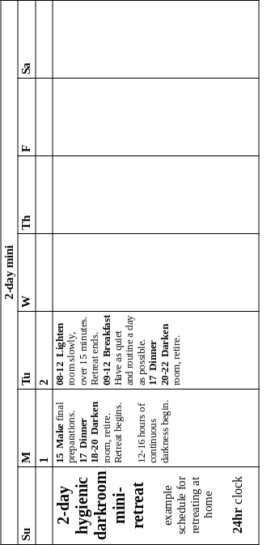

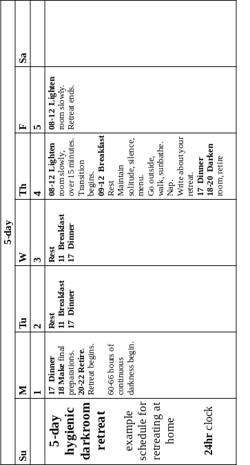

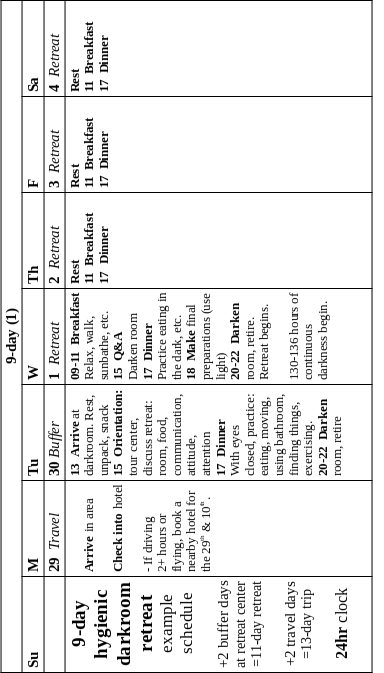

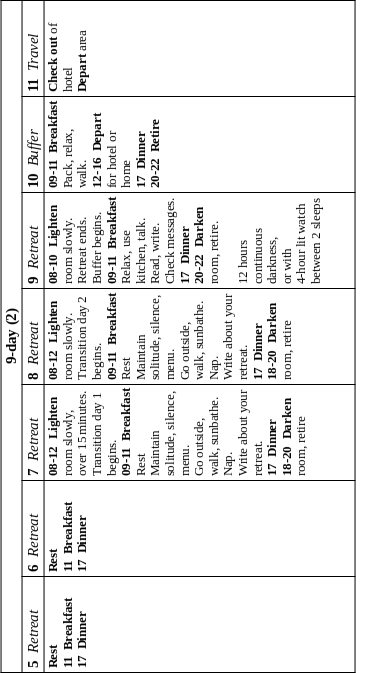

#### ladder {#ladder}

For a long time, I was stuck in the course of retreats I had envisioned. It was like a ladder made for 3m high giants. And it had a missing rung between 5-day and 9-day standard retreats. It was too far to get a leg up. And I could not stay with 5-day retreats and suffer more over-loss of [____false capacity____](#false-capacity) _-1_.

The [____Czech retreat____](#czech) _-4_ is the missing rung. Now the ladder is complete:

1. read my book
2. darken your room for sleep
3. upgrade it for a 5-day retreat
4. do one
5. improve your life (after every retreat)
6. upgrade room for 9-day Czech retreats
7. support them for others, training some of them as supporters
8. have one of them support a Czech retreat for you
9. build a darkroom in a separate building
10. do and support 9-day standard retreats
11. build portable hygienic houses
12. move to a better location with them
13. do and support medium retreats
14. do and support long retreats

### medium {#medium}

A medium retreat lasts 3--8 weeks (including ~25% transition days). This length of a retreat will enable the organism to heal the root causes of one's psychic suffering. Some problems will vanish, others may remain. But one will finally be able to solve them. With so much time at rest, the organism can restore its primary system. One will finally have the capacity to put things right again.

Minimize internal obstacles: get away from all accustomed influences and associations. Now that you know what you're doing in darkness, it's worth paying extra for this. Take a trip at least a couple hours away. Fly to a darkroom on another continent if necessary. Or rent a fully functioning small house in an unpolluted place and darken it yourself, arranging for maintenance and support with experienced fellow retreaters.

The darkroom needn't be fancy, only function in every way without fail or compromise. One of the supporters must be handy enough to keep it that way. There's nothing like mechanical issues to ruin a retreat.

Two of three supporters should be available all the time to make sure you have food, basic comforts, and someone to talk to for a few minutes when necessary. By the time you decide to do it, you will know you are doing one of the most important things in your entire life. Prepare accordingly.

The benefits of short retreats are impressive but still limited. Doing many of them does not equal doing a few long ones. The law of diminishing returns combines with the frustration of glimpsed but unrealized potential. Boldly escalate from a couple short retreats to a medium one.

I did a long series of 4-5-day retreats. My next retreat will be 9 days. I aim for 21 days (including transition days). In 2008, in my second successful retreat, I had a vision: in 2 weeks of darkness I will heal from my psychic trauma at the core. This will enable me to put the rest of my life back together afterward. With 5 transition days, this will make for a 21-day retreat.

I do not know exactly how long others would have to retreat to reach the same point. I assume others will have similar visions in their short retreats of how long their medium retreats must be. Thus the time range of 3-8 weeks.

One of my clients has been considering this for awhile. In his early experiments with darkness, he sensed that he would need 3 weeks of darkness (plus a week of transition days). I believe people come to know precisely what they need the more they get of it.

### long {#long}

A long retreat lasts 3-12 months. I have heard reports of retreats like this. They had results we would consider miraculous. But they are within man's potential. The organism made itself to begin with. Under good conditions, it is able to remake itself, perhaps better than new.

[____Stories persist____](https://hygienicdarkretreat.com/report/365-day-yogi) of astonishing physical healing occurring in Ayurvedic dark retreats lasting 3-12 months: growing new teeth; recovering lost hair and eyesight, even youth itself. It is worth looking into.

The hygienic protocol for long retreats is yet to be determined. Short retreats give us clues about medium ones. Medium retreats will give us clues about long ones. Reports from other traditions are useful. 

For example, in the above story, the yogi exposed himself to a tiny amount of light. His assistants would leave the darkroom door cracked when they brought him food before sunrise, after first light. Is this a good idea? Let's find out.

He attributed his miraculous recovery, not to his practices in darkness nor the ayurvedic herbs he took, but to Lord Krishna. Krishna is an incarnation of Vishnu, the preserver. He is a projection of the self-preserving power of life. 

Jesus the Christ is called the author of life. The Christ principle is in all living things. Jesus modeled it. His complete identification with the Christ naturally resulted in miracles.

He said all who believe in Him, the Christ, would do all he did and more. For he would go to the Father, something even greater that we cannot yet behold. 

One needn't be a Hindu or Christian to appreciate the vivifying principle in these ideas—and in every organism. The principle means you and I are enough. We have within ourselves the living power we need to recover ourselves. We need only provide it the proper conditions.

This much we can do. 

W> ## warning {#warning}

There are five harmful and dangerous ways to retreat in darkness. I learned about them the hard way and am paying the price to this day. The only possible point of my enduring them was so I could warn you. These are little gateways to hell. I sincerely wish you to heed my words and to avoid such suffering.

Fortunately, avoiding them is easy once you know. In the list, each is linked to longer discussions of them elsewhere in the book. Just say no to:

1. mini-retreating even one second behind schedule. See _retreat_ > _mini_ section above.
2. retreating without transition days. See _5-day retreat_ above and [____post-retreat____](#post-retreat) _-5_.
3. doing more than one 5-day retreat rather than advancing to 9-day, medium, and long retreats. This is a serious no-no, folks. See _5-day retreat_ above and [____false capacity____](#false-capacity) _-1_. The matter cannot be overstated.
4. sub-standard darkrooms. We become vulnerable in darkness. We are fools to tolerate the irritations and compromised retreats due to poor design and construction: noise, low air-quality, toxic materials, discomfort, cold drafts, etc. See chapters 7-11 for how to build or judge a darkroom suitable for hygienic retreats. Precious few people operate them. It's time to get serious and build world-class darkrooms.
5. poor support:
	- insufficient support
	- inexperienced, ignorant, or indifferent support
	- other people who are around who are hostile to you or to retreating itself. Say no to abusive relationships of all kinds.
6. I said five. But now I'm going to talk sternly.

	By ignoring my instructions and warnings, maybe you can discover more ways to get hurt in darkness. But why? As my late legal counsel, DeWaynn Rogers, would ask, "What is the penalty for following instructions?"

	In the future, we will have more data. We will have studied, applied, and reflected upon all this enough to see better ways. I will update my writings to reflect them, just as I have for 15 years.
	
	Until then, stick to the tried and true. Err conservatively. Be reckless about some other part of your life. The most amazing thing you ever do is bound to have rough edges if handled incorrectly. Don't pet pigs backwards, either.

Ok, now you know how to keep yourself safe in darkness. Back to the many wonders of hygienic dark retreating.

## future {#future}

I aim for the simplest way to restore health fully. Broken bones can heal perfectly. So can we, and in every aspect. To this end, I would like to see hygienic retreat centers worldwide with facilities and support for:

- short, medium, and long dark retreats
- fasts (a la Albert Mosseri's groundbreaking [____method____](https://hygienicdarkretreat.com/f/fasting))
- physical retraining
- training in healthy lifeway, including both lifestyle and livelihood
- open-source research and development of the above
- a village residence for staff, family, friends, and guests, where all this gets applied and tested in real life

In 4–5 visits over 2-3 years, one would be:

- restored to full function and vitality
- able maintain it in daily life
- healed of all trauma, poisoning, and exhaustion of the past

For a few years, I focused on designing and building public darkrooms. Then came a few more years of making private darkrooms at home. As a consultant, I am also available to help:

- operators of retreat centers who would like to switch to the hygienic approach
- developers of hygienic retreat centers described above

If you support hygienic dark retreating, I will refer clients to you. Write me.

~/~

It may take a few generations of healthy living to fully restore our health and realize man's potential. I believe we can get most of the way back in our lifetimes.

We have examined different formats of the restful use of darkness for different circumstances and purposes. Let's look ahead to more of what happens in a retreat and exactly how to conduct it.

# _5_ &nbsp; protocol {#protocol}

How to be and what to do once in darkness is simple. It's a lot like having a guest. Provide what is necessary for function and comfort, then stay out of the way. 

Dark retreating is like the rest of hygiene. Practice consistently follows theory. In hygiene, our purpose is to serve life. Life's needs are our priorities. 

We need profound rest to recover from exhaustion or injury. This makes our task in darkness simple and clear: maintain the conditions of rest. This frees the autonomic self to return the whole being to health and function as quickly as possible. The autonomic self does most of the work and all the complicated parts. It indicates to the volitional self the simple ways to help

Dark retreating is nothing less than recovery of the lost self. In darkness, you will begin to reunite with yourself. It's as if a peg-legged sailor were to awaken one day to find his leg had started to grow back. The more you come back to yourself, the more you become your own guide. This chapter helps you do your first retreats. It is a map. You and your supporters can refer to it if any of you get lost.

Hygienic dark retreating is new, and I am still learning. The final authority in hygiene is life itself. Consider these notes from the field and an invitation to explore an idea whose time has come.

## mechanics {#mechanics2}

### logistics {#logistics}

I describe the overall process of retreating in [____format____](#format) _-4_, especially the 5-day and 9-day retreat sections. Here are the details.

- food
	- the day your retreat begins, eat the same way you will in darkness: just fruit and greens or as simply as you can
	- finish eating for the day by 18:00
- retreating
	- in your bedroom:
		- neutralize it: cover or store everything unnecessary to the retreat
		- clean it thoroughly
		- pad sharp corners and protrusions
	- at a center
		- arrive at 18:00
		- your supporter will:
			- show you to your room, pointing out where food will be delivered and any special features
			- find out particular things you need
			- talk to you a little bit about the retreat, reiterating the basic ideas of rest and self-healing
		- as you unpack and settle in, memorize the room. Close your eyes and practice moving around and finding things
- set two alarms on a cellphone
	- between 10:00 and 12:00 the first day you will uncover the windows. On transition days, you can open the room before noon, as early as 06:00, as long as you feel fully rested.
	- between 06:00 and 12:00 the morning your retreat will end, depending on your schedule.
	- turn cellphone off or put it in flight mode to stop calls and minimize electromagnetic radiation
- lights out
	- how to do everything in a totally dark room: slowly!
	- _Important_: avoid hitting your head when standing up or sitting down. Make a circle with your arms in front of yourself at chest height, hands together, when moving up or down. Practice this a few times in light with eyes closed, near something you will touch with your hands.
	- put food scraps in bucket provided inside the room
	- things slowly go out of place in darkness. If you would like the bed remade, lost shoes found, etc, ask your supporter.
	- If you notice a light leak, immediately look away. Find something to cover it with. See [____gear____](#gear) _-6_ for materials to do this with. Tell your supporter so he can plug the leak.
	- Use scratch paper and pen to write notes to your supporter. Put them in the agreed-upon spot for messages.
	- Avoid all media during your retreat: text, music, photos, video. 
	- Avoid all company as well: family, friends, etc, unless 
		- you are a parent and your child needs to be with you
		- perhaps if your retreat is longer than 9 days (I don't know yet)
- transition day(s)
	- take walks, lie in the sun on the grass, go barefoot
	- take naps, inside with windows covered if you like
	- maintain solitude
	- write about your retreat
	- darken the room again between 18:00 and 20:00
	- maintain darkness until morning
- last morning
	- finish writing about your retreat
	- pack and exit room by 13:00

### water and exercise {#water-exercise}

I make sure I do two things in darkness: 

- drink water: the body uses water for virtually all its processes. Detection of dehydration is strangely harder in darkness. Each day, drink about 1 liter for every 20 kg you weigh, 2.5 liters minimum. Get enough bottles to hold that much. Keep them by your bed. Fill and drink them down every day. Simple.

	With all its extra energy, the body is reopening old wounds. It needs water to repair, clean, and re-energize these tissues. It is shaking toxins loose. It needs water to wash them out. It soaks the nerves in water to keep them cool. Hydrating in darkness makes the experience smoother emotionally. 
- exercise: exercise helps one get to sleep, avoid bed soreness, feel less restless and irritable, retard muscle atrophy, and, interestingly, maintain the psychophysical "space" in which healing occurs. Even three minutes a day makes the difference between a pleasant retreat and constant discomfort.

	The first couple days, exercising can be really hard. One is so tired. If so, and none of the above problems arises, just sleep. Energy to exercise should return on day 3.
	
	That is when I start wanting to exercise. It becomes a game: how many push-ups can I do? How high can I elevate my feet? I feel motivation to move like I did in childhood. It was a pleasant surprise the first time it happened.
	
	Soft, lightweight exercise equipment is good in darkness. Solid weights are unsafe. [____Variable resistance____](https://www.youtube.com/watch?v=qv_KJGTvmg8) bands are superior exercise, and you can't drop or stub your toe on them. 

### food {#food2}

Eat meals rather than snacks. When you are hungry, focus on eating until you feel full and satisfied. The human alimentary tract processes food in batches, not continuously. A constant stream of food (often eaten in boredom) disrupts and distresses digestion. Thus it disrupts sleep, attention, and healing.

You will probably need 25-50% less food, by calories, than usual. I recommend keeping it to fresh, raw, ripe fruit and leafy greens to maximize nutrition, elimination, and psychic agility. Keep food in a cooler with a block of ice. Eat as much as you like. It is likely that your appetite will be diminished due to extra [____melatonin____](https://en.wikipedia.org/wiki/Melatonin‎) in the blood (a reason we do not get hungry when we sleep). This was especially noticeable in my [____first retreat____](https://hygienicdarkretreat.com/report/five-darkness-experiences#2006-Feb-10). 

As much as 10% of your food, by mass, can be tender leafy greens like leaf lettuce (not iceberg) and baby spinach. Celery, too. This is the equivalent of 1 large head or bunch of greens per day total.

A minimum of 90% of your food, by mass, should be seeded fruit, sweet and non-sweet (like tomatoes, bell peppers, cucumbers). So salads can be sweet (greens mixed with sweet fruit) and savory (greens mixed with non-sweet fruit). 

Our need for fat is tiny and easily met with the above food types. Fat is very complex and difficult to digest. Too much interferes with resting and healing. So eliminate oils and minimize fatty foods. Forego nuts and seeds altogether. One small to medium avocado during a 5-day retreat in a savory salad is very pleasant.

Most of what you consume in fruit and leafy greens is water. So you must eat 3-5 times more volume for the same sense of fullness and satisfaction. Eating this much, like 5 apples instead of one or half a watermelon instead of a slice, can take getting used to. Practice it before the retreat.

For more about food, see:

- [____food____](#food) _-2_ and [____menu____](#menu) _-6_
- [____*The 80/10/10 Diet*____](https://foodnsport.com) by Dr Douglas Graham
- [____Loren Lockman's videos____](https://youtube.com/user/LorenLockman)

#### fasting {#fasting2}

I believe in fasting. It is a significant part of hygiene. But it seems best to wait on it until significant psychic capacity is regained in darkness. 

They seem to have opposite metabolic requirements. The organism focuses its healing efforts wherever food is absent. It gains energy—or at least internal comfort and support—from wherever food is present. The organism heals the body when physical food is absent. It heals the soul when the psychic food of sensation, especially vision, is absent. 

I have tried both at the same time and it is very good but intense. I look forward to more, but for now, I am taking one at a time. I recommend the same to you till you receive a strong clear signal from your organism to combine them. I recommend Shelton's books, _Fasting Can Save Your Life_ (short, popular) and _The Science and Fine Art of Fasting_ (long, thorough), and Albert Mosseri's [____*Fasting: Nature's Best Remedy*____](https://hygienicdarkretreat.com/f/fasting)\*.

### conservation {#conservation}

Here are ways to conserve energy in darkness for healing:

- talking
	- talk only when necessary
	- if you usually talk to yourself, catch yourself and stop
	- for a more concentrated experience, do a silent retreat. Your supporter speaks minimally. See story about my first silent client in next section.
- learn to write in darkness. Then you can communicate with a supporter without speaking and take notes on your experience. Use a small notebook or pad of paper. Use your non-writing hand to cover the last line and guide your pen.

	Before retreating, practice this. Number the pages. Tie or tape a pen to the pad with a length of string. Get a cardboard box for the darkroom. After writing on a page, tear it out and put it in the box. Tear out a page whenever you are in doubt about having used it. Put them back in order on your transition day.
- enjoy the transition days

	At first, my clients and I felt like leaving the facility quickly upon exiting the darkroom and throwing ourselves back into ordinary life. This was due to an unaccustomed increase in energy level and well-being. We had a sharpened sense of anticipation about our lives. We felt pulled together. We felt we were more in our bodies. We felt ready to conquer the world. 
	
	But rather avoid immediately re-entering regular life. You will probably end up blowing off this extra energy. It is better to reabsorb it, recirculate it, stabilize it. 

	This is how transition days came about. The retreat continues after darkness with windows uncovered and doors opened during the day one day for every 3 darkened days. This gives time to re-orient to light and gravity. Take a walk, lie in the grass, look at nature, and reflect on what has happened. See [____transition____](#transition) _-4_ and my blog post, [____post-retreat protocol____](https://hygienicdarkretreat.com/blog/2012/12/post-retreat-protocol) for more about this.

### support {#support}

My ideas of support have evolved since my first retreat. Once a day, Harold brought me food and talked to me a few minutes. I, then my clients generally liked having such active support for our first retreats. We found it reassuring to say a few words to someone each day. 

For my first clients, I brought food more often and talked more than a couple minutes. It became too much. I thought of myself as a facilitator. But I was not sure about this. Sometimes I could see it was too much.

Then a client came who wanted to retreat in silence. He communicated with notes and clapping in response to my questions. One clap meant no; two, yes; three, repeat the question. (Any distinct sound works: whistle, tap, finger snap, etc.)

His retreat was up to him and he knew it. He just wanted practical support and the passive psychic support of my being around.

I liked this a lot. It eased my worries and helped me trust in life more. Rather than a facilitator, I started thinking of myself as a supporter. 

I later tried retreating without any support. In some ways, I preferred the solitude and lack of interruption. But it was only a 5-day retreat, and I was in a small, remote village of friends. For 9-day retreats, I have found that having someone nearby, on call, is critical. 

A retreater is in a kind of womb. Supporters are like parents. They remain available while going about their regular lives. They help absorb a retreater's occasional excesses of energy, as well. Jean Liedloff explains more details of this perspective in [____*The Continuum Concept*____](https://continuum-concept.org).

Supporters create constant psychic shielding for the retreater. Weird and hostile forces exist in the world. We need to rest from them, too.

A retreater can get a supporter's attention from inside the darkroom with notes, an operable flag, knocking, a bell at the end of a cord, a door bell, or an intercom. A fully charged cellphone or walkie-talkie works in case of emergency.

Here are the attributes of good support.

- a supporter:
	- has read and understood this book, including the basic ideas of hygiene
	- has retreated or will soon. No neutral or implicitly negative supporters!
	- is reliable and has common sense
	- brings food and checks for notes or says hello according to an agreed schedule (noon or soon before works well). Saying hello can happen once a day, once in the middle of the retreat, or not at all.
	- stays nearby and keeps the retreater in the back of his mind while going about daily life
	- has back-up support, at least one other person, at least by phone (see [____consult____](#consult) _-x_
- design
	- a supporter can deliver food and talk to the retreater in a normal voice without opening the darkroom's door
	- a supporter can enter the darkroom or deliver food without letting in light. To have the retreater cover his eyes while the door is open is unacceptable. Like having to open the door to get fresh air, it is lazy, unserious design.
	- a retreater can call the supporter without leaving the room or being exposed to light
	- see [____design____](#design) _-7_ and [____make____](#make) _-8_ for ways to do these

## attitude {#attitude3}

Besides a darkroom, food, and support, a hygienic retreat requires a fourth critical ingredient: knowledge of the hygienic attitude. 

You don't have to believe it. Just learn it here and take it in with you to consider, test, and use when opportunities arise. It helps you recognize them in the moment and respond well. It is not something to impose on yourself or make yourself do.

Darkness is a chance to let go and let life catch you. In some ways, you already do this. To learn  hygiene's passive attitude toward healing is to gain more confidence in life's saving graces.

### purpose {#purpose}

The purpose of a hygienic dark retreat is to rest deeply. This enables the organism, especially the psyche, to heal itself of major psychophysical trauma. Which all of us sustained in civilization, and which causes all suffering, including physical disease.

Your principal task is to sleep. Benefits of the deep sleep possible in darkness compound each day. Deep sleep enables the organism to accumulate tremendous vital energy. This energy is necessary to heal psychophysical injuries that lie deep in the being, way beyond even the pretenses of the will:  practice, treatment, and use of substances.

Consider any spiritual, personal developmental, or therapeutic purpose to which you might put this retreat as part of what you are retreating from. Really: feel free to let it all go in darkness. Whatever is valid will happen by itself, much better than you imagined it would. 

If somehow you can't let it go, it's ok. Some of us must first recover the capacity to let go. Or the confidence in the autonomic self to handle what you let go of.

Likewise with what we often regard as our moral responsibilities. The autonomic functions of the organism will deal with most of them, too. Dark retreating is not primarily an active process (like spiritual practice). It is primarily a passive process as regards the will. It requires minimal effort on your part. It is like waiting in a hospital bed to heal.

Thus there is no need crack the whip on yourself. I mean engaging in long, vigorous introspection, thinking hard, figuring out your life, etc. Leave these complicated matters to the unconscious and subconscious.

It is normal to consider your feelings, impulses, thoughts, and needs. So it is fine in darkness, too. Everything in your being plays a part in life. Anything could be an important cue. Every movement of the organism ultimately has health as its aim. Listen, wait, receive.

It is quite possible to have a specific internal goal for a retreat and make progress with it. I did this several times. But I did it out of lack of confidence in my autonomic self. My aims were security objects.

Such over-purposefulness interferes with the organism's priorities. Which cannot be improved upon. Life always knows what is most important, millisecond by millisecond. I recommend retreating with this as a hypothesis.

My [____pivotal retreat____](https://hygienicdarkretreat.com/report/2x3-day) happened when I felt sure it would not work and I gave up on any specific aim I might have had besides just to rest. I only continued out of sheer logic. My own arguments still seemed airtight and unavoidable. I could not see anything else to do, so I stuck with the plan. Then I witnessed a marvel of self-healing.

This process is as foolproof as possible. Given the conditions of rest---most of which are built into the room itself---you will heal.

The organism is the principal actor. Your job is to support its self-healing process through stillness and conserving energy. This includes conserving energy expended by attention. (More about attention later.)

### expectations {#expectations}

At a minimum, 

- You will get a distinct break from your regular life. It's best to consider anything more a bonus.
- You will experience something unusual. 

	Many have had amazing experiences in darkness, but it is not guaranteed. Nor is it necessary. What is necessary is to rest. What really matters is how well you function in daily life afterward.

Your results are up to your whole self. 99.99% of you is autonomic. It operates below the level of conscious awareness, beyond control of the will.

I do guarantee that your organism will do exactly what is most necessary. It will not require more of you than you can give. Perfect, complete knowledge of everything about you and absolute power to act on this knowledge are the autonomic self's great gifts for you. 

As when wandering the streets of a foreign city, keep your wits about you. Neither your supporter nor your autonomic self will relieve you of the normal task of watching over your own life. You remain responsible for yourself.

If nothing happens, conditions were not met sufficiently. Analyze the points of failure and try again. Several of my early retreats failed because of light leaks, poor air quality, noise, a bad bed, time shortage, and other stressors. While darkness is natural, one still has to learn to arrange and use it.

### attention {#attention}

What do you do in a retreat? 

Consciously, you rest. 

But how, exactly? Half the time, you're lying around awake, apparently with nothing to do. You could get restless.

You rest consciously by focusing attention in restful places. I know of 4:

1. externally on environment. A well-built and operated darkroom minimizes this.
2. conscious phenomena, for a few minutes at a time
	- mentally on thoughts, above and behind the head
	- emotionally on feelings, usually in the chest
	- physically on voluntary movement, throughout the body
3. visually on darkness, in front of the eyes (closed or open), for 5-10 minutes at a time
4. palpably and audibly on semi-voluntary bodily rhythms, for hours at a time, on:
	- breathing, in the belly
	- the pulse, anywhere, sometimes in the heart
	- swallowing
	- blinking

These are all suitable places for attention. It just depends on what resting requires in any given moment. For example, if you need to think about something, avoiding it will be agitating, not restful. Remember the purpose of rest, and you will learn when, where, and how to move your attention.

We have no choice about having attention. We only have a choice about where to place it. The capacity to place attention varies moment to moment. We will recover this capacity, too. Meanwhile, attention sometimes wanders like an untethered goat. Sometimes it dashes off madly. Sometimes it gently returns for direction. 

Don't fight the goat of attention. Be at peace with it. It is an injured animal that must remain free to heal. When it wanders, track and observe it. When it dashes off uncontrollably, hang on for dear life. If it rampages, cover your head and endure it. Or seize it if you are sure you must.

Attention is different from the mind. Attention can be on the mind itself: its actions, thoughts, and memories. It can also be on feeling, sensation, and movement. Sensation can be of the environment or internal phenomena.

Placing attention on oneself is usually called meditation. (Gurdjieff, in his usual precision, called it self-remembrance). Thus dark retreating sounds like meditation to many people. But meditation is a discipline. Time is set aside just for it. It is the main process. The moment meditative effort stops, so does the main process.

A hygienic retreat is not for meditation but rest. Healing is the main process. What one does with attention helps. But healing goes on anyway. It is an autonomic process. It runs in the background of willed activity. Further, a retreat provides so many conditions of rest and so little to do, one tends to rest more.
	
Thinking is sometimes critically important. When you have presence of mind and a pressing issue arises, think it through logically. Steadily make rational connections until it is resolved. This doesn't happen much or take long. We all know how thinking too much can drive one crazy. But everything has its place. Fortunately, thinking is not the only option in darkness.

You can also look directly at darkness itself, making it an object of attention. We are usually taught to think of darkness as nothing or as a background for something lit. Focusing on darkness for awhile as an external fact, eyes open or closed, helps calm the mind. It can be unexpectedly absorbing. 

Try it right now for a minute or two. Put your palms over your eyes. Slightly overlap them above the nose to seal out light. Look at the backs of your eyelids like you are looking a couple meters away. Do this for a few minutes. Shapes and colors and spots might move around for awhile, then slowly clear away. Focus on the slowest dark patches, sometimes in front of, sometimes behind the imagery. You are withdrawing all your senses back inside your head. 
	
You can also do this in the middle of a regular day to rapidly collect yourself, to feel centered and in your body again. It is restful for the eyes. It is an old practice from hygiene called _palming_.

I used to look at darkness for hours at a time for days. This was way too much. You can read the trouble I got into for this in my [____7-day retreat____](https://hygienicdarkretreat.com/report/7-day). Increasingly clear images of a subjective nature play on the "screen" of darkness. In other words, the images are coming from the mind. At first, I found this fascinating. Then it became torturous and nightmarish. There is no point to this.

Yet it is not meaningless. I think it reflects what is repressed or denied in oneself. There is no need to seek this out. The unconscious will show us what we need to know of it. So just look at darkness for 5-10 minutes. 

Then move attention into your gut to feel the movement of breathing. This is always safe, a shelter from the storm sometimes raging in the mind. I can calmly hang out there for hours while lying down, palpating the motion of breathing. Just the in-and-out of my belly where natural breathing occurs (not in the chest). 

Move attention to the pulse, wherever you sense it first. Feel for it elsewhere, sometimes in the heart.

Swallowing and blinking give more variety to the "show". 

Breathing is normally through the nose. The tongue rests, sucked against the roof of the mouth. Of course, one breathes through the mouth if congested. With just fresh fruits and leafy greens during the retreat, the body will soon clear itself out.

### beyond {#beyond}

Beyond these ordinary objects of attention, I have often seen unusual images. Vaulted ceilings often appear. Sometimes they are low, dark, and grey or brown; sometimes high, airy, lit, and colored. Once I saw a vivid [____still life mural____](https://hygienicdarkretreat.com/report/five-darkness-experiences#2008-Oct-25). 

Such images often come in dreams and stay upon waking up. Clients have reported them, too. They are different than the imagery when looking at darkness. They come spontaneously. They have an objective quality, as if one is looking at something outside oneself. They are hyper-real: they are extremely vivid and feel more real than things in daily life. They are bracing and compelling. 

On the one hand, I don't think we should get fascinated with them. One the other, I don't accept the common dismissal of them as hallucinations. 

Darkness impresses me as a waking portal to the dreamworld. Which is also called [____dreamtime____](https://hygienicdarkretreat.com/conjecture/dreamtime) or _timespace_. This is the other basic dimension of reality. 

We should have access to it. Indigenous people do. Civilized people do not because of psychic malfunction from major trauma. Maybe we can finally pull ourselves together using darkness.

## experience {#experience}

Resting in darkness affects fundamental things in life, like time, sex, and power. Here is what I have observed about them during my retreats.

### time {#time}

Many of us in darkness have experienced a strange compulsion to know what time it is. It feels like an addictive craving, even mild panic, though obviously absurd. Darkness gives the best possible opportunity to withdraw from it by avoiding finding out. 

I often feel late, short on time, rushed. Yet, at the end of a retreat, in which days passed without accomplishing regular tasks, I always feel luxuriously ahead of schedule. So I view the feeling of being short on time as a symptom of exhaustion. It is temporal dysphoria, a disorientation or dislocation in time. It is exactly like an anemic whose blood iron levels normalize during a fast. Why? It is malabsorption, not deficiency.

The civilized sense of time is very close to the heart of our psychosis. The indigenous report a very different experience of time. They feel _in_ time, on time, in synchrony with the flow of events. Where we mostly measure time cardinally, with specific dates and hours, they measure it ordinally: before, after, earlier, later.

In darkness, you may feel a shift from the strange relationship with time we consider so normal.

### sex {#sex}

One way or another, sexuality makes its presence known in darkness. If it has been repressed, it stirs, like an animal escaping captivity. If it has run wild, it calms down.

Sexuality lies close to the base of organic existence and its power. We all come from sex, we renew ourselves in it throughout life, and we make more life with it. We exude it in everything we do through the gender polarities of masculinity and femininity. It expresses one's self-esteem and confidence. Sexuality amplifies life's colossal power. 

Thus civilization's centralizers of power, the state and religion, whether sacred or secular, rabidly suppress sexuality. Violence and the need for more artificial controls result.

Over several retreats, and [____one in particular____](https://hygienicdarkretreat.com/report/7x1-day), I felt my sexuality begin to return to me. Shut out for a long time, a part of it found a way back in. An unfamiliar feeling of self-satisfaction accompanied it, taking a place next to my accustomed longing. I have related more of the initial, liberating effects of retreating on my sexuality in my [____reports____](https://hygienicdarkretreat.com/report) online.

Before his retreat, one of my early clients tried to lure his giggling girlfriend into darkness for "conjugal visits". This was funny. But I recommend hanging in there alone. In darkness, the reality and fullness of sexuality is just for the retreater. The point is to recover sexual power. Sexually powerful people have what they need. They don't seek it from others. They express it with others at the right opportunity.

Meanwhile, I recommend refraining from masturbation. Instead, exercise and sleep. If orgasm is necessary, the being will arrange it in a dream. If ejaculation is necessary, the dream will include nocturnal emission. This way, the tremendous energy of sexuality serves healing and strengthening of the being, including causes of incontinence.

Traumatized sexuality causes shame, fear, and guilt; rebelliousness, including rejection of parents; and purposelessness. The healing of sexuality leads to continence, recovery of innocence, self-esteem, and conviviality, and feelings of security and confidence.

Darkness supports healing from the nightmare of sexual repression and violence that has beset our lifeway for thousands of years. Soon, I hope, an end will come to this madness once and for all.

### power {#power}

As an organism, one has a basic power: to live. It enables one to survive, to take shelter, find water and food, handle emergencies, defend oneself, maintain one's place in the world, and provide for others. Power is an ability and the energy to exercise it. It combines the concepts of capacity and vitality.

Power manifests in every movement, thought, and feeling. Fitness, magnetism, relaxedness, and humor all signify the power to live. Money represents it externally. A powerful person controls his own life in ordinary ways and adapts easily to circumstance. Peace, freedom, prosperity, and joy characterize powerful people and societies alike. 

Everyone alive has power to some degree. Those without it are dead. While it has immediate social effects, it is primarily personal. It is not power over others. Real power grows, not out of the barrel of a gun, but from within.

Like any capacity, personal power suffers significant damage from trauma. The routine brutality of civilization pushes people to the brink of powerlessness. Power becomes the motive of nearly all activity. Power turns to aggression. A drama unfolds. Some people become control freaks, power-lusters, and abusers. Others become perennial victims or rescuers. Roles suddenly reverse. Fear, violence, and evil touch everyone. War, repression, poverty, slavery, epidemics, and corruption all signify a collective lack of power. 

Resting profoundly in darkness, one's power is restored. These symptoms of mass psychopathology disappear. One begins to feel and act virtuously without trying or even thinking of it. Life works again on a personal scale. 

On a social scale, such power is irresistible by conventional force. Martin Luther King, Jr and Mohandas Gandhi showed this. From their words and my glimpses in darkness, their demonstrations pale before the potential of a fully restored man. Our distressed world, kings and peasants alike, awaits such people. Once the dam breaks, 10,000 years of suffering will wash away overnight. This is what I saw when I first dreamt of hygienic dark retreating. This is my prayer.

## difficulty {#difficulty}

An uncomfortable period usually occurs somewhere in the middle of the retreat, lasting minutes to hours. It's like a bout of pain while convalescing in a hospital. But now it is the soul that heals. What to do?

### discomfort {#discomfort}

You might feel tense, like crawling in your skin. You might curl up and cry. It's perfectly natural. You have provided the organism a chance to work something out, and it is doing so. Let it happen. 

If discomfort feels like too much to be endured, here are things you can do about it:

- examine your basic conditions like a hygienist:
	- survival
		- is the room secure?
		- is the darkroom safe?
		- do you feel safe with your supporter?
		- do you need a few words with your supporter?
	- mechanical
		- is it totally dark?
		- is it quiet enough? Are any noises bothering you?
		- do you have enough fresh air and warmth?
		- is the food good?
		- is your bed comfortable?
		- is anything else not working?
	- behavioral
		- are you:
			- drinking enough water? (2.5L water minimum, 4 maximum)
			- exercising? (2 hours maximum)  
			- each of these can instantly ease discomfort
		- do you need to pee, poop, or bathe?
	- procedural
		- is something actually wrong, or is something just unfamiliar about your experience? If the latter, might the organism be working on something difficult but not harmful, and you can stay with the process until it finishes in some hours?
	- is there something about the process you are struggling with, dislike, or don't understand? Your supporter can probably help you figure it out.
- use sensation as a brake on the process
	- talk or sing to yourself
	- talk to your supporter
	- red light: A red LED light is pure red light. It gives no signal to the circadian system to bring rest to an end and prepare you for action. If other techniques don't help you ease your discomfort, turn on the red light for a minute. Don't do this regularly. If you have a supporter, have him bring the light and take it away.
	- if you still can't stand it, use natural light as a last resort. Slightly uncover the window or crack open the door for 3-30 minutes. Start with eyes closed and turned away from the light. Open your eyes, but do not look into the light directly. If this is insufficient, let in more light. Next, step outside. When you feel calm again, re-enter darkness. 
- see more techniques in the phobia section below

Waiting it out often works. Enduring. Hanging on. In some case, retreating can feel unbearably difficult. It is perfectly alright to not resume the retreat at this time. Darkness is natural, but reacquaintance with it and oneself in it can take time and must not be rushed.

Perhaps reflection on your experience will show why you could not proceed. Perhaps something unexpected will change and you can try again later. Perhaps something else is more important for your life now. 

Sometimes something is not quite right with the retreat or the darkroom, and I cannot figure it out till after I quit. This is frustrating, but there will be more retreats.

### phobias {#phobias}

Those with phobias related to darkness (eg, superstition, claustrophobia, fear of the dark) can still retreat using these techniques:

- micro-retreat: retreat for five seconds. Then take a break in red light till you feel ready for the next micro-retreat. Gradually increase the length of the micro-retreats and decrease the breaks. Do this for at least 15 minutes. The next night, go at least 30 minutes, etc. Within a week or two, you should feel comfortable enough to retreat. 
- reason: go over the facts of your situation in your mind. What evidence do you have for what you fear? You can learn to recognize and dismiss arbitrary (baseless) ideas.[^29]
- companion: retreat with another person inside or near the darkroom till you feel ok alone

I had a client from a superstitious culture. Her elders actually taught her to fear the dark. But the idea of resting in darkness appealed to her common sense. She stayed in darkness for a whole night in my darkroom for the first time in her life. Afterward, she said that when her fear of monsters or ghosts came, she simply reasoned her way through it.

She remembered closing and locking the door, then checking under the bed and table and finding nothing before blowing out the candle. The door had not opened since then, so nothing could have gotten in. She deduced there could be no threat. She calmed down and went back to sleep. That night, her fantastic fear yielded to her reasoning four times.

When she awoke in the morning, she felt ecstatic from staying all night in absolute darkness and overcoming her fear of it. Her rationality strengthened, and she used it to strengthen her relationship to reality and her feeling of safety. Allied with her autonomic self, the tide gently turned on her phobia.

In any case, try. If these methods fail, perhaps you will come up with your own in the moment of crisis. An idea will occur to you. You will feel something or have an impulse. Act on it. Dark retreating isn't all just lying around. These brief calls for heroism are part of the minimal effort the retreat requires of everyone at some point.

### psychotic {#psychotic}

As I have said, I view our entire society and everyone in it as psychotic. This includes me, you, our "leaders", the garbage man, the kind lady across the street. Businessmen, teachers, lawyers, carpenters. Everyone. 

We survive long enough in our dysfunction and pain to reproduce. We exist on a continuum of psychosis ranging from the temporarily shocked, to the functional, to the disabled, to the severely psychotic.

Merely this change in perspective from our current presumptions of sanity can aid the situation greatly. Lots of little ridiculous things we currently do can be exposed and stopped. Clinically psychotic people will appreciate the honesty.

I have known but not worked with severe psychotics. Conventional psychologists would identify them simply as psychotic. But I think that we can become able to handle at least some of their cases by ourselves. I mean, without the use of professionals or experts, just with the care of friends and family. 

Of course, if an expert can behave normally, that's great. He would simply provide wisdom and care unobtrusively like anyone else, without an air of superiority. Some experts do know useful things. There's no reason for their knowledge to go to waste if it does more good than harm.

Severely psychotic people will be helped at first by the presence and love of others who have recovered some of their own sanity in darkness. Severely psychotic people are especially sensitive to our society's callousness and stupidity, especially from those who are supposed to care about them. If just that reverses, some cases of severe psychosis would disappear in weeks. 

So let us first give ourselves attention. It's like using an oxygen mask on an airplane: first, breath with it yourself, then give it to those in your care. 

Darkness could be used in extreme cases with excellent effects. It would require gradual application and extra support. It must be done with great care and attention to conditions. The one who is helped must understand and consent. 

The organisms use of darkness is deep and intense. Great harm occurs in those it is forced upon. I condemn cruel and despotic use of darkness in prisons and elsewhere. 

Cooperating with him at every step, eliminate all light that enters his room from outside. Use blinds and door seals and improve ventilation. Cover indicator lights inside. Remove night lights. Replace them with a red light if he still wants some light. The more access he has to reason and the more he trusts his caregivers, the easier it will be to normalize his sleeping environment. 

Replace his fluorescent and direct light with indirect, incandescent light (tungsten or halogen, not LED).

Remove scheduling pressure. I mean all those therapeutic activities that are supposed to help people. They are distressing over time. They are pastimes when on medication. Allow him to sleep more. Provide more fresh, raw fruits and leafy green vegetables, fresh air, sunlight, pure non-fluoridated water, contact with plants and earth, grounding sheets, etc. Phase out medication.

Lots of little changes like this can quickly de-escalate severe psychosis to mere disabled psychosis or even functional psychosis. From there, he could manage the rest of the way to sanity with ordinary levels of support.

## aftermath {#aftermath}

### post-retreat {#post-retreat}

The effects of a retreat continue afterward. Sometimes their intensity is even greater. The time afterward can feel like a storm. So I call it the aftermath. It is another phase of exploration, metamorphosis, and insight. It can last from a few days to a few weeks. The transition days of a retreat reduce its length and intensity to tolerable levels.

> **_CAUTION:_** Do not attempt a retreat without transition days, no matter how desperate and short on time you may be. See [____warning____](#warning) _-4_ for more.

For about a week after your retreat, plan only usual things: job, school, family. Keep to the routine, the familiar. Do nothing unusual or exhausting. Stay in when you might go out. The party will still be there in a week. Be subdued. Keep to yourself. Whose life is it anyway?

This way, you can quickly return to functional stability. It minimizes your exposure to disturbance and maximizes your chance of absorbing the value of the retreat.

How the aftermath goes depends on one's personality. I'm not the stablest oil rig in the Gulf, so it fairly tosses me around. It usually begins with a calm, solid feeling of deep restedness from the retreat. Then a tension builds to a crisis over a few days. I can feel as bad as the worst moments of my retreat. Then an insight or discovery comes that shows the way to the next period of my life.

This insight is often accompanied by the return of will and focus. Suddenly, I know exactly what to do, how to do it, and have the energy and strength to make it happen. It's fun after months of listlessness.

I know less about this part of my clients' retreats than the dark part. From what I saw and heard, their aftermaths varied greatly in character. Sometimes they matched the drama of mine, sometimes they were smooth sailing. Remember where you just were. Keep your eyes peeled.

### recapacitation {#recapacitation}

Regarding some aspects of our own lives, we all know better. I mean things we think we should do for ourselves which, strangely, we do not. Moralism says it is because we will not. Hygiene says it is because we cannot. Stop a moment and consider the relief this idea brings.

Dark retreating provides the conditions in which the organism restores one's capacity for both self-care and its benefits. This is recapacitation. The intensity of a retreat mostly fades, but restored capacity remains. A broken leg, once healed, doesn't spontaneously become broken again.

The full application of the idea behind hygienic dark retreating consists of:

> **doing retreats of increasing length,**  
**alternated with periods of improved lifeway,**  
**until health is fully restored.**

The [____ladder____](#ladder) _-4_ outlines the course of retreats involved. You already know some improvements you would like to make. After retreats, you will find yourself more able to make some of them. Those you do not know, you will, in darkness, become capable of discovering, learning, and applying. Resources and opportunities that were right under your nose, on the tip of your tongue, out of the corner of your eye, suddenly become visible, compelling, accessible.

Having restored a lost part of yourself, _how_ you are changes. How you seem to yourself and the quality of your presence to others changes. You notice and attract different things. Once you see you can go through the front door of a bakery and get whatever you like, you stop begging crumbs out the back.

~/~

I have tried to impress upon you the idea that your will is not the main actor in darkness. Another part of you is. We are taught to belittle, deny, and disown the autonomic self. But it goes on keeping us alive, moment by moment.

In darkness, we cease to identify solely with the conscious. We see it is just a part of a larger self. We begin to see its proper role as servant of the unconscious. This is a correction of the conventional relationship. We have mistakenly tried to harness life's unfailing virtues to the desperate agenda of a crippled will, which we have viewed as our sole identity.

In ordinary life, you must arrange certain conditions to live. You must keep your wits about you. You are accountable for your own experience. These basic facts not only persist in the darkroom, they become especially clear. In darkness, it is your job to maintain certain conditions of the retreat. 

Your non-expert, non-mind-reading, non-therapist supporter will be on the outside helping you do that. He will be maintaining the darkroom, bringing food, perhaps finding your lost shoes. Like any decent person would, he will talk to you for a few minutes if you need. It's your retreat. If something is not working, say so.

On your last transition day, write a description of what happened while it is fresh in your memory. Finalize it later with insights from your aftermath. Share it online if you like and send me a link. I have found these reports useful in improving darkrooms, understanding the process, and explaining it to people. More writers and readers of reports will help spread hygienic dark retreating, advancing its theory and practice.

[^29]: I was raised with many superstitions. In [____*Objectivism*____](https://objectivismphilosophyaynrand.com/)_: The Philosophy of Ayn Rand_, Leonard Peikoff explains how to identify and treat _arbitrary_ ideas. There is no evidence for them whatsoever. One must willfully dismiss them and put one's attention back on the facts of reality, dealing only with ideas tied to it. I found his analysis of _truth status_ extremely helpful in dealing with the conscious part of superstition.

# _6_ &nbsp; prepare {#prepare}

The main thing you need to prepare for a successful retreat is knowledge. Thus, this book. The **instructions** below outline the process. The **quiz** in the **questionnaire** helps you solidify your grasp of the text. The **personal** section orients you toward your own retreat. **Menu** and **gear** sections guide your material preparations.

If you have clients one day, use the questionnaire with them. Please share your modifications of it with me.

As of 2024, I support [____retreats____](#retreat) _-x_ again. Someday, there will be many centers that support hygienic dark retreats. Your retreat cannot wait till then. Do it yourself at home. Use a friend's place or a vacation rental. Or enroll with me in America or my collaborators in Australia or Norway.

Once you do it yourself, others will want to know about it. You will naturally have opportunities to share it: with a friend, or in an announcement, public talk, book club, class, workplace, or online. Climb the [____ladder____](#ladder) _-4_.

## instructions {#instructions}

1. Finish reading this book.
2. Complete the questionnaire below.
3. Consider when you would like to retreat. See example [____schedules____](#schedule) _-4_.
4. Consider where you would like to retreat.
	- if at home, build a darkroom (see remaining chapters)
	- if not, [____retreat____](#retreat) _-x_ with me, [____Marion____](https://profoundrest.wordpress.com) or [____inquire____](#contact) _-x_ about Simen.
5. Gather gear and retreat!

{pagebreak}

## questionnaire {#questionnaire}

Copy and paste this into a text file and complete it for yourself. Send it to a supporter.

If I'm to be the supporter, see [____enroll____](https://hygienicdarkretreat.com/store/enroll) for further instructions. 

I also [confer][/store/confer] about questionnaires as a service to improve your experience and results when retreating at home.

### 1 &nbsp; contact {#contact2}

1. Name
2. Email
3. Phone number
4. Good times to call

### 2 &nbsp; quiz {#quiz}

- these have correct answers
- search/refer to the book if needed
- use my words and phrases

1. What is the purpose of a hygienic retreat?
2. What heals the organism in darkness?
3. What does this mean you should do with your will and attention?
4. Where is a good place to put your attention most of the time?
5. What is the maximum total time per day you should put your attention on your visual field?
6. If a retreat becomes too uncomfortable, what are 4 things you can do to slow it down and keep retreating?
7. What must you always do when standing up or sitting down in darkness?
8. How much does a silent location matter for a successful retreat?
9. How much does the air you breathe mass compared to the food you eat?
10. What does this imply about the importance of continuous fresh air?

### 3 &nbsp; personal {#personal}

- Respond simply, in your own words. 
- 1-3 sentences are usually enough.
- There are no trick questions.

1. What meaningful or memorable experiences of darkness have you had?
4. What dark retreats have you done or attempted?
2. What percentage of my book have you read? (Please read everything. The lists of instructions in the last 4 chapters are optional.)
3. How much would you like to retreat, on a scale of 1-10?
5. What attracted you to the hygienic approach versus others? Or, why would you like to do a hygienic dark retreat rather than another kind?
6. How does the frugivorous menu sound to you? (see section below)
7. Would you like to maintain silence during your retreat? (You communicate with notes and taps, I talk minimally. See [____support____](#support) _-5_)
8. What fears or beliefs do you have that might interfere with your retreat, eg, nyctophobia (fear of the dark), claustrophobia? How will you handle them? What special support might you need?
9. What do you think of my idea that the people of our lifeway—and virtually all those touched by us—are [____psychotic____](#psychosis) _-3_? Assuming it is true, what significant effects of retreating in darkness might you experience in your psyche, for better or worse, and why would you say so?
10. What is your philosophy or religion?
11. What is its significance to you?
12. What substances, prescription or otherwise, do you use? Which ones in the past had much effect?
13. What will you be doing the week after the retreat?
14. Please add anything else you would like to.

{pagebreak}

## menu {#menu}

### summary {#summary}

- pure water, min 3L per day
- frugivorous menu
	- fruit: whole, raw, ripe, in season, well-washed, ample for eating anytime
	- tender leafy greens: romaine, escarole, young spinach; also celery
	- treats:
		- green salad: sweet or savory, large, properly combined, served at midday or evening
		- 1/2 avocado or 15 olives max once per 2 days
		- smoothie, max 1 per 5 days
	- no:
		- ferments: vinegar, sauerkraut, kim chee, cheese
		- stimulants: onions, garlic, ginger, spices, salt
		- extracts: juice, oil, dried food
		- complex fatty foods: nuts or seeds

### guide {#guide}

Most of the time, just eat plain fruit.

- eat one fruit until you lose your taste for it
- if still hungry, switch to another
- start with the wettest foods (melons), end with the driest (bananas, dates)
- eat greens anytime

On some days, have a yummy recipe:

- sweet green salads (midday or evenings)
	- melon
		- 1 head romaine, chopped
		- 2 L watermelon, chopped (only combine one kind of melon with one green, otherwise stomach ache)
	- banana
		- 1/2 head romaine, chopped
		- 3 ribs celery, finely chopped
		- 4 bananas, ripe
		- 1 L strawberries or blueberries or chopped nectarines
	- citrus
		- 1 head romaine, chopped
		- 5 sprigs parsley
		- 3 oranges, peeled, sectioned, cut in half
		- 2 apples, chopped
		- 2 slices pineapple, chopped
- savory salads (evenings)
	- tomato
		- 1 head romaine, chopped
		- 3 ribs celery, finely chopped
		- 1dL rocket lettuce
		- 1 orange, chopped very finely (into pulp)
		- 5dL tomato, chopped
		- 1/2 avocado or 1dL olives
	- dry
		- 1 head romaine, chopped
		- 10 sprigs parsley or cilantro
		- 1 orange, chopped very finely 
		- 2 red bell pepper, chopped finely
		- 2dL mushrooms OR zucchini, chopped

Come up with your own based on above patterns. No more than 6 ingredients per recipe. The trick to making yummy savory salads is to include these 8 flavors and textures in varying proportions in each dish:

bitter, sweet, sour, salty, savory, spicy, crunchy, fatty

- bitter: tender greens like romaine and young spinach, celery, and mild culinary herbs like parsley and cilantro
- sweet: fruit!
- sour: orange, grapefruit, pineapple, berries
- salty: celery, tomatoes
- savory: tomatoes, olives (rinse off oil)
- spicy: just a hint, barely enough to notice. Spicy greens are best, like rocket, arugula, mustard, cilantro
- crunchy: celery, apple
- fatty
	- with sufficient chewing, oiliness of lettuce is usually enough
	- tricky because it is surprisingly easy to overeat fat
		- eat only one kind of fatty food per day
		- eat a small quantity once per 2-5 days: 1 small avocado, 15 olives
		- stick to fatty fruits like avocado and olives (rinse off any oil from packaging)
		- eat 5-6% of your daily calories from fat, no more than 10%. Track your calories for two weeks. It's surprising. Use nutrition tables, websites, or apps.

Just say no to: 

- nuts, seeds
- fractured foods: oil, juice, dried food
- ferments. Vinegar, for example, is the second stage of fermentation, beyond alcohol formation, and even more toxic. It's a digestive disaster.)
- onions, garlic, ginger
- spices, salt

These substances imbalance, overload, or destroy digestive chemistry, bacteria, and enzymes. The good things you hear about vinegar, garlic, and ginger are old wives' tales, wishful thinking, or industry-sponsored hype. 

If you would like to know more about this menu before trying it, see:

- [____food____](#food) _-2_ and [____food____](#food2) _-5_
- Dr Douglas Graham's masterful [____*80/10/10 Diet*____](https://foodnsport.com)
- [____Loren Lockman's videos____](https://www.youtube.com/user/LorenLockman)

If, for whatever reason, you cannot yet eat this way in a retreat, eat as simply and naturally as you know how. For suggestions, write me with your limitations. Give more attention to it later when your motivation and capacity increase.

{pagebreak}

## gear {#gear}

- Yes:
	- bedsheets and pillow
	- loose clothes: pajamas, sweater,
	- slippers / loafers
	- water bottles totaling 3-4L
	- clock (unlit analog or red LCD)
	- cellphone
	- red LED light
	- materials and tools for plugging light leaks
		- masking tape
		- black electrical tape, 1 roll
		- black plastic sheeting
		- black polar fleece, 50cm x 20cm
		- scissors
		- table knife 
		- bamboo skewer
	- toiletries and personal items
	- prescription medication
- No: 
	- contraband
	- cigarettes, alcohol, drugs, plant medicines
	- anything that make sound, light, vibration, or smell: phones, computers, audio players, watches, clocks, vaporizers, oils, massage devices, etc. If you must bring them, turn them off and store them during the retreat, maybe with your supporter. If something is so critical for your survival you will be sick or injured without it, keep it with you and tell your supporter. He needs to know what might happen.

~/~

This ends the retreat part of the book. You've learned how to arrange and do a retreat. The hygienic theory you learned before is sinking in. Now, you just need a darkroom.

-# darkroom

#### part 3 : building

&nbsp;

&nbsp;

_7_ &nbsp; design  
_8_ &nbsp; make  
_9_ &nbsp; air  
_10_ &nbsp; darkness  
_11_ &nbsp; water

# _7_ &nbsp; design {#design}

Nature works. Occasionally, disaster strikes and chaos ensues. We must restore order. We need a plan. So we design.

## considerations {#considerations}

### normal {#normal}

Hygiene uses only normal conditions. A darkroom is merely what all shelter should be: easily darkened. The purpose of buildings is to provide shelter. We use shelter to control our exposure to elements, pollution, and animals for the purposes of rest, safety, and security.

The light pollution of street lamps combined with the modern fetish for large unshuttered windows make the darkening of bedrooms critical to survival. Light is an element to control one's exposure to. Having huge lights in the wall that turn off and on by themselves contradicts the purpose of shelter. Everyone’s bedroom should be a darkroom, at least for nightly sleep. It is normal, just rare... for now.

Total darkness is normal for sleep and healing. Man's original habitat is tropical forest. Its dense canopy makes the forest floor pitch black at night. Even in the open, light from stars and moon is nothing compared to artificial lights of . 

While we can sleep in light if necessary, it compromises the quality of sleep. No biological adaptation to it has occurred, only vital accommodation (development of tolerance) at the expense of overall function (see [____process____](#process) _-1_. 

Vernacular architecture worldwide features small windows with shutters for total darkness. The ancients weren't just without cheap plate glass. They knew something.

We have darkness at any time by covering eyes with hands. It is part of the sheltering instinct. We do it reflexively when tired or injured, along with seeking safety, shelter, and solitude. Construction is an intensified form of the sheltering instinct. Our extremely traumatized condition causes the modern, hyper-intense form of construction.

The civilized obsession with building expresses the impulse to self-healing on a social scale. Knowing this, we can voluntarize the activity. We can direct it explicitly toward its implicit goal: to provide the conditions of profound rest. We can define and meet its specifications.

### start {#start}

Start in your own bedroom. You already know you can sleep there, what problems need mitigation, where things are and how they work. You already paid for it. You need access to darkness every night anyway. It makes sense to begin darkening it.

If it is truly not worth darkening or unsuitable for short retreats, it is unsuitable for living. I strongly suggest you make arrangements to move. 

If, for whatever reason, you wish to darken a room elsewhere, then sleep there three nights beforehand. See if anything about it might disturb you which you cannot practically change: noise, odors or poor ventilation, atmosphere. Mind your senses, feelings, and state of mind. Will you be comfortable there? Do you actually sleep? Will darkening and ventilating it be a reasonable effort? If so, proceed. If not, conserve your initiative and keep looking.

### types {#types}

There are basic and dedicated darkrooms. 

A basic darkroom is built to basic specifications below, probably in your bedroom. It is for nightly use and short retreats up to 5 days. Basic specifications are: security, reasonable quietness, perfect darkness, ample ventilation, and comfort, plus any others in the list below that you can manage. See _basic_ comments for clarification. For budget building tips, see [____format____](#format) _-4_ and the _make_ chapters: [____make____](#make) _-8_, [____air____](#air) _-9_, [____darkness____](#darkness) _-10_, and [____water____](#water) _-11_. Or write me after reading them.

A dedicated darkroom is built to full specifications below in a small house in a quiet location. It is for all kinds of people for retreats of any length, short (up to 9 days), medium (3-8 weeks), and long (3-12 months). It requires all the specifications below. If it is your first darkroom, start with a fully functional house. This means it has automated heating, running hot water, mechanical ventilation, and electricity. Later, when you know more, you can build something new.

### standards {#standards}

Most of my retreats succeeded or failed because of how well the darkroom itself worked. Do not tolerate stale air, frequent or extended noise, light leaks, dangers, discomforts, poor food, etc. Poor conditions cause stress. Stress compromises a retreat. If it becomes distress, it ruins a retreat. So handle problems ahead of time rather than imagining you can endure them. That is for spiritual athletes and other egomaniacs. Listen to your body and soul. Listen to your life.

You should be able to turn off the light and let go of external concerns. The stress of healing is enough to bear. A retreat is not an imposition. You naturally want to do it because you are rationally convinced it is good. It is not for discipline or practice, but rest and recuperation. It is not effort, but relief; not penance or strife, but sanctuary from the punishment and strife of our lifeway.

A successful retreat depends on several factors including facility, attitude, preparation, protocol, and support. The facility is usually the biggest piece of the puzzle. Good design builds many conditions of success into the room, making retreats practically foolproof. The better the darkroom, the more effective your retreat will be. There is no penalty for doing things correctly.

But probably you cannot do everything correctly the first time. Certainly, you will do your best. You can improve upon it later. If we could already do everything correctly, we would have no need of darkrooms. Just be honest with yourself about whether your best is good enough for now. This is a real chance to decrease suffering. Don't cut corners if you can help it. This principle applies to everything in the list below.

A hygienic darkroom functions perfectly. It has a minimalist aesthetic for easy and safe use. It is non-toxic. It is comfortable. In construction and operation, it can embody economy or 5-star luxury. But it is always world-class in terms of function.

I welcome everyone's improvements to these specifications judged by the objective standards of reason, good (life-supporting) design, and hygiene.

## building {#building}

### exterior {#exterior}

- secure
	- located among peaceful people
	- defensible grounds and facility
	- keys only with retreater and supporter
	- supporter on call 24/7 with cellphone, intercom, or bell 
- quiet
	- on a low-traffic street
	- away from machines that produce a low-frequency hum and vibration. Specialized detection equipment and a [____lawsuit____](http://www.howtowinincourt.com/?refercode=DA0054) may be required to stop it. Inexpensive silencing techniques cannot.
	- sound-insulated to a normal degree
	- silent or insulated machines inside (free of vibration and harmonics)
	- short, occasional noise is ok
	- _basic:_ quiet enough for your comfort without earplugs
- solitudinous
	- separate, unoccupied building (see noise section below)
	- small: 0-4 bedrooms, 12-70m^2^
	- _basic:_ 
		- 6m^2^ minimum
		- either be alone in the house or apartment during retreat 
		- or supporter can stay there too, but not share a wall for sleeping
- electromagnetically neutral
	- natural materials: earth, wood, stone; no metal structure
	- grounded wiring
	- single outlet where power enters room or building, opposite bed
	- [____earthing____](https://earthing.com) bed sheet
	- _basic:_ unplug and turn off as much electricity in and around the room as possible at the breaker, switch, and appliance. For example, if a heater is needed, turn off power to the darkroom and run an extension cord from another room. This gets power out of the walls and brings it into the room at only one point, away from the bed.

### interior {#interior}

- safe
	- rounded corners and edges
	- padded, guarded, or eliminated protrusions
	- nothing to bump one's head on, especially doors and ceilings
	- nothing easily broken
	- _for long retreats_: small and round (see roundness section below):
		- 3.2--6m inside diameter, 8--28m^2^
		- minimum wall height: 195cm 
		- ceiling peak: 240+cm
- dark
	- perfectly dark: not a haze, glimmer, or pinprick of light anywhere
	- easily darkened windows
	- lightlock
		- lightproof double doors
		- enough space between them for a person and food deliveries
		- for communication, a lightproof vent in inner door
	- lightproof bag for cellphone. It can have a red window made of the translucent plastic used in stage lighting ("gels")
	- candles and lighter for before the retreat and transition days
	- _basic:_ perfectly dark bedroom, bathroom, blindfold, and mostly dark hallways and kitchen
- well-ventilated
	- fresh 
		- air is unpolluted, filtered or purified if necessary
		- no bad smells or toxic fumes inside the building from decay, mold, or modern building materials
	- sufficient
		- fan maintains continuous airflow. Except for constant coastal winds, passive systems require excessive engineering; intermittent ventilation is insufficient and causes mold.
		- manually adjustable airflow, or possibly with smart controls
	- silent: fan is quiet, dampened, silenced
	- ventilation is independent of windows, with its own holes in walls
	- _basic:_ get plenty of fresh air into the room without cold drafts or noise; see [____warmth____](#warmth) _-9_ and the quiet new 200mm [____fan mount____](#fan-mount) _-9_
- warm
	- automatic heating from gas, oil, electricity, pellets, wood, etc 
		- thermostat inside room
		- any fueling occurs outside room
		- non-electric if possible, otherwise, low-intensity, localized, EM-shielded electric heat
	- if possible
		- [____Heat Recovery Ventilator____](https://en.wikipedia.org/wiki/Heat_recovery_ventilation), either with fiwihex core ([____Fresh-R____](https://fresh-r.eu)) or Mitsubishi Lossnay core ([____Renewaire____](https://www.renewaire.com)) (or other high-tech paper core). Fans require silencers and/or acoustic ducting.
		- building is super-insulated and sealed to Passive House standards to eliminate heating 
	- _basic:_ somehow, be warm in and out of bed 
- comfortable
	- bed
		- size: double or long single
		- mattress: layers of new foam padding, flame-retardant free, of varying firmness for adjustable softness, aired out regularly
		- polyester/non-toxic mattress cover, long comforter, and pillow
		- 100% natural fiber bottom sheet and duvet
		- especially with a single bed, a mechanism to prevent loss of covers during sleep. A cord or elastic tied over them to the bed frame at the knee area works.
	- sofa, reclining chair, hammock, inversion swing
	- hard warm floor, rugs
	- dining table and chair
	- _basic:_ bed, rug, padded chair, and table
- bathroom
	- regular bathroom 
	- or portable fixtures in [____water____](#water) _-11_ including
		- composting toilet
		- greywater drainage
	- _basic:_ For a 5-day retreat, minimum requirements in primitive conditions are: bottled water (for both washing and drinking), a washcloth or sponge for a sponge bath, a towel, and a composting bucket toilet. For longer retreats, a darkened bathroom is necessary. En suite is best, but walking to it from the darkroom is fine with a blindfold, dark clothes, and extra curtains on windows. Bathing is as important for emotional and intellectual reasons as physical ones.  
- cold food storage
	- silent (unmotorized or isolated)
	- unmotorized uses the ground, block ice, ventilation (fan-driven cold outside air), or electronic circuit
	- _private_: blindfold to go to refrigerator in kitchen (unscrew its lightbulb)
- shelf for personal storage
- space for simple exercise
	
## qualities {#qualities}

### quiet {#quiet}

Silence is critical to retreating. I was in denial about this for years. It is even more difficult than ventilation. An unacceptable noise level is more common than air pollution and less controllable.

Regarding shared buildings: others inevitably make noise. Even if not, you will know someone is there, able to hear you. Like me, you may need to scream and cry in darkness. It's nobody's business. The process is strictly for oneself.

A darkroom must minimize the influence of others and consideration needed for and from them. This gives the autonomic self the maximum support to perform its awesome task. Contact with people during a retreat should be brief and intentional, not incidental.

A clear exception is if you are a parent of a child. The child can be with you in darkness as long as you both like. I have never facilitated such a retreat, but I definitely would. Nothing is more important to sanity, happiness, and avoidance of retraumatization of new generations than [____filial attachment____](https://continuum-concept.org). If you find your capacity for attachment wanting, you will likely begin to recover it.

The weirdest thing that happened to me with regards to noise from other people was in an apartment building in [____December 2011____](https://hygienicdarkretreat.com/report/6-day). I kept waking up exhausted from hundreds of short, meaningless dreams. After days of this, I realized in a fury that I was dreaming the mind chatter of others in the building. I stopped the retreat. 

I'm rarely "psychic". This never happened to me before. But I am a canary in a coalmine. When something goes wrong, I notice.

Yet two years later, in December, 2013, I successfully retreated in another apartment building. I believe this was due to three factors: The building was fairly quiet. I was less fragile than before. And my sympathetic, wise, older host had a strong, benevolent presence and stayed in the apartment like a guardian while I retreated. I was very lucky.

As always, I had the darkroom to myself. I had tested my comfort in the apartment beforehand, finding I could sleep and dream easily enough. During my retreat, I could feel others' presence in the building, but their thoughts did not invade my dreams like before. I got the deep rest I needed. 

I would not have done a long retreat there, but the short one I did nearly saved my life. It bought me two more months of internal stability to work on this book. And it revealed a widely available setting for short retreats.

The worst noise comes from the relentless grinding of machines: stereos, traffic, ventilation and refrigeration equipment on buildings, and construction. It can seem fine at first. But soon it becomes intolerable. A [____silencer____](#silencer) _-9_ is amazingly effective at neutralizing external noise. House-in-house or room-within-a-room construction, with decoupled walls and floating floor, is necessary to stop low frequencies.

### subtle {#subtle}

Buildings can have subtle problems that most of us have difficulty detecting. This is a place where the feeling and moving [____centers of intelligence____](#psychosis) _-3_ come into play.

The larger the building, the more electrical wiring, and the more steel framing and reinforcement it has, the more it is electromagnetically disturbing. Baubiologie[^30], the advanced building science from Germany, has exposed this danger since the 1950s. 

Then there is high-frequency wireless radiation like cellular, wifi, and bluetooth signals. They comprise the planet-size, psychotronic microwave oven we now live inside of. Fortunately, it exponentially decreases in intensity with distance from the source. You can turn off all wireless devices under your power, and it makes a difference. The mass of a building absorbs some of it. Long term, you can move or install shielding. Magnesium oxide sheeting over or in place of drywall is especially helpful.

Written evidence of damage from wireless radiation lies in the safety warnings in the manuals of cellphones, microwaves, and wifi routers. The US Navy made a [____*100 page summary*____](https://hygienicdarkretreat.com/f/wireless)\* of thousands of pages of military research into the harmfulness of wireless devices _50 years ago_. Widespread lack of concern about it is a textbook example of denial, a symptom of mass trauma-induced  [____mass psychosis____](#psychosis) _-3_.

One can become so vulnerable in profound rest that the wrong setting can become harmful. Make sure you feel comfortable in a large or occupied building. Be confident you will be ok when retreating there.

Let instinct guide you. Observe what your body does. Do you relax or does your body language close? Do you feel pulled into the building, or do you make moves for the door? Your body knows what is good.

If it seems ok, test it by staying a night or two. Later, if the influence of the building undermines the restfulness of the retreat too much, stop the retreat and try again elsewhere.

Make extra preparations to doubly protect yourself from distress on your transition days: no shopping, visitors, media, or travel. Following my weird retreat in 2011, I was not thinking straight. I moved to an even less restful location only one day after. This proved even more harmful than the first location. Post-retreat planning is critical. See [____post-retreat____](#post-retreat) _-5_.

### round {#round}

_Note: A round darkroom is unimportant for short retreats. Plan one for both shelter and medium and long retreats._

An experiment: go into a round building. Observe how you feel. Compare it to how you feel in square ones.

The designers and craftsmen who raised me had me run this sort of experiment since childhood, using myself as my instrument. Here are my conclusions.

Round buildings feel sheltering. Small round spaces feel cozy, not suffocating. One can easily relax inside. One has just what one needs.

Round buildings shield occupants from subtle energy, physical and psychical. Energy flows around and through them. They do not resist or trap it. 

We have a psychobiological expectation of roundness in our environment. Nature is a symphony of curves: circles, ellipses, parabolas, catenaries, spirals, cones, and spheres. Curvature arises from innumerable straight-edged shapes at the microscopic scale: triangles, pentagons, and hexagons; tetrahedrons, octahedrons, dodecahedrons and icosahedrons; their combinations and stellations; and the occasional cube.

Buckminster Fuller demonstrated in his _Synergetics_ (see [____*A Fuller Explanation*____](https://www.arvindguptatoys.com/arvindgupta/synergy-fuller.pdf)\*) that these shapes, in turn, arise from nature's coordinate system: the shape of space itself. Made of close-packed spheres, it is octetrahedronal, not cubic (Cartesian). It is four-dimensional, not three. We find shapes that evoke it inherently, compelling, familiar and alive.

By comparison, a square building feels lifeless and imprisoning. By nature, the right angle stops movement: of things, people, and energy. This stagnation saps and poisons occupants over the long term. Even turning at right angles while walking is jarring and militaristic. 

We compensate by making square (rectilinear or orthogonal) buildings larger than necessary to push corners away. We soften and round them out by filling their corners with stuff. Ever dissatisfied, we remodel. When that fails, we move, perhaps destroying a family or business in the process. 

Eventually, the only thing to do about such toxic buildings is demolish them. When hysterical, we unconsciously arrange for it to burn down or even get bombed. Behind the apparent irrationality of wastefulness, greed, carelessness, crime, and war lies a biological imperative to break free from Roman slave-city architecture.

Due to gravity, single right angles of linear structures, like trees and stalactites, abound in nature. But not squares and cubes. Squares are inherently weak and inefficient. They collapse without diagonal support (triangulation) and require more edge for the same amount of area as circles. They mate poorly with the curved universe. A few minerals have cubic crystals, like salt. Not much else.

Orthogonal construction breeds decadence, disease, and violence. Rectilinearity is the geometry of slavery: Romans built on grids because they are easily policed. It is a military-economic strategy widely used to the current day.

Black Elk, a Plains Indian accustomed to tipis, observed the demoralizing effect of log cabins on his people on reservations. He decided, "It is a bad way to live, for there can be no power in a square."

How tiresome to learn that we live in voluntary prisons. What is to be done?

The problem solves itself. We simply turn our prisons into escape pods. After all, we do need to stop moving around. We are sick. We are slaves. We need to rest, to recover ourselves, to reset our relationship to the world. Conscious of the immobilizing influence of these boxes, these cells, we can turn it to our advantage. We use it to stop. 

But not halfway, like beasts pacing restlessly in a cage. We stop fully, more and faster than anyone expected, without the slightest concession to the demand to constantly be busy. We can even say this is what our buildings were always for.

So rectilinear buildings are not just acceptable for short retreats, but perfectly suitable. We can remedy them by an art of placement: feng shui, vastuveda, wabi sabi, or [____ordo____](https://hygienicdarkretreat.com/other/ordo). This may render them suitable for medium-length retreats. If not, and certainly for long retreats, we replace, vacate, and dismantle them. We burn or bury their materials or renew them through re-use in round buildings. 

A good building for the long-term is round or has five or more walls in a regular polygon. Walls can be rectangles. Right angles where floors meet walls are fine. But not where walls meet ceilings or each other, as in orthogonal floor plans.

Happily, a handful of elegant, cheap, quick, [____round shelter designs____](https://hygienicdarkretreat.com/other/links) exist for new buildings. They include my hygienic house, below. 

It turns out that rectilinear construction is not simpler or easier. It's just a frame of mind.

~/~

Now, let's learn to make prison cells into escape vehicles. The next four "make" chapters give detailed instructions and plans for your very own darkroom.

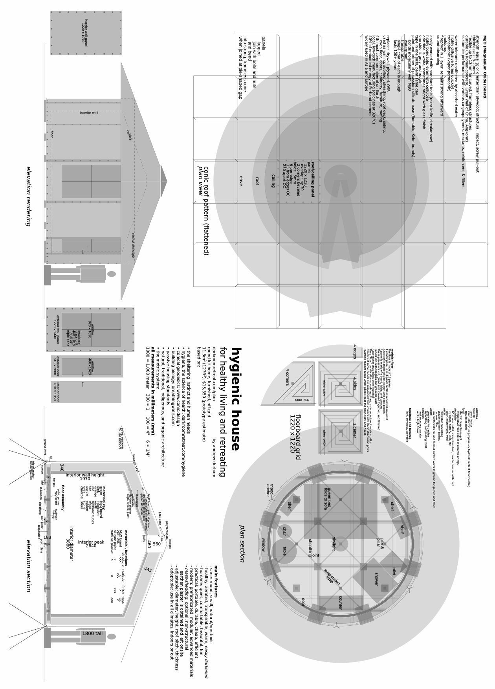

See [____plan____](https://hygienicdarkretreat.com/plan) on my website for a color sketch, downloads, and budget. Also in zip file.

[^30]: Building Biology in English. [____Breathing Walls____](https://breathingwalls.com) is an exceedingly practical manual of baubiological theory and technique. The International Institute for Bau-Biologie and Ecology [____IBE____](https://buildingbiology.net) in Florida offers a course.

# _8_ &nbsp; make {#make}

> _The time for half-measures and talk is over._  
&nbsp; &nbsp; &nbsp; -- Maximus, in "Gladiator"

## intro {#intro2}

Just the thesis of this book has brought relief and hope to readers. But 99% of its value lies in its application. This requires a darkroom. Darkrooms are uncommon. Suitable buildings are not. These last four "make" chapters explain how to build darkrooms inside existing buildings.

Whether or not you build a darkroom, reading these chapters will give you a sense of being in one. You will:

- see how
	- the abstractions in the first part of the book apply concretely in this one
	- theory, process, and design make up an integral whole, sans contradiction
- learn how to combine elements into a system in your own design
- learn what to look for in a darkroom
- know what is going on around you during a retreat
- be better able to help diagnose, even fix yours should it break down during your retreat

This chapter provides basic information that applies to all components of a darkroom. The next three chapters provide blueprints and instructions for components related to three elements: 

- [____air____](#air) _-9_
	- vents: universal and threshold
	- silencer
	- fan mount
	- power sources, heating, air purification are discussed 
- [____darkness____](#darkness) _-10_
	- mask
	- door seal
	- blinds: double blind and panel
- [____water____](#water) _-11_: DIY, portable kitchen and bathroom fixtures
	- sink
	- toilet
	- bath/shower
	
Designs are low-cost, low-tech, and work off-grid.

A darkroom is a real thing you see and touch, make, use, and offer others. It is not a metaphor. It takes knowledge, imagination, design, measurement, plans, materials, craftsmanship, construction, testing, and improvement.

These are normal activities. Everyone does them to some degree. and get help with the rest. If you can walk down stairs without falling, slice a loaf of bread, hit a plate when you aim food at it, hold a pencil, cognize sentences, tell light from dark, and feel a breeze, you are mechanically sufficient to begin. As Jack Nuckols, a mechanical engineer and my grand-elder, told me when my time came, "Become a craftsman." Perhaps your time has come. Become a craftsman.

I make mistakes as I make things. Don't imagine otherwise. Don't imagine you won't. Fix what you can. Start over when you must. There are only two embarrassments in craftwork:

1. having zero ability with it for lack of trying and trying again until you succeed. Way too many people these days are thus embarrassed. Don't be counted among them just because you got a late start. Life requires making things. Get to it. Don't wait for the robots.
2. not scrapping a ruined piece of work. Start over. It's what trash cans are for.

Jack, ever good-natured, talked to us like this when we were kids. We loved it. He challenged us, inspired us, and helped us when we wanted to make something.

A sniper's rule could belong to craftsman, too: "Aim small, miss small." The precision of the plans to follow helps you aim small. The designs and materials are forgiving. Little mistakes can be absorbed, bigger ones, corrected or repaired, fatal ones, quickly forgotten with a fresh set of parts.

I suggest that, your first time through these last chapters, just read the prose parts. Skim or skip the instructions till you make something. They can make quite dense reading before you have great need.

All components rely on the basic instructions in the following sections: **metric**, **tools**, **plans**, and **fabrication**. Each component has special instructions and design constraints in later chapters. 

After improvising darkness to sleep in [____tonight____](#tonight) _-4_, the [____instant mask____](#instant) _-10_ probably comes next. Thus initiated, you can begin your training as a darkroom-building ninja. You will become invisible to everyone for a while. And everything will be invisible to you, too. Haha.

If you need more specific advice for darkening your space, I provide [____design consultation____](#consult) _-x_. I guide people through text, voice, and image on a chat app toward a completed darkroom and successful retreat. Likewise, feel free to use these [____open-source____](#open-source) _-e_ designs and my consultation to darken other people's spaces as a service for money. See [____license____](#license) _-w_ for my liberal terms.

## metric {#metric}

All measurements are in metric. Lone numerals are in millimeters, marked by -, x, + (in drawings, nothing). Examples:

- 50- = 50mm
- 50--60- = 50mm to 60mm
- 50 x 40 x 3 = 50mm wide x 40mm high x 10mm deep/thick
- 50 + door thickness = 50mm + door thickness
- in a drawing, 50 = 50mm

Are you used to the inches, pounds, and gallons of the imperial system? Get a handle on the brain-descrambling metric system in a split-minute:

1. When using it, count, add, subtract, multiply, and divide by 10 as usual. Forget about fractions and multiple conversion factors.
	- basic conversions:
		- length: 
			- 1m = 100cm = 1000- (meter, centimeter, millimeter)
			- 1cm = 10-
		- volume: 1L = 10dL = 1000mL (liter, deciliter, milliliter)
		- mass: 1kg = 10hg = 1000g (kilogram, hectogram, gram) Mass is like weight. But it uses a balance, not a spring scale, so it does not depend on Earth's gravity. (Build a darkroom in space!)
	- cool intra-conversions: 
		- 1L = 10cm x 10cm x 10cm = 1000cm^3^
		- 1L water = 1kg, thus:
		- 1mL water = 1cm^3^ = 1g 
		- brilliant! simple! humane!
2. Make the metric system tangible. Visualize the following imperial near-equivalents. Then use them to imagine my descriptions and make estimations. More precise conversion factors given in {braces} for large quantities.
	- length	
		- 25- = 1" (inch) {25.4-}
		- 100- = 4"
		- 30cm = 1' (foot)
		- 1m = 40" {39-3/8"}
		- 3m = 10'
		- 1km = 0.6 mile / 1 mile = 1.6km {0.62-/-1.61}
	- area
		- 1m^2^ = 11'^2^ {10.76}
		- 4' x 8' sheet = 122cm x 244cm = 3m^2^
		- A0-A8 paper size system. A sheet's 1:&radic;2 proportion remain the same when cut in half the short way. A0 = 841 x 1189 = 1m^2^. A1 = 595 x 841 = 0.5m^2^. A4, the metric counterpart to North American letter size paper, is 210 x 297 = 0.0625m^2^ (1/16m^2^)
	- volume
		- 4L = 1 gallon {3.79}
		- 1.7cmh = 1cfm (for airflow: cubic meter per hour to cubic feet per minute)
	- mass 
		- 28g = 1 oz {28.35}
		- 1kg = 2 lb {2.2}

## tools {#tools}

Making components requires most or all of these tools:

1. table or desk
2. measure
	1. Note: before purchase, test tools for accuracy, which can vary between identical tools, even of good brands. Instructions below.
	2. metric ruler, 45--50cm, clear plastic. If reproducing plans by hand rather than printing them, also get a 30cm [____Incra ruler____](https://www.incra.com). For its effortless marking precision, I recommend it for making anything at all ever. It's the greatest hand tool I have ever used.
	3. metric measuring tape, 5m
		1. common in dollar stores and Harbor Freight Tools in America
		2. hook tape on end of meter stick and compare marks for accuracy of external measurement
		3. push end of meter stick against a wall, put tape on top of meter stick, and compare marks for accuracy of internal measurement
	4. optional: meter stick, steel with engraved marks
		1. skip this in America. It's too hard to find. You just need a long straight edge. 
		2. put marked edges of two sticks together so 40cm mark of one meets 60cm mark of other
		2. push ends of both against a wall and check how well marks line up
		3. repeat with other sticks till you find a match
		4. buy one of them 
3. mark
	1. 0.5- mechanical pencil
	2. ballpoint pen, black or blue ink
	3. black marker
	4. straight pin with colored plastic head or masking tape handle
	5. magnifying glass (even a tiny plastic one works, like the one in a Swiss Army knife)
4. crease, score, cut 
	1. straight edge 200- longer than your longest piece will be. 1--2- thick steel is best. An aluminum door or window frame member also works well. A board less than 12- thick with a perfectly straight edge (check it!) is fine.
	2. table knife: use back of tip for creasing
	3. razor knife with new blade: use for scoring and cutting. To score is to cut halfway through thickness of material with razor knife so it remains one piece and folds very easily
	4. scissors for both paper and fabric
5. join
	1. masking tape
	2. wood glue, unthickened, any grade
	3. glue syringe, 20--50mL for precise, efficient gluing
		- available
			- at kitchen supply shops, with 2--3- stainless needles
			- at discount variety stores (dollar stores, bazars) 
			- at pharmacies. Also get a 2 x 40--50 needle. Perhaps cut off the tip. If unavailable, use a cartridge from ballpoint pen, the fat (4--5-) tapering type. Clean it out and trim it down to point in taper that fits over nipple of syringe
			- at woodworking shops, with needles
		- remove needle and plunger. Cover nipple with finger and fill from back, leaving 10- unfilled. Replace plunger barely. Point nipple upward and uncover it. Wait for air bubble to rise to top. Then push plunger in till air is cleared from syringe. Replace needle and use.

## plans {#plans}

Computer-drafted plans are precise, clear, and easy to modify. They can be baffling at first. Keep studying them.

1. use the **key** to understand the symbols and marks
2. compare drawings to photos.
3. read the instructions through a couple times in the days before making begins.
4. then _follow the instructions_, one step at a time. You ought to end up with the intended component. 
5. dimensions are X x Y x Z (left-right x up-down x forward-backward; width x height x depth/thickness)

Understanding often comes through doing. If this does not work, write me and I'll try to sort out the confusion and maybe improve the instructions and drawings for others, too.

A drawing has one or two _views_, depending on the best way to communicate its information. Most are two-dimensional (2D). A couple are 3D.

- _plan:_ from above. Default view.
- _pattern:_ flat, unfolded part from above
- _elevation:_ from the side
- _section:_ a cutaway or slice of the object showing all parts when assembled
- _perspective:_ from a non-right-angled point of view to capture more sides (3D)
- _exploded:_ all parts separated but in correct order and linear relation (3D)

For example, the [____universal vent____](#universal) _-9_ has pattern views of its parts and a section + elevation view showing how parts are assembled. The [____toilet frame____](#upgrade2) _-11_ has both plan and elevation views, while the [____shower____](#upgrade3) _-11_ has an exploded view. The [____threshold vent____](#threshold) _-9_ has a perspective view.

All plans can be reused except the [____mask____](#mask) _-10_ plan, which is destroyed as you make it. So make as many prints of it as masks you intend to make. 

Images in this book are only for reference and hand-reproduction. They are reduced to fit book pages. Thus they are neither full-scale nor in proportion to each other. If reading on a screen while online, you can zoom in. Download a full-size PDF with link below each image.

### 1 &nbsp; download {#download}

Download all plans at once with the dark retreat [____zip file____](https://hygienicdarkretreat.com/hygienicdarkretreat.zip). Extract (decompress) the file. Contents:

- plans: a complete set of PDF plans
- all photos below plus extras from website
- SVG source files of plans for modifying them, originally drawn in [____Inkscape____](https://inkscape.org).

### 2 &nbsp; print {#print}

1. large format
	1. large format printing is cheap, extremely accurate, and much faster and easier than desktop printing. Most print shops, including Staples and Office Depot, now offer large format printing.
	2. email your files to print shop or take them on a USB flash drive
	3. paper: specify cheapest option
	4. have files printed in actual size, with no scaling. Before paying, check measurements with ruler or measuring tape. Distortion should not exceed 1- over a 250- span.

		After resigning myself to 2- distortion per 250- (0.8%) with desktop printers, I was shocked to find almost no distortion with large format printing, maybe 0.5-/500- (0.1%). But then it made sense because architects, engineers, and builders depend on this service for their blueprints. 
		
		[Note: it turns out that machine was very well maintained. Another large format print job I had done was quite distorted. So, get a guarantee of accuracy and check before paying.] 
2. desktop
	1. only do this if you are absolutely broke or can't find a large format printing service on your desert island. Desktop printing of plans takes a lot of time and yields imperfect results.
	2. print
		1. open file with Adobe Reader (not Adobe Professional) 
		2. in print dialogue, select: "Poster"; Tile Scale: 100%; Overlap: 1.0in; Cut marks: yes; Labels: yes
		3. use A4, letter, or legal size, possibly A3
		4. Distortion over 250- span should not exceed 1-.
		5. after printing one file, check measurements against ruler to 1- tolerance.
	3. join sheets 
		1. cut a small wedge out of overlapping cut mark to align it with matching cut mark on sheet below
		2. align cut marks at perimeter of plan first, then the one(s) in the middle. 
		3. use masking tape to join sheets
3. by hand
	1. ruler and magnifying glass
		1. get large white paper to make a reusable pattern with. Don't measure directly on materials.
		2. to keep drawing orthogonal, use some combination of graph paper, drafting table, and extra careful measurement and marking. An [____Incra ruler____](https://incra.com) will help a lot with this. 
		3. use magnifying glass to see small words and numbers in the book
		4. plans are as symmetrical and uniform as possible. If two similar-looking areas of a plan look the same size, they are. So from measurements given in plans, infer the rest. There is some redundancy so you don't have to figure out everything and can double-check essential measurements with arithmetic. 
		5. use grey-numbered cumulative measurements in plan to quickly mark lines
	2. trace
		1. trace directly from a flat screen monitor
		2. zoom image till stated measurements match a ruler both horizontally and vertically
		3. tape paper to the screen
		4. mark ends, corners, and intersections of lines precisely and lines just well enough to know what you are looking at later
		5. you will have to overlap multiple sheets of paper for most plans, as with a desktop printer. On each new piece of paper, repeat the last set of marks from the previous so you know where to overlap and tape the sheets together.

### 3 &nbsp; key {#key}

Below is the key to the plans. Find further explanation of symbols in **fabricate** section below, especially the dash-dotted guide line. Its use varies with each drawing.

&nbsp;

&nbsp; &nbsp; &nbsp; &nbsp; &nbsp; plan: key - [____download____](https://hygienicdarkretreat.com/img/plan/key.pdf)

{pagebreak}

## fabricate {#fabricate}

These instructions apply to all components, or as indicated. Read further instructions for each component in its respective chapter and section afterward.

### 1 &nbsp; prepare plans {#prepare-plans}

1. for fabric parts of ([____universal vent____](#universal) _-9_ and [____mask____](#mask) _-10_):
	1. using ruler and razor knife, cut out parts on solid outlines
	2. cut out tape holes approximately on dash-dotted lines 
	3. skip to [____3 - make parts____](#make-parts) _-8_ below
2. customize [____threshold vent____](#threshold) _-9_ with instructions in drawing

### 2 &nbsp; transfer plans to materials {#transfer-plans-to-materials}

1. where necessary, make small v-cuts in outlines of plans to see where to align them with edges of materials
2. tape plans to materials
	- [____universal vent____](#universal) _-9_: skew patterns to cardboard, 15°
3. put three layers of cardboard on work surface
4. transfer plan with straight pin
	- use magnifying glass for ease of marking and geeky precision thrills
	- poke pin through 
		- all black lines close to ends (not grey glue sausages)
		- centers of holes
5. remove plan from material
6. mark pin holes:
	- dashed lines: circles
	- dotted lines: double circle
	- solid lines: squares
	- dash-dotted lines: triangle
	- holes: star
7. mark the marked holes again
	- draw short lines from circles, triangles, and squares in the same direction as lines in plan
	- circles/double circles: add asterisks where indicated 
	- copy joint letters (A, B, C...)
8.  label drawing, words oriented the same as in plan

### 3 &nbsp; make parts {#make-parts}

1. keep scrap cardboard on work surface
2. fabric parts (mask, vents)
	1. tape plans to fleece over tape holes
	3. cut parts exactly around plan outline with scissors 
	4. leave plans taped to mask side seals
	5. remove plans from other parts
	6. repeat steps 1--4 to make
		 - 2 mask center seals
		 - 4 mask covers. For the 4th cover, use optional cotton fabric, add 20- on side for seam allowance, and leave plan taped to fabric.
	7. skip remaining steps and resume special instructions
3. paper/cardboard parts
	1. between holes in cardboard
		- circled pairs: crease front, fold forward
		- double-circled pairs, crease back, fold backward
		- press hard into creases with sharp edge of straight board at 45° angle
	2. between circled and double-circled holes in paper:
		- crease front side
		- fold forward
		- refold backward between double-circled holes
	3. between squared holes: cut with razor knife
4. wood: cut parts on a table saw

Voila. You've got the basics of all darkroom components. You've prepared their plans and parts. Now, let's see how they come together for ventilation, silence, and warmth.

# _9_ &nbsp; air {#air}

The tricky part of making a darkroom is not darkening it but ventilating it. After all, now its windows and doors are sealed. So we'll address ventilation first.

Silencing a room is even trickier. But we have a couple aces up our sleeve for that.

We need to understand how ventilation works so we can design a good system. Ventilation affects both the silence and temperature of a darkroom. We will examine each of these conditions, then see how they work together in a mechanical system. Then we will make the components of the system.

Numerals with - x + are in millimeters (see [____metric____](#metric) _-8_).

## ventilation {#ventilation}

This section is on ventilation in general. I will give design constraints and describe various systems. But first, I will address its physiological importance.

### breathe {#breathe}

Nature gives us a constant, abundant supply of fresh air. So must our buildings.

I have observed a shocking number of people who seem oblivious to their own needs for fresh air. Everyone knows we die within minutes without air. Yet the importance of a continuous fresh supply of it has escaped many. 

I can only attribute this negligence to mass psychosis. It is my stock explanation for the appalling features of civilized life. The need for fresh air is one of the most basic, most obvious facts of life. At the risk of insulting your intelligence, I am bound to address it.

Fresh air is always important. It is a normal condition of life. Along with warmth and safety, it is one of our most urgent necessities. Every second of our lives, quintillions of organic processes occur. Virtually all of them require oxygen. It is the most important nutrient we consume. We can live without food for weeks, and without water for days. But without air, we are gone in minutes.

Just like food, air becomes a part of one's organism. It affects quality of life to a very great degree. It seems like nothing. But the amount of air you breathe masses twice as much as the food you eat. In a darkroom, you have little to do besides breathe. If you haven't paid attention to air quality, you will notice it in darkness. 

Even if you don't, poor air quality cancels most benefits of a retreat. Intermittently airing the room out _does not work_. I mean opening the door a couple times a day with eyes covered. Put this approach out of your mind. This is darkness, not the dark ages. Whatever it takes, no matter where you are or what you are doing, always provide yourself with continuous fresh air. 

For a dark retreat, this means either:

1. following the instructions below
2. hiring an HVAC contractor to clean, repair, replace, or install ventilation in your home
3. moving somewhere the ventilation system just works (like the tropics or a new house in northern Europe)
4. using houseplants: [____high oxygen producers____](https://www.ted.com/talks/kamal_meattle_on_how_to_grow_your_own_fresh_air/transcript?language=en) and [____air-purifiers____](https://www.tipsbulletin.com/plants-that-clean-the-air/)
5. or a combination of these

Somehow, it must be done. Forget darkness a moment. We rarely have a more urgent concern in life than arranging to breathe fresh air continuously and comfortably. Keeping it foremost in your thinking about darkroom design and construction will help ensure a successful retreat.

Not freezing to death and avoiding danger are more urgent than continuous fresh air. Building systems can meet all these needs harmoniously. Unaddressed fear and ignorance result in design conflicts between them. For example, we still often depend on windows for ventilation instead of a proper, separate system. The rest of this chapter will help you avoid such errors.

{pagebreak}

### constraints {#constraints}

- system provides plenty of fresh air
- absolutely lightproof
- silent: absolutely no hum or harmonics from fan and exterior noises mostly extinguished
- comfortable temperature: no undesired cold drafts
- economical: ie, no wasted heat to the outdoors. This is more involved and a lower priority than retreating itself, so don't get stuck on it. It requires a heat recovery ventilator (HRV). Besides significantly lowering heating costs, an HRV improves air quality and comfort in nearly all climates. More about it below.

### system {#system}

Somehow, fresh air has to get into the darkroom and stale air has to get out, without letting in noise or light.

In the terms of the HVAC industry (Heating, Ventilation, Air Conditioning), the fresh air vent is the _supply_ and the stale air vent is the _return_.

Sometimes, supply and return vents exist in the same room. This is the fanciest version of _balanced_ mechanical ventilation. If your place has it, thank your lucky stars. Just make sure it runs continuously. Unless your room is huge, intermittent is not good enough.

More commonly, balanced systems put supplies in bedrooms and living rooms, and returns in kitchens and bathrooms. This means air escapes a bedroom around the door. Unless the space outside the door is totally dark, this calls for a _threshold_ lightproof vent (plans below).

Balanced systems are rare. More common are negative pressure systems: bedroom and living room windows act as passive supplies and bathroom and kitchen exhaust fans as active returns. In this case, a lightproof universal vent, built into a window blind, is the supply. Or a silencer if noise surrounds your dwelling. A threshold vent is the return, letting stale air escape the bedroom to the exhaust fan.

Rooms with totally passive ventilation rely on open windows, exterior vents, and infiltration through cracks. These will get sealed against light. Such rooms will need universal vents in blinds at different heights to take advantage of convection. But they probably call for a fan and a silencer, maybe ducting.

By closely observing buildings I have discovered some simple ways to ventilate them. Sometimes rooms have lightproof and sound-dampened holes built into them in unexpected places:

- unused holes for pipes, wires, chimneys, and ventilation. 
- behind a cupboard or piece of furniture, or inside a closet
- a removable panel or wide piece of trim that could be temporarily replaced with a panel with a hole in it. 

Once, a new door exactly the same size as my darkroom's door caught my eye. It was in the garbage at a building supply store because of cosmetic damage. We were buying other materials, so they let us take it. I stored the original door and cut supply and return holes in the salvaged door for ventilation. 

Another darkroom had no ventilation or suitable holes anywhere. But it also had no door. So we built a frame inside the doorway with a narrow door on one side and a narrower panel on the other. We cut holes in the panel for ventilation ducts. We fixed the frame in the existing doorway with metal straps screwed into old hinge holes. When dismantling the darkroom, we left no trace.

Similarly, we hung 7m of ducting that ran through three rooms; attached a silencer to it; made three window panels; and covered five more windows in the building on the way to the bathroom---all with only one new screw hole in the entire rented house. And that hole was invisible behind a loose piece of trim. "Leave no trace" is a fun game that often improves design.

Sewage pipes drain downward but are ventilated upward. Once, friends and I replaced a flush toilet with a composting toilet. The exposed drain pipe, being oversize and in a single-story house, wasn't subject to backflow. So it proved a perfect exhaust duct for a case fan at floor level. Imagination conquers all obstacles (and renews itself in darkness).

Separate ventilation from windows whenever possible. Give it its own holes in walls. This improves many attributes of a shelter: security, economy, comfort, silence, darkenability, and overall control.

## vent {#vent}

Here are further design constraints, photos, plans, and instructions for making and installing lightproof vents.

### constraints {#constraints2}

(universal / uv-short  specifications in parentheses)  
{threshold vent specifications in curly braces}

- durable (protected by cardboard shell){protected by wood reinforcement, subject to damage by kicking but easily rebuilt, could be made of sheet metal or shielded with cardboard or thin wooden boards}
- thin enough to fit between blind and window (<84-) or door and threshold {adjustable}
- cross-sectional area >78cm^2^ (85cm^2^){60--120cm^2^} to equal standard 100- diameter ducting
- fully blocks light, sending light around at least 5 corners (6 corners / 4 corners + enclosure's corners){2--6 fabric-covered corners} 
- short airway (465- / 312-){370-} 
- minimal size (220 x 290 x 77 / 140 x 281 x 67){fits under door, sticks out 20- each side and up 60-}
- easy to make (medium){medium}
- elegant (yes: simple compact form, uses common materials){yes: adapts to nearly all swinging doors}
- cheap ($4 in materials, 2-hour assembly time){$2 in materials, 1-hour assembly time}

### universal {#universal}

The universal vent works nearly anywhere. It attaches by its face or side to a slot in any material. It can be made of cardboard or wood. Its principle adapts to any size. Walls and baffles can be thinner or thicker. It can be shortened for enclosure, eg, inside a silencer. All its rigid parts are rectangles, easily cut with a knife or table saw. It can be either for supply or return air.

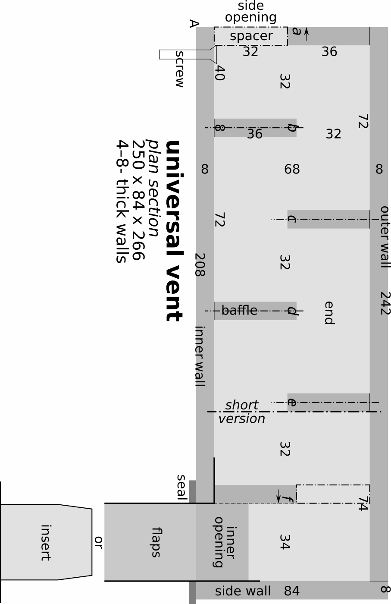

&nbsp; &nbsp; &nbsp; &nbsp; &nbsp; plan: universal vent, plan

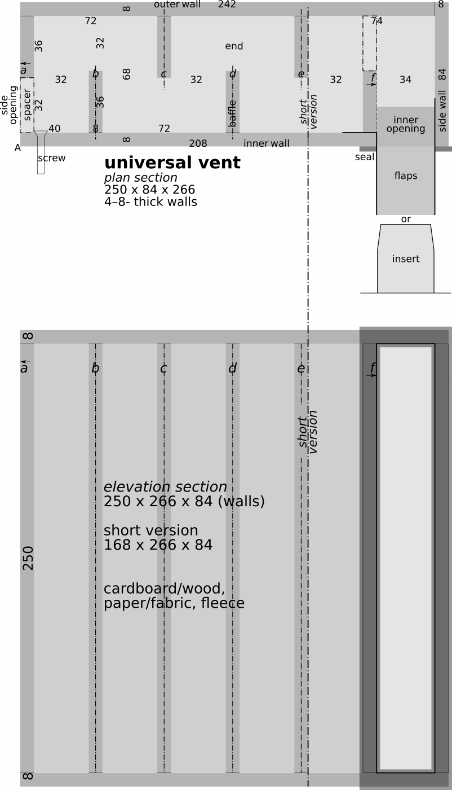

&nbsp; &nbsp; &nbsp; &nbsp; &nbsp; plan: universal vent - [____download____](https://hygienicdarkretreat.com/img/plan/universal-vent.pdf)

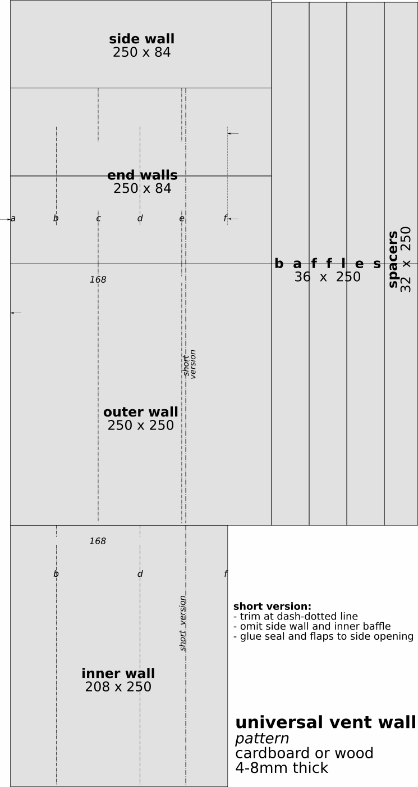

&nbsp; &nbsp; &nbsp; &nbsp; &nbsp; plan: universal vent, walls - [____download____](https://hygienicdarkretreat.com/img/plan/universal-vent-wall.pdf)

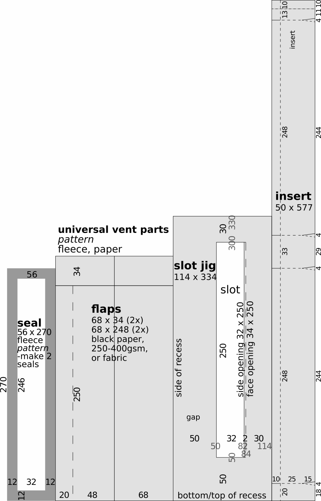

&nbsp; &nbsp; &nbsp; &nbsp; &nbsp; plan: universal vent, parts - [____download____](https://hygienicdarkretreat.com/img/plan/universal-vent-parts.pdf)

{pagebreak}

The universal vent can go anywhere: a blind, a door, a wall, etc. Flaps and seal attach to either opening. They poke through a slot and get taped or glued down. Mostly it attaches to a blind with the face opening.

- blind: attach it to a blind and slightly open the window behind it. 
- door: cut slot in it and use universal vent instead of a threshold vent. 
- existing vent in a wall: cut a hole in a cardboard box the same size as existing vent hole. Cut a slot on the opposite side of the box for a universal vent. Attach universal vent to box and box to wall over existing vent.
- enclosure (like silencer): use shortened version inside or out. It has fewer light-stopping corners because enclosure already has two or more. Attaches at side wall. See note in drawing and dash-dotted lines and measurements.

If your darkroom's ventilation is passive, put vents both low and high in room to enable convection. This works better the greater the inside and outside temperature difference; the greater the vertical distance between vents; and the more vents. 

Do you wish to manufacture vents? A set of simple wooden or sheet metal templates and jigs, maybe a table saw with a sled, can speed production tremendously while keeping equipment and investment to a minimum. Start in your garage.

Read through instructions once while studying plans.

#### prep {#prep}

1. materials:
	1. walls, 4--8- thick
		1. cardboard: double-layer is stable if kept dry and out of direct sun and intense heat.
		2. wood: thin tongue and groove boards, masonite, exterior plywood aged 3+ months, or marine plywood. Avoid interior plywood. Its especially toxic glue outgasses a long time.
	2. flaps: black acid-free posterboard/cardstock/coverstock, 250--400gsm or thin tightly woven fabric like poplin or twill
	3. seal: black polar fleece, medium weight. Quality check: a 10-layer stack should measure 30--35- high.
	4. tricot or no-see-um netting
	5. wood glue
	6. paint, matte black, probably spray paint. Or glue black paper to one side of cardboard, both sides of baffles, before cutting
2. follow instructions in [____fabricate____](#fabricate) _-8_
3. determine exact vent location
	- in blind, panel, or silencer
	- whether it will attach at side or face opening
	- vent must clear window handles, locks, and frame
	- if used with a double blind, shade hole in insert from direct sunlight
4. the plan adapts to wall material between 4--8- thick. Just move walls and baffles toward point A to accommodate it. Use these rules:
	- keep inner wall flush with inner and left edges of end
	- keep baffle _a_ flush with left edge of end
	- move outer wall inward
	- keep inner and outer walls 68- apart (with spacers)
	- keep baffle _f_ flush with right edge of inner wall (thin dash-dotted line)
	- keep baffles _b, c, d, e_ centered on dash-dotted lines, shifting them downward (in short version, keep _e_ flush with right edge of end and outer wall)
	- keep side wall against outer wall

#### assemble {#assemble}

1. seal: glue 2 seals together with minimum of glue: a skinny bead around outer perimeter, with a little extra at the corners.
2. inner half
	1. inner wall
	2. top end
	3. long folded flap, 1 short flap 
	4. baffles b, d, f
	5. side wall
	6. 2 spacers. Attach a piece of tape around an edge so you can pull them out from the openings once vent is dry. Use only 2 dots of glue on each spacer for removability, just enough to hold them in place as you fit the halves together.
3. outer half
	1. outer wall
	2. baffles a, c, e	
4. paint insides matte black
5. glue halves together
	1. inner half
	2. outer half
	3. bottom end
6. add 
	1. 3 other flaps
	2. seal
7. Let it dry.
 Until installation, keep it in a dust-proof bag. 

#### install {#install}

1. mark slot with slot jig
	- it spaces slot correctly on most blinds and panels. It can be further from corner but only 20- closer on panels.
	- face opening, 35 x 248, on blinds, panels, or outside silencer, with shell
	- side opening, 32 x 248, inside silencer or other enclosure, without shell
2. cut out slot
3. position vent over slot and fit vent flaps through it
4. when attaching to soft material like fabric, plastic sheeting, or cardboard, pull long flap snug, use back of table knife tip to crease the outside of it right where it passes through slot
5. fold flap at crease and tape it down. Tape makes vent removable. Only glue it in place if you are certain of not moving it for years.
6. repeat with other long flap, then with short flaps
7. secure side opening with screws. Screw through inner wall into panel or blocks. Or screw from other side into inner wall. If blind material is soft (plastic, fabric, paper, cardboard), use fender washers.
8. vent must be shaded to minimize fading of black paper and warping. Usually, insert of double-blind or white material over window will do this. Otherwise, cover shell with white paper. If in direct sun, shade it somehow.

#### shorten {#shorten}

The universal vent can be shortened for use inside a silencer or other enclosure. The enclosure must have two or more blackened corners that light must go around. Follow instructions in wall drawing. Note dash-dotted lines in plan and elevation views. 

The short version is 168 x 266 x 84. If an even smaller vent is required:

- use thinner cardboard, 2--4-
	- slide baffles leftward, maintaining 32- and 34- spacing
	- trim protruding walls
- or shrink the design proportionally
- or use old helix-z vent (140 x 281 x 68 in the body), in zip file

With thought and experiment, every engineering problem can be solved. This is the awesome and terrifying power of _technique_: of physics and engineering. Let us use it to our advantage, for the purpose of coming back to life. 

### threshold {#threshold}

A bedroom door often has a gap under it, at the threshold, for ventilation. A threshold vent uses this gap to let air through but not light. The design adapts to door width, door thickness, and gap under the door. It also adapts to how much light is outside the door.

If the gap is greater than 40, add wood to bottom of door or build up threshold with boards. Or modify the vent's design. If less than 13, use black paper in place of fleece for the vent baffle, along with black paper over the threshold. If less than 6, trim the bottom of the door or find another way to ventilate the room.

If the light outside the door is dim, just the vent walls are enough. If bright, use one or two hoods as well. You can add them later after testing.

Usually, you need to darken the area outside your door anyway. Either you need a path to a bathroom. Or your supporter needs to get in without lighting up your room. Cover windows in the hallway. Make a curtain across the hallway with a dark blanket fixed to the walls and ceiling with tape or tacks.

Or make a [____removable partition____](https://andrewdurham.shutterfly.com/313). It's a wooden frame a little wider than the hallway so it wedges in place at an angle. It has a fleece seal around the frame. It is filled with black plastic sheeting. It is penetrated by ducting or universal vents as needed.

#### fabricate {#fabricate2}

1. materials
	- cardboard, double-wall, 4--6- thick (400 x 600 x 130 flat produce boxes are perfect) 
	- fleece, black, 200 x 1000
	- muslin, black, 500 x 700
	- cardstock (posterboard), black, acid-free, 180--300gsm, 550 x 700 for seals, maybe threshold.
	- double-sided clear plastic tape or adhesive
	- double-sided foam mounting tape or 3M Command strips
2. prepare pattern with instructions in [____fabricate____](#fabricate) _-8_
3. cardboard
	- fold at creases a little past 90° 
	- edges of hood that fold into each other: crush to 45° so that edges of outer facing of cardboard meet
	- glue the seals onto hood, long skinny ones first
4. cut and glue muslin inside wall and hood pieces, except on flaps

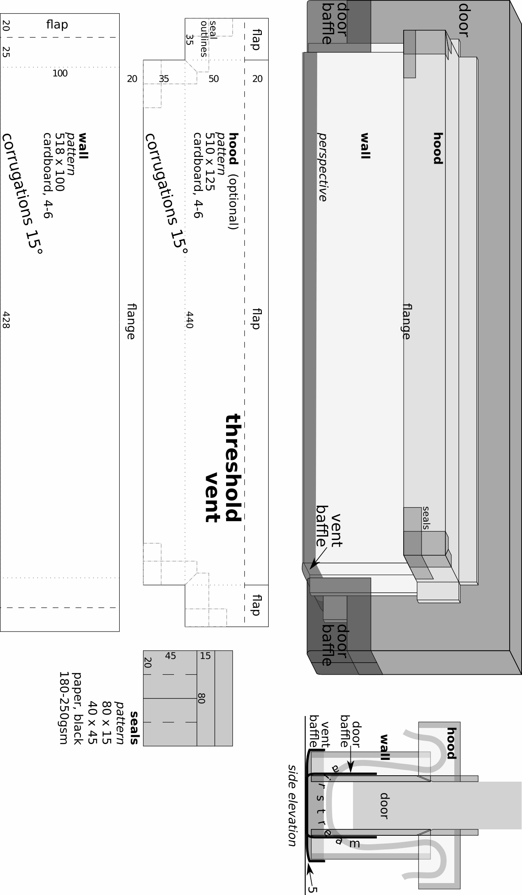

&nbsp; &nbsp; &nbsp; &nbsp; &nbsp; plan: threshold vent - [____download____](https://hygienicdarkretreat.com/img/plan/threshold-vent.pdf)

#### install {#install2}

1. position one vent wall on door so that it is 5- above high point of floor in swing area of door. Tack in place with masking tape. Once it is perfect, mark its position with tape. Duplicate marks on the other side of the door.
2. attach muslin over area of door that vent will cover. Width: 420-. Length: from 20- above wall on one side to same height on other, wrapped under the door. Use double-sided tape. Seal with finger nail. If no hood is needed, masking tape works, too. Use wall as guide or remove it and use tape marks. Remove wall afterward.
3. vent baffle
	- cut piece of fleece 470 x (90 + door thickness)
	- glue to bottom of one wall
	- glue extra length at sides up the sides of the walls. Cut slit where flaps are.
4. attach vent walls to door at marks. Use double-sided foam tape or 3M Command strips.
5. glue vent baffle to bottom of other wall
6. measure and cut door baffles wide enough to seal door where there is no vent. Add 10 + half the door thickness. Length = (46 + door thickness). Attach them to door 20- above bottom of door. Use masking tape.
7. if light leaks under the door, cover the threshold with black paper or fabric
8. if there's a danger of kicking it in, glue pieces of wood, 10 x 428 x 38, to the bottom of the walls. Screw them in from the inside with 3 x 15 screws and fender washers.

{pagebreak}

## soundproofing {#soundproofing}

### principles {#principles}

At some point, noise defeats a retreat. One must attenuate it somehow, even in remote locations.

Shelter is the [____normal____](#normal) _-7_ means of controlling exposure to pollution. Pollution includes noise.

Outside, noise comes from machines, traffic---including boats, trains, and airplanes---construction, music, fireworks, and talking and playing people. Inside, it comes from machines---refrigerators, fans, water pipes and pumps), people in adjoining spaces, and their music. 

The four principles of soundproofing are:

1. mass: use heavy materials absorb low-frequency (bass) sounds
2. absorption: use fine fibers absorb high frequencies and prevent echoing
3. dampening: use rubbery material dampens vibration in resonant materials like metal, wood, masonry, glass
4. decoupling: disconnect structures and airspaces to prevent transmission of sound vibration between them

[____Soundproofing tutorials____](https://bit.ly/soundproofingtutor) abound online. 

These principles apply to ventilation as well. Dampening and decoupling figure in the fan mount; mass and absorption, in the silencer. The silencer absorbs most noise, including the fan's.

Fans make noise directly and indirectly. Small fans have little hum to start with, but they run at high speed, so they develop harmonics. Bigger fans start with more of a hum but they run more slowly for the same air output, so they develop less noise overall. Use fan mount to avoid amplifying these vibrations.

Even the quietest fan makes noise because of the friction of air itself against the fan blades, housing, ducting, and vents. Because of air friction, fully silencing a ventilation system requires a silencer of some type at the room-ends of ducts. 

{pagebreak}

### silencer {#silencer}

A silencer is an larger duct section lined with insulation. Its greater volume depressurizes the airstream. This transforms low-frequency sound into into high-frequency sound. High-frequencies vibrate the fine fibers lining the silencer, transforming the sound into heat. Genius!

You can make or buy silencers. 

- my double-turn box design is below, $2-$10 depending on your material salvaging skills.
- [____DIY straight tube____](https://bit.ly/diysilencer) 
- [____for sound booths____](https://bit.ly/silencerbooth). With dark insulation and enough bends, this eliminates the need for a lightproof vent.
- manufactured silencers are made of metal and other super durable materials and cost $100--200.
- [____acoustic ducting____](https://www.google.com/search?q=acoustic+ducting), at least 3m of 100- with 2--3 bends

Silencers and acoustic ducting are standard industrial components, making buildings quiet worldwide. Thanks to Richard Nöjd of Skattungbyn, Sweden, for showing me these solutions. 

I built silencers into window recesses on two occasions. They were simpler and more effective than I hoped. They swallowed up sound. The window, open at one end, provided one face of the box. The thick wall provided 4 sides. Boards against the inside of security bars formed the box's outer face, about 20cm from the glass. Shredded fabric insulation lined the box. This technique disables the window as a light source. It is a temporary solution. It works if you have other windows you can uncover during transition days.

The design below is a zig-zag channel through insulation inside a wooden box with a hole at each end. Each hole has 4 possible locations: face, sides, or end. Cut a circle for ducting or fan, a slot for a universal vent. The fan mount adapts to all 4 locations, inside or out.

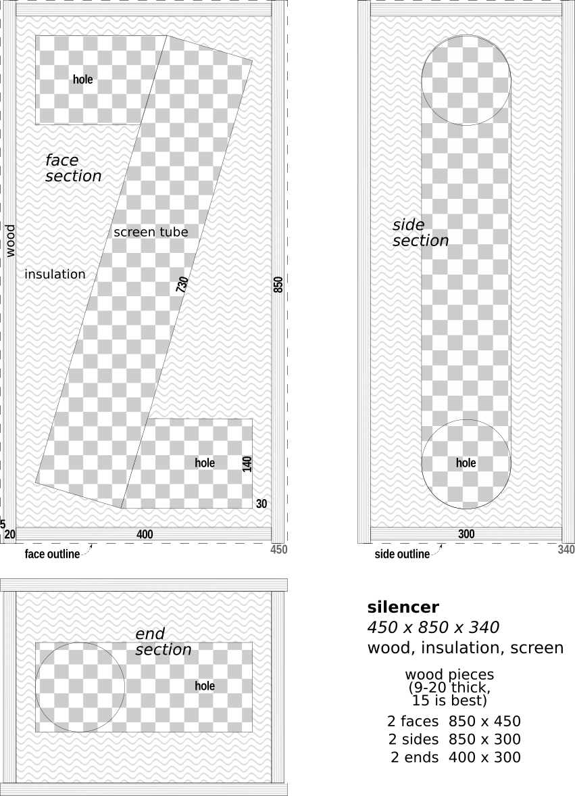

&nbsp; &nbsp; &nbsp; &nbsp; &nbsp; plan: silencer - [____download____](https://hygienicdarkretreat.com/img/plan/silencer.pdf)

The box is lined with porous non-toxic insulation. clean wool, shredded fabric, wood fiber could all work. Note, the shredded fabric and wood fiber I've tried had faint smells that I disliked. 

Rockwool works. It is unpleasant to work with, but it is fairly odorless. Polyester pillow filling and quilt batting and acoustic foam work. But I don't like my air going through plastic.

Fiberglass is terrible to work with and often smells of chemicals. Closed cell foam, like styrofoam, polyisocyanurate boards, camping pads, etc, does not work due to non-porosity.

Discarded furniture is made of melamine, an excellent material for silencer boxes. It is particle board with resin veneer, usually 15- or 19- thick. Marine plywood uses non-toxic glue. Otherwise, avoid plywood or line with foil or mylar. 

Use a table saw to cut the 8 pieces so they come out square. Or have a carpenter do it for you, including the holes. Just take the drawing with you, modified for your needs. The carpenter probably has some extra melamine laying around to sell you cheap. To screw pieces together, first drill pilot holes so edges don't break. I always drill pilot holes in wood less than 30- wide for this reason.

To insulate, make round tubes of plastic screen. Cover with porous fabric if insulation is fine, like cellulose. Stuff insulation around it and close the box. Roughen the plastic surface first with sandpaper so the glue sticks. 

### hum {#hum}

People all over the world have reported hearing a strange hum. Its source is rarely found. In Europe, I heard it in many places.

The hum is a low-frequency sound and vibration that comes through the air and ground. My first explanation was that all the machines we use combined generate this hum. This includes cars, trains, airplanes, factories, ventilation (ironically), underground pumps (whose sound carries far), farm machinery, etc. 

Most people can't hear it. I talked to a famous musician in Australia. She knew people worldwide who had heard it. She said it tends to occur in people who feel their internal conflict and disconnection acutely but cannot resolve or repair it yet. They still project responsibility for their suffering on the world at large. It's not all in one's head, but one is too vulnerable due to an error in attitude.

I had started to suspect something like this. She already had it nailed.

In Czech Republic, I visited a large music recording studio in the middle of Brno on a busy street. It was 8m x 14m inside with a 4m ceiling. The engineer let me lie on the floor in the dark for 10 minutes. I don't recall if I was hearing the hum at that time. Their building technique was extremely effective in stopping the deafening noise outside.

They called it "house-in-house". In America, "room within a room". My brother had mentioned building a few music studios like this. The walls and ceilings of each structure don't touch. The inner room's floor "floats" on vibration-dampening springs or rubber blocks. 

Then I visited an anechoic chamber at the Petrof Piano Factory in Hradec Kralove. It was extreme soundproofing! It was a 6m concrete cube, resting on leaf springs inside another building, with a 1m gap between the two. 

To enter, I stepped over a gap, as in a subway, through a 120cm thick door. Foam cones 1m long protruded from the ceiling, walls, door, and floor. Suspended in the middle was a steel grill platform for a piano and engineer. With no measurable noise or echo inside, they could test a piano's sound with extreme precision.

You have probably heard of these rooms. People claim to start going crazy in them. That is hype. The silence was heavenly. I could have stayed in there for a month. 

The engineer was kind enough to give me 10 minutes. Sigh.

Anyway, the house-in-house technique is practical for silencing bedrooms for darkrooms. The gap between the houses must be at least 50- all around. The floating floor is 12--19- plywood on a frame, insulated and sheathed. Walls and ceiling are also insulated frames with drywall on both sides. Dual pane windows, airtight door seals, and silenced ventilation complete the construction.

## machines {#machines}

### fan {#fan}

Use an axial case fan, also known as a squirrel cage fan. Most common in desktop computers. Specifications:

- DC (direct current)
- 12V (volts) but run on as little as 6V, reducing speed, noise, and airflow
- 120--200- diameter
- 600--1200RPM (revolutions per minute)
- maximum 20dB (decibels)
- 65--200cmh (cubic meters per hour) or 40--120cfm (cubic feet per minute)

I recommend 200- fans. I redesigned the fan mount for them rather than the 120- fans I used for years. They move a lot of air and are very quiet. I have Cooler Master brand. Noctua makes the best, quietest fans available, running as low as 7dB. Maybe you could hear that if you're a bat.

However, a common 120- fan is better than nothing. It usually requires a silencer. It is salvageable from a desktop computer power supply, $3 at thrift stores or flea markets, or $5--40 at a computer or electronics store. Avoid AC (alternating current) fans due to their penetrating hum (more on noise below). 

Power it from the grid with an AC/DC adapter. 12V case fans run on as little as 6V. A universal adapter with pole switching and variable voltage (3--12V) for speed control is $5--10 at variety stores. Thrift stores have boxes of cheap adapters of fixed voltage if you know what voltage you want. 

Off grid, use car or household batteries or a solar power system. To control speed, use a DC/DC car adapter from eBay. If you have no fan movement? Switch the +/-- poles on the adapter or switch the positive and negative wires.

Blower fans are interesting. They overcome resistance in ducts and HRVs and move a ton of air. 120- units on eBay are $10--20. They need silencers and more powerful adapters. Larger slower quieter ones would be better. I built one once, about 500- dia x 100- thick. It was fun but it took a lot of time!

### fan mount {#fan-mount}

The fan mount totally dampens vibration from the fan, already smooth and quiet. The silencer then absorbs airborne noise from the fan. It is inspired by studio microphones and tensegrity structures. It fits the silencer.

It is a fan suspended in a web of 2 concentric rings of rubber, stretched between 4 screw posts, anchored in a wooden base. It is modular, fitting silencer in any configuration.

- materials
	- base: 272 x 272 x 19 (center hole, 194- diameter). Cut precisely with jig, band, or coping saw; router; or have a carpenter do it for you. Screw hole centers 20- from corners
	- case fan: 200- (computer fan)
	- screws: 4, 5 x 60 machine + 4 nuts + 4 T-nuts, 4 fender washers
	- rubber: 28 x 1700 x 1--2. Use regular bicycle inner tube. Distances between loops and buckles vary with thickness of rubber. Tighten webbing enough to suspend fan without too much movement. 
	- loop: wire, 1-, bent to fit tight 
	- gap: 0.5--1- between base and fan
- assembly
	- lay out rubber strip.
	- figure out order to slide loops on. Do so.
	- add buckle
	- tighten and adjust rubber
	- fit fan with foam standouts into rubber
	- align fan directly over the hole in base. Gravity may pull it to one side or another. Tug on fan or webbing to reposition fan.
	- slide webbing up or down screws to adjust base-fan gap
	- screw base onto silencer over a hole in any position

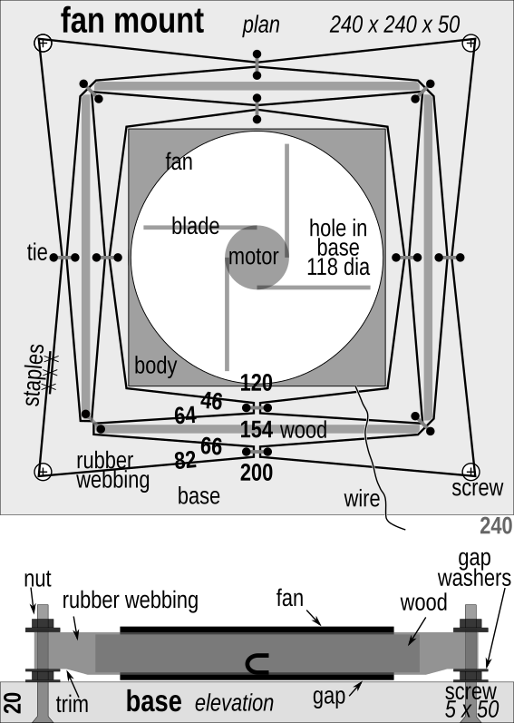

&nbsp; &nbsp; &nbsp; &nbsp; &nbsp; plan: fan mount - [____download____](https://hygienicdarkretreat.com/img/plan/fan-mount.pdf)

{pagebreak}

### power {#power2}

In my first major darkroom in Guatemala, I had no electricity.

At first, to create a draft, I made lamps that burned cooking oil inside a lightproof chimney. It was a messy, unreliable, and labor-intensive process. No one should ever repeat it. But it worked long enough for my brain to make the leap to the 20th century and remember the existence of batteries.

AA batteries made a quick and dirty solution. One night requires 4--8 batteries, alkaline or rechargeable. Connect them in series: positive end of one to negative end of the next. 

Voltage adds up like this. Each battery is 1.5V, so 4 batteries = 6V. Some fans need 7V or 9V to start, thus 5 or 6 batteries. Increase fan speed by adding batteries to the pack, up to 8. Increase pack life by using bigger batteries or another series in parallel (fan wires contacting ends of both series).

I was isolated and just learning. This simple discovery encouraged me after weeks of the fascinating absurdity of oil lamp-driven convective ventilation. However, changing batteries every day also quickly got to be a pain. So I bit the bullet and got a proper solar power system for less than $100:

* solar panel: 12V. Size depends on location: 10W in Guatemala, 40W in rainy Oregon winter. ($10--$100 on eBay)
* charge controller: 12V, 4 or 6-pole ($35 on eBay)
* battery: 12V 7A, lead acid ($30 at a motorcycle shop)
* wire, 20 AWG, enough to connect everything ($0--10 from your shed, a dumpster, yard sale, or hardware store).

Once built, maintain by wiping dust off panel once a week. What a luxury! Of course, if you have reliable wind or hydro power, that's great, too.

{pagebreak}

### warmth {#warmth}

For warmth, I often use a portable oil-filled electric heater. It is silent and can be positioned by a window or vent to warm incoming cold fresh air. Before buying, check that its indicator lights are easy to cover (not glowing from the interior through multiple cracks) and that it doesn't rattle or hum. Old or cheap ones often make noise. Buy it new.

If you live in a cold place, I highly recommend buying and installing a [____Heat Recovery Ventilator____](https://en.wikipedia.org/wiki/Heat_recovery_ventilation) (HRV) for both health and economy. It conducts heat from return air to supply air while keeping airstreams separate using an exchanging core and fans.

Fine wire heat exchange (fiwihex) technology is my favorite. It is 15x more efficient than plate exchangers. It is compact. A low power fan will supply air to one person. So it can be installed at point of use with little to no ducting. Fiwihex cores have been available for $150 from [____Viking House____](http://viking-house.ie) and possibly [____Fresh-R____](https://fresh-r.eu). These companies' _Breathing Windows_ embody an intriguing design for a complete ventilation system. 

However, I lived with one for six months and found it too loud due to its small, high-RPM fans with no silencing. If fans were separated and silenced, fiwihex would be great. A 200- axial case fan works (I tried it). DC  blower fans could work with silencing. Building your own HRV is doable.

It also needs a filter despite the manufacturers' strange denials. Just a leg of a stocking inside a tube for each intake is enough. It's much easier to remove, clean, and replace than using the core itself as a filter (the manufacturer's strange instruction).

The most interesting plate exchangers use the Mitsubishi _Lossnay_ core, found in ERVs (Energy Recovery Ventilators) such as [____Renewaire's____](https://www.renewaire.com). Made of high-tech paper, the Lossnay recovers heat-trapping water vapor as well as heat from air. 

Lossnay's principle has DIY-potential, using non-siliconized parchment paper ("sandwich paper" in supermarkets). After 20 years of contemplation, I conceived a design for a convection-powered fiwihex ERV (solid state, silent). It would take a small factory to produce. Maybe someday I will.

{pagebreak}

### purity {#purity}

In some cases, an air purifier becomes necessary. Get one if your house is near a factory, busy roads, in a smoggy city, or near a smelly restaurant or neighbor. Purification methods include:

- activated carbon
- HEPA
- Photo Catalytic Oxidation ([____PCO____](https://www.sciencedirect.com/science/article/pii/S0926337316308001)) is a new, interesting technology that destroys pollutants at the molecular level. Several companies make filters with it. Prices vary widely. 
- UV-C light bulbs with 253.7nm wavelength destroys VOCs and germs and cost less than $10. These would use the regular case fan and just need a universal vent to stop light.

Do not use an ionizer. It produces toxic levels of ozone.

Recently, I upgraded the ventilation system of a darkroom in Czech Republic where people burn coal for heat. Coal smoke smells terrible. I installed an activated carbon filter into the silencer. The $50, 180 x 180 filter eliminated the smell. Catching the particles would require HEPA filtration, but it was less important at the time. 

The filter also stops all light and some sound. It requires a fan more powerful than a case fan to overcome the resistance it presents. A blower fan does this. I have yet to test one with a silencer. If that works, I'll adapt the fan mount for one.

If air quality at your home is bad enough, consider moving. Lots of places in small towns and the countryside have clean air and are less polluted in general. It is a cheap and simple solution to multiple problems, some of which you may not know you have yet.

~/~

That's it for lightproof ventilation, silence, power, heating, and purification. On to darkening doors and windows.

	
# _10_ &nbsp; darkness {#darkness}

There is darkness, and then there is _darkness_. We're going for the second kind: perfect and absolute. There is a million percent difference between 99% and 100% dark. In 100% darkness, the mind has nothing left to hold onto, no reason to resist. Finally it can let go, fall into the well of itself, and be renewed.

Light is easier to deal with than ventilation. There are fewer factors involved, they are all controllable, and they are visible.

But light is relentless. It sneaks sideways through a single layer of clear plastic tape and the hook and loop of black velcro; through the weave and fibers of heavy fabric; around multiple, darkened corners; and past all edges and joints.

I suffered many defeats at the mighty hands of light. Eliminating it demanded equally formidable techniques. I wandered continents for years to find them. Now I bestow them upon you.

Numerals with - x + are in millimeters (see [____metric____](#metric) _-8_).

## technique {#technique}

Generally, to darken a space,

1. use dense, inherently lightproof sheet material in 1--2 layers to cover area. Using few layers means:
	- simpler construction
	- better function
	- easier operation
	- neater appearance
	- greater need for precision
2. seal out light at edges with black polar fleece. Attach it to 2 sides, over an edge, forcing light around 1--2 corners.
3. make outer surfaces exposed to sun reflective: white or silver
4. in vents, channel light around 6 black-surfaced corners

If improvising for [____tonight____](#tonight) _-4_: use as many layers as necessary. If it is already night, turn on all your lights and check your work from outside. With each layer, block as much light as close to the source as possible. First, block 99% the light. Then 99% of what's left. The last 0.01% is easier to address or ignore. Close curtains over windows outside a darkroom's door. Where possible, shade darkening measures made of paper from direct sunlight.

Edges were tricky till I tried black polar fleece. It's like a sponge for light. It is widely available, cheap, and forgiving. A knit fabric, its edges require no hem. Just cut and attach with school glue or masking tape. 

We will start with the most portable and perhaps simplest design. It darkens the small space around the eyes: the mask.

{pagebreak}

## mask {#mask}

A good blindfold or sleeping mask is the quickest way to obtain a large measure of darkness wherever you are. It's like draping a dark shirt over the eyes, but it stays on all night.

Know that no mask is comfortable for long periods. None stays in place during all movement. And our skin has enough light-receptors for it to wake us up. A mask cannot replace a darkroom. And the [____double-blind____](#double-blind) _-10_ below may be just as easy to make.

A mask is cheap, accessible, discreet, and very effective for immediately improving sleep. It is a good first step toward the profound rest darkness makes possible.

No mask I've tried or seen satisfied my requirements. So I designed one. The strap design is very effective. It would improve most existing masks. Instant and standard versions are described.

### constraints {#constraints3}

- blocks all light 
	- through the mask
	- at its edges
- comfortable for many hours
- stays in place during sleep and gentle activity
- cheap and simple to make
- easily replaced elastic (skin and hair oils seem to degrade it quickly)

Adjust the measurements as needed. The mask can cover your forehead, but not your ears, nor go below your nose. Adapt it according to its comfortability and light-blocking ability on your face. The drawing is of the mask that fits me.

### instant {#instant}

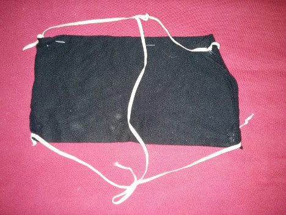

&nbsp;

I put this one together in a few minutes. It's like the standard mask below but without seals. Combined with a mostly darkened room, it blocked 95% of light and let me sleep in and nap. (Later, I managed to staple seals to it for 99--100% darkness.)

- cut a piece from a black 100% cotton
	- T-shirt, 250 x 440, folded the short way in 4 layers
	- or sweatshirt, 250 x 330, folded in 3
	- towel, 250 x 220, folded in 2
- staple along its long edges
- 4 strap anchors
		- 3- holes poked through with a ballpoint pen tip, elastic going through them then knotted
		- or 2 staples each
		- knot where comfortable, end-knots (overhand or figure-8) on one end, two half-hitches or slip knots on the other.
- vertical strap: make a slipknot in each end of the vertical elastic piece that tightens around the horizontal straps.

### standard {#standard2}

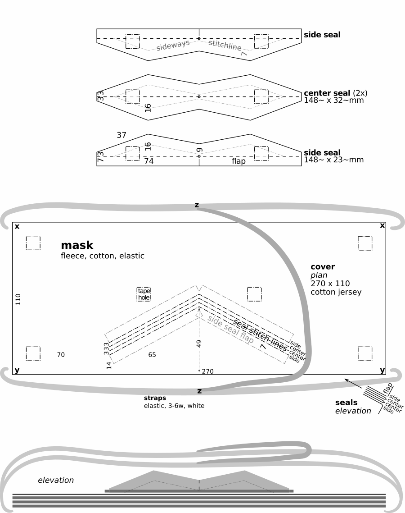

&nbsp; &nbsp; &nbsp; &nbsp; &nbsp; plan: sleeping mask - [____download____](https://hygienicdarkretreat.com/img/plan/mask.pdf)

{pagebreak}

1. materials
	- soft black knit fabric: 
		- 100% cotton sweatshirt fabric (French Terry cloth or loop-back cotton) 
		- 100% T-shirt fabric (cotton jersey)
		- polar fleece for the cold
		- cotton is cooler than fleece, which can feel scratchy, too. Avoid woven fabric. It frays and doesn't flex. A bright colored piece of cloth on the outside makes finding the mask in the light and in bags a lot easier. 
	- elastic, 3--5-, white, helps to find the mask and is common in stores
	- cord, 3- polyester or nylon, white
	- thread
2. follow instructions in [____fabricate____](#fabricate) _-9_
3. attach side seals to cover
	1. put cotton cover with plan still attached on 2--3 layers of cardboard
	2. each side seal has a 7- wide flap divided by 5- cut in middle and a small circle on dashed stitch line. Two side seals=4 divisions. 
		1. align one division at a time to grey marks on cover
		2. tape in place
		3. sew on stitch line of plan to or from small circle
		4. tear plan in middle to bend seal 
		5. repeat for other three divisions
		6. remove all paper from fabric
4. attach center seals
	1. fold center seals in half the long way and fit them between side seals, making everything symmetrical and even
	2. pin center seals to cover through their folds 
	3. sew (maybe hand sew) center seals to cover
5. bind seals
	1. hand-sew seals together through sideways stitch line
	2. pull thread with minimal force, leaving seam neither loose nor tight.
	3. the stitch line is a little distant—7-—from the zigzagging edges of the seals. This allows the seals to hold each other up to fill in the gaps on each side of the nose. Yet the unbound edges of the seals can fan out to more gently make contact with the face.
6. sew cover
	1. stack all cover pieces, matching up edges evenly
	2. fold seam allowance of cotton cover under and pin in place to other cover pieces
	3. sew around edge of cover to join all pieces
7. prepare straps
	1. cut elastic
		- 2 pieces 500- long
		- 1 piece 250- long
	2. cut cord, 4 pieces 30- long
	3. melt all ends with flame to prevent fraying
	4. tie figure-8 knots in ends of elastic
8. attach straps
	1. fold cord in half, making a loop. Sew loop to front of mask at points **x** and **z** so loops stick out over corners from cover 1- and cord ends are pointed toward center of cover
	2. tie one end of a 500- piece to a loop at point **x** with a slip knot
	3. tie other end at other point **x** with taut line hitch
	4. repeat steps 2 & 3 with other 500- piece at points **y**
	5. tie 250- piece to 500- pieces at points **z** with slip knots
	6. the taut line hitch, when tight, slides on the part of the strap it is tied to, then locks in place, creating a strap of adjustable length. Adjust straps for comfort. Bottom strap should go around neck, top strap should go high around back of head.
	
{pagebreak}

## door seal {#door-seal}

Black polar fleece makes darkening a door easy and quick. Use masking tape at first. Tack edge of fleece in position with 10- pieces of masking tape every 400-. Then put a continuous strip of tape over the edge. Once you get the hang of it and know where you want the fleece to stay, use school glue where possible (glue removal described below).

1. sides and top: affix 50--70- wide strips of black fabric to door jam with masking tape or white school glue. When closing, door should catch middle of fabric, pulling and bending it around one edge of the door and fill the gap between the door and jam. 
2. hinges: make perpendicular cuts in edges of fleece to accommodate these
3. latch: make a parallel cut over the strike plate to accommodate the bolts
4. bottom: where no threshold vent is necessary, make a fleece baffle the width of the door. See threshold vent perspective drawing for baffle design. It is a half-tube of black fleece fabric that hangs from the bottom of the door on each side and touches the threshold or floor underneath. Tape a 100- wide strip of black fabric to the threshold or floor under the closed door. Black fabric against black fabric makes a good light seal. Partially darken space beyond door with curtains or partitions to ensure darkness in the darkroom.
5. if light still leaks in the sides or top, affix a second strip to door, as in drawing
6. to remove glued-on fabric, wet it. This will dissolve the glue and the strips will peel off easily after a few minutes. As this happens, use a wet rag to wipe off glue residue before it dries again.

If door has a window, cover it with a double-blind or a panel, described below. 

&nbsp; &nbsp; &nbsp; &nbsp; &nbsp; plan: door seal - [____download____](https://hygienicdarkretreat.com/img/plan/door-seal.pdf)

## window {#window}

For your next trick: blacking out windows. I have tried about 10 methods of covering windows for lightproofness in ~100 spaces over the past 15 years. Two work well just about everywhere.

The double-blind is the new standard for darkening windows. It is a quick, easy blackout blind. The panel is a modern revival of traditional shutters, offering soundproofing and security.

Notes on retired methods—foil, single layer, velcro, roller blind—come last.

### general {#general}

#### comments {#comments2}

In sealing off windows, we must consider ventilation.

If your room's air supply comes through your window, attach a universal vent to the back of the blind. If the recess doesn't allow this, attach the vent to the front. Test position of vent before cutting a slot for it to make sure it clears the window frame and handles. The slot jig usually works. See [____universal vent parts____](#universal) _-9_.

If both your supply and return air pass through your window, use two lightproof vents, one at the top, one at the bottom of a blind. Use fan mounts and silencers if necessary. Test without them at first. Some buildings have mysteriously good ventilation. Convection works in winter, when temperatures inside and out are different enough.

Some windows leave no space for a blind or vent because they are flush with the wall. In this case, either:
 
1. remove the window temporarily. Replace it with a panel with a vent
2. use a panel or traditional shutters outside, operable from the inside
3. or build a deep-set frame around window for a double-blind or panel

A handful of companies make portable blinds for traveling, especially with children. They attach to the glass with suction cups. The cups can be repositioned on the blind for different windows. They are convenient and helpful.

Some sell the fabric they use by the meter. One company sent me several samples to test. I wanted lightproofness in one layer. No sample worked, so I gave up on it. But two layers of it would make a fine double-blind. It would be portable, adaptable, and look nice, as well.

#### constraints {#constraints4}

- perfectly darkening
- quickly and easily operated so it is actually used
- good-looking
- discreet: looks like a blind or curtain from the outside
- accommodates lightproof vent
- window or trickle vent can be open behind it
- holds its shape over time in different temperatures and humidities
- durable
- can be made of common, cheap materials
- easy to make
- easily uninstalled
- leaves few marks or holes

#### lesson {#lesson}

Here's a quick lesson on window types and anatomy.

- types:
	- fixed
	- opening
		- sliding
			- double-hung (vertical)
			- horizontal
		- casement (hinged)
- anatomy, from center of window to wall:
	1. pane: the glass itself
	2. frame: holds pane, moving with it in opening windows 
	3. sash: attached to wall, surrounds frame. In opening windows, the frame closes against the sash. With non-opening windows, sash is often the same as the frame.
	4. sill: holds sash; it's the surface where you put plants, candles, etc, and corresponding sides and top. Defines the recess.
	5. recess: entire opening in wall where window is installed. It is defined by the sill.
	6. trim: wooden border around window. Attaches to wall and edge of sill, covering the crack between them. Not always present. 40--100- wide, 10--20- deep. 
	7. wall

### coverings {#coverings}

#### double-blind {#double-blind}

This is my favorite method. One layer is inserted into the recess. One covers the recess. Light can't get past all the corners and narrow gaps. The double-blind is: 

- cheap, easy, fast to find materials for and to do
- extremely effective and simplest overall
- durable, adaptable, and cleanable for reuse and travel

It blocks 99.9% of light even without taping the outer layer. Masking tape seals out the rest. It requires ordinary precision, much less than with a single layer. It is more effective and comfortable than a mask, and about as quick to make.

It is usually of flexible black plastic construction sheeting. Plastic is the lightest weight lightproofing material. It doesn't stretch, making taping easy. 

The inner layer can also be a lightweight board: cardboard, foam-core board, or corrugated plastic sign board. It is easy to use for weeks, months, maybe years.

The design principles apply to fabric and paper, too. They look better. But they are heavier. Fabric requires a rod (or suction cups). Paper warps with heat or moisture. 

I use masking tape. It sticks to plastic and most other things very well and causes the least damage when removed. Heat from a blow dryer can help remove it. Magnets, suction cups, poster tack, pins, tacks, staples, nails, etc could also work. 

North Americans: 1 mil = 0.025- = 25µ(microns).

Minimum total thickness of plastic layers: 0.25-. Fabric and paper: thicker. Always use black. It absorbs the most light as it passes through the thickness of the material.

##### materials {#materials}

- plastic
	- black
		- most common
		- construction sheeting, black polyethylene, 0.15 thick. Widely available in rolls or by the meter at building supply, variety, and department stores.
		- garbage bags. Package usually shows thickness in microns. Make two stacks, 0.125 each. Join with staples, tape, melting, or sewing
	- white: **important**
		- with black plastic, attach white material to outside layer. Use any thickness of plastic, fabric, paper. But leave 30--50- of black edge exposed.
		- windows build up fierce heat when sealed with black plastic. It destroys the vacuum seal of dual or triple-pane windows. It even causes them to explode! The heat also damages paint and wood.
		- black plastic looks spooky from the outside, attracting negative attention. White looks normal.
	- black&white
		- laminated agricultural plastic
			- called "light deprivation" tarp, used in greenhouses and for "pit tarps". I once got some for free from an agricultural plastic supply house. It was the end of a 1-ton roll of 0.125- plastic. It was too small for them, a huge amount for me.
			- easiest. Appealing and satisfying to use. Technology at its best.
			- use one layer for traveling. Use two layers, white sides visible, for perfect darkness. 
		- lumber unit shipping covers, free at lumber yards. They are big, black&white-laminated woven plastic tarps with printed graphics. Rinse or wipe clean. Patch punctures. Put black sides together, making white sides visible.

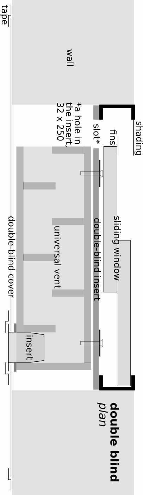

&nbsp; &nbsp; &nbsp; &nbsp; &nbsp; plan: double-blind with vent - [____download____](https://hygienicdarkretreat.com/img/plan/double-blind.pdf)

- fabric
	- black twill or similar tight weave.
	- white muslin or bed sheeting for outer layer
- paper
	- kraft paper off a roll, black, white, brown
	- white backside of gift wrapping paper
- masking tape (more below)

##### assembly {#assembly}

1. insert
	- this is the first layer. It goes inside the recess against the sash or frame. Measure, cut, and tape it in place.
	- it can also be cardboard, black foam-core board or black corrugated plastic
	- join multiple boards with 50- wide strips of the same material.
	- fit a window perfectly with no measuring: enlarge a board with 50--200- wide strips of black posterboard glued to edge of board, extending to the sash or sill. First, crease and fold the strip 15- from the edge.
2. the cover is the second layer. It goes over the recess, extending 100--200- past it or past trim. This also blocks light that leaks through cracks between sill and wall.
4. when using 2 layers of black-white plastic, fold edge of outside layer back 20--50-. This exposes black side for sealing against frame or wall.
5. temperature control: protect windows from heat damage
	- reflect heat with white paper, posterboard or fabric that faces outside. At the edges, leave 30--50- black to absorb light where it makes contact with frame
	- in extremely hot areas, install an awning, exterior blind or shutters
6. For a handle, use a small block of wood. Screw it in from the back through a fender washer or stiff piece of plastic, like a bottle cap.
7. For daily use till you make a panel,
	- tape it up just at top corners. Tape and untape blind layers in place
	- put a patch of tape on wall to tape to to protect wall and extend life of tape
	- make a curtain rod with a 19 x 38 board. Tape plastic to the back of it. Rest board on nails or screws beyond top corners of window and, during the day, below bottom corners.

##### tape {#tape}

1. use regular masking tape, 25- wide. Masking tape is effective, cheap, sticks and conforms well to irregular wall surfaces, yet comes off easily without residue (unless you leave it up too long: months, maybe weeks). 3M construction grade from a builder's supply is best. It is strong and sticky.
2. I want you to know about black masking tape. It is not necessary for my standard techniques, but it is interesting and fun. It could be useful in special applications you dream up. Brands and models are Intertape PF3 or PB1 and Shurtape T106<!-- from American Tape and Label-->. Local art and professional lighting supply stores carry it. For difficult surfaces, photographic masking tape or black kraft paper tape are stickier, thicker (more lightproof), stronger, and more expensive. Look for ProGaff (formerly Permacel) 743, Shurtape 724 or 743, and 3M 235. 
3. avoid electrical and duct tapes. They are made of soft vinyl and obnoxious adhesives. They are toxic in their manufacture, handling, use, and disposal. Gaffer's tape has better adhesive for removal. But most are vinyl. One exception is Shurtape PC 657, a polyethylene coated gaffer's tape. 
4. pro-tips
	- let tape relax between unrolling it and pressing it in place. Don't apply while stretched. Stretched tape slowly peels off by itself!
	- for temporary seal, press in place with pad of finger.
	- for strong, more permanent seal, press in place with finger nail or edge of guitar pick or credit card. You can see and feel the difference immediately.
	- use sticky side of one piece to grab edge of another applied piece and remove it
	- use small pieces to tack material in place, then long pieces to cover the whole edge
	- use one layer of tape except for tacking and overlapped ends. One layer flexes with what it is taped to. Which expands and contracts with heat and moisture. Multiple layers of tape are rigid. They peel, opening cracks for light to get through.

#### panel {#panel}

A panel is for permanent use. It has several benefits. It seals snugly inside a recess or outside like a shutter. 

A panel is of exterior plywood inside or out, or melamine inside. These engineered woods are dimensionally stable. 

A panel: 

- is best for long-term use
- is lightproof in one layer
- seals well with fleece, which attaches well to the edges with various glues
- adds soundproofing and thermal insulation
- retains its shape and size
- easily takes cutting for a hole or slot to attach a duct or vent (unlike glass). 
- looks good
- is easy to get free material for from discarded furniture
- removes with no trace, usually held in place by pressure.
- installable with hinges
- usable for retreats and nightly sleeping
- adds security if installed outside and latches from the inside through the window

Seal exposed edges of melamine with varnish, glue, or tape. Exterior plywood outgasses after three months. Meanwhile, block fumes with foil or mylar taped over inside.

Avoid interior plywood. Its glue is less stable and outgasses more and longer than that of exterior plywood.

&nbsp;

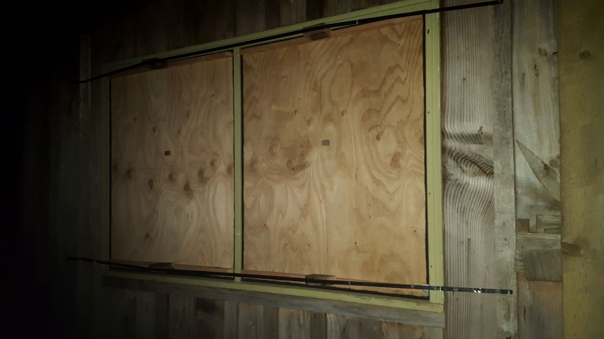

&nbsp;

I made my first panels with cardboard. But it warps and shrinks. Water damages it. It hasn't enough mass to stop noise.

Panels work for opening or fixed windows. Fill big openings with multiple panels. Add a flange of wood to the edge of one panel and fleece to the edge of the next one.

Remove an opening window at or from its hinges. Carefully trace its outline onto the board you will use. Or trace onto paper or cardboard if handles or hinges make tracing awkward or to test-fit the pattern. Tracing is better than measuring. It accommodates non-square corners that windows tend to acquire over time.

Cut 2--3- inside the line to allow for fleece seal. Make sure it fits in the frame with 2--3- around it. Fold fleece the long way so it attaches to the panel's edge and face. Use glue. Then it will make contact with window frame on two sides all the way around, sealing out light.

Determine where a vent or silencer will go so it clears the frame, the screen, and the window recess. Measure and mark a hole in the panel for the vent or silencer.

Cut out hole with a jig or coping saw. Or drill holes just inside the corners with a 4- bit. For each hole, drill two more 8- away just inside the line. Then drill between them along the line at various angles until you cut a slot big enough for a keyhole or hack saw.

Attach a handle to the panel so you can lift it in and out. A 20 x 30 x 20 block of wood glued and screwed to the board is enough.

Fleece at edges usually holds the board snugly in place. If not, find attachment points on either side of the frame (or make them with screws). Stretch a wire or rope over the panel between them. Wedge a block of wood between wire and panel to keep panel pressed in place. 

If panel warps, reinforce it with dimensional lumber to keep it flat. Add hinges, inside or out, to easily darken and silence a room. 

The oldest solution proves the most elegant: exterior shutters, operable from the inside. Traditional architecture worldwide uses them. They are common in Europe. Roller blinds like this are standard on the Mediterranean. They operate with interior straps. It's so nice! The French still like shutters hinged, as do Latinos.

Alas, most Americans, Canadians, and Australians miss them without knowing it. People of Protestant countries are less aware of their bodies. And we cling to big windows as symbols of space and freedom we are fast losing. Ironically, the first step to regaining these is to cover up the windows.

### zip {#zip}

I don't use these techniques anymore. But I kept their photos, plans and instructions in the [____zip file____](https://hygienicdarkretreat.com/hygienicdarkretreat.zip).

#### foil {#foil}

If all you have is foil and electrical tape, this technique works. The trick is to remove the roll from the box and unroll it directly onto the glass. This prevents bending, cracking and resulting light leaks. Tape it in place with black electrical tape. One-time use. Doesn't work with vent. It is wasteful and toxic but better than psychosis.

#### single layer {#single-layer}

A single layer blind uses extra-thick (0.25-) material: 

- black polyethylene construction sheeting, available at concrete supply houses
- EPDM rubber, used for pond lining and roofs
- high-quality blackout fabric (~1- thick)

A single layer requires extra treatment at the edge. Do one or more of these:

- fold edge under to create a springy seal
- make a fleece seal, especially for rough surfaces
- extend plastic farther beyond trim (150--200-)
- black, lightproof tape when sealing to wall 

Avoid nicks and punctures. Repair with black tape or taped patches of the same material. The double-blind is better in most cases.

#### velcro {#velcro}

Blackout fabric + adhesive velcro = 1-hour blind. This technique isn't bad. It is promising. Maybe it's for you. Good fabric must be found. The adhesive was not secure. It can also peel off the fabric's lightproof coating. It mucks up sewing needles. Non-adhesive, sewn-on velcro would be better than adhesive velcro. Commercial versions of it exist. 

#### roller blind {#roller-blind}

These can be cool: motorized blackout roller blinds with lightproof rails and remote control. Watch them on YouTube. 

I wanted to see how cheaply I could do it. I reduced the cost of materials 90%. But labor was too much. The result was not as durable, effortless, or sleek as a high-quality manufactured blind. Compatibility with motors is uncertain.

If you want a roller blind, I suggest you save up and buy one from an established local blind shop. Let a technician come and measure your windows. Buy only top-quality national or international brands. Cheap models online may disappoint you.

Get a guarantee of absolute lightproofness of the entire installation. Tell them you will be testing it with advanced sensors: eyes adjusted to darkness for days.

Foamed acrylic coating is the industry standard. Make sure the label says "acrylic" so you avoid toxic PVC.

# _11_ &nbsp; water {#water}

If you already have a bathroom and kitchen, great. If not, make the off-grid fixtures below. They are quick, cheap, and portable, like everything I design. If basic versions are too punk rock for you, try the upgrades. Improve them incrementally as you find out the value of retreating.

Numerals with - x + are in millimeters (see [____metric____](#metric) _-8_).

## sink {#sink}

### basic {#basic}

- bucket with lid, 10-25L
- 1-2L soda bottle with cap, filled with water
- loosen cap slightly
- squeeze bottle over bucket, lidded or not. Use one hand or put bottle between your knees for hands-free use
- wash hands or food
- pour water on lide into bucket
- putting fruit peels in bucket helps keep down smell

### upgrade {#upgrade}

- table
- rectangular plastic basin, like a restaurant bus tub
- short stand, 30cm x 30cm x 40cm, behind basin
- 10 or 20L bottle with valve-cap on stand
- drinking water (if separate from wash water): in 20L bottle with valve-cap
- waste (water and food): two, 20L buckets with lids

### deluxe {#deluxe}

- salvaged sink set in a counter-height table
- drains directly into waste bucket
- upgrade again by adding a drain tube to outside. 

## toilet {#toilet}

Both designs below are composting bucket toilets. The basic design is simple and fast. The upgrade is ventilated with separating and squatting options.

### basic {#basic2}

- bucket: 20L / 5 gal
- seat:
	- regular toilet seat. Balance it or wire it on. 
	- snap-on lids are made for this: $15 online
	- slit a pool noodle and fit it over the edge of the bucket. Put a piece of cardboard over the top between uses.

Pros: simple, cheap, fast  
Cons: not ventilated, not stable enough for squatting, not separating (see upgrade)

### upgrade {#upgrade2}

A wooden frame and plastic skirt make a lightweight box. Highly adaptable.

- ventilated: no odor, even during use
- sit or squat
	- add seat adapter to connect a regular toilet seat
	- slope the toilet at 4° angle for more comfortable squatting (facing down) or sitting (facing up)
- separates pee from poop with rails and tub or funnel urinal
- fits 20L bucket 
	- trim legs to fit yourself and a smaller bucket (8-16L)
	- removal: lift whole box or just one platform

If you intend to use a separating tub (see option #3 below), get one first. Adjust gap between platforms to fit it. This will also affect lengths of front, back, and spanner of toilet seat adapter. 

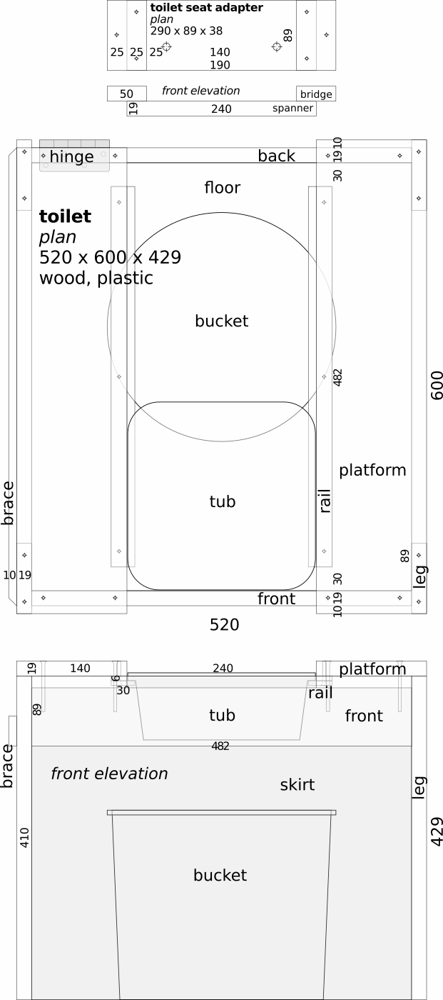

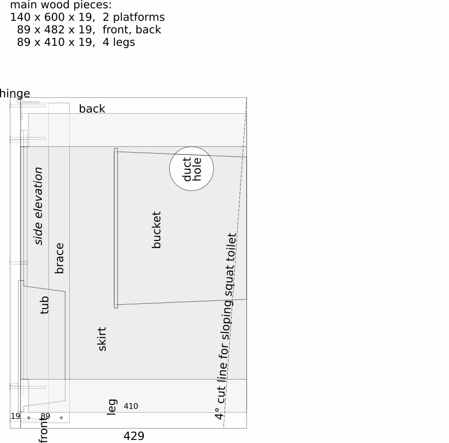

&nbsp; &nbsp; &nbsp; &nbsp; &nbsp; plan: toilet - [____download____](https://hygienicdarkretreat.com/img/plan/toilet.pdf)

&nbsp;

&nbsp;

#### build {#build}

1. frame
	1. cut boards
	2. measure, mark, and drill pilot holes (smaller than screw threads, about same size as screw shaft)
	3. join legs to front and back
	4. join platforms to them
	5. when shortening legs, allow at least 15- between top of bucket and underside of toilet. Tub requires more, of course. It must pass over bucket.
2. skirt (attaches inside frame)
	1. cut a strip of ~0.15- plastic, 2044 x 425 (leg + 15-)
	2. turn assembled toilet frame upside down
	3. coil plastic inside legs
	4. tape a short edge down the middle of a leg, upper corner level with end of leg
	5. fold 15- of lower edge onto underside of platform, taping it there with masking tape
	6. work your way around
	7. tape second short edge down same leg as first
	8. slit edge 15- between platforms. Tape resulting flaps over front and back with plastic packing tape.
3. Put a pan, tray, or a plastic sheet with towel or paper on top on the floor under the bucket to catch spills.
4. ventilation 
	- room's return duct attaches at hole in skirt for continuous exhaust
	- cut hole
		- next to a frame leg. Attach a wire or bracket to leg to support duct
		- 50--100- off floor
		- 20- smaller than return duct to fit over it snugly

#### options {#options}

1. toilet seat adapter
	- make adapter
	- attach toilet seat to it through 2 big holes
	- position adapter between platforms where comfortable. Seat should stick out 30-80-
	- drill pilot holes into platforms through holes in bridges
	- screw adapter into platforms
2. lifting platform -- it eases removal of bucket. Add brace to lifting side. Three types:
	1. hinged
		1. trim 10- from one platform at rear
		2. attach it to back with heavy door hinge, 76- or 89-
		3. drill one pilot hole in the middle of the other end, a little smaller than ~3- dia nail 
		4. shorten and round end of nail so it will stick out of platform 20-. Put it through platform.
		5. enlarge pilot hole in the frame so nail slides in it
		6. swing platform up to remove bucket
	2. removable
		1. use one nail as above at each end of a platform
		2. remove platform and set aside to empty bucket
	3. hinged adapter 
		1. use removable platform
		2. screw one bridge of adapter into it as usual
		3. replace other with heavy 76- or 89- door hinge
		4. toilet seat and removable platform swing up to remove bucket
3. slope
	1. for perfect balance when squatting
	2. trim 4° off legs as drawn, perhaps closer to platforms
	3. trim skirt at same angle
4. separating tub
	1. why:
		- unwetted poop smells the least
		- emptying bucket is less frequent and neater
	2. get ~3L squarish storage tub, ~240 x ~240 x ~80
	3. adjust platforms so tub drops between them
	4. attach rails
	5. tub slides forward to catch pee, back to catch bidet water. Empty tub into a pee bottle.
	6. emptying tub may be tricky in darkness. Thus the advantage of a wide single bucket that catches everything. See "simple big improvement" at beginning of toilet section. Or funnel, below.
	7. when sitting, tub only works for women. Men need clearance.

		For example, another bucket or a small plastic garbage can. Maybe cut away almost half of the top 100- leaving a backstop and the bucket's handle.

		Or a large funnel and tube leading to a large container below, perhaps through a wall. Restaurants discard 20L cooking oil bottles in boxes.

		Buy a funnel and attach a tube or hose. Or make one: cut the bottom off a large plastic bottle. If it has a spouted cap, remove sliding outer part and attach tube over inner spout. If cap is plain, drill a smooth hole in it. Put a small tube (8--15- ID) through it snugly.

		Put a smooth, floating ball over the drain to seal out odor. Screw funnel to front board near top edge, maybe hang it from the underside of (fixed) platforms with wire, plumber's tape, or a strip of the bottle's bottom that was cut away.

		A funnel that doesn't move is a lot easier to operate than a tub when a squatting, too. Bidet water falls in the poop bucket. Sawdust and paper absorb it.
		
### use {#use}

- put a layer of paper and 2L of sawdust in the bottom
- fill another bucket by the toilet with sawdust
- scoop 0.5L sawdust into toilet after each use
- place toilet by return vent, away from bed
- simple big improvement to system: when just peeing: 
	- use a vented [____pee bottle____](https://hygienicdarkretreat.com/report/2x3-day#mechanical-report). It works for men and adventurous women (or is adaptable)
	- pee into a small bucket and empty it into food scrap bucket. Sugar in food scraps neutralizes odor of pee. Could also works for emptying separating tub of toilet upgrade, below.

### compost {#compost}

- pour off liquid under trees and bushes
- dump solids in a covered compost pile bin
- dust it with dirt and cover with a 30--50- layer of carbonaceous material like leaves, straw, or sawdust	
- also put food scraps in pile 
- once full, seal it off for a year and start a second pile

It's that simple. I wrote more about [____composting toilets____](https://hygienicdarkretreat.com/blog/2024/02/compost-toilet) and bins to allay concerns and provide more details.

### paper upgrade {#paper-upgrade}

Finally attain cleanliness behind. Prevent abrasion, itching, and infection. How? Replace toilet paper with water. 

Graphic description:

- prepare
	- wash out a 0.5--1L soda bottle 
	- poke a hole through the cap near the circumference at an angle with a large sewing needle
	- fill bottle with water, cap it, put it near toilet
- paper
	- when finished pooping, remove most remaining poop with paper (any kind).
	- daub and lift it off, don't wipe or rub
	- put paper in bucket
- water
	- point hole in cap forward
	- hold bottle upside down behind your back
	- squeeze bottle and wet fingers of other hand
	- point stream at anus, wipe with one finger
	- use more fingers to finish cleaning
	- the big improvement over toilet paper becomes apparent at this point.
- finish
	- rinse off fingers
	- pat yourself dry with cloth or paper (not newspaper) and be happy
	
## bath {#bath}

### basic {#basic3}

A sponge bath.

### upgrade {#upgrade3}

- on waterproof floor or large plastic sheet, make a 2m diameter border of towels. Sit in the middle. 
- put warm water in 2, 1.5L soda bottles, with loose lids or nearly closed drinking spouts
- hold a bottle above yourself with one hand and wash with the other
- wipe up water with towels and squeeze it out into bucket
- hang towels to dry or give them to supporter

### deluxe {#deluxe3}

It's a portable shower! It provides a good shower with as little as 4-10L of water. It needs no connecting pipes. It collapses for storage.

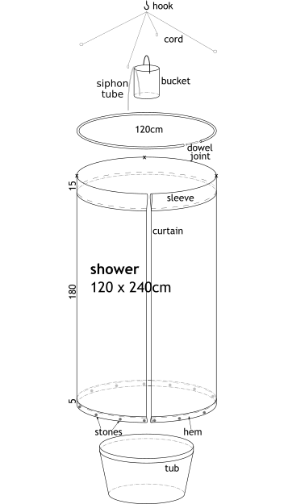

&nbsp; &nbsp; &nbsp; &nbsp; &nbsp; plan: shower - [____download____](https://hygienicdarkretreat.com/img/plan/shower.pdf)

{pagebreak}

**Parts**, top to bottom:

- hook (in ceiling)
- bucket or bottle (4-10L, hangs from hook by handle)
- siphon tube (polyethylene, 4 ID x 500, bent near its middle with heat to hook over rim of container)
- 4 cords (hung from hook, tied to curtain rod)
- curtain rod (common irrigation tubing, black polyethylene, 30- OD, circular, 375cm long for 120cm diameter, dowel inside ends for smooth joint)
- curtain (polyester or plastic sheeting, with 15cm sleeve for rod (as shown) or grommets and rings, 50- bottom hem with small river rocks inside to weigh it down)
- **x**=holes in curtain for cords to tie around curtain rod
- large tub (90L+, from garden supply store, catches everything at the bottom) or deep tray or pan.

Solar water heating method: nearly fill clear 4-8L bottles with water. Put rectangles of black plastic sheeting inside as elements. Put bottle in sun. Have supporter give it to you when warm. Or, with dark clothing and mask on tight, grab it from a sunny spot.

Adjust water temperature with cold water to suit yourself. Hang it from the hook. Suck on the tube to start the siphon action. Water flows for 8 minutes. Not bad. Dump used water into a 20L bucket with a lid for later disposal. Yes, all this is possible in darkness. I did it.

Adjust shower length and water flow with different size containers and tubes. Make sure hook can hold the weight.

~/~

That's the state of my art of low-cost, off-grid, DIY darkroom design and construction. As always, the principles involved (like, water flows downhill) are infinitely adaptable. Check back for the latest developments. If you design something simpler, faster, cheaper, more effective, or more elegant, please let me know. See [____open-source____](#open-source) _-e_.

~/~

That's also the end of the body of my book. Thank you for reading. I hope it helps you find yourself, recover your health in body and soul, feel joy, be successful in all ways, and be free of crime.

{backmatter}

-# back

&nbsp;

&nbsp;

&nbsp;

_s_ &nbsp; faq  
_t_ &nbsp; bibliography-influences  
_u_ &nbsp; acknowledgments  
_v_ &nbsp; participate  
_w_ &nbsp; license  
_x_ &nbsp; services  
_y_ &nbsp; bio
_z_ &nbsp; links

# _s_ &nbsp; faq {#faq}

## mechanics {#mechanics3}

<!-- - **I don't read books.**

No worries. The breakfast cereal will be out soon.

- **I only read fiction.**

Some people view this book as fiction. Think of it as a story you can enter and try. That's when it really picks up.
-->
**1 - Where can I go for a hygienic dark retreat?**

I offer [____retreats____](#retreat) _-x_ in America. My collaborators, [____Marion Abbott____](https://profoundrest.wordpress.com) of Australia and Simen Kirkerød of Norway are preparing to.

None of the other 130 dark retreat providers support hygienic retreats. None can. Hygiene is a total commitment. It doesn't mix with other ideas. It is exclusive. Pure truth belies everything else. By the time someone opens a darkroom, he already has a philosophy, program, and business model. His investments in them have become too big to change.

This is why I wrote the last five chapters of this book. Use them to make darkness in your own home for sleeping, then for a 5-day retreat, and so on, up the [____ladder____](#ladder) _-4_. The hygienic darkrooms of the future will come from us.

&nbsp;

**2 - I suffer from X. Will this help me?**

Yes. Chronic suffering, whether psychic or physical, results from psychic trauma. The psyche heals itself of trauma in darkness. Therefore, symptoms of X will heal in darkness. Your suffering will decrease and eventually disappear. You will become better able to deal with causes that still need attention after retreating.

In your first retreats, you get a taste of these things. You realize them fully in later retreats. Meanwhile you get relief, a little healing, a new vision, and hope. The distress of hopelessness aggravates many problems.

&nbsp;

**3 - Do you eat in a dark retreat?**

Yes. Food and water are always available. I recommend fresh fruit and tender leafy green vegetables. This accords with the frugivorous nature of human anatomy and physiology.

Fasting is part of hygiene, too. It is compatible with darkness. But wait on it till psychic issues are handled in darkness.

&nbsp;

**4 - How many people retreat at once?**

One. The point of this retreat is to rest, heal, and recover oneself. Nothing is more stimulating than other people.

&nbsp;

**5 - How do you do things in darkness?**

Slowly and smoothly. First, become familiar with the room in light. Make memorable places for your belongings. Practice doing everything blindfolded before turning out the lights. Then do them in darkness. Always hold your arms in a circle in front of yourself when standing or sitting. This protects you from hitting your head.

&nbsp;

**6 - Could you just retreat with a mask?**

No. No mask stays in place, so light leaks in. No mask is comfortable in extended use. The skin has enough light receptors to awaken one from sleep.

Then one still needs a properly ventilated room, minimally furnished to eliminate dangers, distractions, and associations. Ventilation is harder to arrange than darkness. My [____double blind____](#double-blind) _-10_ and [____door seal____](#door-seal) _-10_ make darkening a room easy. Every reason to darken the room exists.

Sleeping masks are good for travel, naps, and sleeping until your bedroom can be darkened. Also, for walking through a semi-lit space between a darkroom and a bathroom in dwellings where this is necessary.

&nbsp;

**7 - Is it like meditation?**

In essence, no. Superficially, yes, they are is similar. Each involves less physical activity. Attention turns from the world to oneself. But what goes on inside oneself radically differs.

Meditation is active, ie, the will drives the process. Will is primary to meditation. The instant it relaxes, the process stops. The purpose of meditation is to make the unconscious conscious, or to compel the conscious to submit to a higher consciousness. It is a quiet, internal war. 

Hygienic retreating is passive, ie, the unconscious drives the process. Autonomic activity is primary. Willed activity is secondary. The will is a servant of life. The purpose of retreating is to rest so the being can restore itself to wholeness naturally. It is peaceful. 

These subtly different drivers and purposes have massive effects on one's experience and results. As extraordinary as the process and results of meditation and spiritual practice seem to be, they pale before the power of the autonomic self.

## concerns {#concerns}

**1 - Is total extended darkness safe?**

Yes, if you do it correctly. This is uncomplicated. Dangers are easily avoided if you know what they are. I have identified a handful of them. See my [____warning____](#warning) _-4_.

&nbsp;

**2 - I feel afraid of this.**

Fear of darkness comes from assuming the conscious self leads a retreat, like it does so many other things. But you are not conscious of what awaits you in darkness or how to handle it. 

Your unconscious self, on the other hand, was born in the dark. It knows everything there. It can handle everything. As you learn that it leads a retreat, and you see how to support and follow it consciously, your fear will dissipate.

Your unconscious is your champion. It will protect  you from everything. It will only show you what you need to know and only when you able to know it.

Sometimes this may feel bad—as bad as what you face in daily life. But it may be the last time you have to face it. Your unconscious will have resolved the core of it before revealing the part concerning your conscious.

I am sure you would like to be free of such repetitive troubles.

Overemphasizing the conscious is the essence of our lifeway. It's the air we breathe. So we even try to consciously direct unconscious activities. This is what exposes us to danger. Living in fear results.

Consciously supporting unconscious activities with normal conditions is the safe and sane approach. Hygiene embodies it. It banishes fear.

I make this distinction in various ways throughout this book. Reading it helps you find the place of your conscious in the process and leave fear behind. 

See also objection #1, below.

&nbsp;

**3 - Wouldn't you go crazy staying in darkness that long?**

No, you would only go crazy in darkness from being _forced_ to be there, as in prison. A retreat is a choice based on reason. You and your supporter each have a key to the door.

You don't go crazy in darkness. You are already crazy. You heal from it in darkness. Craziness becomes more apparent in darkness as the organism heals from it. 

This can be uncomfortable, painful, even alarming, like the traumatic causes of craziness. But simply having feelings is not dangerous. The room is safe and comfortable. Supporters are at hand. There is nothing to fear. See concern #2 about fear.

&nbsp;

**4 - Do you get bored?**

Yes. It is a very good sign.

Part of the being is so damaged, painful, and draining that all feeling to it has been shut off. It is like an internal black hole. Boredom means the unconscious is approaching it to resuscitate it. Recovery of a lost part of yourself is imminent.

&nbsp;

**5 - Five days is a long time to do nothing.**

You're talking about idleness. That is an activity, not rest. Darkness is different. 

We've been told being idle is bad. Being productive all the time is offered as the virtuous alternative. This tends to discourage rest and encourage overwork and over-consumption. Enough, already. 

Moreover, we've all spent more than five days doing destructive things. Doing nothing would have been a big improvement. The secret benefits of profound rest would have been much better still. 

Civilization teaches that the will is the only useful driver of activity in the being. We are bad if we are not busy. Only doing things by willful effort is respectable.

In fact, one would be poisoned to death by his own internal waste in seconds without autonomic activity. The will is helpless to restore psychic integrity, every animal's greatest value. Tissue knits itself back together involuntarily. The autonomic self is infinitely intelligent, capable, and graceful. 

It also makes you interesting. You rediscover this in darkness. You have lots of time to get to know yourself. 

Everyone is nervous about this at first. It is like meeting someone special again. Gratification soon comes from doing the right thing. After days of delicious sleep and time to themselves, most wish they could stay longer.

Maybe you mean it sounds pointless or dreadful. In fact, a retreat often begins with a sense of relief. Discomfort usually comes after resting, when you are prepared. You make contact with your autonomic self again to draw on its resources. This is extremely meaningful, enjoyable, and fruitful.

## objections {#objections}

**1 - I could never do a dark retreat.**

At the moment, your doing a retreat is out of the question. You cannot do it if you don't want to. You cannot want to if you don't believe in it. And you cannot believe in it if you don't know enough about it for it to make sense to you. So forget about doing it. The only thing that matters is, does it interest you enough to learn more about it? If so, then I can recommend a good book about it.

&nbsp;

**2 - Why must I read a whole book just to retreat with you?**

You must read it so you know how to do it, want to do it, are able to do it and will do it and succeed at it.

If you do not read it, you will not be able to do it. You will fail and cause me more problems. I will not help you fail or suffer your complaints when you do.

Knowing how to do it includes knowing:

- how not to do it
- how to counter lifelong conditioning to fail at it (which all of us receive in this lifeway).

Hygiene especially depends on your knowledge of it to work. Without knowledge, you will have no understanding, belief, motivation. So you will not do it or do it correctly. So you will fail. Unlike in medicine, there are no mentally passive hygienists.

There is no better way to learn about hygiene and hygienic dark retreating than to read my book. It is better than talking to me. It is a concentrated, pure form of my knowledge. It is complete. I could talk for years and not say everything in the book, which you can read in 6 hours.

When you read it, you also show me that you are serious. I only want serious clients. They only want the real thing. They know why a retreat with me is _it_.

&nbsp;

**3 - Isn't total darkness unnatural? Shouldn't we be exposed to stars and moon at night?**

No. First, our natural habitat is tropical forest. Its dense canopy makes the forest floor perfectly dark at night. Even when sleeping in the open, the amount of light from stars and moon is surprisingly little compared to artificial light. Which now bombards us nearly everywhere.

Second, covering our eyes, seeking solitude, and taking cover when traumatized is a reflex. Taking extended shelter in darkness merely supports this reflex when the trauma is great. The sheltering instinct intensifies with trauma. The only way to condition us out of it is by force.

Large uncovered windows came to popular architecture very recently. Traditional shelter, civilized and indigenous, is dark or easily darkenable. Traditional people also spend more time outside in the bright sun.

Our obsession with building---the principle activity of civilization for 13,000 years---indicates a natural need for extreme sanctuary to self-heal from cataclysmic trauma. When we get especially frustrated, we even have wars, destroy countries full of buildings, then build new ones. Nothing could be more natural to us in our damaged state than extended total darkness.

&nbsp;

**4 - This sounds Satanic.**

Some Christians I have met have attempted to equate physical darkness with the spiritual darkness the Bible speaks against, and is thus Satanic. 

Taking metaphors literally is just what rational people mock fundamentalists for. It would also mean that physical light is spiritual light. This amounts to sun worship... which is itself Satanism. It shows how stupidity, at some point, becomes evil.

Satan lies about everything. The defining lie of Satanism is that salvation comes by work. Jesus said that salvation comes only by grace, not works. The idea of hygienic dark retreating is that healing (a kind of salvation) comes by rest. Rest is the opposite of work and a corollary of grace.

Does the Bible tell of something bad that happened due to someone's extended stay in darkness? Does  it warn against extended rest in physical darkness? If so, I'd like to know it.

The Bible does tell of extremely good things that happened during or immediately after extended stays in darkness. I demand explanations for them. For example, Elijah in the cave, Jonah in the whale, Lazarus and Jesus in their tombs—not to mention the creation of the world and prayer in closets.

Myself, I began to sense Christ during my dark retreats. If darkness were evil, it should have driven me further away from that sense. It should have inclined me toward greater evil. The opposite occurred.

The psychopaths I have met, including some Christians, hate and fear darkness. I think _the One_ they serve fears it, too.

The God of Psalm 139:13 fears nothing. “If I ascend to heaven, you are there; if I make my bed in Sheol, you are there... Even the darkness is not dark to you.” King David was capable of using two different senses of the same word in the same sentence. Like most of his readers, you probably can, too.

&nbsp;

**5 - Extended darkness could be good for some people, but there are many ways people can heal their suffering. Nothing works for everyone.**

There are many ways to gain temporary relief. Some can help one cope with the worst part of his suffering. That is good. It enables him to catch his breath and survive. With lowered stress, the organism does heal a little.

But no significant recovery occurs. It is merely acceptable or maybe impressive by our lifeway's low standards.

For all living functions, nature provides single universal conditions and specific combinations thereof. Physiology doesn't provide options to suit one's tastes. We're not talking about which color to paint a house.

To breathe, one must have air. To heal from major trauma, one must have darkness and associated conditions of profound rest. These solutions have no substitutes. They are available everywhere and work for everyone, even other animals. Physiology is what it is. Post-modernist dogma doesn't alter it one whit.

We can look at it in the negative as well. If this tired statement were true,

- the "many other ways to heal" would make sense and work
- those who did them well them would now be ok
- everyone would have every reason to do them asap
- all the problems we face today would already be solved
- the deep healing necessary in cases of cataclysmic trauma could occur without profound rest
- profound rest can occur in semi-darkness and other compromised conditions
- or psychic trauma is not the primary cause of metaphysical suffering
- or life has no specific needs for recovering from such pain. It is all random. And this is true despite:
	- its specific and universal need of rest for recovery in all other cases. 
	- its specific needs of water for quenching thirst, air for breathing, etc
	- suffering's being an indication in all other cases that something is wrong and needs attention
 
Evidence shows all these are false. Relativism makes fashionable philosophy but poor biology. Repeating it changes nothing. 

Reality is what it is. It is not what they said it was in college. They defrauded you of a lot of time and money. It is not too late. Cut your losses.

This will be easier when you have a replacement for the collection of poisonous delusions ruining your life. See my [____bibliographies here____](#bibliography-influences) _-t_ and [____here____](https://hygienicdarkretreat.com/other/bibliography) for a rehabilitative course of study.

&nbsp;

**6 - If hygienic dark retreating is so great for healing, why are you still sick?**

Complete healing through profound rest in darkness requires full application of this method. This, in turn, requires a team, a proper facility, and a complete method. 

I had none of these. A complete method had to be developed from a basic idea. This took 11 years of experiments and reflection. In my trials, I made the damaging error of ([____over-loss____](#false-capacity) _-1_). I was using up my reserves.

I do claim that, by resting in darkness, I was saved from suicide twice. I am healthy compared to a corpse. And my attitude about fixing fundamental problems in life is among the healthiest in the world.

This book is not just about what I have done. It is also based on what I have glimpsed from the furthest edges of experience while in darkness. It is up to you to reason it through and decide for yourself whether you will try it or not. I and my condition do not substitute for your own judgment.

It is natural to be curious about my condition. It is fallacious to dismiss my thesis because of it. Ad hominem is especially popular these days. But refuting my thesis requires addressing it point by point on its own terms. So far, no one has succeeded.

&nbsp;

**7 - I'm skeptical / I have doubts about this / I don't believe it.**

[____Yourfallacy.is/personal-incredulity____](https://yourfallacy.is/personal-incredulity). Disbelief is not an argument. 

Baseless doubt is just as irrational as baseless belief. Baseless means _arbitrary_: without evidence in the particular case. 

Skepticism pretends to be rational and scientific. But it is arbitrary. By its own admission, it is without evidence. Arbitrary statements are to be rejected out of hand. 

But let us go further.

Until you name the flaw in the argument, you have no grounds to object. Sophistry is an evasion amounting to concession. Then, if you believe you are a serious person, you are obliged to replicate the experiment. If you don't, it shows you are not serious.

You have no reason to doubt. The most you can say is, I don't know. Or, I'll have to read or think more about this. Without knowledge, you cannot reasonably decide one way or another about it.

Maybe you are saying I'm lying. Or delusional. Or that the logical and predictable results of using darkness restfully don't exist. But then how do you know? Merely because it contradicts your view?

Probably, you are just afraid. But fear, discomfort, or unfamiliarity with an idea is not a reason to reject it. What are you afraid of? Do you know? 

Baseless doubt is a manifestation of unconscious denial resulting from unhealed major trauma. It proves the very thing you are attempting to refute by it. It confirms everything I have asserted. It utterly vacates your contention. And it binds you more tightly to the necessity of trying darkness.

# _t_ &nbsp; bibliography and influences {#bibliography-influences}

#### anthropology, history {#anthropology-history}

- Jim Woods at Herrett Museum, Twin Falls (with thanks to Janie Brumbach, RIP)
- _The Songlines_, Bruce Chatwin
- _Earth in Upheaval_, [____Immanuel Velikovsky____](https://www.velikovsky.info)
- _Ishmael_, [____Daniel Quinn____](https://ishmael.org)
- _Where White Men Fear to Tread_, [____Russel Means____](https://www.russellmeansfreedom.com)
- [____Prosper Waukon____](https://bit.ly/prosperwaukon), Winnebago entrepreneur and ambassador
- _Running on Emptiness: The Pathology of Civilization_, [____John Zerzan____](https://www.johnzerzan.net)

#### psychology {#psychology-b}

- _The Continuum Concept_, [____Jean Liedloff____](https://continuum-concept.org) (also anthropology)
- _Summerhill_, A S Neill, genius British headmaster
- _Magical Child Matures_, [____Joseph Chilton Pearce____](https://joseph-chilton-pearce.com/) and [____here____](https://ttfuture.org)
- _Birth Without Violence_ Frederick Leboyer
- _The Primal Scream_, Arthur Janov
- _Mass Psychology of Fascism_, Wilhelm Reich
- _Fury on Earth_, Myron Sharaf, biography of Wilhelm Reich 
- _Pleasure_, Alexander Lowen, student of Reich
- _Banished Knowledge: Facing Childhood Injuries_, Alice Miller

#### philosophy {#philosophy}

- my parents, John and LouAnn, and brother, [____Paul____](https://blacklabworld.com)
- _Atlas Shrugged_, etc, Ayn Rand, preceptor
   - [____Tantric Hinduism____](https://www.hohmpress.com/products/the-alchemy-of-transformation) with my former guru, [____Purna Steinitz____](https://goo.gl/dEcMwg)
- [____*In Search of the Miraculous*____](https://hygienicdarkretreat.com/f/search.pdf)\*, PD Ouspensky (GI Gurdjieff's basic teachings)
- The Bible as law, with DeWaynn Rogers (late legal counsel, enigma, and possibly Teacher of the Age)
- Christianity, the Bible as it is, and Satan's rule of the world in [____"Total Onslaught"____](https://adtv.watch/series/total-onslaught) video series on YouTube, Walter Veith
- [____Dr Bill Warner____](http://politicalislam.com), master exposer of Islam
- [____*Our Universal Journey*____](https://ourjourneyhome.earth), George Kavassilas + [____YouTube interviews____](https://youtube.com/playlist?list=PLV75wDOASk_eAijH1idZyya3AE7RmwbG1)
- animism from nature, books (above, especially by Quinn), elders (scoutmaster Jack Asher; godfather and mentor, [____John Boyer____](https://www.facebook.com/boyerjewelry/)), extended family, and friends

#### health {#health}

- my parents, always keenly interested in diet and health
- hygiene
	- initiated into hygiene by [____Frederic Patenaude____](https://fredericpatenaude.com), author of _The Raw Secrets_, which I edited and co-published.
	- _Do You Really Need Eyeglasses?_, Marilyn B. Rosanes-Berrett
	- _Fit for Life_, Harvey and Marilyn Diamond
	- [____*Science and Fine Art of Natural Hygiene*____](https://hygienicdarkretreat.com/f/hygiene.pdf)\*, Herbert Shelton
	- _The 80/10/10 Diet_, [____Dr Douglas Graham____](https://foodnsport.com)
- _Introduction to Human Technology_ and _Human Technology_, William Arthur Evans (thanks to friend, Sterling Voss, for finding this rare work)

#### design, art {#design-art}

- my parents and brother
- grandelder and grandmaster craftsman and engineer, [____Jack Nuckols____](https://rockcreekmetalcraft.com)
- childhood schoolteacher, Steve Parks (Horizons School, Twin Falls)
- accompanist and mentor, [____Willetta Warberg____](https://bit.ly/willettawarberg)
- mentor, John Boyer
- _The Dark is Rising_, Susan Cooper
- _The Romantic Manifesto_, Ayn Rand (indispensable!)
- _Design for the Real World_ Viktor Papanek
- _BuckyWorks_, Jay Baldwin (about Buckminster Fuller)
- _The Natural House_, Frank Lloyd Wright
- _Selected Poems_, Robert Bly 

#### experiences {#experiences}

- 1 week of peaceful society at Sawtooth Methodist Church Camp, Idaho, Joanie Williamson, director, 1985
- 3 months enraptured, Idaho, 1987
- 23 days fasting in California desert, 1991
- hundreds of hours since 1986 in conversation with mentor and godfather, John Boyer, jeweler, especially 1991-93, Idaho
- 1 week of fresh, rich society at Rainbow National Gathering, Idaho, 2001
- 56-hour dark retreat, supported by Harold, Oregon, 2006
- 10 days in audience of Advaita master, [____Arnaud Desjardins____](https://arnauddesjardinsdvds.com), Montana, 2007
- 8 seconds in dreamtime, with Adrian Wolfe, Oregon, 2008
- 18 months with the Maya of Lake Atitlan, Guatemala, 2011
- 2 months of life-altering sex, Sweden, 2012

# _u_ &nbsp; acknowledgments {#acknowledgments}

Thanks to hundreds of people in a dozen countries on 2 continents for over 3 decades, who morally and materially aided me during my prodigal search, especially my Norwegian...

### editors {#editors}

...for heroic efforts to make this book real. In its triage, you were as merciful as you could be:

- Are Solheim, writer and fellow refugee in darkness, for seeing and believing in me and the book, for visionary editing, hosting me during the rewrite, and your compassion for mankind, even me
- Magnus Vanebo, philosopher, for enthusiastically diving into the text and sensitively editing it
- Also, Bertrand Besigye, famous poet and fellow journeyman in darkness, for early support of the book

### collaborators {#collaborators}

- Marion Abbott, for friendship, overflowing transworld conversations, and constant in-the-trenches support starting 2016
- Simen Kirkerød, friend, host, serious retreater and observer, with loads of ideas and help since 2013
- Johan J&auml;rlind: investor-partner, retreat supporter, confidant, and friend in critical years 2012-13. You gave me so much, I'm speechless except... thank you.
- Chrissy Weisgard: friend, host, client, morale-booster since 2009

### family {#family}

Immediate, extended, and adopted: I leaned on all of you that would let me. It can't be easy rearing a stubborn 20, 30, then 40 year-old psychotic child in defiance of a world that denies everything real. Thanks, especially, to:

- Brother Paul, for shelter and guidance you should never have had to give
- Grandmother Anna Lou Craig Callen Posey, always there. RIP.
- Brother Francois, for constant experience of love
- Cousin Christopher, for your generosity and grit
- Uncle Jim---dropout, drug dealer, beach bum, dumpster diver, Mexican pastry lover, loser, cool-ass mofo---for laughingly giving the system the finger till the day you died. RIP, man.
- Trimurti: my second family, torn away as soon as I noticed, for helping further raise me

### influences {#influences}

...for friendship, support, and/or raising the bar so high that anti-gravity boots became necessary. And especially my elders: 

- Jack Nuckols: a giant and first among my elders, you showed me how to make what I wanted. You stuck around and watched over me till I found my way. RIP.
- Willetta Warberg: you poured your heart and soul into me through your piano, kindness, and huge personality. RIP.
- John Boyer: you fed me with so much of your _time_.
- DeWaynn Rogers: you helped me get up, push back, and stay out of the system's clutches. RIP.
- Purna Steinitz: you destroyed my sentimentality and kept your terrible promise.
- Harold: you showed me my job.

Each of you gave me the world.

### old friends {#old-friends}

- John Roberts: lifelong friend, biggest supporter, and host
- Danny Meulbroek: guardian, supporter, and host extraordinaire 
- Evelyn Thomas and Sterling Voss: supporters, fellow investigators and survivors 
- Ian Robertson: for the life-ring of rationality when it mattered most

### since darkness {#since-darkness}

- America
	- Crea Egan for helping Harold begin with darkness, thus opening the door for me.
	- Rob Miller, Malia Shultheis, and Jen Carroll: supporters and early retreat hosts
	- Brian Sullivan: early collaborator, who gave first help in developing these ideas and, as always, trying them out
	- Jesse King, John Monroe, and Elisabeth Goward, Dome Villagers at Maitreya Ecovillage, Eugene: camaraderie and support
	- Blanche Colson: for getting me started in commercial window coverings for darkrooms. Of course, it was cardboard.
	- [____Hannah Christina Torres____](https://hannahtorres.massagetherapy.com) for the second window covering idea
	- Daniel Tucker and Les Stitt, then Ben Ramsey and Stephanie: for KCMO shelter
	- Frank Cicela: supporter since 2002
	- Brad Crutchfield: friend, always-interested supporter, and deep well-wisher
- Guatemala
	- The Maya: for your friendship and unshakable presence
	- Niels Gronau: for your miraculous Guatemalan facility
	- Elena Rago: friend, neighbor, and provider of an experimental facility
	- Karsten: friend, neighbor, supporter, client, and for lending me tools and a workshop where such things are rare
	- Tom Savage: friend and supporter
	- Sandro Garcia, Nancy Martin, and Violet: heroic friends, hosts, supporters, retreaters
	- Joshua Brang and Nadja: friends, supporters, and (Josh) travel agent
	- my clients: for exploring darkness with me
- Europe
	- Kostas: fast friend, host, and shepherd from Athens to Thessalonika
	- David Friman and Erika Hedstrom, for shelter and space to test darkroom design
	- Oscar, Limme, and Max at Kulturforeningen Gryning of Helsingborg: friends, hosts, and supporters. Cheers!
	- Anna Ericksson: supporter and darkness experimenter
	- Sanna Aatig: friend, supporter, host, and nurse in my darkest days
	- &Aring;sa Ringstrom and Johan L&ouml;rne: friends and supporters
	- Richard N&ouml;jd for hard-won darkroom design ideas
	- A woman, unnamed, who initiated me in an essential part of my lost self, leading to the [____conclusive test____](https://hygienicdarkretreat.com/report/2x3-day/) of this idea
	- Marcus Ivarsson and Emma Sofie Berg: connectors
	- Stisse and Carina Gilgren: Swedish godparents
	- The people and place of Skattungbyn, Sweden 
	- Dr Anette Kjellgren: for unqualified, professional encouragement
	- Oscar Nelson for the donation that sustained me and the book for a dark winter
	- B&aring;rd Anders Lien, friend, host, sponsor, apprentice _and_ guide in Oslo
	- Terje Tjensvoll, supporter, host, collaborator, and guardian
	- Elisabette Molin: friend, host, and champion retreat supporter
	- Astrit Gashi, friend and host
	- Ketil Berg, friend, host, sponsor, treasurer extraordinaire. Without you, 2015 would have been very hard to survive. RIP
	- Marie Richert and Virginie Bournaud, friends, hosts, sponsors, and guides in Paris
	- 40 contributors to my 2016 crowdfund to support a 21-day retreat. One day, success.
	- Aimee Fenech and TomTom, friends, hosts, helpers, and mentors in Spain
	- Jan and Thomas Hermann, hosts in La Alpujarra proper 
	- Mary Salama back home in America, for proof-editing this book in 2018
	- Lougaya and J. for support and for trying and making darkness wholeheartedly.
	- Jan Hlavacek, Stepanka Trenz, Martin Pokorny, Petr Vesely, Katerina Cervena, Honza Dlabal for showing me dark retreating in Czech Republic
	- Pavel, Cestr family, Jarda and Jana, and my other neighbors in Czech Republic, for such great peace, kindness, and respect

### end {#end}

I called some people here guides, but anyone who hosted me also guided me. I've needed a lot of help for a long time. Everyone on this list put a lot of time and energy into me and my work.

I also made enemies and hurt some people along the way. To the good people: I'm sorry it didn't go the way we thought at first. Here's hoping it was not in vain. To the evil people: may you find peace, either in the destruction you crave or through unprecedented regeneration.

Onward, then, till the task is complete.

# _v_ &nbsp; participate {#participate}

Join the dolphin economy: help me help you help me help you...

### how {#how}

- read
	- my book and retreat [____reports____](https://hygienicdarkretreat.com/report)
	- Herbert Shelton's masterwork,  
		[____*Science and Fine Art of Natural Hygiene*____](https://hygienicdarkretreat.com/f/hygiene.pdf)\*
	- other books in my [____bibliography____](#bibliography-influences) _-t_
- apply
	- darken your room
	- retreat according to this method at home or at a center
	- climb the [____ladder____](#ladder) _-4_
- interact
	- [____send____](#contact) _-x_ me a question or comment
	- report on your retreat online and send me the link
	- join my Telegram [____study____](https://t.me/darkroombookstudy) and [____makers____](https://t.me/darkroommakers) groups.
- engage
	- tell me about spelling and grammatical errors you find in the book
	- [____improve____](https://github.com/yodrew/yodrew.github.io/issues) the website and designs
	- improve the method (see below)
	- publish the book; see [____license____](#license) _-w_
	- invite me to [____speak____](#speak) _-x_ at an event
	- do something not listed above, perhaps something only you know about or that we could develop together
- support
	- [____buy____](#write) _-x_ the book after reading if it has been beneficial
	- hire my [____services____](#services) _-x_

### improve {#improve}

If you find a theoretical or practical error in the approach, or a way to improve it, please let me know. I am happy to alter the book if your proposal:

- presents a rational argument
- remains consonant with hygienic principles
- includes clear reports of your own reproducible experiments with the current method
- is offered courteously

Likewise, I would like to work with you in any way to develop hygienic dark retreating and advance its cause if you:

- have read my book 
- demonstrate understanding of its basic ideas
- have retreated according to my protocol and are convinced of the value of my approach

Cheers.

# _w_ &nbsp; license {#license}

Welcome to the political-economy of _cool_. Here, you get rewarded for cooperating, not punished if you don't. 

1. [____Copyleft____](http://wtfpl.net) 2009-2015 by [____Andrew Durham____](https://hygienicdarkretreat.com/). Copying is an act of [____♥____](https://copyheart.org). Write me for a print-worthy pdf. Please copy, distribute, and sell (yes, _sell_) this book in its entirety or its industrial applications, ie, darkroom components, in any media or business venture for your own personal gain.
2. I would like credit where due, so I will recognize and link to you on this site if you:
	1. credit me for a quotation or excerpt and tell me where it appears
	2. share suggestions for text or designs by making pull requests or opening issues in my [____github repo____](https://github.com/yodrew/yodrew.github.io), or sending [____email____](#contact) _-x_
	3. include this license in your partial reprints of my work and with instructions accompanying components
	4. include a printed or electronic copy of this book with components (a link is sufficient)
3. Furthermore, I will also give you my [____endorsement____](https://questioncopyright.org/creator_endorsed.html), a visible mark to use in your marketing copy if you: 
	- share with me part of your earnings from:
		- reprints of my writings
			- print: 8% of retail price
			- ebook: 70% of proceeds
		- reproductions of darkroom components (1% of retail price)
	- and/or somehow astound me

	See [____pay____](#pay) _-x_ for how to send me money.

	This means you can instantly become my publisher or manufacturer. These deals roughly equal what you and I would make if I were published or self-published and you were simply selling the books, yet without your having to order from me in bulk, pay shipping, keep legally complicated records, or sign a contract. 
	
The idea is to make the book and components available with minimal friction in every way, at every level of distribution. Then we all can retreat asap and make reasonable livings as we go. If anything about this license seem to conflict with these goals, please let me know.

We now possess the means of recovering the whole self, the source of all wealth. It will eventually make money irrelevant. Meanwhile, this is a structure in which we can make a living, have a good time, and be cool while doing it.

# _x_ &nbsp; services {#services}

I do everything related to hygienic dark retreating: study, experiment, write, speak, consult, design, build, operate, support.

I do nothing related to active approaches to dark retreating: spiritual, therapeutic, or psychedelic. 

Find more information on everything below in my [____store____](https://hygienicdarkretreat.com/store).

### retreat {#retreat}

- I support retreats in person at my place or yours. They are 11 days: a [____9-day Czech____](#czech) _-4_ retreat + 2 buffer days. 

	The process is to read, [____confer____](https://hygienicdarkretreat.com/store/confer), [____enroll____](https://hygienicdarkretreat.com/store/enroll), book, and retreat.
- I support retreats remotely. This also begins with reading and conferring.
- If you plan to retreat on your own, I can confer with you about your questionnaire by email and phone.

Marion Abbott of Australia at [____Profound Rest Retreats____](https://profoundrest.wordpress.com) is also organizing retreats. Simen Kirkerød of Norway can do it, too (write me).

### write {#write}

- get this book
	- [____online____](https://hygienicdarkretreat.com/): free.
	- as an [____ebook at leanpub____](https://leanpub.com/hygienicdarkretreat). $15+.
	- in paper, inscribed/signed by me. Handsewn, lay flat, cloth-bound paperback stays open for ease of holding and reading. It even bends back on itself. Matching, searchable, hyperlinked PDF included. $55 North America, $75 abroad. Pay below. Add a note or email me with mailing address and inscription request. <!---->
- see [____writing____](https://hygienicdarkretreat.com/store#write) for opportunities to publish, quote, or have me write for you.

### speak {#speak}

Invite me to speak to your audience. $1000 + expenses.

### consult {#consult}

Get my advice on hygienic dark retreating, building hygienic darkrooms, and issues arising thereof. $40/hour.

### design-build {#design-build}

I design and build darkrooms as part of supporting retreats in existing buildings or from scratch. $40/hour + I may use it once for a 9-day retreat. 

See my [____hygienic house____](https://hygienicdarkretreat.com/plan) for some of my latest thinking.

### pay {#pay}

I accept payments by:

- Zelle: info@andrewdurham.com
- [____Wise: andrewd1878____](https://wise.com/share/andrewd1878) (formerly Transferwise)
- [____Venmo: @andrewdurham____](https://venmo.com/u/andrewdurham)
- [____PayPal____](https://www.paypal.com/ncp/payment/KRPFPSXEFEUE4) (works for credit cards. Add 3% to cover fees)
- Cryptocurrency: Litecoin, Bitcoin, Ether, Dash. Write me for addresses. 
- Cash, check, money order, metal, Goldbacks, bank transfer, deposit, commodities, etc: email me. Include your location.

### contact {#contact}

- email: info@andrewdurham.com 
- text/voicemail: +1 541 210 8470 (in the US) 

[____hygienicdarkretreat.com____](https://hygienicdarkretreat.com/)

# _y_ &nbsp; bio {#bio}

Born 1971, Twin Falls, Idaho. 

My family and elders trained me to think and to make things. We constantly discussed philosophy, health, design. They became my main interests. 

Music was the air we breathed. My brother, Paul, carries that torch.

At 16, [____joy overcame me____](https://hygienicdarkretreat.com/conjecture/rapture) for 3 months. It inspired me to independently investigate its cause full-time for 21 years using my interests. A little autistic, I can focus obsessively and extrapolate correct conclusions from little data.

I tested my findings while traveling America. I lived outside, with friends and relatives, and in small groups. I played music, did odd jobs, and built alternative shelters.

In 2008, I discovered darkness as the means nature provides us to heal from trauma, the cause of our strange suffering. Out of this came the [____*darkness conjecture*____](https://hygienicdarkretreat.com/conjecture/)\*, the concept of the restful use of darkness in support of the self​-healing psyche. It became my purpose. Since then I have:

- designed, built, and upgraded darkrooms (30 in America, Guatemala, Sweden, Norway, Spain, and Czech Republic, consulting on 4 more, all in 4 climates on 4 continents)
- retreated (27 times, from 2-7 days) and supported retreats (30)
- given talks (14) and consulted for readers worldwide
- refined my work, documenting it at [____hygienicdarkretreat.com____](https://hygienicdarkretreat.com/)

[____Proof of concept____](https://hygienicdarkretreat.com/report/2x3-day) came in 2013. I rewrote the conjecture as this book. Development of the model of hygienic dark retreating ended in late 2019. All details of theory, protocol, and design were worked out. It became a practical solution. The phase of application of the solution began.

&nbsp;

~/~

&nbsp;

[____contact info____](#contact) _-x_

# _z_ &nbsp; external links {#external-links}

§: hygienicdarkretreat.com

#### notes

underlined - [§/](https://hygienicdarkretreat.com/)  
*italicized* - [foodnsport.com](https://foodnsport.com)  
*asterisked* - [§/f/hygiene.pdf](https://hygienicdarkretreat.com/f/hygiene.pdf)  
hygienicdarkretreat.com - [§/](https://hygienicdarkretreat.com/)  
hygienicdarkretreat.zip - [§/hygienicdarkretreat.zip](https://hygienicdarkretreat.com/hygienicdarkretreat.zip)  

#### introduction

Science and Fine Art of Natural Hygiene - [§/f/hygiene.pdf](https://hygienicdarkretreat.com/f/hygiene.pdf)  
John Zerzan - [johnzerzan.net](https://johnzerzan.net)  
reports - [§/report/365-day-yogi](https://hygienicdarkretreat.com/report/365-day-yogi)  
Frederic Patenaude - [fredericpatenaude.com](https://fredericpatenaude.com)  
Wow - [§/report/five-darkness-experiences](https://hygienicdarkretreat.com/report/five-darkness-experiences)  
rapture - [§/conjecture/rapture](https://hygienicdarkretreat.com/conjecture/rapture)  
backpack - [mchalepacks.com](https://mchalepacks.com)  
retreat reports - [§/report](https://hygienicdarkretreat.com/report)  
*Science and Fine Art of Natural Hygiene* - [§/f/hygiene.pdf](https://hygienicdarkretreat.com/f/hygiene.pdf)  
zip file - [§/hygienicdarkretreat.zip](https://hygienicdarkretreat.com/hygienicdarkretreat.zip)  
hygienicdarkretreat.com - [§/](https://hygienicdarkretreat.com/)  
reports - [§/report](https://hygienicdarkretreat.com/report)  
early essays - [§/conjecture](https://hygienicdarkretreat.com/conjecture)  
blog - [§/blog](https://hygienicdarkretreat.com/blog)  

#### hygiene

rapture - [§/conjecture/rapture](https://hygienicdarkretreat.com/conjecture/rapture)  
fasting - [§/f/fasting-discovery](https://hygienicdarkretreat.com/f/fasting-discovery)  
Frederic Patenaude - [fredericpatenaude.com](https://fredericpatenaude.com)  
*The 80/10/10 Diet* - [foodnsport.com](https://foodnsport.com)  
Loren Lockman - [tanglewoodwellnesscenter.com](https://tanglewoodwellnesscenter.com)  
Shelton - [§/f/hygiene.pdf](https://hygienicdarkretreat.com/f/hygiene.pdf)  
Apparently - [§/report/365-day-yogi](https://hygienicdarkretreat.com/report/365-day-yogi)  
blog - [§/blog](https://hygienicdarkretreat.com/blog)  
*Natural Hygiene: Man's Pristine Way of Life* - [bit.ly/euphoriaquote](https://bit.ly/euphoriaquote)  
*Life Science Health System* - [bit.ly/lifesciencehealth](https://bit.ly/lifesciencehealth)  
"Total Onslaught" - [adtv.watch/series/total-onslaught](https://adtv.watch/series/total-onslaught)  
*Science and Fine Art of Natural Hygiene* - [§/f/hygiene.pdf](https://hygienicdarkretreat.com/f/hygiene.pdf)  

#### dark-retreat

microzymas - [livebloodonline.com/pleomorphism-and-germ-theory-explained/](https://livebloodonline.com/pleomorphism-and-germ-theory-explained/)  
suprachiasmatic nucleus - [wikipedia.org/wiki/suprachiasmatic_nucleus](https://en.wikipedia.org/wiki/suprachiasmatic_nucleus)  
melatonin - [wikipedia.org/wiki/melatonin](https://en.wikipedia.org/wiki/melatonin)  
many aspects - [wikipedia.org/wiki/Sense](https://en.wikipedia.org/wiki/Sense)  
Shelton's - [§/f/hygiene.pdf](https://hygienicdarkretreat.com/f/hygiene.pdf)  
Douglas Graham's - [foodnsport.com](https://foodnsport.com)  
five darkness experiences - [§/report/five-darkness-experiences](https://hygienicdarkretreat.com/report/five-darkness-experiences)  
existence - [§/other/existence](https://hygienicdarkretreat.com/other/existence)  
*The 80/10/10 Diet* - [foodnsport.com](https://foodnsport.com)  
Loren Lockman - [youtube.com/user/LorenLockman](https://www.youtube.com/user/LorenLockman)  
*Science and Fine Art of Natural Hygiene* - [§/f/hygiene.pdf](https://hygienicdarkretreat.com/f/hygiene.pdf)  
William Arthur Evans - [§/blog/2009/08/william-arthur-evans/](https://hygienicdarkretreat.com/blog/2009/08/william-arthur-evans/)  
*In Search of the Miraculous* - [§/f/search.pdf](https://hygienicdarkretreat.com/f/search.pdf)  
"Total Onslaught" - [adtv.watch/series/total-onslaught](https://adtv.watch/series/total-onslaught)  
*Our Universal Journey* - [ourjourneyhome.earth/market-place#section-1592035487385](https://www.ourjourneyhome.earth/market-place#section-1592035487385)  
*God Control Matrix* - [youtube.com/playlist?list=PLV75wDOASk_eAijH1idZyya3AE7RmwbG1](https://youtube.com/playlist?list=PLV75wDOASk_eAijH1idZyya3AE7RmwbG1)  
*Science and Fine Art of Natural Hygiene* - [§/f/hygiene.pdf](https://hygienicdarkretreat.com/f/hygiene.pdf)  
*Political Ponerology* - [§/f/ponerology.pdf](https://hygienicdarkretreat.com/f/ponerology.pdf)  
excellent introductory interview - [sott.net/article/159686-In-Memoriam-Andrzej-M-obaczewski](https://www.sott.net/article/159686-In-Memoriam-Andrzej-M-obaczewski)  
"Psychopaths Among Us" - [hare.org/links/saturday.html](http://www.hare.org/links/saturday.html)  
*Malignant Self-Love: Narcissism Revisited* - [narcissistic-abuse.com](https://narcissistic-abuse.com)  

#### psychology

Victoria Bidwell - [getwellstaywellamerica.com](https://getwellstaywellamerica.com)  
summary - [bit.ly/pathsummary](https://bit.ly/pathsummary)  
Koch's Postulates - [wikipedia.org/wiki/Koch%27s_postulates](https://en.wikipedia.org/wiki/Koch%27s_postulates)  
general pathology - [soilandhealth.org/book/the-hygienic-system-vol-vi-orthopathy/](https://soilandhealth.org/book/the-hygienic-system-vol-vi-orthopathy/)  
symptoms and responses - [health4thebillions.org/product.php?id_product=91](https://health4thebillions.org/product.php?id_product=91)  
reports - [§/report](https://hygienicdarkretreat.com/report)  
psychosis - [§/conjecture/psychosis](https://hygienicdarkretreat.com/conjecture/psychosis)  
hygiene notes - [§/conjecture/hygiene-notes](https://hygienicdarkretreat.com/conjecture/hygiene-notes)  
*Science and Fine Art of Natural Hygiene* - [§/f/hygiene.pdf](https://hygienicdarkretreat.com/f/hygiene.pdf)  
Medical Myths - [foodkills.org/medicalmyths/](https://foodkills.org/medicalmyths/)  
"Enigma 2012" - [divinecosmos.com/videos/free-videos/374-the-2012-enigma-free-full-length-documentary-film/](https://divinecosmos.com/videos/free-videos/374-the-2012-enigma-free-full-length-documentary-film/)  
*In Search of the Miraculous* - [§/f/search.pdf](https://hygienicdarkretreat.com/f/search.pdf)  
catastrophe - [§/conjecture/catastrophe](https://hygienicdarkretreat.com/conjecture/catastrophe)  
Alternative Healing - [towardsfreedom.com/iwrters/bernarr-zovluck/alternative-healing-what-nobody-understands/](http://towardsfreedom.com/iwrters/bernarr-zovluck/alternative-healing-what-nobody-understands/)  

#### format

segmented sleep - [wikipedia.org/wiki/Segmented_sleep](https://en.wikipedia.org/wiki/Segmented_sleep)  
how not to retreat - [§/blog/2013/05/how-not-to-retreat](https://hygienicdarkretreat.com/blog/2013/05/how-not-to-retreat)  
Stories persist - [§/report/365-day-yogi](https://hygienicdarkretreat.com/report/365-day-yogi)  
method - [§/f/fasting](https://hygienicdarkretreat.com/f/fasting)  

#### protocol

Variable resistance - [youtube.com/watch?v=qv_KJGTvmg8](https://www.youtube.com/watch?v=qv_KJGTvmg8)  
melatonin - [wikipedia.org/wiki/Melatonin‎](https://en.wikipedia.org/wiki/Melatonin‎)  
first retreat - [§/report/five-darkness-experiences#2006-Feb-10](https://hygienicdarkretreat.com/report/five-darkness-experiences#2006-Feb-10)  
*The 80/10/10 Diet* - [foodnsport.com](https://foodnsport.com)  
Loren Lockman's videos - [youtube.com/user/LorenLockman](https://youtube.com/user/LorenLockman)  
*Fasting: Nature's Best Remedy* - [§/f/fasting](https://hygienicdarkretreat.com/f/fasting)  
post-retreat protocol - [§/blog/2012/12/post-retreat-protocol](https://hygienicdarkretreat.com/blog/2012/12/post-retreat-protocol)  
*The Continuum Concept* - [continuum-concept.org](https://continuum-concept.org)  
pivotal retreat - [§/report/2x3-day](https://hygienicdarkretreat.com/report/2x3-day)  
7-day retreat - [§/report/7-day](https://hygienicdarkretreat.com/report/7-day)  
still life mural - [§/report/five-darkness-experiences#2008-Oct-25](https://hygienicdarkretreat.com/report/five-darkness-experiences#2008-Oct-25)  
reports - [§/report](https://hygienicdarkretreat.com/report)  
*Objectivism* - [objectivismphilosophyaynrand.com/](https://objectivismphilosophyaynrand.com/)  

#### prepare

Marion - [profoundrest.wordpress.com](https://profoundrest.wordpress.com)  
enroll - [§/store/enroll](https://hygienicdarkretreat.com/store/enroll)  
*80/10/10 Diet* - [foodnsport.com](https://foodnsport.com)  
Loren Lockman's videos - [youtube.com/user/LorenLockman](https://www.youtube.com/user/LorenLockman)  

#### design

earthing - [earthing.com](https://earthing.com)  
Heat Recovery Ventilator - [wikipedia.org/wiki/Heat_recovery_ventilation](https://en.wikipedia.org/wiki/Heat_recovery_ventilation)  
Fresh-R - [fresh-r.eu](https://fresh-r.eu)  
Renewaire - [renewaire.com](https://www.renewaire.com)  
filial attachment - [continuum-concept.org](https://continuum-concept.org)  
December 2011 - [§/report/6-day](https://hygienicdarkretreat.com/report/6-day)  
*100 page summary* - [§/f/wireless](https://hygienicdarkretreat.com/f/wireless)  
*A Fuller Explanation* - [arvindguptatoys.com/arvindgupta/synergy-fuller.pdf](https://www.arvindguptatoys.com/arvindgupta/synergy-fuller.pdf)  
round shelter designs - [§/other/links](https://hygienicdarkretreat.com/other/links)  
plan - [§/plan](https://hygienicdarkretreat.com/plan)  
Breathing Walls - [breathingwalls.com](https://breathingwalls.com)  
IBE - [buildingbiology.net](https://buildingbiology.net)  

#### make

Incra ruler - [incra.com](https://www.incra.com)  
zip file - [§/hygienicdarkretreat.zip](https://hygienicdarkretreat.com/hygienicdarkretreat.zip)  
Inkscape - [inkscape.org](https://inkscape.org)  
Incra ruler - [incra.com](https://incra.com)  

#### air

high oxygen producers - [ted.com/talks/kamal_meattle_on_how_to_grow_your_own_fresh_air/transcript?language=en](https://www.ted.com/talks/kamal_meattle_on_how_to_grow_your_own_fresh_air/transcript?language=en)  
removable partition - [andrewdurham.shutterfly.com/313](https://andrewdurham.shutterfly.com/313)  
Soundproofing tutorials - [bit.ly/soundproofingtutor](https://bit.ly/soundproofingtutor)  
DIY straight tube - [bit.ly/diysilencer](https://bit.ly/diysilencer)  
for sound booths - [bit.ly/silencerbooth](https://bit.ly/silencerbooth)  
Heat Recovery Ventilator - [wikipedia.org/wiki/Heat_recovery_ventilation](https://en.wikipedia.org/wiki/Heat_recovery_ventilation)  
Viking House - [viking-house.ie](http://viking-house.ie)  
Fresh-R - [fresh-r.eu](https://fresh-r.eu)  
Renewaire's - [renewaire.com](https://www.renewaire.com)  
PCO - [sciencedirect.com/science/article/pii/S0926337316308001](https://www.sciencedirect.com/science/article/pii/S0926337316308001)  

#### darkness

zip file - [§/hygienicdarkretreat.zip](https://hygienicdarkretreat.com/hygienicdarkretreat.zip)  

#### water

pee bottle - [§/report/2x3-day#mechanical-report](https://hygienicdarkretreat.com/report/2x3-day#mechanical-report)  
composting toilets - [§/blog/2024/02/compost-toilet](https://hygienicdarkretreat.com/blog/2024/02/compost-toilet)  

#### faq

Marion Abbott - [profoundrest.wordpress.com](https://profoundrest.wordpress.com)  
here - [§/other/bibliography](https://hygienicdarkretreat.com/other/bibliography)  
Yourfallacy.is/personal-incredulity - [yourfallacy.is/personal-incredulity](https://yourfallacy.is/personal-incredulity)  

#### bibliography-influences

Immanuel Velikovsky - [velikovsky.info](https://www.velikovsky.info)  
Daniel Quinn - [ishmael.org](https://ishmael.org)  
Russel Means - [russellmeansfreedom.com](https://www.russellmeansfreedom.com)  
Prosper Waukon - [bit.ly/prosperwaukon](https://bit.ly/prosperwaukon)  
John Zerzan - [johnzerzan.net](https://www.johnzerzan.net)  
Jean Liedloff - [continuum-concept.org](https://continuum-concept.org)  
Joseph Chilton Pearce - [joseph-chilton-pearce.com/](https://joseph-chilton-pearce.com/)  
here - [ttfuture.org](https://ttfuture.org)  
Paul - [blacklabworld.com](https://blacklabworld.com)  
Tantric Hinduism - [hohmpress.com/products/the-alchemy-of-transformation](https://www.hohmpress.com/products/the-alchemy-of-transformation)  
Purna Steinitz - [goo.gl/dEcMwg](https://goo.gl/dEcMwg)  
*In Search of the Miraculous* - [§/f/search.pdf](https://hygienicdarkretreat.com/f/search.pdf)  
"Total Onslaught" - [adtv.watch/series/total-onslaught](https://adtv.watch/series/total-onslaught)  
Dr Bill Warner - [politicalislam.com](http://politicalislam.com)  
*Our Universal Journey* - [ourjourneyhome.earth](https://ourjourneyhome.earth)  
YouTube interviews - [youtube.com/playlist?list=PLV75wDOASk_eAijH1idZyya3AE7RmwbG1](https://youtube.com/playlist?list=PLV75wDOASk_eAijH1idZyya3AE7RmwbG1)  
John Boyer - [facebook.com/boyerjewelry/](https://www.facebook.com/boyerjewelry/)  
Frederic Patenaude - [fredericpatenaude.com](https://fredericpatenaude.com)  
*Science and Fine Art of Natural Hygiene* - [§/f/hygiene.pdf](https://hygienicdarkretreat.com/f/hygiene.pdf)  
Dr Douglas Graham - [foodnsport.com](https://foodnsport.com)  
Jack Nuckols - [rockcreekmetalcraft.com](https://rockcreekmetalcraft.com)  
Willetta Warberg - [bit.ly/willettawarberg](https://bit.ly/willettawarberg)  
Arnaud Desjardins - [arnauddesjardinsdvds.com](https://arnauddesjardinsdvds.com)  

#### acknowledgments

Hannah Christina Torres - [hannahtorres.massagetherapy.com](https://hannahtorres.massagetherapy.com)  
conclusive test - [§/report/2x3-day/](https://hygienicdarkretreat.com/report/2x3-day/)  

#### participate

reports - [§/report](https://hygienicdarkretreat.com/report)  
*Science and Fine Art of Natural Hygiene* - [§/f/hygiene.pdf](https://hygienicdarkretreat.com/f/hygiene.pdf)  
study - [t.me/darkroombookstudy](https://t.me/darkroombookstudy)  
makers - [t.me/darkroommakers](https://t.me/darkroommakers)  
improve - [github.com/yodrew/yodrew.github.io/issues](https://github.com/yodrew/yodrew.github.io/issues)  

#### license

Copyleft - [wtfpl.net](http://wtfpl.net)  
Andrew Durham - [§/](https://hygienicdarkretreat.com/)  
♥ - [copyheart.org](https://copyheart.org)  
github repo - [github.com/yodrew/yodrew.github.io](https://github.com/yodrew/yodrew.github.io)  
endorsement - [questioncopyright.org/creator_endorsed.html](https://questioncopyright.org/creator_endorsed.html)  

#### services

store - [§/store](https://hygienicdarkretreat.com/store)  
confer - [§/store/confer](https://hygienicdarkretreat.com/store/confer)  
enroll - [§/store/enroll](https://hygienicdarkretreat.com/store/enroll)  
Profound Rest Retreats - [profoundrest.wordpress.com](https://profoundrest.wordpress.com)  
ebook at leanpub - [leanpub.com/hygienicdarkretreat](https://leanpub.com/hygienicdarkretreat)  
hygienic house - [§/plan](https://hygienicdarkretreat.com/plan)  
Wise: andrewd1878 - [wise.com/share/andrewd1878](https://wise.com/share/andrewd1878)  
Venmo: @andrewdurham - [venmo.com/u/andrewdurham](https://venmo.com/u/andrewdurham)  
PayPal - [paypal.com/ncp/payment/KRPFPSXEFEUE4](https://www.paypal.com/ncp/payment/KRPFPSXEFEUE4)  
hygienicdarkretreat.com - [§/](https://hygienicdarkretreat.com/)  

#### bio

joy overcame me - [§/conjecture/rapture](https://hygienicdarkretreat.com/conjecture/rapture)  
*darkness conjecture* - [§/conjecture/](https://hygienicdarkretreat.com/conjecture/)  
hygienicdarkretreat.com - [§/](https://hygienicdarkretreat.com/)  
Proof of concept - [§/report/2x3-day](https://hygienicdarkretreat.com/report/2x3-day)  
