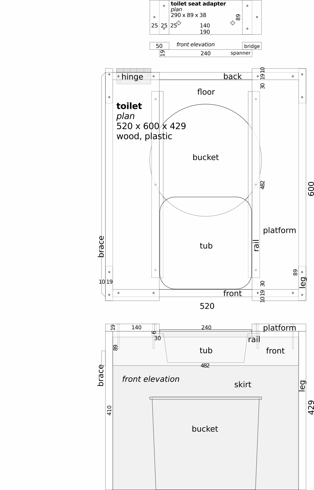
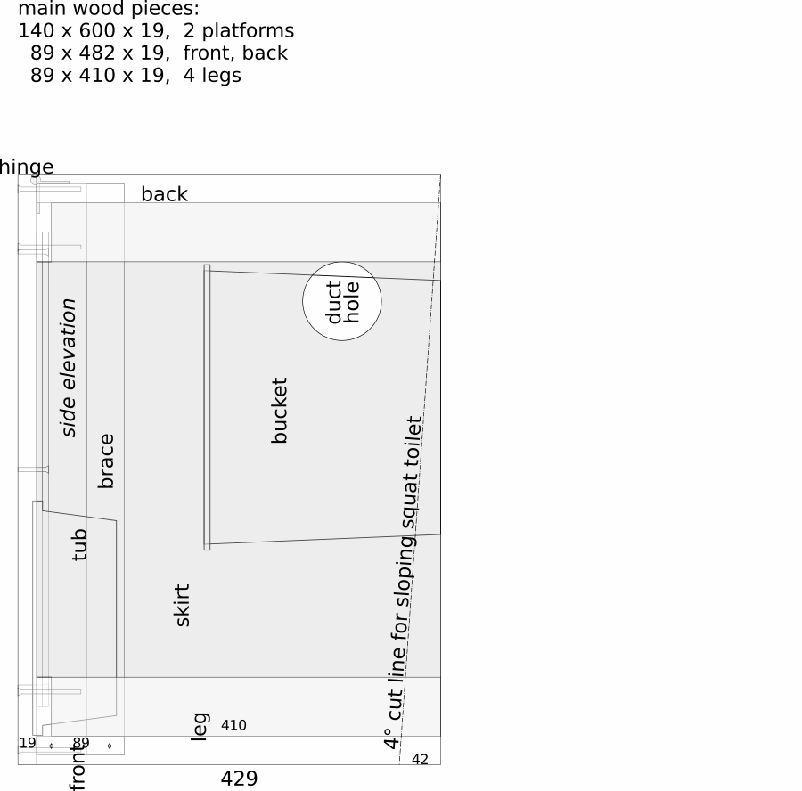
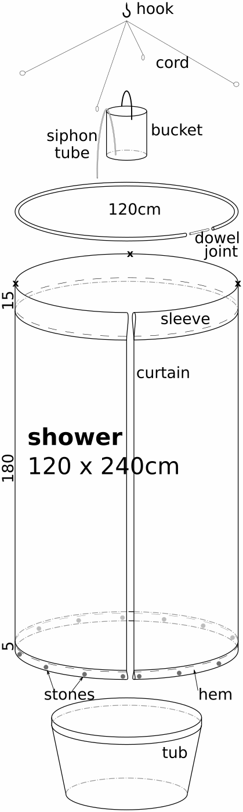

# _11_ &nbsp; water {#water}

If you already have a bathroom and kitchen, great. You're ready.

If not, make the off-grid fixtures below. They are quick, cheap, and portable. If basic versions are too punk rock for you, try the upgrades.

Numerals with - x + are in millimeters (see [____metric____](#metric)&nbsp;_-​8_).

## sink {#sink}

### basic {#basic}

- bucket with lid, 10-25L
- 1-2L soda bottle with cap, filled with water
- loosen cap slightly
- squeeze bottle over bucket lid. Use one hand or put bottle between your knees for hands-free use.
- wash hands or food
- pour water from lid into bucket
- discard fruit scraps in bucket to reduce odor

### upgrade {#upgrade}

- table
- rectangular plastic basin, like a restaurant bus tub
- short stand, 30cm x 30cm x 40cm, behind basin
- 10--20L bottle with valve-cap on stand
- drinking water (if separate from wash water): in 20L bottle with valve-cap
- waste (water and food): two, 20L buckets with lids

### deluxe {#deluxe}

- salvaged sink set in a counter-height table
- drains directly into waste bucket
- upgrade again by adding a drain tube to outside. 

## toilet {#toilet}

Both designs below are composting bucket toilets. The basic design is simple and fast. The upgrade is ventilated with separating and squatting options.

### basic {#basic2}

- bucket: 20L / 5 gal
- seat:
	- regular toilet seat. Balance it or wire it on. 
	- snap-on lids are made for this: $15 online
	- slit a pool noodle and fit it over the edge of the bucket. Put a piece of cardboard over the top between uses.

Pros: simple, cheap, fast  
Cons: not ventilated, not stable enough for squatting, not separating (see upgrade)

### upgrade {#upgrade2}

A wooden frame and plastic skirt make a lightweight box. Highly adaptable.

- ventilated: no odor, even during use
- sit or squat
	- add seat adapter to connect a regular toilet seat
	- slope the toilet at 4° angle for more comfortable squatting (facing down) or sitting (facing up)
- separates pee from poop with rails and tub or funnel urinal
- fits 20L bucket 
	- trim legs to fit yourself and a smaller bucket (8-16L)
	- removal: lift whole box or just one platform

If you intend to use a separating tub (see option #4 below), get one first. Adjust gap between platforms to fit it. This will also affect lengths of front, back, and spanner of toilet seat adapter. 

&nbsp; &nbsp; &nbsp; &nbsp; &nbsp; plan: toilet - [____download____](https://hygienicdarkretreat.com/img/plan/toilet.pdf)

&nbsp;

&nbsp;

#### build {#build}

1. frame
	1. cut boards
	2. measure, mark, and drill pilot holes (smaller than screw threads, about same size as screw shaft)
	3. join legs to front and back
	4. join platforms to them
	5. when shortening legs, allow at least 15- between top of bucket and underside of toilet. Tub requires more, of course. It must pass over bucket.
2. skirt (attaches inside frame)
	1. cut a strip of ~0.15- plastic, 2044 x 425 (leg + 15-)
	2. turn assembled toilet frame upside down
	3. coil plastic inside legs
	4. tape a short edge down the middle of a leg, upper corner level with end of leg
	5. fold 15- of lower edge onto underside of platform, taping it there with masking tape
	6. work your way around
	7. tape second short edge down same leg as first
	8. slit edge 15- between platforms. Tape resulting flaps over front and back with plastic packing tape.
3. Put a pan, tray, or a plastic sheet with towel or paper on top on the floor under the bucket to catch spills.
4. ventilation 
	- room's return duct attaches at hole in skirt for continuous exhaust
	- cut hole
		- next to a frame leg. Attach a wire or bracket to leg to support duct
		- 50--100- off floor
		- 20- smaller than return duct to fit over it snugly

#### options {#options}

1. toilet seat adapter
	- make adapter
	- attach toilet seat to it through 2 big holes
	- position adapter between platforms where comfortable. Seat should stick out 30-80-
	- drill pilot holes into platforms through holes in bridges
	- screw adapter into platforms
2. lifting platform -- it eases removal of bucket. Add brace to lifting side. Three types:
	1. hinged
		1. trim 10- from one platform at rear
		2. attach it to back with heavy door hinge, 76- or 89-
		3. drill one pilot hole in the middle of the other end, a little smaller than ~3- dia nail 
		4. shorten and round end of nail so it will stick out of platform 20-. Put it through platform.
		5. enlarge pilot hole in the frame so nail slides in it
		6. swing platform up to remove bucket
	2. removable
		1. use one nail as above at each end of a platform
		2. remove platform and set aside to empty bucket
	3. hinged adapter 
		1. use removable platform
		2. screw one bridge of adapter into it as usual
		3. replace other with heavy 76- or 89- door hinge
		4. toilet seat and removable platform swing up to remove bucket
3. slope
	1. for perfect balance when squatting
	2. trim 4° off legs as drawn, perhaps closer to platforms
	3. trim skirt at same angle
4. separating tub
	1. why:
		- unwetted poop smells the least
		- emptying bucket is less frequent and neater
	2. get ~3L squarish storage tub, ~240 x ~240 x ~80
	3. adjust platforms so tub drops between them
	4. attach rails
	5. tub slides forward to catch pee, back to catch bidet water. Empty tub into a pee bottle.
	6. emptying tub may be tricky in darkness. Thus the advantage of a wide single bucket that catches everything. See "simple big improvement" at beginning of toilet section. Or funnel, below.
	7. when sitting, tub only works for women. Men need clearance.

		For example, another bucket or a small plastic garbage can. Maybe cut away almost half of the top 100- leaving a backstop and the bucket's handle.

		Or a large funnel and tube leading to a large container below, perhaps through a wall. Restaurants discard 20L cooking oil bottles in boxes.

		Buy a funnel and attach a tube or hose. Or make one: cut the bottom off a large plastic bottle. If it has a spouted cap, remove sliding outer part and attach tube over inner spout. If cap is plain, drill a smooth hole in it. Put a small tube (8--15- ID) through it snugly.

		Put a smooth, floating ball over the drain to seal out odor. Screw funnel to front board near top edge, maybe hang it from the underside of (fixed) platforms with wire, plumber's tape, or a strip of the bottle's bottom that was cut away.

		A funnel that doesn't move is a lot easier to operate than a tub when a squatting, too. Bidet water falls in the poop bucket. Sawdust and paper absorb it.
		
### use {#use}

- put a layer of paper and 2L of sawdust in the bottom
- fill another bucket by the toilet with sawdust
- scoop 0.5L sawdust into toilet after each use
- place toilet by return vent, away from bed
- simple big improvement to system: when just peeing: 
	- use a vented [____pee bottle____](https://hygienicdarkretreat.com/report/2x3-day#mechanical-report). It works for men and adventurous women (or is adaptable)
	- pee into a small bucket and empty it into food scrap bucket. Sugar in food scraps neutralizes odor of pee. Could also works for emptying separating tub of toilet upgrade, below.

### compost {#compost}

The only danger with poop is if it gets permanently mixed with water. Then it becomes super toxic. 

- pour off liquid under trees and bushes
- dump solids in a covered compost pile bin
- dust it with dirt and cover with a 30--50- layer of carbonaceous material like leaves, straw, or sawdust	
- also put food scraps in pile 
- once full, seal it off for a year till the black gold is ready
- start a second pile

It's that simple. I wrote more about [____composting toilets____](https://hygienicdarkretreat.com/blog/2024/02/compost-toilet) and bins to allay concerns and provide more details.

Compost toilets are the future. Don't be the last to know.

### paper upgrade {#paper-upgrade}

Finally attain cleanliness behind. Prevent abrasion, itching, and infection. How? Replace toilet paper with water. 

Graphic description:

- prepare
	- wash out a 0.5--1L soda bottle 
	- poke a hole through the cap near the circumference at an angle with a large sewing needle
	- fill bottle with water, cap it, put it near toilet
- paper
	- when finished pooping, remove most remaining poop with paper (any kind).
	- daub and lift it off, don't wipe or rub
	- put paper in bucket
- water
	- point hole in cap forward
	- hold bottle upside down behind your back
	- squeeze bottle and wet fingers of other hand
	- point stream at anus, wipe with one finger
	- use more fingers to finish cleaning
	- the big improvement over toilet paper becomes apparent at this point.
- finish
	- rinse off fingers
	- pat yourself dry with cloth or paper (not newspaper) and be happy
	
{pagebreak}

## bath {#bath}

### basic {#basic3}

A sponge bath.

### upgrade {#upgrade3}

- on waterproof floor or large plastic sheet, make a 2m diameter border of towels. Sit in the middle. 
- put warm water in 2, 1.5L soda bottles, with loose lids or nearly closed drinking spouts
- hold a bottle above yourself with one hand and wash with the other
- wipe up water with towels and squeeze it out into bucket
- hang towels to dry or give them to supporter

### deluxe {#deluxe3}

Get clean with as little as 4-10L of water in this portable shower. It has no pipes and collapses for storage.

**Parts**, top to bottom:

- hook (in ceiling)
- bucket or bottle (4-10L, hangs from hook by handle. I like the 10L diesel additive bottle, usually in the trash of an auto-parts store. Rinse out the mild stuff left inside.)
- siphon tube (polyethylene, 4 ID x 500, bent near its middle with heat to hook over rim of container)
- 4 cords (hung from hook, tied to curtain rod)
- curtain rod (common irrigation tubing, black polyethylene, 30- OD, circular, 375cm long for 120cm diameter, dowel inside ends for smooth joint)
- curtain (polyester or plastic sheeting, with 15cm sleeve for rod (as shown) or grommets and rings, 50- bottom hem with small river rocks inside to weigh it down)
- **x**=holes in curtain for cords to tie around curtain rod
- large tub (90L+, from garden supply store, catches everything at the bottom) or deep tray or pan.

&nbsp; &nbsp; &nbsp; &nbsp; &nbsp; plan: shower - [____download____](https://hygienicdarkretreat.com/img/plan/shower.pdf)

Solar water heating method: nearly fill clear 4-8L bottles with water. Put rectangles of black plastic sheeting inside as elements. Put bottle in sun. Have supporter give it to you when warm. Or, with dark clothing and mask on tight, grab it from a sunny spot.

Adjust water temperature with cold water to suit yourself. Hang it from the hook. Suck on the tube to start the siphon action. Water flows for 8 minutes. Not bad. Dump used water into a 20L bucket with a lid for later disposal. Yes, all this is possible in darkness. I did it.

Adjust shower length and water flow with different size containers and tubes. Make sure hook can hold the weight.

~/~

You've seen how a bathroom can be made from garbage in minutes. For $50 more in materials, one can be made in an afternoon that works better in some ways and 1000x more elegantly than the standard $20,000 bathroom.

That's the state of my art of low-cost, off-grid, DIY darkroom design and construction. The principles involved ("water runs downhill") are surprisingly adaptable. Go for it. If you come up with something simpler, faster, cheaper, more effective, or more elegant, please let me know. See [____open-source____](#open-source)&nbsp;_-​e_. Check back for the latest developments.

~/~

That's also the end of the body of my book. Thank you for reading. I hope it helps you find yourself, recover your health in body and soul, be free of crime, be successful in all ways, and feel joy.

